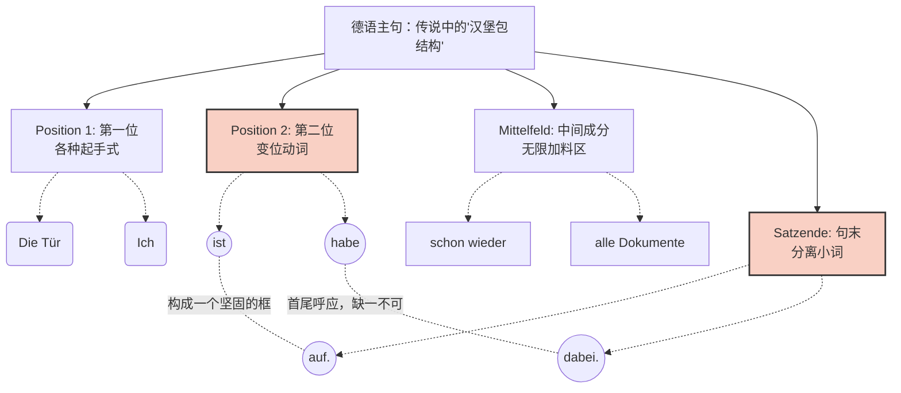
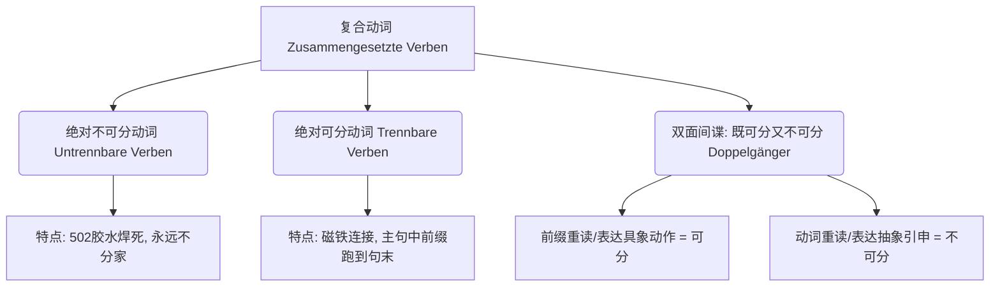

# 复合动词

### 🧩 核心概念：词汇的“乐高游戏”

想象一下，德语的动词就像**乐高积木**。

基础动词 `sein`（是）和 `haben`（有）就像两块最基础的灰色底板。单独看它们，平平无奇。但是，当你把 `an, aus, auf, zu` 这些五颜六色的“小积木”（介词或副词）拼在上面时，它们就瞬间“变身”了，产生了全新的意思！

这张图主要展示了两组截然相反的状态，我们结合你在德国**移民、找工作、租房**的实际场景来吸收它们。

#### 1. 🔌 开关之神：an sein / aus sein

- **an sein** = eingeschaltet sein（处于开启状态）
- **aus sein** = ausgeschaltet sein（处于关闭状态）
- **大师情境演示（租房生活）：** 德国的冬天很冷。如果你刚租的房子暖气坏了，你可以立刻打电话给房东抱怨：“_Die Heizung ist **aus**!_”（暖气停了！）而不是干巴巴地背诵复杂的被动语态格式。如果电视开着太吵，你可以对室友说：“_Der Fernseher ist noch **an**._”（电视还开着呢。）

#### 2. 🚪 门神：auf sein / zu sein

- **auf sein** = geöffnet sein（处于开门/营业状态）
- **zu sein** = geschlossen sein（处于关门/打烊状态）
- **大师情境演示（行政办事）：** 在德国，跟外管局（Ausländerbehörde）打交道是常态。如果你早上跑过去延签，却发现大门紧闭，你可以绝望地感叹：“_Oh nein, die Tür ist schon **zu**!_”（哦不，门已经关了！）相反，如果诊所开门了，你可以说：“_Die Arztpraxis ist jetzt **auf**._”（诊所现在开门了。）

#### 3. 👻 存在与消失：da sein / weg sein

- **da sein** = anwesend sein（在场、存在）
- **weg sein** = verschwunden sein（不见了、消失了）
- **大师情境演示（找工作与日常）：**

    去面试时，前台可能会告诉你 HR 在不在：“_Herr Müller ist heute leider nicht **da**._”（米勒先生今天不在。）如果你刚取出来的现金找不到了，你可以惊呼：“_Mein Geld ist **weg**!_”（我的钱没影了！）

#### 4. 👍👎 站队表态：dafür sein / dagegen sein

- **dafür sein** = einverstanden sein, etwas gut finden（赞成、同意）
- **dagegen sein** = nicht einverstanden sein, etwas nicht gut finden（反对、不同意）
- **大师情境演示（职场会议）：**

    开会讨论是否要推迟项目截止日期，你需要表达立场。非常干脆的表态就是：“_Ich bin **dafür**._”（我赞成）或者 “_Ich bin **dagegen**._”（我反对）。这比说长篇大论的“Ich stimme dieser Idee zu”要利落得多。

#### 5. 🎒 另外三个高频实用宝藏

- **los sein**（热闹、有活动、发生了什么）：刚搬到柏林，周末晚上你想出去玩，可以问邻居：“_Abends ist hier viel **los**._”（这里晚上可热闹了。）或者看到一群人围观，你可以问：“_Was ist hier **los**?_”（这里发生什么事了？）
- **dabeihaben**（带在身边）：去市政厅（Bürgeramt）落户（Anmeldung），办事员第一句话通常是：“_Haben Sie alle Dokumente **dabei**?_”（您文件都带齐了吗？）**极其高频！**
- **anhaben**（穿在身上）：夸赞同事的着装：“_Du hast eine schöne Jacke **an**._”（你穿的这件外套真好看。）

---

### 🍔 语法核心：德语句子的“汉堡包结构”（框形结构）

图片最下方展示了德语中最著名的句法特点——**框形结构（Klammerstruktur）**。

为了让你秒懂，我们把它想象成一个**“德式汉堡包”**。

- **顶层面包（句子的第 2 位）**：永远是变位动词（这里是 `ist` 或 `habe`）。
- **底层面包（句子的末尾）**：永远是那些分离前缀或小副词（如 `auf, dabei`）。它们被无情地一脚踢到了句子的最后。
- **中间的肉饼和生菜（Mittelfeld）**：是句子的其他成分（时间、地点、宾语等）。不管中间加多少料，两片面包必须把它们牢牢夹住！

为了让你更直观地理解，我为你生成了一个结构图：

代码段

**大师纠错时刻：**

很多初学者会受到中文习惯的影响，把小词提前，比如错误地说成：_Ich habe dabei alle Dokumente._ ❌

**记住汉堡包法则！** 小词必须垫底：_Ich habe alle Dokumente **dabei**._ ✅

---

### 📅 六个月冲刺 B 2 的学习建议

今天学的这个知识点，是你通往地道德语的敲门砖。针对接下来的六个月，我给你定下三个小规矩：

1. **情境造句法**：不要孤立地背单词。把你每天要做的事情（比如去超市、开门、找钥匙）用今天学的 `an/aus/auf/zu/weg/da` 造一个句子。
2. **死磕第二位和句末**：在练习口语时，强迫自己每次说话前先想好“顶层面包”（变位动词）和“底层面包”（小词），然后再往里面塞名词。
3. **双轨制学习**：准备一个笔记本，左边写口语表达（比如 _Die Tür ist auf._），右边写对应的 B 2 级书面语（比如 _Die Tür ist geöffnet._），做到随时切换。

如果你能把这个“乐高积木”的思维和“汉堡包”的结构刻进骨子里，哪怕语法再复杂，你的德语底盘都会稳如泰山。去试着用今天学的词造几个句子吧，想象你现在正站在德国的火车站，发现你的车票不见了，你要怎么喊出来？加油！

## aus auf 区别
### 1. 🔌 aus sein：电与能量的“终结”
* [f] **对应动作**：断电、熄灭、停止运转。
* **反义词**：`an sein`（通电、开启）。
* **类比记忆**：想象你拔掉了一个插头，或者掐断了电流。`aus` 专门用于**带电的、有机械开关的设备**。
* **书面语**：ausgeschaltet sein
* **图片例句**：*Der Fernseher ist aus.* （电视机是关着的。）
* **移民生活场景**：
    * *Das Licht ist aus.*（灯关了/停电了。）
    * *Mein Handy ist aus.*（我手机关机/没电了。）
    * *Die Heizung ist aus.*（暖气停了。）

### 2. 🚪 auf sein：物理空间的“敞开”
* [f] **对应动作**：物理上的打开、敞开、营业。
* **反义词**：`zu sein`（关闭、打烊）。
* **类比记忆**：想象一阵风吹过，必须有一个“物理通道”被打开了。`auf` 专门用于**门、窗、箱子、瓶盖**，甚至是**商店和政府机关的营业状态**。
* **书面语**：geöffnet sein
* **图片例句**：*Die Tür ist auf.* （门是开着的。）
* **移民生活场景**：
    * *Das Fenster ist auf.*（窗户开着。）
    * *Der Supermarkt ist noch auf.*（超市还开着门/还在营业。）
    * *Die Ausländerbehörde ist heute leider nicht auf.*（外管局今天很遗憾不开门。）

---

### ⚠️ 大师避坑指南：小心“中式德语”

为了冲刺 B 2，你必须从思维底层戒掉中文的翻译习惯：

* **错误直译**：如果你想表达“关门”，千万不要看着中文的“关”字就联想到电器的“关”，从而说出 *Die Tür ist aus.* ❌（德国人听了会满头问号，心想：难道你的门是用电驱动的机器人，现在没电死机了？）
* **正确表达**：门物理上的闭合，必须用 *Die Tür ist zu.* ✅

**总结一下：**
记住两个画面。当你面对一个屏幕、一个按钮、一个插座时，你的脑海里应该弹出 **an/aus**；当你面对一扇门、一扇窗、一家超市的大门时，你的脑海里应该弹出 **auf/zu**。

把你房间里的电视、电灯、大门和窗户贴上这四个小词的便利贴，坚持看两周，这种德语母语者的物理逻辑就会深深印在你的脑海里，成为你的肌肉记忆。继续保持这种敏锐的观察力，我们在 B 2 的路上稳步前进。

## 复合动词和可分不可分动词的区别？

### 🧠 核心概念厘清：别再把它们搞混了！

你的怀疑非常敏锐！很多初学者确实会把这两个概念混为一谈。

简单来说：**“复合动词”是一个大家族的总称，而“可分动词”只是这个家族里最活跃的一个分支。**

为了让你一目了然，我为你准备了下面这个结构图：

代码段

这就好比我们在组装乐高积木。基础动词是“车厢”，前缀是“车头”。

- **不可分动词**是用“502 强力胶”粘死的，怎么拽都拽不开。
- **可分动词**是用“磁铁”吸住的，一到特定的句型里，磁铁断开，车头直接飞到句子的最末尾。

下面我们逐一击破，结合你未来在德国的生活场景进行深度剖析！

---

### 第一类：死心塌地的“绝对不可分动词”（Untrennbare Verben）

**规则：** 无论在什么时态、什么句型中，前缀和动词**永远不分离**。发音时，**重音在动词词根上**，前缀轻读。

**常见前缀（请当口诀记熟）：** `be-, emp-, ent-, er-, ge-, miss-, ver-, zer-`

_(记忆法小窍门：**be**(=被) **emp**(=安)排 **ent**(=去) **er**(=德)国，**ge**(=给)了 **miss**(=迷失)的 **ver**(=发)展 **zer**(=折)磨。)_

**移民生活场景实战：**

- **verstehen（理解）** [ver- + stehen]
    - _看租房合同时：_ Ich **verstehe** den Mietvertrag nicht. (我不理解这份租房合同。)
- **bekommen（获得/得到）** [be- + kommen]
    - _去外管局延签：_ Wann **bekomme** ich mein Visum? (我什么时候能拿到我的签证？)
- **unterschreiben（签名）** _(注意：unter 通常是双面间谍，但在这里绝对不可分)_
    - _入职签合同：_ Ich **unterschreibe** heute meinen Arbeitsvertrag. (我今天签署我的工作合同。)

---

### 第二类：喜欢跑酷的“绝对可分动词”（Trennbare Verben）

**规则：** 在一般现在时和过去时的主句中，**动词词根留在第二位，前缀像被踢飞一样，直接跑到句子的最后面（句号前）**。发音时，**重音在前缀上**！

**常见前缀：** `ab-, an-, auf-, aus-, bei-, ein-, los-, mit-, nach-, vor-, zu-, zurück-, zusammen-` 等等。（这些通常都是独立的介词或副词）

**移民生活场景实战：**

- **aus|füllen（填写）** [aus- + füllen] -> 重音在 aus
    - _去市政厅落户：_ Ich **fülle** das Anmeldeformular **aus**. (我填写登记表。)
- **ein|ziehen（搬入）** [ein- + ziehen] -> 重音在 ein
    - _租房成功：_ Wir **ziehen** nächsten Monat in die neue Wohnung **ein**. (我们下个月搬进新公寓。)
- **mit|bringen（带来）** [mit- + bringen] -> 重音在 mit
    - _看医生：_ Bitte **bringen** Sie Ihre Versichertenkarte **mit**. (请您带上您的医保卡。)

---

### 第三类：B 1/B 2 级别的终极 BOSS——“双面间谍”（双重前缀）

这是最容易丢分的地方！有一些前缀，它们既可以做“502 胶水”，也可以做“磁铁”。

**双面间谍名单：** `durch-, über-, um-, unter-, wider-, wieder-`

**如何区分？教你两个黄金法则：**

1. **听音辨位法（重音法则）：**
    
    - 重音在**前缀**上 -> **可分** (磁铁)
    - 重音在**动词**上 -> **不可分** (胶水)
        
2. **具体 vs. 抽象法则（意义法则）：**
    
    - 如果动作是**物理上、具象的**（你能用眼睛看到的真实动作） -> **可分**
    - 如果动作是**引申的、抽象的**（脑力活动或比喻） -> **不可分**

**移民生活场景实战（极其重要）：**

**1. übersetzen**

- **(可分 / 具象 - 渡水)：** 重音在 ü。
    - Die Fähre **setzt** ans andere Ufer **über**. (渡轮驶向对岸。) -> _几乎用不到_
- **(不可分 / 抽象 - 翻译)：** 重音在 setz。
    - Der Dolmetscher **übersetzt** meine Zeugnisse. (翻译员翻译我的学历证明。) -> _移民局公证必备！_

**2. umfahren**

- **(可分 / 具象 - 撞倒)：** 重音在 um。
    - Er **fährt** das Straßenschild **um**. (他开车把路牌撞倒了。)
- **(不可分 / 抽象 - 绕行)：** 重音在 fahr。
    - Wir **umfahren** den Stau. (我们绕过堵车路段。)

---

### ⚠️ 易错点大盘点（B 2 考试必考雷区）

就算你搞懂了它们可不可分，一旦放入长难句里，规则会发生变异！请牢记以下三个变异场景：

#### 雷区一：在从句中（Nebensätze）——磁铁重新吸合！

如果有引导词（如 weil, dass, wenn），动词必须踢到句末。此时，**可分动词的前缀和词根会重新合并，不再分开！**

- _主句：_ Ich **fülle** das Formular **aus**.
- _从句：_ Die Beamtin wartet, **weil** ich das Formular **ausfülle**. (女公务员在等，因为我在填表。—— _aus 和 fülle 重新连在一起了！_)

#### 雷区二：完成时态（Perfekt）的 "ge" 放在哪？

- **不可分动词：** 绝对不要加 "ge"！
    - Ich habe den Vertrag **unterschrieben**. (不是 geunterschrieben)
- **可分动词：** "ge" 必须夹在“车头”和“车厢”中间，像三明治！
    - Ich habe das Formular aus**ge**füllt.

#### 雷区三：带 zu 的不定式（Infinitiv mit zu）

- **不可分动词：** zu 放在最前面分开写。
    - Es ist wichtig, den Vertrag **zu verstehen**. (理解合同很重要。)
- **可分动词：** zu 必须夹在中间，变成一个长单词！
    - Vergessen Sie nicht, das Formular aus**zu**füllen. (别忘了填表。)

---

语法知识就是这样，规则明确，但需要大量的场景代入来形成肌肉记忆。移民德国的生活每天都会遇到这些词，尽早把它们和具体场景绑定，你的德语会突飞猛进。

现在，我想测试一下你对这三个“雷区”的掌握程度。请你尝试将下面这句中文翻译成德语（重点考察从句和可分动词的结合）：

**“因为我明天搬家（um/ziehen，可分），所以我今天必须把这些箱子打包（ein/packen，可分）。”**
