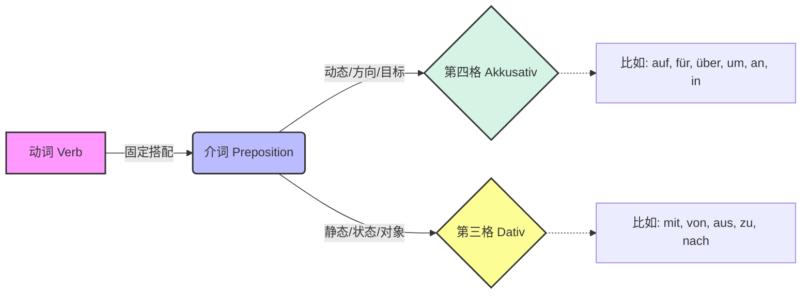
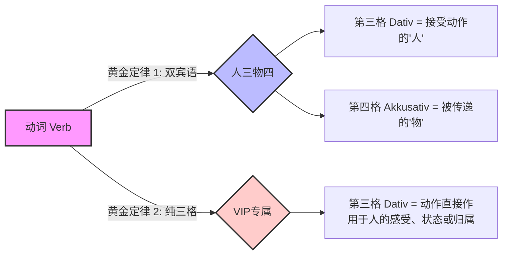
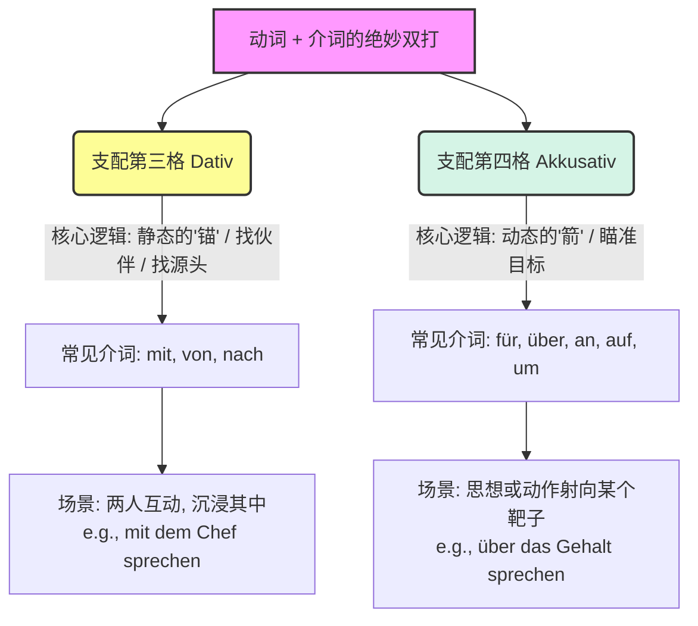

# 常用动词单词合集---支配介词宾语的动词

![[image-216.png|1026]]

看到这两大列密密麻麻的“动词+介词+格”搭配，是不是感觉头皮发麻，心里在咆哮：“**这真的都要背吗？！**”

作为你的德语大师，我必须诚实又温柔地告诉你：**是的，都要掌握。但绝不是死记硬背！** 在德语里，动词就像是**“老板”**，介词是它指定的**“部门经理”**，而后面的格（第三格 Dativ 或第四格 Akkusativ）则是进入这个部门的**“着装要求（Dress Code）”**。你不仅要知道找哪个经理办事，还得穿对衣服，否则句子就会被保安（语法规则）赶出来。

为了让你在 6 个月内拿下 B 2 并顺利融入德国的移民生活，我们必须把这些干巴巴的单词放到**真实的生存场景（租房、找工作、延签、看病）**中去。

大师来给你“扫雷”了！**请注意：你提供的教材图片中有一个明显的错误！** 图片右侧将 `sich gewöhnen an` 放在了第三格（Dativ）里，这是不对的！`sich gewöhnen an` 永远加**第四格（Akkusativ）**！大师已经帮你把它纠正到第四格的笔记中了。

现在，深呼吸，我们开始整理这份为你量身定制的**“德国生存通关笔记”**（一个不漏，全部奉上）！

---

### 第一部分：动词 + 介词 + 第四格（Akkusativ）搭配

_第四格通常代表一种“指向性、动作性或目标感”。想象你的动作像一支箭，射向了目标。_

**1. achten auf (Akk.)** - 注意，留意

- **大师讲解：** 像雷达一样锁定目标。在德国签合同一定要睁大眼睛。
- **生存例句：** Bitte **achten** Sie **auf** die Kündigungsfrist im Mietvertrag. (请您注意租房合同上的解约期限。)

**2. sich anmelden für (Akk.)** - 报名参加

- **大师讲解：** 想要融入，先从报班开始。
- **生存例句：** Ich möchte **mich für** den Integrationskurs **anmelden**. (我想报名参加融合班。)

**3. antworten auf (Akk.)** - 回复（某事/某信）

- **大师讲解：** 德国人爱发邮件，回复邮件必定用它。
- **生存例句：** Ich muss schnell **auf** die E-Mail von der Ausländerbehörde **antworten**. (我得赶紧回复外管局的邮件。)

**4. aufpassen auf (Akk.)** - 照看，注意

- **大师讲解：** 眼睛死死盯住某人或某物。
- **生存例句：** Können Sie kurz **auf** mein Gepäck **aufpassen**? (您能帮我稍微看一下行李吗？)

**5. sich ärgern über (Akk.)** - 对...感到生气

- **大师讲解：** `über` 像乌云一样罩在头上。在德国最容易让你生气的往往是交通。
- **生存例句：** Ich **ärgere mich über** die ständige Verspätung der Deutschen Bahn. (我对德国铁路经常晚点感到很生气。)

**6. sich beschweren über (Akk.)** - 抱怨，投诉

- **大师讲解：** 进阶版的“生气”，你要把不满表达出来。
- **生存例句：** Der Mieter **beschwert sich über** den lauten Nachbarn. (租客投诉隔壁邻居太吵。)

**7. sich bewerben um (Akk.)** - 申请（职位等）

- **大师讲解：** `um` 围绕着一个目标（工作）转。找工作必备！
- **生存例句：** Ich **bewerbe mich um** die Stelle als Softwareentwickler. (我申请软件工程师的职位。)

**8. bitten um (Akk.)** - 请求，要求

- **大师讲解：** 有求于人，态度要诚恳。
- **生存例句：** Ich **bitte** Sie **um** einen schnellen Termin. (我请求您尽快给我安排一个预约。)

**9. denken an (Akk.)** - 想到，记起

- **大师讲解：** 思维的箭射向某事。
- **生存例句：** Bitte **denken** Sie **an** Ihre Krankenversichertenkarte! (请别忘了带您的医保卡！)

**10-13. 谈论四兄弟：diskutieren / sprechen / reden / sich unterhalten + über (Akk.)** - 讨论/谈论某事

- **大师讲解：** 这四个词在图片里分别出现了，其实它们核心用法一样。`über` 翻译为“关于”。在德国职场或生活中，表达观点是 B 2 的核心要求。
- **生存例句 (diskutieren)：** Wir **diskutieren über** die hohen Mietpreise in München. (我们在讨论慕尼黑高昂的租金。)
- **生存例句 (sprechen)：** Der Arzt **spricht** mit mir **über** meine Blutwerte. (医生和我谈论我的验血指标。)
- **生存例句 (reden)：** Lass uns **über** dein Gehalt **reden**. (我们来谈谈你的薪水吧。)
- **生存例句 (sich unterhalten)：** Wir **unterhalten uns über** das deutsche Steuersystem. (我们在聊德国的税务系统。)

**14. sich engagieren für (Akk.)** - 投身于，致力于

- **大师讲解：** 德国人很看重社会参与度（Ehrenamt）。
- **生存例句：** Er **engagiert sich für** die Integration von Migranten. (他致力于移民的融合工作。)

**15. sich entscheiden für (Akk.)** - 决定（选择）...

- **大师讲解：** 在众多选项中做抉择。
- **生存例句：** Ich habe **mich für** die gesetzliche Krankenversicherung **entschieden**. (我决定选择法定医疗保险。)

**16. sich entschuldigen für (Akk.)** - 为...道歉

- **大师讲解：** 犯了错不可怕，大大方方认错。
- **生存例句：** Ich **entschuldige mich für** die Verspätung, mein Zug ist ausgefallen. (我为迟到道歉，我的火车被取消了。)

**17. sich erinnern an (Akk.)** - 回忆起，记得

- **大师讲解：** 思绪回到过去的一个点（an）。
- **生存例句：** Ich **erinnere mich** nicht mehr **an** mein Passwort für das Elster-Portal. (我不记得我税务局系统的密码了。)

**18. sich freuen auf (Akk.)** - 期待（未来的事）

- **大师讲解：** `auf` 望向未来。盼望着放假或拿签证！
- **生存例句：** Ich **freue mich auf** meinen Urlaub in Italien. (我期待我在意大利的假期。)

**19. sich freuen über (Akk.)** - 为...感到高兴（已经发生的事）

- **大师讲解：** `über` 笼罩在当下的喜悦中。
- **生存例句：** Ich **freue mich über** das positive Feedback von meinem Chef. (我为老板的正面反馈感到高兴。)

**20. sich informieren über (Akk.)** - 了解，打听关于...的信息

- **大师讲解：** 德国办事全靠自己查资料。
- **生存例句：** Ich muss **mich über** die Voraussetzungen für die Niederlassungserlaubnis **informieren**. (我得去了解一下申请永居的条件。)

**21. sich interessieren für (Akk.)** - 对...感兴趣

- **大师讲解：** 找房、面试常用套话。
- **生存例句：** Ich **interessiere mich für** diese 3-Zimmer-Wohnung. (我对这套三居室感兴趣。)

**22. sich kümmern um (Akk.)** - 照顾，负责处理

- **大师讲解：** `um` 围着某事转，操心劳力。
- **生存例句：** Wer **kümmert sich um** die Anmeldung beim Bürgeramt? (谁去负责在市民局登记报户口的事？)

**23. lachen über (Akk.)** - 嘲笑，对...发笑 (图片中写错成了 lach，原形是 lachen)

- **大师讲解：** 保持幽默感，化解文化差异。
- **生存例句：** Manchmal müssen wir **über** unsere eigenen Fehler beim Deutschlernen **lachen**. (有时我们必须对自己在学德语时犯的错一笑置之。)

**24. nachdenken über (Akk.)** - 沉思，深思熟虑

- **大师讲解：** 相比于 `denken an`（想起），这个词更强调深度思考。
- **生存例句：** Ich muss **über** Ihr Jobangebot **nachdenken**. (我得仔细考虑一下您的工作邀约。)

**25. sich streiten über (Akk.)** - 为...争吵

- **大师讲解：** 尽量别用，但如果遇到奇葩房东就不得不维权了。
- **生存例句：** Wir **streiten uns über** die hohe Nebenkostenabrechnung. (我们在为高昂的附加费账单争吵。)

**26. sich verlassen auf (Akk.)** - 信赖，依靠

- **大师讲解：** 信任就像把自己“放”在别人身上（auf）。
- **生存例句：** Sie können **sich auf** mich **verlassen**, die Arbeit wird rechtzeitig fertig. (您可以相信我，工作会按时完成的。)

**27. sich verlieben in (Akk.)** - 爱上...

- **大师讲解：** 坠入（in）爱河。
- **生存例句：** Sie hat **sich in** die Stadt München **verliebt**. (她爱上了慕尼黑这座城市。)

**28. sich vorbereiten auf (Akk.)** - 为...做准备

- **大师讲解：** 你的首要任务！
- **生存例句：** Ich **bereite mich** intensiv **auf** die B 2-Prüfung **vor**. (我正在紧张地为 B 2 考试做准备。)

**29. warten auf (Akk.)** - 等待

- **大师讲解：** 德国生存必备技能：等。
- **生存例句：** Ich **warte** schon seit zwei Monaten **auf** mein Visum. (我已经等签证等了两个月了。)

**【大师纠错专属补充】sich gewöhnen an (Akk.)** - 习惯于...

- **大师讲解：** 再次强调，教材放错了位置！它是加第四格的！
- **生存例句：** Ich muss **mich an** das kalte Wetter in Deutschland **gewöhnen**. (我必须习惯德国寒冷的天气。)

---

### 第二部分：动词 + 介词 + 第三格（Dativ）搭配

_第三格通常表示一种“静态、来源、组成，或者是人与人之间的互动（伙伴关系）”。_

**30. ausgehen von (Dat.)** - 从...出发，假定

- **大师讲解：** 职场高级表达，表示基于某个前提。
- **生存例句：** Ich **gehe davon aus**, dass mein Gehalt pünktlich überwiesen wird. (我假定/相信我的薪水会被准时汇过来。)

**31. sich beschäftigen mit (Dat.)** - 忙于...，从事于...

- **大师讲解：** `mit` 伴随。你整天和文件打交道。
- **生存例句：** Ich **beschäftige mich** momentan **mit** viel Bürokratie. (我目前正忙着处理很多繁文缛节/官僚程序。)

**32. bestehen aus (Dat.)** - 由...组成

- **大师讲解：** 拆解事物的构成。
- **生存例句：** Die Bewerbungsmappe **besteht aus** einem Anschreiben und dem Lebenslauf. (申请材料由一封求职信和简历组成。)

**33-36. 互动交流群：diskutieren / sprechen / reden / sich unterhalten + mit (Dat.)** - 与某人讨论/谈论

- **大师讲解：** 第一部分我们学了 `über + Akk`（谈论的内容），现在是 `mit + Dat`（谈论的对象）。他们经常合体出现：_Ich spreche mit dir über das Wetter._
- **生存例句 (diskutieren)：** Ich **diskutiere mit** dem Vermieter. (我在和房东理论。)
- **生存例句 (sprechen)：** Ich muss **mit** meinem Chef **sprechen**. (我必须和老板谈谈。)
- **生存例句 (reden)：** Sie **redet mit** der Krankenschwester. (她在和护士说话。)
- **生存例句 (sich unterhalten)：** Ich **unterhalte mich mit** meinen Kollegen in der Pause. (我在休息时间和同事们聊天。)

**37. einladen zu (Dat.)** - 邀请去...

- **大师讲解：** 收到面试邀请就靠它。
- **生存例句：** Wir möchten Sie gerne **zu** einem Vorstellungsgespräch **einladen**. (我们想邀请您来参加面试。)

**38. erzählen von (Dat.)** - 讲述关于...

- **大师讲解：** 相比于 `über` 的严肃讨论，`von` 更像是在讲故事。
- **生存例句：** Im Interview habe ich **von** meiner Berufserfahrung **erzählt**. (在面试中我讲述了我的工作经验。)

**39. fragen nach (Dat.)** - 询问...

- **大师讲解：** 迷路了或者想要打听消息。
- **生存例句：** Darf ich **nach** dem Gehalt **fragen**? (我可以问一下薪资待遇吗？)

**40. gehören zu (Dat.)** - 属于...

- **大师讲解：** 归属感，或者说明职位职责。
- **生存例句：** Teamfähigkeit **gehört zu** meinen Stärken. (团队合作能力属于我的强项。)

**41. gratulieren zu (Dat.)** - 祝贺...

- **大师讲解：** 送祝福专用。
- **生存例句：** Ich **gratuliere** dir **zur** bestandenen B 2-Prüfung! (祝贺你通过 B 2 考试！)

**42. teilnehmen an (Dat.)** - 参加

- **大师讲解：** 你存在于（an）某个活动中。
- **生存例句：** Ich möchte nächste Woche **an** der Teamsitzung **teilnehmen**. (我想参加下周的团队会议。)

**43. telefonieren mit (Dat.)** - 和...打电话

- **大师讲解：** 电话两头，需要伙伴（mit）。
- **生存例句：** Ich muss **mit** meiner Versicherung **telefonieren**. (我得给我的保险公司打个电话。)

**44. träumen von (Dat.)** - 梦想...

- **大师讲解：** 梦的源头（von）。
- **生存例句：** Wir **träumen von** einem eigenen Haus in Deutschland. (我们梦想在德国拥有一套自己的房子。)

**45. sich treffen mit (Dat.)** - 和...见面

- **大师讲解：** 经典的伙伴互动。
- **生存例句：** Nach der Arbeit **treffe** ich **mich mit** dem Makler. (下班后我要和房产中介见面。)

**46. sich trennen von (Dat.)** - 和...分离/分手

- **大师讲解：** 从...（von）剥离开来。
- **生存例句：** Man muss **sich von** schlechten Gewohnheiten **trennen**, um effizient Deutsch zu lernen. (为了高效学德语，必须抛弃坏习惯。)

**47. sich verabreden mit (Dat.)** - 和...约定/约会

- **大师讲解：** 德国人极度依赖日程表，什么都要预约。
- **生存例句：** Ich bin morgen Nachmittag **mit** dem Handwerker **verabredet**. (我明天下午和修理工约好了时间。)

---

这份笔记绝对是你冲击 B 2 的基石。记住，不要一天背完，每天挑选 3-5 个，代入到你自己即将面对的真实场景里去造句，读出声来！

你目前在德国生活或准备移民的过程中，最让你头疼的是哪个场景（比如：租房沟通、面试、看医生）？说出来，我们针对那个场景来强化造句！

Hallo！没关系，德语大师随时为你调整频道！

你重新发的这张表，简直是德国生存和 B 2 考试的**“黄金宝典”**！这张表分为两块：“双宾语动词”和“支配第三格的动词”。很多同学学到这里会觉得崩溃：“天哪，又要记第三格（Dativ），又要记第四格（Akkusativ），脑子根本转不过来！”

别怕！德语大师今天传授你两个**“黄金定律”**，帮你把这些枯燥的表格变成肌肉记忆。

### 🌟 大师核心心法：快递员定律与 VIP 定律

在开始记笔记之前，我们先用一张图搞懂背后的核心逻辑：

代码段

- **双宾语动词 = 快递员定律（人三物四）**：想象动词是一个快递员。他送的**“包裹（物品）”**要穿第四格（Akkusativ）的制服，而接收包裹的**“客户（人）”**要穿第三格（Dativ）的制服。
- **第三格宾语动词 = VIP 定律**：这些动词不涉及“递送物品”，而是直接作用于某个人的情绪、状态或归属权。人在这里是绝对的 VIP，必须尊享第三格（Dativ）。

现在，我们把表里的词一个不漏地全部化为你的**“生存实战笔记”**！

---

### 第一部分：双宾语动词（人三物四）

_记住：做这些动作时，永远问自己：“把**什么东西（第四格）**，给**谁（第三格）**？”_

**1. anbieten** (提供)

- **大师讲解：** 待客之道。把东西提供给客人。
- **生存实战：** Darf ich **Ihnen** (三格人) **einen Tee** (四格物) anbieten? (我能为您提供一杯茶吗？)

**2. bezahlen** (支付)

- **大师讲解：** 替别人买单，仗义疏财。
- **生存实战：** Er hat **uns** (三格人) **die Getränke** (四格物) bezahlt. (他替我们付了饮料钱。)

**3. bestellen** (订购/点餐)

- **大师讲解：** 在餐厅或者网购时给别人点东西。
- **生存实战：** Er hat **uns** (三格人) **Kaffee** (四格物) bestellt. (他给我们点了咖啡。)

**4. bringen** (带来)

- **大师讲解：** 最经典的“快递员”动词。
- **生存实战：** Bitte bringen Sie **mir** (三格人) **einen Kaffee** (四格物). (请给我带杯咖啡。)

**5. empfehlen** (推荐)

- **大师讲解：** 刚到德国找房子、找好吃的，全靠别人推荐。
- **生存实战：** Ich kann **Ihnen** (三格人) **ein Restaurant** (四格物) empfehlen. (我可以给您推荐一家餐厅。)

**6. erklären** (解释)

- **大师讲解：** 面对德国繁琐的官僚文件，你最需要的一句话。
- **生存实战：** Können Sie **mir** (三格人) **das Problem** (四格物) erklären? (您能给我解释一下这个问题吗？)

**7. erzählen** (讲述)

- **大师讲解：** 把故事当作礼物送给人。
- **生存实战：** Meine Oma hat **uns** (三格人) immer **schöne Geschichten** (四格物) erzählt. (我奶奶以前总是给我们讲好听的故事。)

**8. geben** (给)

- **大师讲解：** 最基础的给予。结账必备！
- **生存实战：** Bitte geben Sie **mir** (三格人) **die Rechnung** (四格物). (请把账单给我。)

**9. holen** (去拿)

- **大师讲解：** 和 bringen 不同，holen 强调“去取回来”。
- **生存实战：** Er holt **uns** (三格人) **die Getränke** (四格物). (他去帮我们拿饮料了。)

**10. kaufen** (买)

- **大师讲解：** 给某人买个某物，花钱买开心。
- **生存实战：** Ich möchte **meinem Sohn** (三格人) **einen Laptop** (四格物) kaufen. (我想给我儿子买个笔记本电脑。)

**11. kochen** (煮/做饭)

- **大师讲解：** 贤惠的表达。
- **生存实战：** Wer kocht **uns** (三格人) heute **das Mittagessen** (四格物)? (今天谁给我们做午饭？)

**12. leihen** (借)

- **大师讲解：** 借出或借入物品。
- **生存实战：** Sie hat **ihm** (三格人) **ein Buch** (四格物) geliehen. (她借给了他一本书。)

**13. liefern** (送货)

- **大师讲解：** 真正的送快递/家具！
- **生存实战：** Die Firma liefert **uns** (三格人) **die Möbel** (四格物) am Freitag. (公司周五把家具给我们送来。)

**14. mitbringen** (随身带来)

- **大师讲解：** 去别人家做客或度假回来必备。
- **生存实战：** Sie bringen **ihm** (三格人) aus dem Urlaub **ein Souvenir** (四格物) mit. (他们从度假地给他带了一个纪念品。)

**15. renovieren** (装修/翻新)

- **大师讲解：** 为某人翻新某物。德国人工贵，经常朋友互助。
- **生存实战：** Wir renovieren **unseren Freunden** (三格人) **die Wohnung** (四格物). (我们帮朋友翻新公寓。)

**16. reparieren** (修理)

- **大师讲解：** 为某人修某物。
- **生存实战：** Die Werkstatt kann **uns** (三格人) **das Auto** (四格物) erst nächste Woche reparieren. (修理厂下周才能帮我们修好车。)

**17. reservieren** (预订)

- **大师讲解：** 聚餐第一步。
- **生存实战：** Bitte reservieren Sie **uns** (三格人) **einen Tisch** (四格物) für 20:00 Uhr. (请帮我们预订一张晚上 8 点的桌子。)

**18. sagen** (告诉/说)

- **大师讲解：** 传递信息。
- **生存实战：** Hast du **ihm** (三格人) **die Neuigkeit** (四格物) gesagt? (你把这个消息告诉他了吗？)

**19. schenken** (赠送)

- **大师讲解：** 送礼专用动词。
- **生存实战：** Sie schenkt **ihrem Vater** (三格人) **eine Krawatte** (四格物). (她送给她爸爸一条领带。)

**20. schicken** (发送/寄)

- **大师讲解：** 每天和德国人发邮件都在用。
- **生存实战：** Können Sie **uns** (三格人) bitte **Informationen** (四格物) schicken? (您能把信息发给我们吗？)

**21. schneiden** (剪)

- **大师讲解：** 为某人剪某物（通常是剪头发）。
- **生存实战：** Der Friseur hat **ihr** (三格人) **die Haare** (四格物) super geschnitten. (理发师把她的头发剪得超级棒。)

**22. schreiben** (写)

- **大师讲解：** 写信、写邮件。
- **生存实战：** Sie schreibt **ihm** (三格人) **eine E-Mail** (四格物). (她给他写一封邮件。)

**23. servieren** (上菜/端上)

- **大师讲解：** 餐饮服务业常用。
- **生存实战：** Sie serviert **ihren Gästen** (三格人) **Kaffee und Kuchen** (四格物). (她给客人们端上咖啡和蛋糕。)

**24. verkaufen** (卖)

- **大师讲解：** 把某物卖给某人（二手交易平台必备）。
- **生存实战：** Er verkauft **seinem kleinen Bruder** (三格人) **seinen alten iPod** (四格物). (他把旧 iPod 卖给了他的小弟弟。)

**25. wünschen** (祝愿)

- **大师讲解：** 生日、过节万能套话。
- **生存实战：** Ich wünsche **dir** (三格人) **viel Glück** (四格物)! (我祝你多福多运！)

**26. zeigen** (展示)

- **大师讲解：** 把某物展示给某人看。
- **生存实战：** Die Frau zeigt **ihnen** (三格人) **die Sehenswürdigkeiten** (四格物) in der Stadt. (这位女士向他们展示城里的名胜古迹。)

---

### 第二部分：支配第三格宾语的常用动词（VIP 定律）

_记住：这里的动作没有传递的过程，而是直接作用于“人”的某种状态或情感，所以“人”是 VIP，只加第三格。_

**1. antworten** (回答)

- **大师讲解：** 纯粹给某人一个回应。
- **生存实战：** Er konnte **ihr** (三格) nicht sofort antworten. (他没法立刻回答她。)

**2. danken** (感谢)

- **大师讲解：** 德国人把礼貌给了 VIP。
- **生存实战：** Ich danke **Ihnen** (三格). (我感谢您。)

**3. fehlen** (缺少/哪儿不舒服)

- **大师讲解：** 看医生时的超级高频句，医生问你“缺了什么（健康）”。
- **生存实战：** Was fehlt **Ihnen** (三格)? (您哪里不舒服？)

**4. gefallen** (使...喜欢)

- **大师讲解：** 德语的“喜欢”是倒过来的，物做主语，人做第三格宾语（物取悦了人）。
- **生存实战：** Der Hut gefällt **mir** (三格) gut. (我很喜欢这顶帽子。/这顶帽子很讨我喜欢。)

**5. (gut/schlecht) gehen** (（某人）过得好/坏)

- **大师讲解：** 见面寒暄的灵魂。
- **生存实战：** Wie geht es **dir** (三格)? (你过得怎么样？)

**6. gehören** (属于)

- **大师讲解：** 强调物权归属。
- **生存实战：** Wem gehört der Schlüssel? -> Er gehört **mir** (三格). (这钥匙是谁的？-> 它属于我。)

**7. glauben** (相信)

- **大师讲解：** 信任某人。
- **生存实战：** Ich glaube **dir** (三格). (我相信你。)

**8. gratulieren** (祝贺)

- **大师讲解：** 对某人表示庆贺。
- **生存实战：** Sie gratulieren **ihm** (三格) zum Geburtstag. (他们祝贺他生日快乐。)

**9. helfen** (帮助)

- **大师讲解：** 提供援助。
- **生存实战：** Kann ich **Ihnen** (三格) helfen? (我能帮您吗？)

**10. leidtun** (使...感到抱歉)

- **大师讲解：** 这件事让我感到遗憾。
- **生存实战：** Entschuldigung, das tut **mir** (三格) leid. (对不起，这让我感到很抱歉。)

**11. passen** (适合/合适)

- **大师讲解：** 衣服尺寸合适，或者时间安排合适。
- **生存实战：** Die Hose passt **mir** (三格) leider nicht. / Der Termin passt **mir** (三格) nicht. (这条裤子不合我的身。/ 这个预约时间对我不合适。)

**12. schmecken** (尝起来觉得好)

- **大师讲解：** 评价食物的万能词。食物作主语，讨好了食客的味蕾。
- **生存实战：** Die Torte schmeckt **uns** (三格). (我们觉得这蛋糕很好吃。)

**13. stehen** (适合 - 指外观/风格)

- **大师讲解：** 跟 passen（尺码合适）不同，stehen 强调颜色、款式让你看起来很美。
- **生存实战：** Das Kleid steht **ihr** (三格) gut. (她穿这条裙子很好看。)

**14. wehtun** (疼)

- **大师讲解：** 身体部位做主语，让“我”感到疼。看病必备！
- **生存实战：** Der Kopf tut **mir** (三格) weh. (我头疼。)

**15. zuhören** (倾听)

- **大师讲解：** 集中注意力听某人说话。
- **生存实战：** Bitte hören Sie **mir** (三格) genau zu. (请您仔细听我讲。)

深呼吸，这就是你通往 B 2 必须要迈过的词汇门槛。把这些句子大声朗读出来，想象你在慕尼黑的咖啡馆点餐、在柏林的医生诊所描述病情，你的德语一定会突飞猛进！Viel Erfolg! (祝你成功！)

# 习题暂存，可删除

Guten Tag！没问题，大师的黑板随时为你擦亮！

这张小卡片可是德语 B 1 过渡到 B 2 的**“核心枢纽”**！很多同学在考口语或者写求职信的时候，脑子里总是在打架：“这里到底该加第三格（Dativ）还是第四格（Akkusativ）？”

别急，德语大师今天就教你一招**“太极心法”**，把这张表里的知识点彻底转化为你的语言本能。

### ☯️ 大师心法：动态的“箭”与静态的“锚”

记忆这些搭配，死记硬背是大忌。我们要给这两种格赋予“灵魂”：

代码段

- **支配第四格（Akkusativ）的介词，往往带有“指向性”**。就像你射出一支箭，你的注意力、情绪或动作，直直地瞄准了一个具体的目标（靶子）。
- **支配第三格（Dativ）的介词，往往带有“陪伴、根源或固定状态”**。就像抛下一个锚，强调你和某人在一起（陪伴），或者某事物的来源。

特别注意卡片里最精华的部分：** `sprechen/diskutieren` 这两个词的“人格分裂”**！

- 当你**和某人（Person）**聊天时，这是陪伴，用 `mit + Dativ`。
- 当你聊**某个话题（Thema）**时，这是你们共同瞄准的靶子，用 `über + Akkusativ`。

下面，我们一个不漏，把卡片上的词全部带入你在德国的**“生存实战场景”**！

---

### 🎯 第一部分：支配第四格（Akkusativ）—— “瞄准目标”

**1. sich ärgern über (Akk.)** - 对...感到生气/恼火

- **大师讲解：** 情绪的箭头射向让你不爽的事物。在德国，最容易让人恼火的莫过于官僚作风和糟糕的交通。
- **生存实战：** Ich **ärgere mich über** die lange Wartezeit bei der Ausländerbehörde. (我对在外管局漫长的等待时间感到很生气。)

**2. denken an (Akk.)** - 想到，惦记

- **大师讲解：** 思维的箭射过去。出门办事，脑子里一定要一直惦记着带齐文件。
- **生存实战：** Bitte **denken** Sie **an** Ihren Reisepass und die Meldebescheinigung! (请您务必想着带上您的护照和户口登记证明！)

**3. sich interessieren für (Akk.)** - 对...感兴趣

- **大师讲解：** 找房、面试的黄金敲门砖。你的兴趣指向了这个事物。
- **生存实战：** Ich **interessiere mich** sehr **für** diese 2-Zimmer-Wohnung in Berlin. (我对柏林的这套两居室非常感兴趣。)

**4. warten auf (Akk.)** - 等待...

- **大师讲解：** 目光锁定在未来要出现的事物上。在德国生存，等待是一门必修课。
- **生存实战：** Ich **warte** schon seit drei Monaten **auf** die Antwort vom Finanzamt. (我已经等财政局的回复等了三个月了。)

**5. diskutieren über (Thema) (Akk.)** - 讨论（某个话题）

- **大师讲解：** `über` 就像笼罩在头顶的乌云，你们的话题围绕着它。
- **生存实战：** Wir müssen **über** die Nebenkostenabrechnung **diskutieren**. (我们得讨论一下这笔附加费账单/物业费账单。)

**6. sprechen über (Thema) (Akk.)** - 谈论（某个话题）

- **大师讲解：** 同上，言语的箭头指向要谈的事。面试谈薪资必备。
- **生存实战：** Lassen Sie uns **über** mein zukünftiges Gehalt **sprechen**. (让我们来谈谈我未来的薪水吧。)

**7. sich anmelden für (Akk.)** - 报名参加...

- **大师讲解：** 把自己的名字“射”进某个名单里。
- **生存实战：** Ich möchte **mich für** den B 2-Deutschkurs **anmelden**. (我想报名参加 B 2 德语班。)

**8. sich kümmern um (Akk.)** - 照顾，负责处理...

- **大师讲解：** `um` 是围绕，你围着这件事情转，操心劳力。
- **生存实战：** Mach dir keine Sorgen, ich **kümmere mich um** die Dokumente für die Versicherung. (别担心，医保的文件我会去处理的。)

---

### ⚓ 第二部分：支配第三格（Dativ）—— “寻找伙伴与根源”

**9. träumen von (Dat.)** - 梦想着...

- **大师讲解：** 梦的源头（von）在哪里？这是描述未来愿景的高频词。
- **生存实战：** Viele Einwanderer **träumen von** einem unbefristeten Arbeitsvertrag. (许多移民梦想着能拥有一份无限期/永久的工作合同。)

**10. fragen nach (Dat.)** - 询问，打听...

- **大师讲解：** 顺着线索去找。迷路或者去前台打听消息时用。
- **生存实战：** Entschuldigung, darf ich **nach** dem Weg zur Apotheke **fragen**? (打扰一下，我可以问一下去药房怎么走吗？)

**11. sich beschäftigen mit (Dat.)** - 忙于...，从事于...

- **大师讲解：** 每天和什么东西作伴（mit）。这通常用来高大上地描述你的日常工作或学习状态。
- **生存实战：** In meiner Freizeit **beschäftige** ich **mich mit** der deutschen Grammatik. (业余时间我正忙着死磕德语语法。)

**12. telefonieren mit (Dat.)** - 和...打电话

- **大师讲解：** 电话线两端，必须有伙伴陪你聊。
- **生存实战：** Ich **telefoniere** gerade **mit** meinem Vermieter. (我正和我的房东打电话呢。)

**13. sprechen mit (Person) (Dat.)** - 和（某人）说话

- **大师讲解：** 交流的对象，是你的谈话伙伴。
- **生存实战：** Ich muss dringend **mit** dem Arzt **sprechen**. (我得赶紧和医生谈一谈。)

**14. teilnehmen an (Dat.)** - 参加...

- **大师讲解：** 你本人驻扎（an）在某个活动之中，这是一种状态。
- **生存实战：** Werden Sie morgen **an** der Teambesprechung **teilnehmen**? (您明天会参加团队会议吗？)

**15. diskutieren mit (Person) (Dat.)** - 和（某人）讨论

- **大师讲解：** 辩论的对手或伙伴。
- **生存实战：** Es hat keinen Sinn, **mit** dem unfreundlichen Nachbarn zu **diskutieren**. (和那个不友好的邻居争论是没有意义的。)

---

### 💡 大师实战融合技（满分造句公式）

想要在 B 2 口语考试中惊艳考官，或者在德国职场游刃有余，你需要把这两类介词**揉进同一句话里**！

> **公式：** `sprechen/diskutieren` + `mit` (加第三格的人) + `über` (加第四格的事)
> 
> **满分例句：** Ich möchte **mit dem Chef** (_Dativ, 伙伴_) **über meine Gehaltserhöhung** (_Akkusativ, 目标靶子_) **sprechen**.
> 
> (我想和老板谈谈我加薪的事情。)

你看，只要搞清楚了“伴随谁”和“指向什么”，复杂的语法瞬间就变成了生活中的常识。

要想把这些知识完全变成你的，我们现在就来进行一个小测验：如果让你假装正在给外管局（die Ausländerbehörde）写邮件，**催问你的签证进度（提示：等待...）**并**询问缺少的材料（提示：询问...）**，你会怎么尝试运用这上面的两个动词来造句呢？
