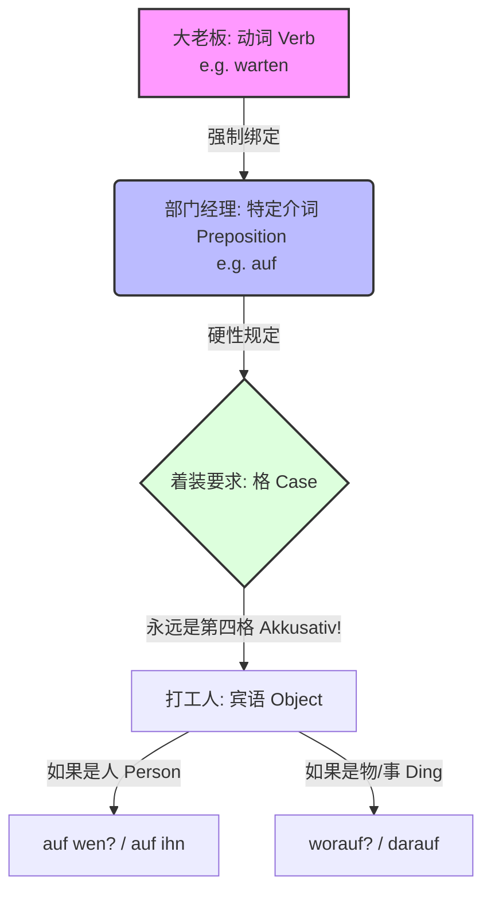

> [!quote] 知识点：
> 可以用来发发文，与[[⭐必背所有知识点整理考察整理#^00fffq|疑问句]]关联
> 配合介词，与介词知识点关联
> 所以必须先掌握以上知识 
# 支配介词宾语的动词

### 核心概念：什么是“支配介词宾语的动词”？

**💡 大师的生动类比：**

想象一下，德语动词是一家公司的“大老板（Boss）”，名词/代词是底层的“打工人（Employee）”。有些大老板脾气很怪，他不愿意直接和打工人沟通，非要在中间安插一个特定的“部门经理（Manager）”——也就是**介词（Präposition）**。

而且，这个部门经理还会强制规定打工人的“着装要求”——必须穿**第四格（Akkusativ）**还是**第三格（Dativ）**的制服。

**⚠️ 终极避坑指南（打破你的固有认知）：**

在初级阶段，你学过“静三动四”（Wechselpräpositionen），比如 _in, auf, an_ 会根据“在哪儿（Wo）”还是“去哪儿（Wohin）”改变格。

**请立刻把这个规则忘掉！**

在“支配介词宾语的动词”里，介词已经完全丧失了它原本的“空间方位”意义。它就是个无情的传话筒，**它要求什么格，就是什么格，没有任何道理可讲！**

为了让你一目了然，我们来看下面这张图表：

代码段

---

### 第一关：死磕固定搭配（B 1-B 2 高频移民生活场景）

既然没有规律，我们就必须像记固定电话号码一样，==把“动词 + 介词 + 格”作为一个整体来背诵==。以下是你未来六个月在德国最常用的几个“黄金组合”：

#### 1. 找工作/职场 (Arbeit & Beruf)

- **sich bewerben um + Akkusativ** (申请/应聘)
    - _例句：_ Ich bewerbe mich **um** die Stelle als Ingenieur. (我正在申请这个工程师的职位。)
- **sich vorbereiten auf + Akkusativ** (为...做准备)
    - _例句：_ Ich bereite mich intensiv **auf** das Vorstellungsgespräch vor. (我正在为面试做紧张的准备。)

#### 2. 外管局/行政事务 (Behördengänge)

- **warten auf + Akkusativ** (等待)
    - _例句：_ Ich warte schon seit zwei Monaten **auf** meine Aufenthaltserlaubnis! (我已经等我的居留卡等了两个月了！)
- **bitten um + Akkusativ** (请求/要求)
    - _例句：_ Ich bitte Sie **um** eine schnelle Bearbeitung meines Antrags. (我请求您尽快处理我的申请。)

#### 3. 找房/租房 (Wohnungssuche)

- **sich interessieren für + Akkusativ** (对...感兴趣)
    - _例句：_ Wir interessieren uns sehr **für** diese Zweizimmerwohnung. (我们对这套两居室非常感兴趣。)
- **sich kümmern um + Akkusativ** (照顾/负责处理)
    - _例句：_ Der Hausmeister kümmert sich **um** die Reparatur der Heizung. (房屋管理员负责修理暖气。)

#### 4. 医疗/看病 (Beim Arzt)

- **leiden an + Dativ** (患有...疾病)
    - _例句：_ Ich leide **an** starken Kopfschmerzen und Schlaflosigkeit. (我患有严重的头痛和失眠。)
- **sprechen mit + Dativ / über + Akkusativ** (和某人谈论某事)
    - _例句：_ Ich muss **mit** dem Arzt **über** meine Blutergebnisse sprechen. (我得和医生谈谈我的验血结果。)

---

### 第二关：人与物的终极对决（Da-词 与 Wo-词）

这是 B 2 考试中必考的核心考点！当动词带着它的介词经理出场时，面对的“打工人”是**人**还是**物**，处理方式完全不同。

#### 1. 当宾语是“物/事情”时 (Dinge/Sachverhalte)

德国人非常懒，如果上文提到过一件事，他们绝不会再重复一遍，而是会用 **“da + 介词”** 来指代（如果介词以元音开头，中间加个 'r'，即 **dar + 介词**）。

- **陈述句（指代物）：**
    - A: Kümmerst du dich um _den Mietvertrag (租房合同)_?
    - B: Ja, ich kümmere mich **darum**. (是的，我来处理**这个**。) -> _不能说 um es!_
- **疑问句（对物提问）：用 “wo(r) + 介词”**
    - **Worauf** wartest du? (你在等**什么**？)
    - Ich warte **auf** den Brief vom Finanzamt. (我在等财政局的信。)

#### 2. 当宾语是“人”时 (Personen)

对于人，德国人表示出了充分的尊重。我们绝对不能用“da-”或“wo-”词来指代或提问人，必须老老实实地用 **“介词 + 疑问代词/人称代词”**。

- **陈述句（指代人）：**
    - A: Sprichst du mit _dem Vermieter (房东)_?
    - B: Ja, ich spreche **mit ihm**. (是的，我在和**他**说话。) -> _绝对不能说 damit!_
- **疑问句（对人提问）：用 “介词 + wen/wem”**
    - **Auf wen** wartest du? (你在等**谁**？)
    - Ich warte **auf** meine Frau. (我在等我妻子。)

---

### 📅 大师的六个月 B 2 进阶规划建议

为了在六个月内攻克并熟练运用这些知识点，我建议你采取以下策略：

1. **第 1-2 个月（建立语感基石）：** 不要孤立地背动词。买一叠单词卡（Flashcards），正面写上场景（例如：_在诊所-患有头痛_），背面写上完整组合：**leiden an (Dativ) -> Ich leide an Kopfschmerzen.** 每天积累 5 个固定搭配。
2. **第 3-4 个月（突破 Da/Wo 词难点）：** 专注于代词的替换练习。在脑海中模拟外管局或面试场景，强迫自己使用 _darauf, wofür, worum_ 进行自问自答。这是德语听力和口语显得“地道”的关键。
3. **第 5-6 个月（长难句与从句融合）：** 将 _da-词_ 作为引导从句的桥梁（Pronominaladverb als Korrelat）。
    
    - _进阶目标：_ Ich freue mich **darauf, dass** ich bald in Deutschland arbeiten kann. (我很高兴不久就能在德国工作了。) 这是 B 2 写作和口语拿高分的利器。

---

语法知识虽然枯燥，但只要把它代入你未来在德国每天都会经历的生活场景中，它就会变成你解决问题的武器。

现在，轮到你来实战演练了！假设你现在正在找房子，你想向中介表达**“我对这套位于市中心的公寓非常感兴趣，我已经为看房（die Besichtigung）做好了准备。”**

请尝试用今天学到的 **sich interessieren für (+Akk)** 和 **sich vorbereiten auf (+Akk)** 来造两个句子。如果你写好了，发给我，我来帮你润色！
