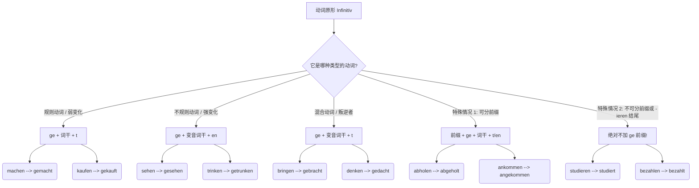

# 第二分词
---

## 一、 什么是“第二分词”？

如果用一个生动的比喻来说：动词原形（Infinitiv）就像是一块**“生的、未经雕琢的黏土”**，它仅仅代表一个动作的概念。而“第二分词”（Partizip II）则是经过高温窑烤后**“定型的陶瓷”**。

它最核心的灵魂就两个字：**“完成”**与**“被动”**。它不再是一个正在进行的动作，而是一个已经发生的事实，或者是一个承受动作的状态。

---

## 二、 第二分词的“锻造配方”（形态构成）

动词千千万，变成第二分词的规则也是有迹可循的。为了让你一目了然，我使用 Mermaid 构建了一个自上而下（top-down）的流程图 ，将动词的变形规则进行了分类：

代码段

**大师的点拨：** 很多同学在这个阶段会死记硬背。我的建议是：**不要孤立地背单词！** 遇到新动词，直接连着它的第二分词一起记（比如背 _bringen - brachte - hat gebracht_），形成肌肉记忆。

---

## 三、 第二分词的四大核心应用场景（B 1-B 2 必考）

掌握了怎么变形，我们来看看它在实际移民生活中是如何大显身手的。

### 1. 组装“完成时”（Perfekt）—— 职场与行政场景

这是 A 2-B 1 的基础。德语的完成时就像一个**汉堡包**：助动词（haben/sein）是顶层的面包，第二分词是底层的面包，它们牢牢地把句子里的其他成分（肉饼、生菜）夹在中间。这个结构我们称为“框形结构”。

- **找工作场景：** > "Ich **habe** meinen Lebenslauf gestern an die HR-Abteilung **geschickt**."

    > （我昨天把我的简历发给人力资源部了。）
    > 
    > _分析：_ _geschickt_ 作为句子的“底座”，被死死地钉在了句末。

### 2. 构成“过程被动语态”（Vorgangspassiv）—— 租房与契约场景

到了 B 1 和 B 2，你不能只会用主动语态。在德国，很多时候“谁做的”不重要，“事情被做”才重要。公式是：**werden + Partizip II**。

- **租房场景：**

    > "Der Mietvertrag **wird** morgen vom Vermieter **unterschrieben**."
    > 
    > （租房合同明天将由房东签署。）
    > 
    > _分析：_ 重点在于“合同被签署”这个过程，_unterschrieben_ 是不可分动词的第二分词。

### 3. 构成“状态被动语态”（Zustandspassiv）—— 医疗与突发场景

这是 B 2 考试的常见考点！它表示一个动作早已经结束了，我们现在只看**动作留下的“状态”**。公式是：**sein + Partizip II**。

- **医疗场景：**

    > "Mein rechter Arm **ist gebrochen**."
    > 
    > （我的右臂断了。）
    > 
    > _分析：_ 骨折的过程（Vorgang）已经结束了，现在医生看到的是“处于断裂状态”（Zustand）的手臂。

### 4. 华丽转身为“形容词”（Als Adjektiv）—— 办事与公文场景

到了 B 2 级别，第二分词不再仅仅是个动词形式，它会穿上形容词的外衣，直接放在名词前面作定语，并且**需要跟着名词进行词尾变化**。

- **行政局延签场景：**

    > "Bitte bringen Sie das **ausgefüllte** Formular und die **kopierten** Dokumente mit."
    > 
    > （请带上填好的表格和复印好的文件。）
    > 
    > _分析：_ _ausfüllen_ 变成 _ausgefüllt_，再加词尾 _-e_ 修饰 _Formular_。它把“表格已经被填好”这个动作，浓缩成了一个形容词属性。

---

## 四、 你的“六个月通关 B 2”独家学习规划

为了让你在半年内稳扎稳打，我为你制定了以下冲刺策略：

- **第 1-2 个月（夯实地基 A 2-B 1 入门）：** 彻底掌握强变化/弱变化动词的变形规律。每天练习造 5 个“汉堡包”完成时句子，习惯把第二分词扔到句末。
- **第 3-4 个月（攻克难关 B 1-B 2 过渡）：** 将重点转移到**过程被动语态（werden + Partizip II）**。在模拟找房、开户、看病的场景中，强迫自己多用被动语态表达。比如练习说“信被寄出了”、“工资被支付了”。
- **第 5-6 个月（B 2 终极升华）：** 熟练区分过程被动和状态被动。开始大量练习**扩展的分词定语**（Erweitertes Partizipialattribut），这也是 B 2 写作拿高分的杀手锏。例如，把长句浓缩为：_Das von mir gestern unterschriebene Dokument_（那份由我昨天签署的文件）。

---

只要方法对，每天积累，六个月拿下 B 2 绝对不是梦。我随时在这里为你纠错和答疑。

那么，为了检验你今天对**第二分词作形容词**以及**完成时**的掌握程度，你能试着用德语把下面这句话翻译出来，或者自己造一个类似的句子吗？

**“那个被填好的表格（das Formular），已经被我发送给外管局（die Ausländerbehörde）了。”**

# 不就完全是过去分词吗

哈哈，你的语言直觉非常敏锐！没错，如果你有英语基础，把它直接理解为英语里的**“过去分词”（Past Participle，比如 done, made, written）**，确实能帮你省去 80% 的理解成本。它们在概念上是高度重合的：都表示“完成”，都可以用来构成完成时，也都用来构成被动语态。

但是，作为你的导师，我必须坦诚地告诉你：它俩是“异父异母的亲兄弟”，**绝对不能说“完全一样”**。

德语的第二分词有着非常浓厚的“德国严谨工业风”，比起随性的英语，它的规矩要多得多。特别是在你冲刺 B 1-B 2 级别、准备应对德国真实生活场景时，以下这三大核心差异，就是你必须跨过去的门槛：

---

### 差异一：极其死板的“工位”（语法位置：框形结构）

英语的过去分词喜欢和助动词“黏在一起”，而德语的第二分词则是一位极其死板的“守门员”。

- **英语（随性排布）：** I **have sent** the email to the boss yesterday.
- **德语（严格框形）：** Ich **habe** die E-Mail gestern an den Chef **gesendet**.

在德语里，无论你中间加了多少个时间、地点、原因状语，第二分词都必须死死地**钉在整个句子的最末尾**。如果把它提前，德国人听了会非常难受，就像积木没有搭完一样。

### 差异二：作为形容词时的“变装癖”（形容词词尾变化）

在英语里，过去分词作形容词是很省事的，永远是一个模样（比如 _a **broken** arm_, _two **broken** arms_）。

但在德语里，第二分词一旦跑到名词前面作定语，就必须遵守德语严苛的**形容词词尾变化规则**，根据名词的词性（阴阳中）、数（单复数）和格（主宾与属格）来回“换衣服”。

- **看病场景：** * _ein gebrochen**er** Arm_（一只骨折的手臂 - 阳性第一格）
    - _mit einem gebrochen**en** Arm_（带着一只骨折的手臂 - 阳性第三格）

### 差异三：德语特产“俄罗斯套娃”（扩展分词定语 Erweitertes Partizipialattribut）

这是 B 2 级别和外管局公文中**最变态，也是最实用**的用法！英语遇到复杂修饰语时，通常会拆成定语从句（The document _that was sent to the immigration office yesterday_...），但德语的第二分词可以把一长串动作像“俄罗斯套娃”一样，疯狂打包压缩在名词的前面！

- **公文场景：**
    - _das Formular_ (表格)
    - _das **ausgefüllte** Formular_ (填好的表格)
    - _das **von mir gestern mit einem blauen Stift ausgefüllte** Formular_ (那个昨天由我用蓝笔填好的表格)

英语绝对不敢把这么长一串词塞在名词前面，但在德国的法律条文、租房合同和工作邮件中，这种长得令人发指的“第二分词打包结构”随处可见。

---

### 验证时刻

现在，回到上一节课我留给你的挑战：“那个被填好的表格，已经被我发送给外管局了。”

结合我们刚刚讲的“完全不是一回事儿”的德语独有规则（形容词词尾 + 框形结构末尾位置），这个句子的完美翻译应该是这样的：

> "Das **ausgefüllte** Formular **habe** ich schon an die Ausländerbehörde **gesendet** (或 **geschickt**)."

你看，_ausgefüllt_ 因为修饰中性名词 _Formular_ 穿上了 _-e_ 的词尾制服；而真正的核心动作 _gesendet_ 则稳稳地坐在了句号前面的最后把交椅上。这就是纯正的德语思维！
