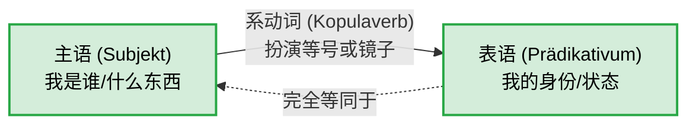
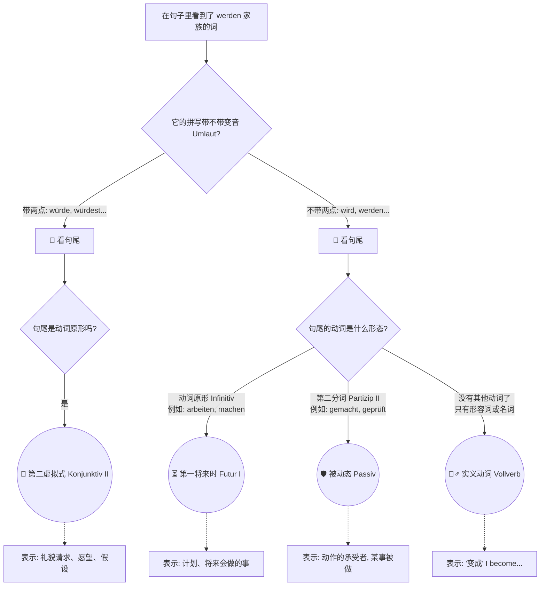
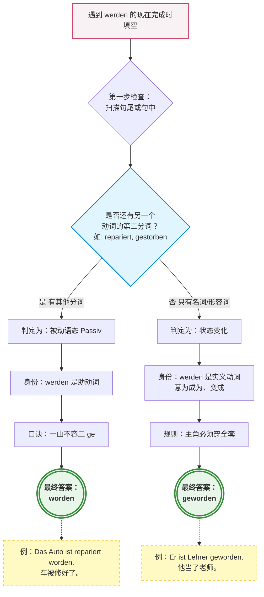

---
aliases:
  - sein
  - werden
  - bleiben
---

# 系动词

今天，我们来系统地攻克德语中的一个核心枢纽——**系动词（Kopulaverben）**。

为了让你秒懂，我们先建立一个生动的类比：**系动词不是用来“做动作”的，它是数学里的“等号（=）”，或者是一面“镜子”。**

在普通的德语句子里（比如“我吃苹果”），有一个动作的发出者（我）和承受者（苹果）。但是系动词不同，它没有真正的动作，它只是在主语和主语的身份、状态之间架起一座桥梁。

你可以看看下面这个关系图，理解一下这面“镜子”的结构：

---

### 一、 德语系动词的“三巨头”

德语里的纯正系动词非常少，主要就是三个。它们分别代表了状态的三种不同阶段：

#### 1. sein (是) —— 状态的“存在”

这是最基础的等号，表示你现在是什么状态或身份。

- **[职场场景]** Ich **bin** ein erfahrener Ingenieur. (我**是**一名经验丰富的工程师。)
- **[医疗场景]** Das Kind **ist** krank. (这孩子病**了**。)

#### 2. werden (成为 / 变) —— 状态的“变化”

表示从一种状态过渡到另一种状态，或者身份的转变。

- **[移民场景]** Er **wird** bald deutscher Staatsbürger. (他很快就要**成为**德国公民了。)
- **[租房场景]** Die Miete **wird** jedes Jahr teurer. (房租每年都在**变**贵。)

#### 3. bleiben (保持 / 停留) —— 状态的“延续”

表示拒绝改变，状态继续维持。

- **[行政场景]** Die Regeln bei der Ausländerbehörde **bleiben** streng. (外管局的规定**依然**严格。)
- **[生活场景]** Wir **bleiben** gute Nachbarn. (我们**继续做**好邻居。)

---

### 二、 系动词与其他成分结合时的“化学反应” (核心考点)

当这三大系动词与其他词性或时态相遇时，会发生一些非常独特的变化。这也是很多初学者容易掉坑的地方。我们总结了四个“大师法则”：

#### 法则 1：与名词结合的“双重第一格（Nominativ）法则”

**口诀：照镜子，你还是你，绝不变格！**

普通的动词后面通常接第四格（Akkusativ，宾语）。但系动词是镜子，镜子外面的主语是第一格，镜子里的身份**也必须是第一格（Gleichsetzungsnominativ）**。

- ❌ 错误：Das ist _einen_ teuren Mietvertrag. (把租房合同当成了第四格宾语)
- ✅ **正确：Das ist _ein_ teurer Mietvertrag.** (这是一份昂贵的租房合同。主语和表语都是第一格。)
- ✅ **正确：Herr Müller bleibt _mein_ bester Freund.** (米勒先生依然是我最好的朋友。第一格！)

#### 法则 2：与形容词结合的“裸奔法则”

**口诀：做表语的形容词，坚决不穿衣服（不加词尾）！**

当形容词跟在系动词后面，用来描述主语的状态时（做表语），它绝对不能加任何词尾变形。

- **[租房场景]** Die Wohnung **ist** sehr _hell_ und _geräumig_. (这套公寓很明亮宽敞。_hell_ 和 _geräumig_ 没有任何词尾。)
- 对比一下如果形容词跟在名词前面（定语）：Das ist eine _helle_ und _geräumige_ Wohnung. (这里就要穿衣服加词尾了)。

#### 法则 3：与介词结合的“状态转移法则”

系动词后面也可以接介词短语，此时介词短语充当状态。

- **[求职场景]** Ich **bin** _auf der Suche nach_ einem Vollzeitjob. (我正处于寻找全职工作的状态中 = 我正在找工作。)
- **[日常场景]** Wir **sind** _gegen_ diese Entscheidung. (我们反对这个决定。_gegen_ 表示处于对立面。)

#### 法则 4：与时态结合的“同流合污法则”

当我们需要把这三个系动词变成**完成时 (Perfekt)** 时，它们有一个惊人的共性：**它们的助动词全部使用 _sein_，而不是 _haben_！** (因为它们都表示状态的存续或变化)。

- **sein 的完成时：** Ich **bin** gestern in der Klinik **gewesen**. (我昨天在诊所来着。)
- **werden 的完成时：** Das Wetter **ist** plötzlich kalt **geworden**. (天气突然变冷了。)
- **bleiben 的完成时：** Mein Visum **ist** glücklicherweise gültig **geblieben**. (我的签证幸运地保持了有效。)

---

### ⚠️ 大师的特别警告：`werden` 的多重人格

在 B 1/B 2 阶段，你必须看穿 `werden` 的伪装。它不仅仅是系动词（变成），它还是德语语法里的“超级打工仔”（助动词）。

1. **当系动词（变/成为）：** 后面接形容词或名词。
    
    - _Mein Deutsch **wird** besser._ (我的德语**变**好了。)
        
2. **当将来时助动词：** `werden` + 动词原形（放在句末）。
    
    - _Ich **werde** den Vertrag morgen **unterschreiben**._ (我明天**将要**签这份合同。)
        
3. **当被动语态助动词：** `werden` + 动词第二分词（Partizip II，放在句末）。
    
    - _Das Formular **wird** vom Beamten **geprüft**._ (这份表格正在**被**官员审查。)

---

### 下一步：实战演练

理解了理论，我们马上来测试一下你的吸收情况。这不仅能巩固知识，也是你这六个月 B 2 冲刺计划中的第一步。

请尝试用今天学的**系动词（sein, werden, bleiben）**，将下面这两个和德国生活息息相关的句子翻译成德语。记住我们的“双重第一格”和“裸奔”法则哦！

1. **这套公寓（die Wohnung）太贵了（teuer），但我会保持乐观（optimistisch）。**
2. **他曾经是一名医生（der Arzt），但现在他成了一名护士（der Krankenpfleger）。** _(提示：前半句用 sein 的过去时/完成时，后半句用 werden 的现在时/完成时)_

你先试着翻译一下，我会帮你精准纠错并分析！准备好了吗？

# werden 在句式中的区别

---

### 🎭 韦尔登先生的三重身份

首先，我们要看他在三种情况下的**“工装”（变形）**和**“搭档”（句尾的动词形式）**，这是区分它们的最核心秘诀。

#### 1. 算命先生：第一将来时 (Futur I)

- **人设：** 预测未来，或者表达一个确定的计划。
- **变形 (Präsens)：** ich **werde**, du **wirst**, er/sie/es **wird**, wir **werden**, ihr **werdet**, sie/Sie **werden**
- **句式公式：** **werden** (变形) + ...其他成分... + **动词原形 (Infinitiv)** (放在句尾)
- **💡 移民生活场景（找工作/规划）：** 你拿到了一份心仪的 Offer，满怀信心地对朋友说：

    > "Ich **werde** morgen den Arbeitsvertrag **unterschreiben**."
    > 
    > （我明天**将会去签**工作合同。）
    > 
    > _大师解析：注意句尾的 unterschreiben 是原形！说明这是将要发生的事。_

#### 2. 甩锅大师：过程被动态 (Vorgangspassiv)

- **人设：** 强调动作本身，弱化甚至隐藏“谁做的”（德式官僚系统中极度常见）。
- **变形 (Präsens)：** 同上（werde, wirst, wird...）
- **句式公式：** **werden** (变形) + ...其他成分... + **动词第二分词 (Partizip II / PII)** (放在句尾，通常带有 ge- 前缀)
- **💡 移民生活场景（外管局延签/医疗）：** 你交了延签材料，但等了三个月没消息。你打电话去外管局，办事员冷冰冰地回答你：

    > "Ihr Visum **wird** gerade **geprüft**."
    > 
    > （您的签证正在**被审核**。）
    > 
    > _大师解析：注意句尾的 geprüft 是第二分词 (PII)！谁在审核？不重要，也不想告诉你，重点是“被审核”这个动作正在发生。这就是被动态的核心逻辑。_

#### 3. 造梦家与礼貌大使：第二虚拟式 (Konjunktiv II)

- **人设：** 表达愿望、非现实的假设，或者在求人时展现出极度的礼貌。
- **变形 (Würden-Form)：** 换上了带两点的特殊工装。ich **würde**, du **würdest**, er/sie/es **würde**, wir **würden**, ihr **würdet**, sie/Sie **würden**
- **句式公式：** **würden** (变形) + ...其他成分... + **动词原形 (Infinitiv)** (放在句尾)
- **💡 移民生活场景（看房/求人）：** 你看中了一套极品好房，为了在众多看房客中脱颖而出，你极其礼貌地对房东说：

    > "Ich **würde** diese Wohnung sehr gerne **mieten**."
    > 
    > （我**非常希望能租下**这套公寓。/ 如果能租下这套公寓就好了。）
    > 
    > _大师解析：不仅换上了 würde，句尾的 mieten 也是原形。这比直接说 "Ich will..." 听起来有教养得多，是 B 2 级别必须掌握的社交利器。_

---

### 📊 终极对比：如何一秒看穿韦尔登先生？

这里为你总结了一张对比表。记住：**看 werden 长什么样，再看句尾的动词穿什么衣服！**

| **语法角色**                  | **隐喻**   | **核心助动词 (以 ich 为例)**       | **句尾动词形态**                 | **标志性结构**                | **移民生活例句**                                                             |
| ------------------------- | -------- | -------------------------- | -------------------------- | ------------------------ | ---------------------------------------------------------------------- |
| **第一将来时 (Futur I)**       | 算命先生     | **werde** (现在时形式)          | **==动词原形==** (-en)         | **werden + Infinitiv**   | Ich **werde** den Arzt **anrufen**. (我将给医生打电话。)                        |
| **被动态 (Passiv)**          | 甩锅大师     | **werde** (现在时形式)          | ==**第二分词**== (ge-...-t/en) | **werden + Partizip II** | Ich **werde** vom Arzt **untersucht**. (我正在被医生检查。)                     |
| **第二虚拟式 (Konjunktiv II)** | 造梦家/礼貌大使 | **würde** (带 Umlaut 的特殊形式) | **动词原形** (-en)             | **würden + Infinitiv**   | Ich **würde** den Arzt gerne **anrufen**. (我想给医生打个电话 / 如果能给医生打个电话就好了。) |

- [!]  首先只有第一将来时任何被动态它们形式相同，只有动词不同，第一将来时用的是不定式，被动态用的是动词的第二分词，儿第二虚拟式会在头上加两个点最容易区分

---

### 🗺️ 大师教你：逻辑判断流程图

为了让你在做 B 2 阅读和听力时能瞬间反应过来，我为你准备了这个决策树图表 ：

代码段

---

### 📅 六个月通关 B 2 的定制策略建议

要在六个月内达到 B 2 水平并顺利应对移民生活，你的时间非常宝贵。不要死磕冷僻语法，要抓大放小：

- **第 1-2 个月（夯实 B 1/巩固基础）：** 彻底搞懂各种从句（dass, weil, obwohl）以及今天讲的 **werden** 的三大用法。每天用这三个句式造一句跟你的生活（租房、购物）相关的句子。
- **第 3-4 个月（B 2 进阶/词汇爆发）：** 开始接触德国本地新闻（如 DW Deutsch lernen）和官方信件（Behördenbriefe）。你会发现信件里全是**被动态**。开始训练自己用**第二虚拟式**写礼貌的求职信和投诉信。
- **第 5-6 个月（冲刺应试/疯狂输出）：** 针对歌德学院或 Telc 的 B 2 题型进行模拟。口语部分，强制自己多用 `Ich würde sagen, dass...` (我想说...) 来争取思考时间并展示你的高级语法储备。

这三个核心语法点在 B 2 考试的口语和写作中是**绝对的加分项**，考官只要听到你正确使用了被动态或者礼貌的虚拟式，心里就会直接给你盖上“B 2 通过”的印章。

现在，轮到你来实战演练了。请告诉我，如果你在税务局 (Finanzamt) 办完事，你想极其礼貌地用德语对工作人员说：**“我非常乐意今天下午把缺失的文件发给您。”**，你会怎么运用今天学到的知识来造这个句子呢？

# 实义动词,中 worden 还是 geworden, 区别和应用场景?

![[image-219.png|1120x244]]

这是一份关于**动词 werden 在现在完成时（Perfekt）中的使用**的专项练习。从你提供的图片来看，你正在练习 `werden` 作为实义动词时的第二分词形态。

以下是详细的逐题解析和深度教学，同时也一并解答了你关于“什么时候用 worden 要不要加 ge”的核心疑问。

---

### 1、逐题精析与纠正

**题目类型**：动词 `werden` 作为实义动词（表示“成为、变成”）时的现在完成时（Perfekt）变位。

**完整题干与填空**：

5. Ihr Sohn ist Lehrer `geworden`.
6. Er ist mit 50 gestorben. Er ist nicht alt `ge[worden]`.
7. 2005 ist Angela Merkel Kanzlerin `ge[worden]`.

**【第 5 题】**：Ihr Sohn ist Lehrer **geworden**.

* **德汉对照**：她的儿子当了老师。
* **诊断与分析**：
    * **你的答案**：`geworden`（**完全正确 ✅**）。
    * **正确形式**：geworden。
    * **解析**：这里 `werden` 后面接名词 `Lehrer`，表示状态的变化（成为某种职业）。作为实义动词的完成时，助动词用 `sein`（句中的 ist），第二分词为 `geworden`。

**【第 6 题】**：Er ist mit 50 gestorben. Er ist nicht alt **geworden**.

* **德汉对照**：他 50 岁就去世了。他没能变老。
* **诊断与分析**：
    * **你的答案**：`ge`（**未完成/错误 ❌**）。
    * **可能原因**：你可能记得需要加前缀 `ge-`，但对拼写不确定，或者在犹豫是否要写成 `worden`，导致只写了一半。
    * **正确形式**：geworden。
    * **解析**：前句 `gestorben` 是 `sterben`（死亡）的完成时（A 2 语法）。后句中，`werden` 后面接形容词 `alt`，表示“变老”。同样是表示状态变化的实义动词，必须使用完整的 `geworden`。

**【第 7 题】**：2005 ist Angela Merkel Kanzlerin **geworden**.

* **德汉对照**：2005 年，安格拉·默克尔成为了总理。
* **诊断与分析**：
    * **你的答案**：`ge`（**未完成/错误 ❌**）。
    * **可能原因**：同第 6 题，对动词形态记忆模糊或产生混淆。
    * **正确形式**：geworden。
    * **解析**：接名词 `Kanzlerin`（女总理），表示身份的转变，依然是实义动词用法，填入 `geworden`。

---

### 2、深度教学解析（聚焦：werden 的第二分词 geworden vs. worden）

你提出的问题非常经典，这也是德语学习者在 A 2-B 1 阶段最容易混淆的语法点之一：**到底什么时候加 `ge-`，什么时候不加？**

**核心规则：看 `werden` 在句中的“身份”**

动词 `werden` 在德语中有双重身份，它的身份决定了它的完成时形态：

* **身份一：作为实义动词 (Vollverb) —— 必须有 `ge-` (`geworden`)**
    * **用法**：当它表示“变成、成为”（后接名词或形容词）时。它是句子的主角。
    * **完成时结构**：`sein` + (名词/形容词) + ** `geworden` **。
    * **本例**：Sie ist Lehrerin **geworden**. (她当了老师。)
    * **拓展例**：Das Wetter ist kalt **geworden**. (天气变冷了。)
* **身份二：作为助动词 (Hilfsverb) —— 绝对不加 `ge-` (`worden`)**
    * **用法**：当它用来构成**被动语态 (Passiv)**的完成时。此时它只是个帮手，句中必定还有另一个动词的第二分词。
    * **完成时结构**：`sein` + **实义动词的第二分词** + ** `worden` **。
    * **拓展例**：Das Auto ist *repariert* **worden**. (这辆车被修好了。) -> *注意：句中已经有了 repariert 这个第二分词，所以 werden 退居幕后，脱掉 ge- 的帽子，变成 worden。*
    * **经典反例**：Das Auto ist repariert *geworden*. (❌ 绝对错误，被动完成时不能出现 geworden)。

**防错要点：**

> **“一山不容二虎，一句不容二 `ge`。”**
> 在做题时，先检查句尾前面**有没有另一个第二分词**（比如 repariert, gebaut, geschrieben）。
> ➡️ 如果**没有**别的分词（只有名词或形容词），`werden` 是主角，填 ** `geworden` **。
> ➡️ 如果**有**别的分词，`werden` 是配角表示被动，填 ** `worden` **。

**小试牛刀：**

请尝试判断以下两句话填 `geworden` 还是 `worden`：

1. Das Haus ist 1990 gebaut _______. (这栋房子是 1990 年建成的。)
2. Er ist nach dem Studium Arzt _______. (他大学毕业后成了一名医生。)
*(答案：1. worden (因为有 gebaut)； 2. geworden (因为只有名词 Arzt))*

---

### 3、总结与回顾

* **您的学习建议**：你对 `werden` 作为实义动词“成为”的用法已有初步概念（第 5 题正确），但在书写时缺乏自信（6、7 题半途而废）。在接下来的复习中，建议把 ** `werden` 的实义动词用法**和**被动语态用法**放在一起对比造句，利用“找句子中是否有另一个第二分词”这个诀窍，就能彻底攻克这个难点。做题时一定要把单词拼写完整！
