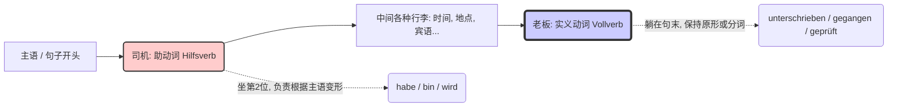

# 助动词

Hallo! 很高兴你继续我们在德语世界的探索。你问到了一个极其关键的概念：**什么是助动词（Hilfsverb）？**

如果说上次我们讲的“变位动词”是占据句子里第2位王座的“国王”，那么今天我们要聊的**助动词，就是德语这台精密机器里的“齿轮传动轴”**。

在德语中，真正纯正的助动词只有三个：**haben（有）**、**sein（是）** 和 **werden（变成）**。

为了让你秒懂，我们用一个“老板与专职司机”的类比来看看它们是怎么工作的。

### 助动词的本质：老板的“专职司机”

在一个句子里，通常有一个**实义动词（Vollverb）**，比如“签（合同）”、“喝（水）”、“去（外管局）”。这个词是真正包含动作意义的，它是**“老板”**。

但是，当老板想要表达“过去发生的事（完成时）”、“未来要发生的事（将来时）”或者“被动挨打/被处理的事（被动语态）”时，老板自己是不动手的。他会雇佣一个**“助动词”来当“专职司机”**。

**工作模式是这样的：**

1. **司机（助动词）坐在前面驾驶座上（占据主句的第2位**），并且负责根据主语变装（变位，比如 ich habe, er hat）。
2. **老板（实义动词）舒舒服服地躺在车后座（句子的最末尾**），保持着某种固定的姿态（原形或者过去分词），根本不需要根据主语去变形。

我们用一张图表来看看这个“专车”结构：

代码段

---

### “德语三剑客”：助动词在移民生活中的实战应用
讲解德语所有的时态和它们的区别
这三个助动词分别承载了不同的语法任务，我们结合你未来在德国的实际生活场景来看看：

#### 1. Haben (有) —— 最常用的“时光机司机”（构成现在完成时 Perfekt）

当你要表达过去发生的事情时，绝大多数动词都会雇佣 `haben` 作为助动词。

- **场景：找房子（Wohnungssuche）**
- **德语：** Ich **habe** gestern den Mietvertrag **unterschrieben**.
- **解析：** _habe_（司机，haben的变位）坐在第2位，表示这是过去时态；_unterschrieben_（老板，签名的过去分词）躺在句末。
- **中文：** 我昨天签了租房合同。

#### 2. Sein (是) —— 专属“位移与状态改变”的司机（构成现在完成时 Perfekt）

如果“老板”（实义动词）表达的是**从A点移动到B点**（比如去、来、飞），或者**状态的改变**（比如醒来、死、睡着），它就不雇 `haben` 了，它要雇 `sein`。

- **场景：看医生（Arztbesuch）**
- **德语：** Ich **bin** heute Morgen schnell zum Arzt **gegangen**.
- **解析：** _bin_（司机，sein的变位）坐在第2位；_gegangen_（老板，去/走 的过去分词）躺在句末。
- **中文：** 我今天早上赶紧去看了医生。

#### 3. Werden (变成) —— B1/B2的核心大BOSS！（构成将来时 Futur 和 被动语态 Passiv）

这个词是你突破B1走向B2的关键。德国人非常喜欢用被动语态（尤其是官方信件和新闻里），而被动语态的唯一指定助动词就是 `werden`。

- **场景：行政事务 / 外管局（Ausländerbehörde）**
- **德语：** Mein Visum **wird** gerade von der Behörde **geprüft**.
- **解析：** _wird_（司机，werden的变位）坐在第2位，搭配句末的过去分词 _geprüft_（审查），构成了**被动语态**。
- **中文：** 我的签证正在被外管局审查。（你不需要知道是谁在审，重点是“被审查”这个动作）。

---

**大师总结：** 助动词本身在这些句子里**没有实际的翻译意思**（你在上面的中文翻译里看不到“有”、“是”、“变成”的字眼）。它们纯粹是为了**搭建语法结构**（帮你表达时间或被动）而存在的工具人。记住“司机和老板”的位置，你就掌握了德语时态和语态的核心密码！

**下一步（Nächster Schritt）：**

现在轮到你来当“车队调度员”了。假设你要向你的德国房东表达：**“我已经支付了押金（die Kaution）。”** （提示：支付的实义动词是 _bezahlen_，它的过去分词还是 _bezahlt_；这是一个普通的动作，不需要位移，所以该选哪个助动词呢？）

试着把这句话用德语造出来吧！大胆试，大师随时为你纠错。
