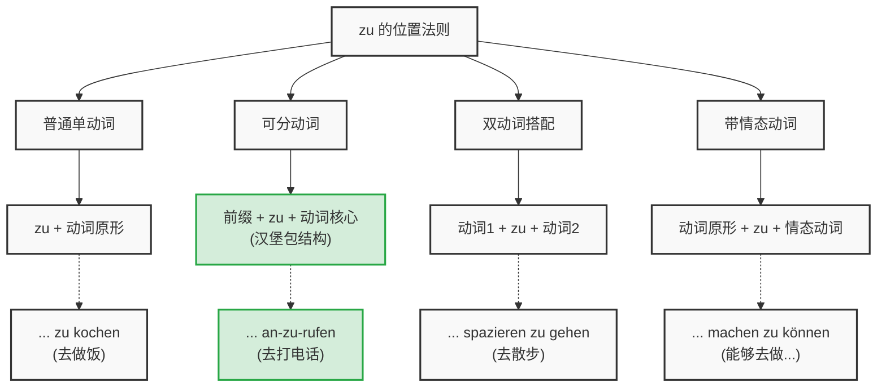
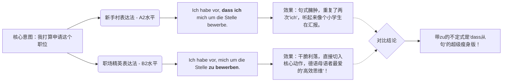
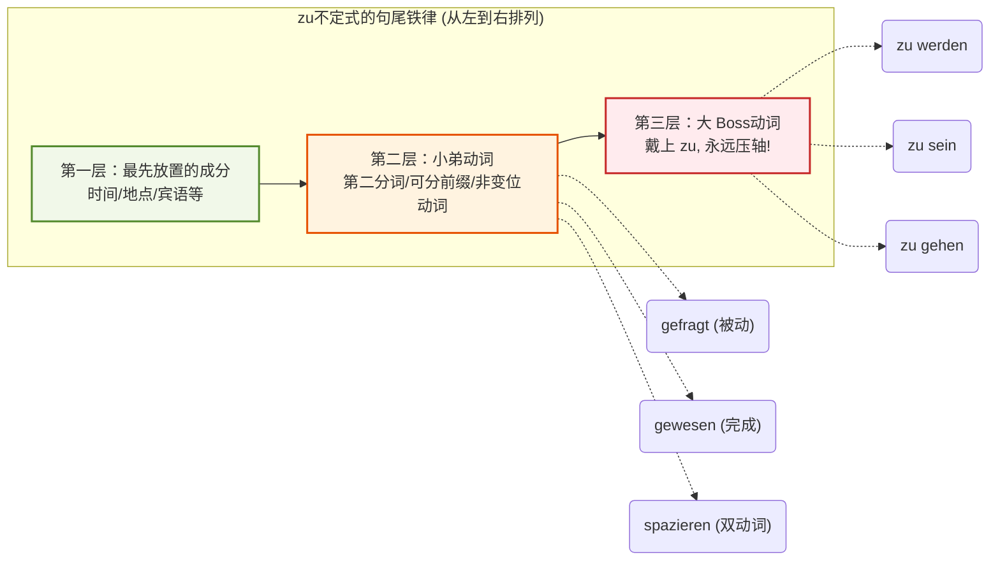
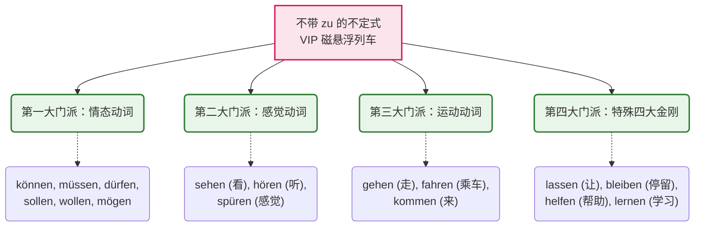

# 带zu的不定式

# 1

Hallo！你好！欢迎来到我的德语小课堂。我是你的“德语大师”。看到你定下了“六个月内拿下 B 2”的硬核目标，我必须为你点赞！这不仅需要毅力，还需要科学的方法。在异国他乡，语言就是我们最好的通行证。

不要一看到“不定式”三个字就觉得头大。让我用一个生动的比喻来给你拆解：**如果把德语的主句比作一辆“火车头”，那么带 zu 的不定式就是挂在后面的“车厢”。** 它们没有自己的发动机（没有主语），必须靠前面的火车头拉着跑！

为了让你在六个月内不仅能应付考试，还能在德国租房、找工作、看医生时对答如流，我们把这个知识点彻底嚼碎！

---

### 第一部分：什么时候邀请 "zu" 出场？（火车头与车厢的挂钩）

不是所有的句子都能接 `zu` 不定式。图表中给了我们三大类“火车头”，它们天生就喜欢带后面的“小弟”（zu 不定式）。

#### 1. 表达评价、感受或客观情况 (es ist + 形容词 / ich finde es + 形容词)

当你想要对某件事发表看法时，主句先摆明态度，后面的 `zu` 不定式解释具体是什么事。

- **【找房实战】**
    - _Es ist nicht leicht,_ eine günstige Wohnung in München **zu finden**. (在慕尼黑找到一间便宜的公寓**是不容易的**。)
    - _Ich finde es wichtig,_ den Mietvertrag genau **zu lesen**. (我**觉得**仔细阅读租房合同**很重要**。)

#### 2. 搭配抽象名词 (主句中含有特定的抽象名词)

比如时间(Zeit)、梦想(Traum)、机会(Chance)、问题(Problem)、害怕(Angst)等。

- **【求职/职场实战】**
    - _Ich habe heute leider keine Zeit,_ an dem Meeting **teilzunehmen**. (我今天遗憾地**没有时间去参加**那个会议。)
    - _Es ist mein Traum,_ in Deutschland als Ingenieur **zu arbeiten**. (在德国作为工程师工作**是我的梦想**。)
    - _Ich habe die Chance,_ ein Praktikum bei BMW **zu machen**. (我**有机会**在宝马做实习。)

#### 3. 跟着特定的“带头大哥”动词 (可再跟一个动词的动词)

有些动词天生就自带延伸动作，比如：希望(hoffen)、尝试(versuchen)、开始(anfangen/beginnen)、停止(aufhören)、建议(raten/empfehlen)。

- **【看病/延签实战】**
    - _Der Arzt rät mir,_ mehr Wasser **zu trinken** und mich **auszuruhen**. (医生**建议我多喝水**并多休息。)
    - _Ich versuche,_ das Formular für die Ausländerbehörde fehlerfrei **auszufüllen**. (我正**尝试着**把外管局的表格无误地**填好**。)
    - _Ich hoffe,_ das B 2-Zertifikat in sechs Monaten **zu bekommen**. (我**希望**在六个月内**拿到**B 2 证书。)

---

### 第二部分："zu" 的站位学问（这节车厢怎么拼装？）

在句型结构上，`zu` 不定式结构总是被踢到句子的**最末尾**。那么 `zu` 究竟放在动词的哪里呢？这里我为你准备了一个思维导图，一目了然：

代码段

**大师划重点（避坑指南）：**

1. **普通动词**最简单，直接放在动词前。
2. **可分动词**是重灾区！一定要记住“汉堡包”法则：`zu` 就像汉堡里的肉饼，必须夹在**前缀**和**基础动词**中间，而且要**连写成一个词**！
    
    - _(错误)_ Ich versuche, zu ausfüllen das Formular. ❌
    - _(正确)_ Ich versuche, das Formular **auszufüllen**. ✅
        
3. **情态动词**的用法是 B 2 口语和写作的加分项。比如图中的 _Es ist schön, viel Urlaub machen zu können._（能度很多假是件美好的事）。在德语中，能力(können)、意愿(wollen)本身也可以变成不定式。

---

### 第三部分：生死攸关的“主语一致性”原则 (dass 还是 zu?)

图表的最后一段提到了一个绝对不能忽视的黄金法则，这是 B 2 考试最爱挖的陷阱！

还记得我开头的比喻吗？“车厢”（zu 不定式）没有自己的发动机，它必须靠“火车头”（主句）拉着。也就是说：**zu 不定式里的动作，必须是主句的那个主语发出的！**

如果两件事的主语**是一家人（同一个）**，用 `zu` 不定式，句子简洁高级：

- _Ich_ hoffe, pünktlich **zu kommen**.

    _(我希望，我能准时到。主句是我，准时到的也是我。)_

如果两件事的主语**不是一家人（不一致）**，就绝对不能用 `zu`！这时候必须请出大名鼎鼎的从句引导词 `dass`，给从句配上独立的发动机（主语）：

- _Ich_ hoffe, **dass** _er_ pünktlich **kommt**.

    _(我希望，他能准时到。主句是我，准时到的是他。发动机不同了！)_

**【行政事务实战】**

- 你对签证官说：Ich hoffe, mein Visum bald **zu erhalten**. (我希望能很快拿到签证。—— 拿到签证的是你)
- 你对朋友抱怨外管局：Ich hoffe, **dass** die Beamten mein Visum bald **bearbeiten**. (我希望官员们能尽快处理我的签证。—— 处理签证的是官员，主语变了！)

---

### 第四部分：你的“六个月通关 B 2”行动指南

既然目标是六个月拿下 B 2，并且是为了在德国顺利生活，那么从今天起，请按照以下策略将这个语法点融入你的血液：

1. **场景化造句（每天 3 句）：**

    不要背干巴巴的例句，把你每天要办的事用德语写下来。

    - _今天要去超市:_ Es ist wichtig, heute noch frisches Gemüse **einzukaufen**. (买菜，einkaufen 是可分动词哦！)
    - _准备投简历:_ Ich fange an, meinen Lebenslauf auf Deutsch **zu schreiben**.
        
2. **录音纠错法：**

    说出你的句子并录音。然后听一听，`zu` 有没有放错位置？可分动词有没有夹在中间（比如：aus-zu-machen）？

3. **阅读敏感度：**

    在看德国新闻、招聘启事或租房网（WG-Gesucht / ImmoScout 24）时，拿出一支荧光笔，专门寻找 `zu + Infinitiv` 的结构。你会发现它们无处不在！

**现在，轮到你来实战了！**

请你想象自己刚搬到柏林，遇到了一些租房的麻烦。请尝试用今天学的语法（主句挑一个，配上 zu 不定式）把下面这两句话翻译成德语：

1. _(我觉得很烦人)_，我的暖气坏了，但我联系不上房东。 (提示联系不上：den Vermieter nicht erreichen)
2. _(我没有时间)_，今天一直在家里等修理工。 (提示等修理工：auf den Handwerker warten)

发给我你的答案，大师亲自为你批改！我们一步一个脚印，B 2 绝对没问题！Viel Erfolg! (祝你成功！)

# 这个柱的不定是存在的意义是什么为什么要用它，用它和不用它又有什么区别和效果强调一下

在德语学习的初期（A 1-A 2），我们只要能把意思表达清楚就算胜利；但到了 B 1-B 2 阶段，我们的目标是**融入、专业、高效**。带 `zu` 的不定式（Infinitiv mit "zu"），正是帮你实现这一跨越的“秘密武器”。

为了回答你的问题，我们先来看一张直观的对比图，体会一下这两种表达方式在“气质”上的巨大差异：

代码段

---

### 🌟 在连词句中少一个主语和变位

德国人以严谨和追求效率著称，这在他们的语言中体现得淋漓尽致。

**区别与效果：**

如果你不用带 `zu` 的不定式，你就必须依赖 `dass`（连词“因为/所以/那”）来引导一个完整的从句。这意味着你必须再造一个主语，再变位一次动词。

- **不用 zu（啰嗦版）：** Es ist wichtig, **dass man** die Mietkaution pünktlich **überweist**. (重要的是，**人们**要把租房押金按时**汇过去**。)
- **用 zu（精简版）：** Es ist wichtig, die Mietkaution pünktlich **zu überweisen**. (按时**汇**租房押金很重要。)

**强调了什么？**

它强调了**“省去废话，直奔主题”**。当主句和从句的执行者是同一个人，或者在无人称句型中（大家都要遵守的客观事实）时，重复主语是极度浪费唇舌的。带 `zu` 的不定式就像是给句子做了一次“抽脂手术”，让你的德语听起来不再像个初学者，而是像一个思维敏捷的成年人。

---

### 聚焦于表达核心

当你使用带 `zu` 的不定式时，你实际上在引导听众的注意力。

**区别与效果：**

- **找工作场景（不用 zu）：** Ich hoffe, _dass ich_ den Arbeitsvertrag bald unterschreibe.
    _听者的注意力被分散了：我希望..._我_...很快签合同。_

- **找工作场景（用 zu）：** Ich hoffe, den Arbeitsvertrag bald **zu unterschreiben**.
    _听者的注意力瞬间聚焦：我希望...**签合同**！_

**强调了什么？**

它强烈地强调了**动作（Handlung）和事件本身**，弱化了做动作的人。在德国的职场、租房谈判、与外管局（Ausländerbehörde）的交涉中，往往“事情办成”比“谁去办”更重要。这种表达方式显得更加**客观、专业、有礼貌**。

---

### 🌟 存在意义三：B 2/C 1 高阶语法的基石

如果你仔细观察德国的官方文件、信件和新闻，你会发现带 `zu` 的不定式无处不在。它是很多高级表达的“地基”。如果不用它，很多更高级的、充满逻辑感的修辞你根本无法使用。

**比如我们上节课提到的“魔法三兄弟”：**

如果没有 `zu` 的不定式，你将无法优雅地表达复杂的逻辑。

- **医疗场景（你想表达：他没吃药就去上班了）**
    - **不用 zu（A 2 拼凑法）：** Er ist zur Arbeit gegangen. Und er hat seine Medikamente nicht eingenommen. (他去上班了。而且他没吃药。—— 像两个生硬的石块堆在一起)
    - **用 zu（B 2 伴随状语）：** Er ist zur Arbeit gegangen, **ohne** seine Medikamente **einzunehmen**. (他去上班了，却**没吃**药。—— 逻辑紧密，一气呵成！)

**强调了什么？**

它强调了你作为新移民的**教育水平和语言素养**。在德国，一口流利且结构复杂的德语（即大量使用不定式和从句结构）是获得尊重、顺利通过面试、赢得房东好感的重要隐形筹码。

---

### 🎯 总结：为什么要逼自己用它？

1. **脱离“娃娃音”：** 停止每句话都用 _Ich... dass ich..._ 这种重复结构。
2. **符合德国人的阅读/听觉习惯：** 他们的大脑在等待那个挂着“访客牌”的动词原形出现在句末，这会给他们一种“句子完美闭环”的舒适感。
3. **考试拿分硬指标：** 无论是 Goethe-Zertifikat B 2 还是 Telc B 2，考官在口语和写作中都在“竖着耳朵”听你有没有用 `um...zu...`, `ohne...zu...` 或者简单的 `zu + Infinitiv`。不用？很难上高分。

现在，感受到了这个小小的 `zu` 背后蕴含的巨大力量了吗？它是你从“能说德语”向“能把德语说得很漂亮”进阶的必经之路！

**来，趁热打铁，感受一下效果的区别！**

请你把这句极其啰嗦的“A 2 德语”用 `zu` 改造为“B 2 精英德语”（租房场景）：

_A 2 啰嗦版：_ Ich versuche, **dass ich** den Vermieter heute Nachmittag **anrufe**. (我尝试，我今天下午给房东打电话。)

_你的 B 2 改造版是：___________________

# 1, 我是说系动词和其他动词同时出现, 谁放 zu 后面. 2. 是不是我想强调散步,也可以把 spazieren 放到最后,看我主观意愿

哈哈，大师必须要给你热烈鼓掌！你能问出这两个问题，说明你的大脑已经不再满足于“死记硬背”，而是开始探索德语的底层架构了！拥有这种“寻找规则边界”的敏锐度，你离 B 2 的终点线已经非常近了。

你问的这两个问题，触及了德语句法学中最核心的两个原则：**“动词阶级论”**和**“句尾铁律”**。我们一个一个来硬核破解！

---

### 第一个问题：系动词和其他动词同时出现，谁放 `zu` 后面？

首先，我们要理清一个概念：系动词（sein, werden, bleiben）通常是不和“其他动词原形”直接同框的。它们一般和**形容词/名词**（如 gesund bleiben），或者**第二分词（Partizip II）**同框。

当系动词和第二分词同框时，这就构成了 B 1/B 2 级别的重头戏：**完成时** 或 **被动语态**。

遇到这种情况，大师送你一条永远不会错的**“大 Boss 法则”**：

**谁在普通句子里负责“动词变位（根据主语变脸）”，谁就是这个句子的“大 Boss”。在 `zu` 不定式中，只有大 Boss 有资格戴上 `zu` 这顶帽子，并且必须稳坐整个句子的最后一把交椅！**

我们来看移民生活中的实战场景：

**1. 被动语态场景（第二分词 + werden）**

- _普通句子：_ Ich **werde** oft nach meinem Pass **gefragt**. (我经常被问到要护照。—— _werde 是变位的大 Boss_)
- _变成 zu 不定式：_ Es ist nervig, ständig nach dem Pass **gefragt zu werden**. (不断**被索要**护照是很烦人的。)
    - **解析：** `gefragt`（第二分词）往前靠，大 Boss `werden` 戴上 `zu` 稳坐最后！

**2. 完成时场景（第二分词 + sein/haben）**

- _普通句子：_ Ich **bin** gestern in Berlin **gewesen**. (我昨天在柏林。 —— _bin 是变位的大 Boss_)
- _变成 zu 不定式：_ Es ist toll, gestern in Berlin **gewesen zu sein**. (昨天**呆在**柏林真是太棒了。)
    - **解析：** `gewesen`（第二分词）往前靠，大 Boss `sein` 戴上 `zu` 稳坐最后！

---

### 第二个问题：想强调“散步”，可以把 spazieren 放到最后吗（看主观意愿）？

**大师的回答干脆利落：绝对不行！(Auf gar keinen Fall!)**

这就是德语和汉语（甚至英语）思维差异最大的地方。汉语靠词序来表达强调，但**德语的句尾结构是一座“铁壁铜墙”，不讲人情，不讲主观意愿，只讲绝对的语法规则！**

在 `spazieren gehen`（去散步）、`kennen lernen`（去认识）这种双动词组合中，地位是天生注定且不可僭越的：

- **gehen / lernen** 是核心变位动词（大 Boss）。
- **spazieren / kennen** 是补充说明的状语成分（小弟）。

在普通主句里，大 Boss 站在第 2 位（Ich **gehe** spazieren）；但在所有的从句、不定式中，大 Boss 必须去最后压阵。

如果你强行为了“主观强调”写成：_... gehen zu spazieren_ ❌。

在德国人听来，这就好比中文里说“我饭吃要”一样，是彻底的语法错误，系统会直接报错。

**那么问题来了，如果在德语里我真的极其渴望强调“散步”这个动作，该怎么办？**

在口语中，德国人完全依靠**重音 (Betonung)** 来解决！

- 当你读句子时：Es ist schön, heute mit dir **SPAZIEREN** zu gehen!
- 你只需要在嘴巴上把 **SPAZIEREN** 咬得很重、声音很大，德国人就立刻明白你的主观意愿了。但落在纸面的语法结构上，`zu gehen` 必须焊死在最后面。

---

### 结构图解：德语词尾的“权力游戏”

为了让你在未来六个月里彻底治愈“句尾排序选择困难症”，大师为你绘制了这张德语句尾排序的权力图谱。箭头越往右，权力越大，必须放在越后面：

代码段

德语语法的魅力就在于它的严谨和秩序，就像德国的精密机械一样。只要你认准了谁是那个负责变位的“大 Boss”，把它和 `zu` 绑定并一把推到句子的最末尾，你在 B 1 和 B 2 的写作、口语考试中，就能立于不败之地！

# 所以总的来说，使用这种语法没有改变任何一点句子的意思，但是却在逻辑和理解层面强调了某个动词并且让句子变得更高级，没有实际作用

哈哈，大师必须要纠正你一下了！你这个总结**“对了一半，但也误解了一半”**。

你非常敏锐，说对的那一半是：它确实**没有改变句子的根本意思**，而且用上它之后，句子听起来确实**更高级、更地道**了。

但是，如果你觉得它“没有实际作用”，那讲究实用主义的德国人可要大声抗议了！`zu` 不定式在德语里绝对不是“脱裤子放屁”的花架子，它有一个极其强大且务实的实际作用——它是德语里的**“语言压缩包”**和**“去重神器”**。

让我们来看看它真正的“实际作用”到底在哪里：

### 1. 消灭废话，符合“高效”天性

想象一下我们说中文。你会说“我准备去超市”，还是说“我准备，我去超市”？显然第一个更自然，因为没必要重复两次“我”。

如果不掌握 `zu` 不定式，你所有的表达就只能依赖 `dass` 从句，这会让你听起来像个啰嗦的机器人：

- **不使用 zu (啰嗦的绿皮火车)：** Ich versuche, **dass ich** mehr Sport **mache**. (我尝试，我做更多运动。—— _重复了 ich，拖沓！_)
- **使用 zu (丝滑的高铁)：** Ich versuche, mehr Sport **zu machen**. (我尝试多做运动。—— _干脆利落！_)

**实际作用：** 替你省去了重复主语和从句引导词（dass）的麻烦，让交流效率大幅提升。

### 2. 有些句型，不用它根本没法好好说话

还记得我们最开始说的 `Es ist + 形容词` 这种客观评价句型吗？

比如你想表达：“每天学德语很重要。”

- **使用 zu (自然地道)：** Es ist wichtig, jeden Tag Deutsch **zu lernen**.
- **不用 zu (强行拼凑)：** 如果你偏不用，你就得硬生生编一个主语出来 ➡️ Es ist wichtig, **dass man** jeden Tag Deutsch **lernt**.

**实际作用：** 虽然第二句语法也没错，但在日常口语中，老编造一个 `man` (人们/有人) 出来显得非常官僚和生硬。`zu` 不定式提供了一种直接就事论事的优雅途径。

### 3. 彰显逻辑的“主次感”

你说它“强调了某个动词”，这个感觉很准。当句子有两个动词时，`zu` 将核心动作一把推到句尾，这就产生了一种**悬念感和节奏感**。听你说话的德国人必须要聚精会神听到最后一个词，才知道你到底要干嘛，这也是德语逻辑严密的一种体现。

---

**大师总结：**

不要把它看作是为了应付考试而硬加的“高级滤镜”。`zu` 不定式的本质，是**帮你把两个臃肿的短句，无缝焊接到一起，变成一句符合人类自然说话习惯的流利表达**。在六个月冲刺 B 2 的路上，它不是选修课，而是你融入德国社会的必修课！

既然你已经看透了它“提升句子高级感”的属性，那么在日常生活中，你觉得自己在哪些场景下（比如写求职信、给房东发消息、或者去超市买东西），最容易写出那种“啰嗦重复的短句”，急需用 `zu` 不定式来改造一下呢？

# 不带 zu 的不定式

既然我们上一节课已经彻底搞懂了 `zu` 是如何作为“挂钩”把主句和后面的动词车厢连起来的，那么今天，我们来看看德语里的**“VIP 磁悬浮列车”——不带 `zu` 的不定式 (Infinitiv ohne zu)**。

**大师的生动类比：**

如果说普通的动词是老式绿皮火车，必须用 `zu`（挂钩）才能拉动后面的动词；那么今天我们要学的这几类动词，就是**自带磁吸功能的“VIP 引擎”**。它们气场极其强大，不需要任何中间人，直接“啪”的一声，就能把后面的动词原形吸附在句子的最末尾！

在德语中，拥有这种“VIP 磁吸特权”的动词主要分为**四大门派**。我为你整理了一份高维度的武功秘籍：

接下来，我们把这四大门派放到你在德国的真实生活场景中，挨个拆解！

---

### 👑 第一大门派：情态动词 (Modalverben) —— 绝对的权力中心

这是大家最熟悉的 VIP。情态动词天生就是为主干动作增添“色彩”（能力、义务、意愿）的，它们绝对不需要 `zu`。

- **【外管局延签 / 找工作实战】**
    - _Ich **muss** morgen meinen Pass bei der Ausländerbehörde **abholen**._ (我明天**必须**去外管局**取**我的护照。➡️ _muss 磁吸 abholen，绝对不能加 zu！_)
    - _Ich **möchte** in Zukunft als Softwareentwickler in Berlin **arbeiten**._ (我未来**想**在柏林作为软件开发者**工作**。)

---

### 👁️ 第二大门派：感官动词 (Wahrnehmungsverben) —— 所见即所得

当你用眼睛看 (sehen)、耳朵听 (hören)、身体感觉 (spüren/fühlen) 时，你感知到的那个动作，直接用动词原形放在句尾。因为你的感官和动作之间是没有距离的，所以不需要 `zu`。

- **【租房纠纷 / 邻里生活实战】**
    - _Ich **höre** meinen Nachbarn jeden Abend laut Klavier **spielen**._ (我每天晚上都**听到**我的邻居大声地**弹**钢琴。)
    - _Ich **sehe** den Bus gerade **abfahren**._ (我正**看着**公交车**开走**。➡️ _迟到了跑向车站的绝望感！_)

---

### 🏃 第三大门派：运动动词 (Bewegungsverben) —— 行动派的干脆

当你“去”(gehen)、“开车去”(fahren)、“来”(kommen) 做某事时，运动本身和目的动作是一气呵成的。

- **【日常生活 / 消费实战】**
    - _Ich **gehe** heute Nachmittag im Supermarkt **einkaufen**._ (我今天下午**去**超市**购物**。➡️ _注意，不是 gehe zu einkaufen！_)
    - _Wir **fahren** am Wochenende ans Meer **schwimmen**._ (我们周末**开车去**海边**游泳**。)

---

### 🌟 第四大门派：特殊四大金刚 (lassen, bleiben, helfen, lernen) —— B 2 考点大本营

这四个动词极其特殊，尤其是 **lassen (让)**，它是 B 2 级别使用频率最高、最能体现你德语地道程度的神级词汇！

#### 1. lassen (让/使) —— 代替被动语态的高级武器！

`lassen` 有两个超级实用的意思：

- **表允许 (erlauben)：**
    - _Der Vermieter **lässt** mich keine Haustiere in der Wohnung **halten**._ (房东不**允许/让**我在公寓里**养**宠物。)
- **表委托别人做事 (代替被动)：自己不亲自动手，让别人做！**
    - _Ich **lasse** mein kaputtes Auto in der Werkstatt **reparieren**._ (我**把**我坏掉的车**交到**修理厂**修**。➡️ _潜台词：我自己不会修，修理工修的。这是地道德国人最爱用的句型！_)
    - _Ich **lasse** mir vom Arzt Blut **abnehmen**._ (我**让**医生给我**抽**血。)

#### 2. bleiben (保持/停留)

- _Bei diesem Regen **bleibe** ich lieber zu Hause **sitzen**._ (下这么大雨，我宁愿**坐**在家里**呆着**。)

#### 3. helfen (帮助) & lernen (学习) —— 墙头草（大师避坑提示）

这两个词在现代德语中有点“骑墙”：

- 如果句子**很短**，后面的动词车厢只有一个词，**不加 zu**：
    - _Er **hilft** mir **kochen**._ (他帮我做饭。)
- 如果句子**变长了**，后面跟了一大堆宾语和状语，为了句子结构清晰，德国人习惯**加上 zu**：
    - _Er **hilft** mir dabei, das schwere Sofa in den dritten Stock **zu tragen**._ (他帮我把沉重的沙发抬到三楼。)

---

### ⚠️ 大师的 B 2 终极防坑警告：完成时里的“双不定式” (Ersatzinfinitiv)

既然你定下了 B 2 的目标，我就必须把这个顶级陷阱提前揭秘给你！

当我们在**完成时（Perfekt）**中遇到这些“VIP 引擎”（特别是**情态动词**和 **lassen**），并且它们后面跟着另一个动词原形时，一个神奇的语法现象发生了：

**大 Boss 拒绝变成 `ge-` 开头的第二分词，而是傲娇地保持动词原形！** 这就是大名鼎鼎的“双不定式”。

- **【普通动词完成时】：** Ich habe das Auto **gekauft**. (我买了车。 ➡️ _gekauft 是第二分词_)
- **【遇到 lassen / 情态动词】：** * 我（让人）修了车。
    - ❌ 错误：Ich habe das Auto reparieren _gelassen_.
    - ✅ **正确：Ich habe das Auto reparieren lassen.** (连着两个动词原形在句尾！)
    - 我昨天本必须工作的。
        - ❌ 错误：Ich habe gestern arbeiten _gemusst_.
        - ✅ **正确：Ich habe gestern arbeiten müssen.**

这就是 VIP 引擎的特权，它们连完成时都不屑于变身，直接用原形压阵！

---

### 📝 你的实战验收 (Hausaufgabe)

现在，趁着热乎劲儿，请你用今天学的“不带 zu”的句型，结合真实生活场景，把这两句话翻译出来（注意句尾铁律）：

1. **(生活 / 运动动词)：** 今天晚上我不做饭，我去外面（im Restaurant）吃。

    _(提示：去外面吃 = essen gehen)_

2. **(职场 / lassen 的委托用法)：** 这份德语合同太难了，我让我的德国同事翻译（它）。

    _(提示：让...翻译 = übersetzen lassen)_

大胆翻译出来交给我批改！除了这四大门派，你在平时做题或生活中，还有没有遇到过其他让你拿不准到底加不加 `zu` 的动词呢？
