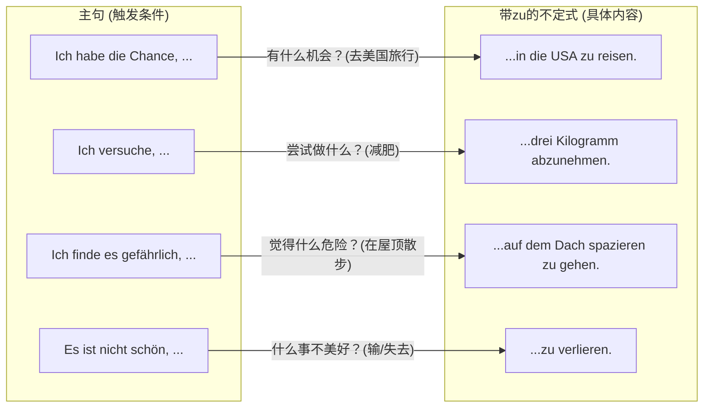

# 不带zu 的不定式
![[image-237.png|985x183]]

你好！很高兴能协助你解析这份德语语法练习题。图片中你做了一些非常认真的中文批注，这说明你在努力理解每个词的含义，这是非常好的学习习惯！

不过，批注中有一处小小的偏差：“Chance”在德语中更多偏向于**“机会（Gelegenheit）”**而非单纯的“可能”，理解为“机会”能让你的翻译更地道。

这是一道非常经典的**B 1 级别**语法题。接下来，我将为你逐一破解这道题的逻辑，并带你彻底掌握背后的核心语法。

---

### 1、逐题精析与连线逻辑

**题目类型**：带 `zu` 的不定式结构（Infinitiv mit „zu“）的主从句逻辑连线。
**题目要求**：请将对应的主、从句连线（寻找符合逻辑与语法搭配的完整句子）。

为了理清思路，我们先通过一个关系图来看看这四组句子的内在逻辑搭配：

**【详细诊断与解析】**

* **[1 - B]：Ich versuche, drei Kilogramm abzunehmen.**
    * **翻译**：我试图减掉三公斤（减肥）。
    * **分析**：动词 `versuchen`（尝试）后必须接具体的尝试动作。根据你的笔记“试”和“减肥”，这两者在语义上完美契合。
    * **语法亮点**：`abnehmen` 是**可分动词**（ab-nehmen），在不定式结构中，`zu` 必须插在前缀和词干之间，变成 **ab-zu-nehmen**。

* **[2 - D]：Es ist nicht schön, zu verlieren.**
    * **翻译**：输是不美好的 / 失败的滋味不好受。
    * **分析**：这里使用了 `Es ist + 形容词` 的句型，`es` 是形式主语，真正的主语是后面的不定式“输（zu verlieren）”。根据你的笔记“丢失”，`verlieren` 确实有丢失的意思，但在比赛或竞争语境中，它作不及物动词表示“输掉”。

* **[3 - A]：Ich habe die Chance, in diesem Sommer in die USA zu reisen.**
    * **翻译**：我有机会今年夏天去美国旅行。
    * **分析**：名词 `die Chance`（机会）常作为触发词，用不定式结构来解释“什么机会”。去美国旅行（in die USA zu reisen）正是一个绝佳的机会。`reisen` 是不可分动词，`zu` 直接加在动词原形前。

* **[4 - C]：Ich finde es gefährlich, auf dem Dach spazieren zu gehen.**
    * **翻译**：我觉得在屋顶上散步很危险。
    * **分析**：这里使用了 `etwas + 形容词 + finden` 的句型。`es` 是形式宾语，真正的宾语是后面的动作。在屋顶散步显然符合“危险（gefährlich）”的描述。
    * **语法亮点**：`spazieren gehen`（散步）是两个动词构成的固定词组。在这种情况下，`zu` 要放在**主要动词（gehen）**的前面，写成独立的三部分：**spazieren zu gehen**。

---

### 2、深度教学解析（聚焦：带 `zu` 的不定式结构）

这个语法点在 A 2 末尾引入，在 B 1 阶段是绝对的核心。你可以把它理解为**“省略了主语的从句”**。当主句和从句的主语一致，或者从句的主语是泛指的大众时，为了语言的简洁，德国人喜欢用 `zu + 动词原形` 来替代完整的 `dass` 从句。

**核心规则：`zu` 到底放在哪？**
带 `zu` 的不定式结构**永远位于句末**，但 `zu` 和动词的结合方式有三种：

1.  **普通/不可分动词**：分离。 `zu` + 动词原形（例如：zu reisen, zu verlieren）
2.  **可分动词**：合体。 可分前缀 + `zu` + 动词词干（例如：ein**zu**kaufen, ab**zu**nehmen）
3.  **动词词组**：分离。 词组第一部分 + `zu` + 动词原形（例如：spazieren **zu** gehen, kennen **zu** lernen）

**正反对比例证**：
* **本例 (正确)**：Ich versuche, drei Kilogramm **abzunehmen**.
* **反例 (常见错误)**：Ich versuche, **zu abnehmen** drei Kilogramm.
    * *错误根源*：把德语的 `zu` 等同于英语的 `to`，直接放在可分动词前面，且没有把动词结构扔到句末。
* **拓展例 (应用)**：Es ist wichtig, jeden Tag Deutsch **zu lernen**. (每天学德语很重要。)

**防错要点（口诀）：**
> **“动词原形踢句尾，可分动词 zu 中间；形式主宾 es 占位，逻辑通顺再连线。”**

**小试牛刀（巩固练习）：**
请尝试把下面两句话合并成一句（使用带 `zu` 的不定式）：
* Ich habe vergessen. (我忘了。)
* Ich rufe dich an. (我给你打电话。 `anrufen` 为可分动词)
*(答案在文末)*

---

### 3、总结与回顾

**您的终极学习建议**：
带 `zu` 的不定式并不难，难在动词的词汇量和对句型的敏感度。建议你在未来背诵动词和名词时，**采用“语块记忆法”**。不要只背“versuchen = 尝试”，要背 **“versuchen, etwas zu tun (尝试做某事)”**；不要只背“die Lust = 兴趣”，要背 **“Lust haben, etwas zu tun (有兴趣做某事)”**。这样在考试和口语输出时，你就能形成肌肉记忆，脱口而出！

祝你德语学习顺利！Viel Erfolg! 

*(小试牛刀答案：Ich habe vergessen, dich an**zu**rufen.)*
