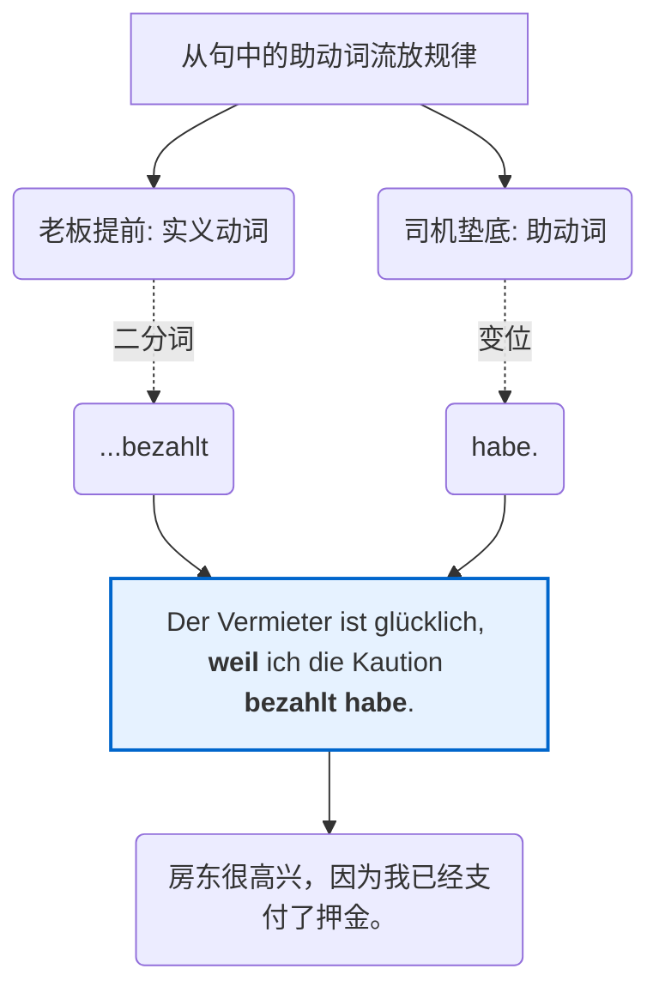

# 主语 + 助动词 + 宾语 + 分词

也就是说有助动词的句子它们的结构都是一样的，第二位是助动词最后一位动词是二分词

作为你的“德语大师”，我必须坦诚地告诉你：**你总结对了80%！但这剩下的20%例外，正是你从初学者跨越到B2水平的关键门槛。**

为了让你彻底看清这台机器的运作，我们继续用“专职司机（助动词）和老板（实义动词）”的类比，来看看你总结的规律在哪些情况下会“变形”：

### 1. 老板的“着装”：不一定总是穿“二分词”制服

你提到最后一位是“二分词”（Partizip II），这在表达**过去（Perfekt）和被动（Passiv）时是绝对正确的。但别忘了，还有将来（Futur）**！

当助动词 `werden` 作为“时光机司机”带你去未来时，老板（实义动词）在后座上穿的不是二分词，而是最轻松的**“动词原形（Infinitiv）”**。

|**语法功能**|**司机 (助动词)**|**老板的着装 (句末动词形态)**|**例句 (场景：支付押金 Kaution)**|
|---|---|---|---|
|**完成时** (过去)|haben / sein|**第二分词** (bezahlt)|Ich **habe** die Kaution **bezahlt**. (我已经付了押金。)|
|**被动语态** (受动)|werden|**第二分词** (bezahlt)|Die Kaution **wird** heute **bezahlt**. (押金今天被支付。)|
|**将来时** (未来)|werden|**动词原形** (bezahlen)|Ich **werde** die Kaution morgen **bezahlen**. (我明天将支付押金。)|

### 2. 司机的“位置”：不一定总能在第2位飙车

你总结的“第二位是助动词”，在普通的**陈述主句**里是铁律。但在另外两条“赛道”上，司机的位置会发生剧烈变化。这也正是你在德国办事、与人交流时最常用的句型：

- **赛道 A：一般疑问句（Ja/Nein-Frage）—— 司机冲锋陷阵**

    当你向房东或办事员提问时，司机（助动词）必须冲到句子的**第1位**。

    > **Hast** du die Kaution **bezahlt**? (你付押金了吗？)

- **赛道 B：从句（Nebensatz）—— B1/B2大魔王，司机被彻底流放！**

    在之前的课里我们讲过，从句（比如由 weil, dass 引导）是不讲理的地方，变位动词（也就是我们的司机）会被流放到句子的**最末尾**，甚至要排在老板（实义动词）的后面！

我们用一张图表来直观感受一下这最致命的“赛道 B”：

代码段

**大师点评：** 发现了吗？在从句里，变成了 `老板(bezahlt) + 司机(habe)` 紧挨着挤在最后面！当你能在口语中不假思索地说出 `..., weil ich ... bezahlt habe` 时，你的德语就正式踏入B级的大门了。

---

**下一步（Nächster Schritt）：**

现在，是时候检验你的学习成果了！结合今天和昨天的知识，我们要去向外管局（Ausländerbehörde）写一封邮件解释情况。

你能试着把下面这句非常典型的**B1级别复合句**翻译成德语吗？

**“我明天不能来，因为我已经看医生了。”**

_提示词：_

- 明天不能来（主句）：Ich kann morgen nicht kommen. (这里用了情态动词 kann，我们先不管它)
- 因为（从句引导词）：weil
- 看医生：zum Arzt gehen (注意：gehen 表示位移，过去分词是 gegangen，它的专属司机是谁来着？)

大胆拼装你的“乐高积木”吧，我会为你把关！
