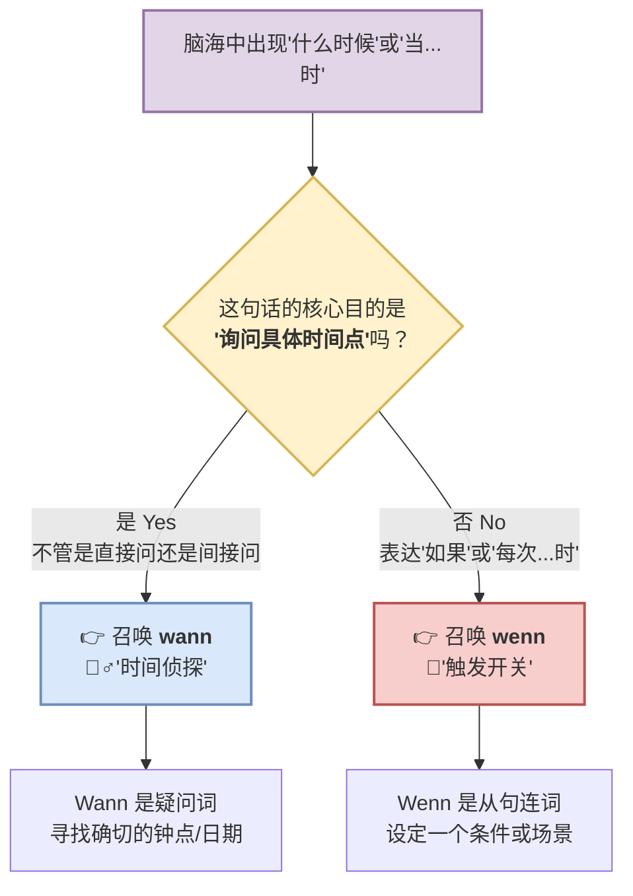

# wenn, wann区别

### 🧠 核心类比：“时间侦探” vs “触发开关”

---
- 记忆：
	- wann -> when
	- wenn -> if
### 🕵️‍♂️ 1. `wann` = 时间侦探 (The Time Detective)

`wann` 的唯一使命，就是揪出一个**具体的、客观的时间点**（比如几点、周几、哪个月）。它就是一个纯粹的**疑问词（Fragewort）**。

只要你的句子里潜台词是**“到底几点？”、“到底是哪一天？”**，就必须用 `wann`。它可以用于直接提问，也可以用于间接提问（此时它作为连词引导从句，变位动词踢到句末）。

- **🏥 医疗场景（直接提问）：**
    - **Wann** habe ich den Termin beim Arzt?
    - （我去看医生的预约是**什么时候/几点**？）
- **⚖️ 行政/外管局场景（间接提问 - B 1/B 2 必考点）：**
    - Ich möchte wissen, **wann** ich meinen Aufenthaltstitel abholen **kann**.
    - （我想知道，我**什么时候**可以去拿我的居留卡。）
    - _大师解析：虽然这是一句陈述句，但潜台词依然是“我在打听具体时间”，所以必须用 `wann`。同时，`wann` 这里客串了“监工”的角色，把变位动词 `kann` 踢到了句末！_

---

### 🔘 2. `wenn` = 触发开关 (The Trigger Switch)

`wenn` 从来不关心具体几点几分！它关心的是**“条件”**或者**“场景的触发”**。它的意思是**“如果 (if)”** 或者 **“每次当...发生的时候 (whenever/when)”**。

它永远是一个**从句连词（Konjunktion）**，只要它一出现，必然把变位动词踢到句末！

- **💼 找工作场景（表达“如果” - 条件触发）：**
    - **Wenn** ich das B 2-Zertifikat **bestehe**, **kann** ich mich auf diesen Job bewerben.
    - （**如果**我考过了 B 2 证书，我**就可以**申请这个工作。）
    - _大师解析：你看，这里根本没有问时间，而是一个条件开关！注意我们上一课学过的“动词接吻定律”：`bestehe` 和 `kann` 隔着逗号接吻了！_
- **🏢 租房场景（表达“每次当...时” - 场景触发）：**
    - **Wenn** der Vermieter **anruft**, **bin** ich immer nervös.
    - （**每次当**房东打来电话**时**，我总是很紧张。）
    - _大师解析：这里不是在问房东几点打电话，而是说“只要打电话这个动作一触发，我就紧张”。_

---

### 💥 终极对比：一念之差，天壤之别

为了让你彻底顿悟，我们把 `wann` 和 `wenn` 放在几乎一样的句子里对比一下。体会一下它们在意思上的巨大反差：

**情景：你在等一份重要的工作面试通知 (Das Interview)。**

- **句子 A (使用 wann):**

    Ich weiß nicht, **wann** das Interview **beginnt**.

    _(我不知道面试**什么时候**开始。)_

    👉 **潜台词**：我在看表，我不知道确切时间是下午 2 点还是 3 点。（时间侦探）

- **句子 B (使用 wenn):**

    Ich bin glücklich, **wenn** das Interview **beginnt**.

    _(**当/如果**面试开始，我会很开心的。)_

    👉 **潜台词**：我不关心几点，只要面试这件事一发生（触发开关），我就开心。

---

### 🗺️ 你的六个月 B 2 学习规划（当前进度提醒）

在我们的六个月计划中，你现在正处于**第 1-2 个月（夯实 B 1 核心）**的关键期。

区分 `wenn` 和 `wann`，以及间接疑问句（用 `wann` 引导从句），是你构建复杂长句的基石。在第 3 个月开始写正式信件（Formeller Brief，比如给外管局写信询问签证进度）时，你会极其频繁地用到它们。

---

### 🏋️ 你的专属实战演练

现在，轮到你来当“德语大师”了！请帮我把下面两个发生在德国的真实场景填上正确的词：** `wenn` ** 还是 ** `wann` **？

**场景 1：在火车站 (Am Bahnhof)**

你走到服务台问工作人员：

"Können Sie mir sagen, ________ der Zug nach Frankfurt abfährt?"

_(您能告诉我，去法兰克福的火车是【什么时候】开吗？)_

**场景 2：生病去药店 (In der Apotheke)**

药剂师递给你一盒药，并嘱咐你：

"Nehmen Sie diese Tablette, ________ Sie Fieber haben."

_(【如果/当】您发烧了，请吃这片药。)_

告诉我你的答案！如果你想挑战一下，也可以试着用 `wenn` 或 `wann` 自己造一个关于你即将来德国生活的句子！我在这里等你。
