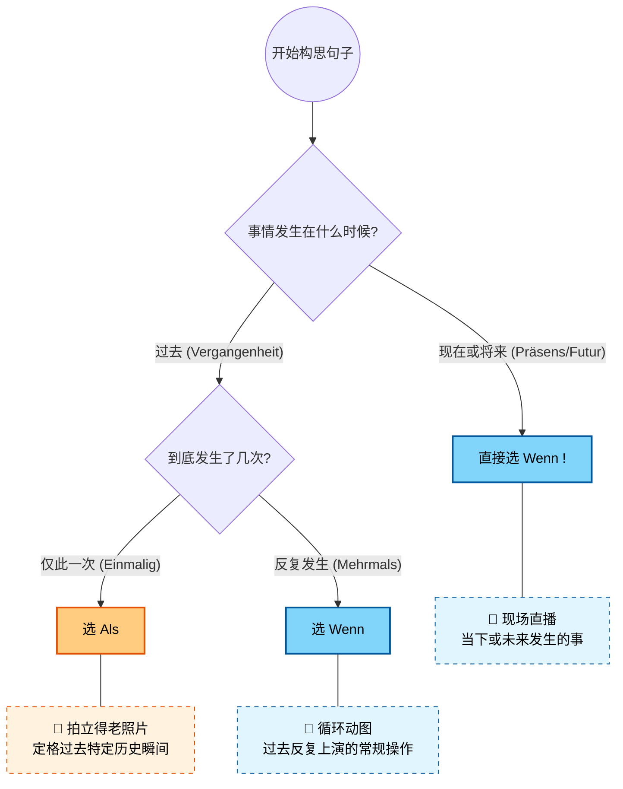
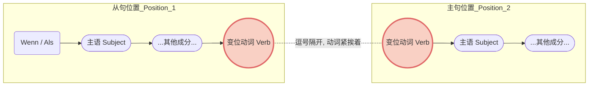
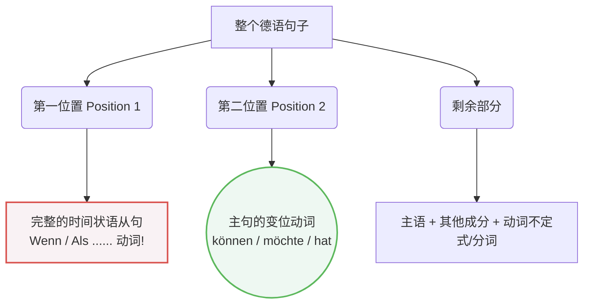

# wenn或als引导的时间状语从句

wenn, als开头的就是从句，主句有时候放在后面

### 一、 核心概念：拍立得 vs. 动图与直播

为了最快地记住它们的区别，我们把这两个词想象成不同的“视觉媒体”。
#### 1. Als：拍立得老照片 (Das Polaroid-Foto)

- **语法规则**：**只**用于**过去**发生的、且**仅发生了一次**的事件或状态。
- **大师解析**：把它想象成一张拍立得照片。它定格了过去某一特定的瞬间、某一段特定的历史或人生阶段。拍完就结束了，那一刻永远不会再发生第二次。
- **移民生活实战场景**：
    - _(初到德国 - 历史瞬间)_

        **Als** ich das erste Mal in Deutschland ankam, war alles völlig neu für mich.

        （当我第一次抵达德国时，一切对我来说都是全新的。）

    - _(找工作 - 特定事件)_

        **Als** ich gestern den Arbeitsvertrag unterschrieb, war ich sehr glücklich.

        （当我昨天签下那份工作合同时，我非常开心。）

    - _(医疗 - 过去的某段状态)_

        **Als** ich letzte Woche krank war, bin ich sofort zum Hausarzt gegangen.

        （当我上周生病时，我立刻去了家庭医生那里。）

#### 2. Wenn：现场直播与循环动图 (Der Livestream & Das GIF)

**Wenn** 的适用范围比 als 广得多，它有两种主要用法：

**用法 A：现场直播 🔴 (现在或将来时)**

- **语法规则**：只要事情发生在**现在或未来**，不管它发生一次还是无数次，**全部用 wenn**（绝对不能用 als）。
- **移民生活实战场景**：
    - _(租房 - 未来的单次事件)_

        **Wenn** ich die Zusage für die Wohnung bekomme, überweise ich die Kaution.

        （如果/当我拿到这套房子的确认时，我就转账付押金。）

    - _(行政事务 - 现在的普遍规定)_

        **Wenn** Sie Ihren Wohnsitz wechseln, müssen Sie sich innerhalb von zwei Wochen beim Bürgeramt ummelden.

        （当您更换住址时，您必须在两周内去市民局办理改迁登记。）

**用法 B：循环动图 🔁 (过去时中的“重复性”事件)**

- **语法规则**：事情虽然发生在过去，但它**反复上演了多次**。为了强调这种重复性，德国人经常在 wenn 前面加上 _immer_ (总是) 或 _jedes Mal_ (每次)。
- **移民生活实战场景**：
    - _(找房子的血泪史 - 过去反复发生的动作)_

        Immer **wenn** ich eine Wohnung besichtigte, waren dort schon 50 andere Bewerber.

        （过去每次我去看房的时候，那里都已经有 50 个其他申请人了。）

    - _(医疗报销 - 过去的常规操作)_

        Jedes Mal **wenn** ich Medikamente kaufte, schickte ich die Rechnung an die Krankenkasse.

        （以前每次我买药的时候，我都会把账单寄给医疗保险公司。）

---

### 二、 黄金总结表

|**连词 (Konjunktion)**|**时态 (Tempus)**|**频次 (Häufigkeit)**|**核心记忆点**|
|---|---|---|---|
|**Als**|仅限过去 (Vergangenheit)|一次性 (Einmalig)|拍立得老照片 📸|
|**Wenn**|过去 (Vergangenheit)|多次/重复 (Mehrmals)|循环 GIF 动图 🔁|
|**Wenn**|现在/将来 (Präsens/Futur)|一次或多次 (Egal)|现场直播 🔴|

---

### 三、 语序规则：动词的“双向奔赴”

掌握了词义，我们还要确保句子结构符合 B 2 的标准。wenn 和 als 引导的都是**从句 (Nebensatz)**。

1. **从句内部**：动词必须被无情地踢到句子的**最末尾**。
2. **主从复合句**：在日常交流和德语写作中，为了强调时间，我们通常会把从句放在整句话的最前面（即占据主句的“第一位置”）。此时，主句的动词必须紧跟在逗号后面，形成**“动词贴贴” (Verb-Verb-Kollision)** 的现象。

我们可以用一张图表来清晰地展示这种结构：

代码段

**结构拆解示范**：

- [**Als** ich gestern zum Ausländeramt **ging**], [**musste**] [ich] lange warten.

    _(从句动词 ging 在逗号前，主句动词 musste 在逗号后紧随其后。)_

- [**Wenn** Sie Fragen zur Steuernummer **haben**], [**rufen**] [Sie] bitte das Finanzamt an.

    _(从句动词 haben 在逗号前，主句动词 rufen 紧随其后。)_

---

### 四、 给你的 6 个月 B 2 冲刺学习规划建议

既然你的目标是 6 个月达到 B 2，针对这类语法，我为你定制了以下节奏：

- **第 1-2 个月（夯实 B 1 基础）**：将 _wenn/als_，以及 _weil, obwohl, dass_ 等所有从句的**尾语序**训练成肌肉记忆。你在说话时，主句动词和从句动词的“碰撞”必须不假思索地脱口而出。
- **第 3-4 个月（进阶 B 2 表达）**：B 2 考试不仅要求你会用从句，还要求你能进行**“介词化”转换 (Nominalisierung)**。例如，把 _Als ich ankam..._ 转换为高级表达 _Bei meiner Ankunft..._（在我抵达时...）。这是 B 2 写作拿高分的必杀技。
- **第 5-6 个月（场景模拟与冲刺）**：完全沉浸在真实的德国社会场景中（例如模拟与外管局官员的对话、写投诉信给房东）。使用 _wenn_ 和 _als_ 流畅地描述你过去的经历和未来的诉求。

语法是帮助你更好地在德国生活的工具，而不是死记硬背的负担。当你下次去超市、去坐地铁时，试着在脑海里用 _wenn_ 或 _als_ 造个句子，把生活变成你的德语训练场。Viel Erfolg! (祝你成功！)

# ❌

## 1

![[image-255.png|1120x312]]

很高兴能为你解答！你观察得非常仔细，不仅在图 1 中标记出了主句动词“为何提前？”，还在图 5 中特别标出了“从句中动词位置”。这两个疑问恰恰触及了德语语法中最核心、也最让初学者头疼的**“语序问题”（Wortstellung）**。

德语的语序确实和中文或英文大不相同，感觉有点“反常规”，但它有着极其严密的数学般逻辑。遵循“纠一错，通一类”的原则，我们先来逐题破解，然后再深入把这个规则彻底吃透。

---

### 1、逐题精析与纠正

**题目类型：** 连词（wenn/als）引导的时间状语从句与条件状语从句的构建，以及主从复合句的语序及动词变位。

**题目要求：** 请用 wenn 或 als 将以下句子成分连接成句。

**待填空句子（原题提取）：**

1. Wenn: du • heute Abend • kommen / wir • können • gleich • ins Kino gehen • .
2. Wenn: Sie • Zeit • haben / möchte • ich • Sie • gerne zu einem Kaffee • einladen • .
3. Wenn: alles • fertig sein / wir • können • nach Hause • gehen • .
4. Wenn: das Auto • kaputt • ist / musst • du • es • schnell in die Werkstatt • bringen • .
5. Als: er • gekommen • ist / sie • hat • sofort • den Raum • verlassen • .
6. Als: neue Stelle • bekommen • hat • sie / mit ihren Freunden eine Party • sie • gemacht • .
7. Als: er • letzte Woche • den Unfall • hatte / musste • das Auto • in die Werkstatt • gebracht werden • .
8. Als: wir • Urlaub • hatten / hat • es • die ganze Zeit • geregnet • .

**逐题诊断：**

- **1. 翻译：如果你今晚来，我们可以马上一起去看电影。**
    - **正确形式：** Wenn du heute Abend **kommst**, **können** wir gleich ins Kino gehen.
    - **错误分析与原因（你的疑问所在）：** 你的蓝色笔迹问“为何提前？”。在中文和英文思维里，我们会说 "..., **we can** go..."（主语+动词）。但在德语中，当从句（Wenn...）放在句首时，**整个从句被视为占据了句子的“第一位置（Position 1）”**。根据德语主句动词永远在“第二位置”的铁律，主句的变位动词（können）必须紧跟在逗号之后，把主语（wir）挤到第三位。从句中的变位动词（kommst）则必须放在从句句尾。
- **2. 翻译：如果您有时间，我想邀请您喝杯咖啡。**
    - **正确形式：** Wenn Sie Zeit **haben**, **möchte** ich Sie gerne zu einem Kaffee einladen.
    - **分析：** 这里的 haben 在从句末尾（因为 Sie 是尊称，变位也是 haben）。逗号之后主句动词 möchte 紧跟，主语 ich 放在其后。图片中这道题打了一个红叉，通常是因为初学者容易写成 "...haben, ich möchte..."，忘记了动词前置。
- **3. 翻译：如果一切都准备好了，我们就可以回家了。**
    - **正确形式：** Wenn alles fertig **ist**, **können** wir nach Hause gehen.
    - **分析：** 动词原形 sein 需要根据第三人称单数主语 alles 变位为 ist，并放在从句末尾。主句动词 können 依旧紧跟逗号。
- **4. 翻译：如果车坏了，你必须赶紧把它送到修理厂。**
    - **正确形式：** Wenn das Auto kaputt **ist**, **musst** du es schnell in die Werkstatt bringen.
    - **分析：** 考察情态动词 (müssen -> musst) 在主句中的占位。
- **5. 翻译：当他来的时候，她立刻离开了房间。**
    - **正确形式：** Als er gekommen **ist**, **hat** sie sofort den Raum verlassen.
    - **分析（你的绿色笔记）：** 你注意到了“从句中动词位置”。这是一个现在完成时的从句。完成时由“助动词(haben/sein) + 过去分词(Partizip II)”构成。在从句中，**只有“变位助动词”(ist)被踢到最后面**，过去分词(gekommen)留在倒数第二的位置。主句同样是完成时，变位助动词 hat 紧接逗号。
- **6. 翻译：当她得到新工作时，她和朋友们办了一场派对。**
    - **正确形式：** Als sie eine neue Stelle bekommen **hat**, **hat** sie mit ihren Freunden eine Party gemacht.
    - **分析：** 题干给出的词序比较散乱。主语 sie 必须放在从句动词和连词之后（Als sie...）。从句的变位助动词 hat 放最后。
- **7. 翻译：当他上周发生车祸时，车必须被送去修理厂。**
    - **正确形式：** Als er letzte Woche den Unfall **hatte**, **musste** das Auto in die Werkstatt gebracht werden.
    - **分析：** 这是一个 B 1 级别的难点：过去时（hatte）+ 带有情态动词的被动语态（musste ... gebracht werden）。只要咬定“主句变位动词（musste）在逗号后第一位”的原则，就不会乱。
- **8. 翻译：当我们度假的时候，天一直在下雨。**
    - **正确形式：** Als wir Urlaub **hatten**, **hat** es die ganze Zeit geregnet.
    - **分析：** 从句是过去时（hatten 在句尾），主句是完成时（hat 紧跟逗号，geregnet 在全句末尾）。

---

### 2、深度教学解析（聚焦：从句语序与“动词碰头”规则）

你观察到的不常规现象，是母语为中文/英文的学习者在 A 2-B 1 阶段最大的绊脚石：**母语负迁移（Mother Tongue Interference）**。为了彻底弄懂它，我们引入一个直观的框架。

代码段

#### 核心规则 1：从句的“尾巴”原则

在由 `wenn`, `als`, `weil`, `dass` 等连词引导的从句中，**变位的动词必须被无情地踢到句子的最末尾**。

- _非从句：_ Du **kommst** heute Abend.
- _变从句：_ Wenn du heute Abend **kommst**, ...

#### 核心规则 2：主从复合句的“动词碰头（逗号相遇）”原则

解答你的“为何提前？”：因为德语有一个雷打不动的“**动词第二位原则（V 2-Regel）**”。

当从句放在主句前面时，**整个从句算作主句的“第一成分”**。为了保证主句动词在“第二位”，主句动词必须立刻出现。

- **正例（本例）：** [Wenn du heute Abend **kommst**] _(第一成分)_, **können** _(第二成分)_ wir gleich ins Kino gehen.
- **反例（你的直觉/常见错误）：** Wenn du heute Abend kommst, wir können gleich ins Kino gehen. (错误！wir 占据了第二位，动词 können 跑到第三位去了)。
- **拓展例（主句放前面）：** Wir **können** gleich ins Kino gehen, wenn du heute Abend **kommst**. (如果主句在前面，主句动词 können 自然就在第二位，从句动词 kommst 依然在末尾)。

#### 核心规则 3：Wenn 还是 Als？

这也是这道题暗含的考点。

- **Als：** 仅用于**过去发生过一次**的事情（比如车祸、得到某份特定工作）。“一次性、已过去”。
- **Wenn：** 用于现在或将来的条件（如果...），或者过去**反复发生**的事情（每当...）。

> 💡 **防错口诀（牢记这个画面）：**
> 
> **“从句动词踢到尾，主句动词接逗号。双动词，逗号见！”**
> 
> 每次写完带有从句的复合句，检查逗号左右是不是都有动词（如：... **kommst**, **können** ... / ... **ist**, **hat** ...）。如果逗号旁边有非动词成分（比如 wir/ich），那就是写错了！

---

### 3、总结与回顾

- **您的终极学习建议：**

    针对这种语序问题，死记硬背是不够的，必须建立**“模块化（框架式）”**的德语思维。下次造句时，不要一个词一个词地顺着翻译，而是先把句子划分为大模块（[从句模块] + [主句动词] + [主句主语]...）。

    建议你在做练习时，用笔把逗号前后的两个动词圈出来。只要你能在视觉上确认“两个动词在逗号两边碰面了”，你的语序就绝对不会错。保持这种敏锐的观察力，你会进步得非常快！
