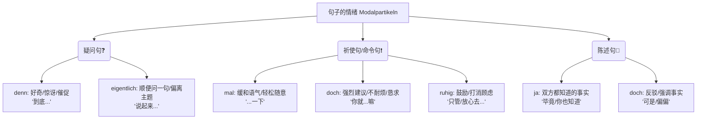
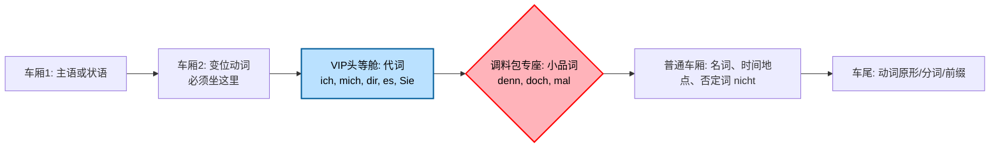

想象一下，小品词就像是我们微信聊天里的**表情包**，或者是说话时的**语气和微表情**。它们在语法上删掉完全不影响句子的完整性，但加上它们，句子就有了喜怒哀乐。

### 🧠 德语大师的“小品词”思维导图

为了让你这个小白也能瞬间理清思路，我为你制作了一个 Mermaid 图表。以后想表达情绪时，直接对号入座：

---

### 一、 核心小品词深度拆解与“有无对比”

#### 1. `denn` —— 好奇宝宝的放大镜 (翻译成：呢、到底、呀)

`denn` 通常用于**疑问句**中，用来表达说话者的好奇、惊讶，或者用来缓和语气的生硬感。

* **图片例句 1：** *Wann kommst du denn?*
    * **不加小品词：** *Wann kommst du?* （你什么时候来？）—— 语气生硬，像是在审问，或者只是单纯获取信息。
    * **加上 `denn`：** *Wann kommst du denn?* （你到底什么时候来**呢**？）—— 语气立刻软化，带有一丝亲切的期盼或轻微的讶异。
* **图片填空题 1：** *Was hast du (denn) da mitgebracht?*
    * **不加小品词：** 你带了什么？（海关查账的既视感）。
    * **加上 `denn`：** 你这**到底/究竟**带了什么好东西**呀**？（朋友之间拆礼物的惊喜与好奇）。

#### 2. `doch` —— 情绪的增压泵 (翻译成：嘛、绝对、明明、吧)

`doch` 是一个情绪极其饱满的词。它可以表示强调一个显而易见的事实（“这难道不是常识吗？”），也可以用来加强请求的语气，甚至是表达轻微的责备或不耐烦。

* **图片例句 2：** *Du kannst doch nicht mit Flipflops ins Theater gehen! Das geht doch nicht.*
    * **不加小品词：** 你不能穿人字拖去剧院。这不行。（像是在陈述一条干巴巴的法律条文）。
    * **加上 `doch`：** 你**绝对/当然**不能穿人字拖去剧院**啊**！这**明明就**不行**嘛**！（画面感极强：妻子看着丈夫脚上的拖鞋，满脸不可思议的责备）。
* **图片例句 3：** *Helfen Sie doch bitte.*
    * **不加小品词：** *Helfen Sie bitte.* （请您帮忙。—— 标准礼貌用语）。
    * **加上 `doch`：** *Helfen Sie doch bitte.* （您**就**帮帮忙**吧**。—— 带有强烈的恳求，甚至有一点焦急）。
* **图片填空题 3：** *Ich hatte (doch) keine Ahnung, dass du keinen Käse magst.*
    * 这里表达的是一种委屈的自我辩护：“我**本来就/明明就**不知道你不吃奶酪**嘛**！”

#### 3. `mal` —— 压力的缓冲垫 (翻译成：一下、随便...)

`mal` 是 *einmal*（一次）的缩写，在口语中高频出现于**祈使句或请求**中。它的作用是让动作显得短暂、轻松、不经意，从而大大降低对方的心理压力。

* **图片例句 5：** *Kannst du nächste Woche mal bei mir vorbeikommen?*
    * **不加小品词：** 下周你能来我这里吗？（听起来像是一个正式的商务邀约或严肃的面谈）。
    * **加上 `mal`：** 下周你能顺便来我这儿**一下**吗？（传达出“不需要待太久，就抽空见个面”的轻松感）。
* **图片填空题 2：** *Kannst du mir das (mal) zeigen?*
    * **解析：** 加上 `mal` 就是“你能给我看**一眼/一下**吗？”，比生硬的“给我看”要礼貌和随和得多。

#### 4. 小品词的“连击组合拳”

德国人说话时经常把几个小品词叠在一起使用，以表达极其微妙且复杂的情绪。

* **图片例句 4：** *Sag doch mal, warum kommst du denn so spät?*
    * **解析：** 这里使用了 `doch mal` 和 `denn` 的组合。前段的 `Sag doch mal` 意思是“你**倒是**说说**看（一下）**”（带有催促和鼓励），后段的 `warum kommst du denn so spät` 意思是“怎么来得这么晚**呢**”（带有好奇和轻微的责怪）。一句话把等待者的急躁与关切表现得淋漓尽致。

# 小品词在句中的位置

其实，德语的语序虽然看起来像个迷宫，但它是有严格的“交通规则”的。你只需要记住一个核心类比：**“汉堡包与调料法则”**。

在德语的框形结构（Satzklammer）中，变位动词是“顶层汉堡胚”，句末的动词（或可分前缀）是“底层汉堡胚”。肉饼和生菜是句子里的核心成分（如主语、宾语代词）。而**小品词，就是你往汉堡里挤的那层酱汁（味精）**！酱汁绝不能乱涂，它有专属的“调料区”。

为了让你这个小白也能一眼看懂，我为你制作了一张“德语句子列车座位表”：

代码段

基于这张图，我们来总结小品词安放的**三大黄金铁律**，并结合你未来在德国的生活场景来实战演练：

### 铁律一：小品词绝对没有资格坐“车厢 1”（句首）

小品词永远不能放在句子的第一位。它们必须躲在变位动词（车厢 2）的后面。

- ❌ _Doch du kommst zu spät!_ （错误语法，像乱涂的酱汁）
- ✅ _Du kommst **doch** zu spät!_ （你**明明就**迟到了**嘛**！）

### 铁律二：必须给“VIP 代词”让座

在德语中，人称代词（如 _ich, mich, dir, es, Sie, Ihnen_）是句子里拥有最高优先权的 VIP。只要有代词出现，小品词必须乖乖站在代词的后面。回看你图片里的例句：_Wann kommst **du denn**?_ （先说 du，再说 denn）。

**🏠 移民生活场景：在房管局 (Bürgeramt) 办理落户 (Anmeldung)**

假设办事员问你要护照，你想礼貌地递给他：

- _无小品词：_ Ich gebe es Ihnen. (我把它给您。)
- _加入小品词 mal (一下)：_ * ❌ _Ich gebe mal es Ihnen._ (错误：抢了代词 es 和 Ihnen 的位置)
    - ✅ _Ich gebe es Ihnen **mal**._ (我把这个给您递**一下**。—— VIP 代词 _es_ 和 _Ihnen_ 必须紧贴动词，小品词 _mal_ 只能往后靠)。

### 铁律三：放在否定词 `nicht` 或“你想强调的焦点”之前

小品词是情绪的放大镜，所以你把小品词放在哪个词的前面，就是在给哪个词“加味精”。通常，它们会放在否定词 `nicht` 的前面，或者放在具体的名词宾语前面。

**💼 移民生活场景：在德国公司找工作 / 职场沟通**

假设你的同事把一份重要的文件放错了地方，你想稍微带点责备但又不想撕破脸地提醒他：

- _无小品词：_ Du hast das Dokument nicht gespeichert. (你没有保存文件。)
- _加入小品词 doch (明明)：_
    - ✅ _Du hast das Dokument **doch** nicht gespeichert!_ (你**明明就**没有保存文件**嘛**！—— _doch_ 放在 _nicht_ 前面，强调“没有保存”这个令人无奈的事实。)

再比如你想请同事顺手发个邮件：

- ✅ _Kannst du mir **mal** kurz die E-Mail weiterleiten?_ (你能把那封邮件给我顺手转**一下**吗？—— _mir_ 是代词 VIP 必须在前，_mal_ 放在 _die E-Mail_ 前面，弱化“发邮件”这个动作的正式感，让人觉得只是举手之劳。)

---

### 总结你的 6 个月 B 2 突破秘籍：语感重于规则

在实际口语交流中，德国人自己也不会在大脑里画这棵语法树。对于你的 6 个月冲刺计划，我建议的训练方法是：**不要单独背规则，而是背“语块 (Chunks)”**。

记住这几个高频出现的“死绑”语块，直接把它们当成一个整体吐出来：

1. **Kannst du mir mal... / Geben Sie mir doch mal...** (用在所有需要请求别人帮忙的场景)
2. **Das ist doch...** (用来强调你的观点，比如 _Das ist doch zu teuer!_ 这明明就太贵了嘛！)
3. **Was ist denn... / Wo ist denn...** (用在所有带有好奇或轻微惊讶的提问中)

当你把这些高频语块像肌肉记忆一样练熟后，你会发现，小品词的位置根本不需要计算，它自然而然就会从你的嘴里溜到最正确的地方。继续保持这种钻研精神，六个月拿下 B 2，你的德语一定会非常地道！
