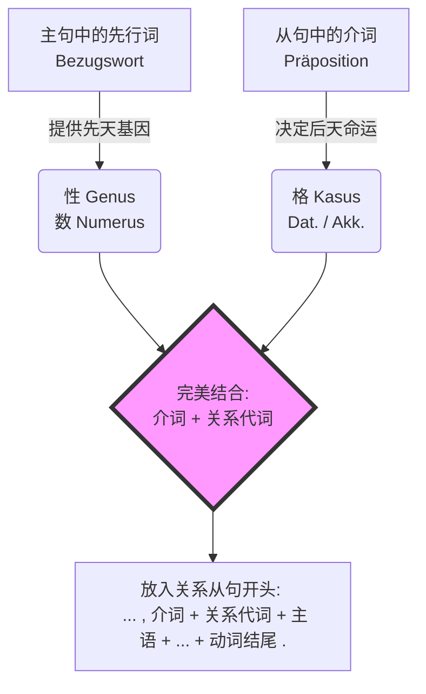

# 带介词的关系从句中关系代词的性、数、格

Hallo！欢迎来到德语大师的课堂！针对你在六个月内突破 B 2 的宏伟目标，我为你量身定制了这堂语法课。

在 B 1 到 B 2 的跨越中，**“带介词的关系从句”（Relativsätze mit Präpositionen）** 是一座你必须翻越的大山。一旦掌握它，你的德语表达将瞬间告别小学生般的短句，变得像母语者一样严密、流畅。这对你未来的 B 2 考试（特别是写作和口语部分），以及在德国的租房、找工作、与外管局打交道都至关重要。

别怕它名字长，我们今天就用最生动、最透彻的方式，把它扒得干干净净！

---

### 🧠 核心心法：两大家族的“抢人”大战

理解带介词的关系代词，你只需要记住一个超级生动的类比：**“基因父母”**与**“现任老板”**。

关系代词就像一个在外打工的年轻人，它的身上融合了两种力量：

1. **基因父母（主句中的先行词 Bezugswort）：** 决定了它的“性”（Genus：阳/阴/中）**和**“数”（Numerus：单/复数）。这是胎里带的，改不了。
2. **现任老板（从句中的介词 Präposition）：** 决定了它的“格”（Kasus：第三格 Dativ / 第四格 Akkusativ）。谁发工资听谁的，介词要求什么格，关系代词就得变成什么格。

为了让你一目了然，我们先看一张“身世鉴定图”：

代码段

---

### 🛠️ 实战演练：移民生活中的四大核心场景

只要按照图表里的“提取基因 -> 听老板话 -> 合成代词”这三步走，你就绝对不会出错。由于介词后面一般只能跟第三格（Dativ）或第四格（Akkusativ），所以我们在关系代词的选择上，**只需要死磕 Akk 和 Dat**！

_复习一下关系代词变化表（重中之重是复数第三格：denen）：_

- **Akk (第四格):** den (阳) / die (阴) / das (中) / die (复数)
- **Dat (第三格):** dem (阳) / der (阴) / dem (中) / **denen** (复数)

#### 场景一：职场面试（阳性单数 + 第三格 Dativ）

**你想表达：** 我昨天**和**他说话的那个**老板**，人非常友善。

- **基因父母（先行词）：** der Chef（老板） -> 阳性（Maskulin），单数（Singular）。
- **现任老板（从句动词及介词）：** sprechen **mit**（和...说话） -> 介词 **mit** 永远要求**第三格（Dativ）**。
- **合成代词：** 阳性 + 第三格 = **dem**。
- **德语成句：** Der Chef, **mit dem** ich gestern gesprochen habe, ist sehr freundlich.

#### 场景二：租房安家（阴性单数 + 第四格 Akkusativ）

**你想表达：** 我们很感**兴趣**的那套**公寓**，租金太贵了。

- **基因父母（先行词）：** die Wohnung（公寓） -> 阴性（Feminin），单数（Singular）。
- **现任老板（从句动词及介词）：** sich interessieren **für**（对...感兴趣） -> 介词 **für** 永远要求**第四格（Akkusativ）**。
- **合成代词：** 阴性 + 第四格 = **die**。
- **德语成句：** Die Wohnung, **für die** wir uns interessieren, ist zu teuer.

#### 场景三：医疗看诊（中性单数 + 第四格 Akkusativ）

**你想表达：** 我正在**等**的那款**药**，现在没货了。

- **基因父母（先行词）：** das Medikament（药物） -> 中性（Neutral），单数（Singular）。
- **现任老板（从句动词及介词）：** warten **auf**（等待...） -> 在这里表达抽象的等待，auf 要求**第四格（Akkusativ）**。
- **合成代词：** 中性 + 第四格 = **das**。
- **德语成句：** Das Medikament, **auf das** ich warte, ist im Moment nicht lieferbar.

#### 场景四：外管局办事（复数 + 第三格 Dativ） 👉 _B 2 考试必考极易错点！_

**你想表达：** 我必须向他们**道谢**的那些**工作人员**，帮了我大忙。

- **基因父母（先行词）：** die Mitarbeiter（工作人员们） -> **复数（Plural）**。
- **现任老板（从句动词及介词）：** sich bedanken **bei**（向...道谢） -> 介词 **bei** 永远要求**第三格（Dativ）**。
- **合成代词：** 复数 + 第三格 = **denen** ！（千万不要写成 den，复数第三格的关系代词是 denen！）
- **德语成句：** Die Mitarbeiter, **bei denen** ich mich bedanken muss, haben mir sehr geholfen.

---

### ⚠️ 大师避坑指南（B 2 提分绝招）

1. **永远把介词绑在关系代词前面！**

    在英语里，介词有时可以扔在句末（The man I talked **to**）。但在严谨的德语里，介词和关系代词是“连体婴儿”，必须手拉手站在从句的最前面（..., **mit dem** ich...）。

2. **“指人”还是“指物”？**

    在 B 1/B 2 阶段，你会学到代副词（Pronominaladverbien）如 _worauf, womit_。

    记住：如果先行词是一个**具体的事物或人**，必须严格使用“介词+关系代词”（auf das / mit dem）。只有当先行词是**整个句子**，或者是不定代词（alles, nichts, etwas）时，才使用 _worauf/womit_。

    - _(正确)_ Das ist das Visum, **auf das** ich warte. (指代具体的签证)
    - _(错误)_ Das ist das Visum, worauf ich warte.

---

### 🎯 你的 B 2 六个月突击检验

语法听懂了只是一半，能自己输出才是真正的内化！现在，轮到你来当大师了。

假设你正在为搬家做准备，你的朋友问起你昨天去看的房子和今天去见的朋友。请运用我们刚才学的“基因父母与现任老板”法则，**帮我把下面这两句话翻译成德语好吗？**

1. 那个我昨天**和她**一起吃晚餐的**女邻居**（die Nachbarin），给了我很多帮助。（提示：和某人一起 = mit + Dat.）
2. 那个我刚才**询问**（fragen nach）过的**租房合同**（der Mietvertrag），还需要修改。（提示：询问某事 = fragen nach + Dat.）
