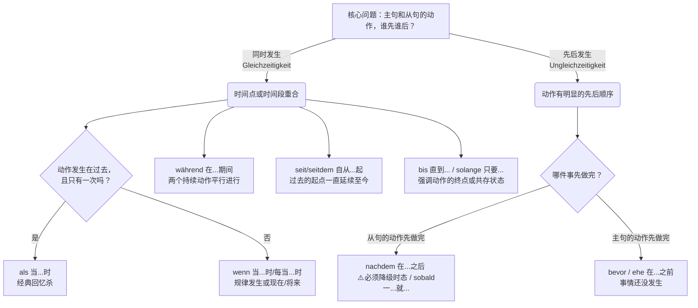

---
aliases:
  - wenn
  - als
  - bevor
  - nachdem
  - seit
  - während
---

# **时间状语从句 (Temporale Nebensätze)**。

你可以把这四个连词（**während, bevor, nachdem, seit/seitdem**）想象成你生活剧本的“场记打板员”。它们决定了你的动作是“同时进行”、“谁先谁后”，还是“从过去一直延续到现在”。

在正式认识这“四大金刚”之前，我们必须先牢记一条**从句铁律（Nebensatz-Regel）**：

> **大师秘籍：** 只要看到这四个词带头的从句，请立刻把从句里的**变位动词**当成班里最调皮的学生——**直接罚站到句子的最末尾！**

为了让你一目了然，我为你准备了一张“时间逻辑关系图”：

代码段

---

### 1. Während：双线并行的“平行宇宙”

- 当...时,在...同时
**生活场景：在延签处（Ausländerbehörde）排队漫长的等待**

- **逻辑类比：** 就像手机的“分屏功能”，两件事情在**同一时间**发生。主句和从句的动作手拉手，时态通常保持一致。
- **图片原句：** Während ich frühstücke, höre ich Radio. (我一边吃早饭，一边听收音机。)
- **大师实战造句：**
    - **德语：** **Während** ich stundenlang auf der Ausländerbehörde **warte**, **lese** ich ein deutsches Buch.
    - **解析：** 我在延签处苦等（从句）的同时，我在读一本德语书（主句）。注意从句动词 _warte_ 被踢到了逗号前面（即从句末尾），紧接着主句马上跟上动词 _lese_。这叫“动词贴动词”（逗号两边都是动词）。

### 2. Bevor：未雨绸缪的“抢跑者”

- 在... 之前
**生活场景：租房（Wohnungssuche）签合同**

- **逻辑类比：** Bevor 意思是“在...之前”。千万别搞混逻辑！它引导的动作**还没发生**，主句的动作“抢先一步”先做了。
- **图片原句：** Bevor ich frühstücke, putze ich meine Zähne. (在吃早饭之前，我先刷牙。 -> 先刷牙，后吃饭)
- **大师实战造句：**
    - **德语：** **Bevor** ich den Mietvertrag **unterschreibe**, **prüfe** ich alle Nebenkosten.
    - **解析：** 在我签租房合同（从句，后发生）**之前**，我先仔细检查所有的附加费（主句，先发生）。在德国租房处处是坑，一定要有这种 _Bevor_ 的精神！

### 3. Nachdem：等级森严的“时差制造者”（B 1-B 2 核心考点！）

- 在。...之后
**生活场景：找工作（Jobsuche）投递简历**
- **类比：通关游戏**。你必须先彻底打通上一关（从句完成），才能进入下一关（主句开始）。因此，**从句的时态必须比主句早一个时态！,注意拿 nachdem 引导的才是从句，不要因为他在前面就把它当成了主句，然后对比后面的句子晚一个时态**
    - **规则 A (如果主句在现在时 Präsens)：从句必须是现在完成时 (Perfekt)。**
        - _场景：行政办事。_
        - **Nachdem** ich mich beim Bürgeramt angemeldet **habe** (先完成注册), **eröffne** ich ein Bankkonto (后开银行账户).
    - **规则 B (如果主句在过去 Präteritum/Perfekt)：从句必须是过去完成时 (Plusquamperfekt = hatte/war + 动词第 II 分词)。**
        - _场景：租房签约。_
        - **Nachdem** wir die Wohnung besichtigt **hatten** (先看完房), **unterschrieben** wir den Mietvertrag (后签合同).

---

- **逻辑类比：** Nachdem 意思是“在...之后”。它表示从句的动作**彻底做完、结案了**，主句的动作才慢吞吞地上场。
- **大师高能预警（时态差）：** 这是图片中最关键、也是 B 级别考试必考的重点！因为从句动作先完成，所以它和主句之间必须存在**“时态差” (Zeitsprung)**。它就像一个有时差的跨国航班：
    - **情况 A（主句是现在时）：** 从句必须用**现在完成时 (Perfekt)** 或 **过去时 (Präteritum)**。
        - _图片原句：_ Nachdem ich gefrühstückt **habe** (完成时), **mache** ich Gymnastik (现在时).
    - **情况 B（主句是过去时）：** 从句必须往更早的过去推，使用**过去完成时 (Plusquamperfekt = hatte/war + 第三分词)**。
        - _图片原句：_ Nachdem ich gefrühstückt **hatte** (过去完成时), **machte** ich Gymnastik (过去时).
- **大师实战造句：**
    - **德语 (情况 A)：** **Nachdem** ich meine Zeugnisse übersetzen lassen **habe**, **bewerbe** ich mich um die Stelle.
    - **解析：** 在我找人把学历证明翻译完**之后**（现在完成时，动作已结束），我才去申请这个职位（现在时）。
    - **德语 (情况 B)：** **Nachdem** ich das Vorstellungsgespräch bestanden **hatte**, **bekam** ich den Arbeitsvertrag.
    - **解析：** （回想过去的一件事）在我通过了面试**之后**（过去完成时），我拿到了工作合同（过去时）。
- 错题
	- [[Nachdem 在他写完作业之后，他就和朋友们去踢足球了。#^zej1ea]]

### 4. Seit / Seitdem：绵延不绝的“长明灯”

- 自从...以来,从...以后
**生活场景：医疗保险（Krankenversicherung）与就医**

- **逻辑类比：** 就像按下了一个秒表的开始键。从句给出了一个过去的“起跑点”，而主句的状态从那个点开始，一直持续到今天（所以主句通常用现在时）。
- **图片原句：** Seitdem ich immer meine Zähne putze, muss ich nicht mehr zum Zahnarzt. (自从我坚持刷牙，我就再也不用去看牙医了。)
- **大师实战造句：**
    - **德语：** **Seitdem** ich in Deutschland **lebe**, **bin** ich bei der TK gesetzlich krankenversichert.
    - **解析：** **自从**我生活在德国（过去的起点延续至今），我就**一直**在 TK 保法定医疗险（现在的状态）。

#### 2\. sobald (一……就……)

- **类比：多米诺骨牌**。第一件事刚做完，第二件事立刻无缝衔接。时态规则与 nachdem 相同。
    - **Sobald** ich die Schlüssel **bekommen habe**, **ziehe** ich ein.（我一拿到钥匙，就搬进去。）

#### 3\. bevor / ehe (在……之前)

- **类比：倒计时**。主句的动作发生时，从句的动作**还没有**发生。这里不需要像 nachdem 那样严格变动时态，通常主从句时态一致即可。
    - _场景：入职前的准备。_
    - **Bevor** Sie Ihren ersten Arbeitstag **beginnen**, **müssen** Sie eine Krankenversicherung abschließen.（在您开始第一天工作之前，您必须办理好医疗保险。）

---

现在，运用刚才讲的铁律，把你自己在德国的实际情况代入到这四个句型中，大声朗读并感受动词的位置：

1. **Während** ich Deutsch lerne, _________ (一边学德语，一边做什么？)
2. **Bevor** ich nach Deutschland kam, _________ (来德国之前，你做了什么？注意时态)
3. **Nachdem** ich mein Visum bekommen hatte, _________ (拿到签证后，你做了什么？注意时态差)
4. **Seitdem** ich dieses Tutorial lese, _________ (自从读了这篇教程，你感觉如何？)

## als 从句

没问题！我非常乐意做你的德语 B 1 专属教练和考官。针对歌德 B 1 考试的重点，我会确保给你的题目既有针对性，又有一定的挑战性（B 1 拔高水平）。

按照你的要求，我们先来系统地梳理一下 ** `als` 引导的时间状语从句**，然后我给你出三道实战题。

---

### 📚 知识点精讲：`als` 引导的时间状语从句 (Temporalsatz mit "als")

在 B 1 考试中，`als` 的核心考点几乎总是和 `wenn` 放在一起对比考察。你需要牢记以下三大黄金法则：

#### 1. 核心用法：一次性 + 过去时

`als` 翻译为“当……的时候”，**只能**用于描述**过去发生的一次性事件**或**过去的一段状态**。

- **例句（一次性事件）：** **Als** ich gestern nach Hause kam, hat das Telefon geklingelt. (昨天我回家的时候，电话响了。)
- **例句（过去的状态）：** **Als** ich ein Kind war, wohnte ich in München. (当我还是个孩子的时候，我住在慕尼黑。_注意：虽然童年很长，但在生命中只有一次，所以用 als。_)

#### 2. B 1 必考对比：`als` vs. `wenn`

这是考试中最爱挖坑的地方，务必分清：

- ** `als` ** = 过去 + 只有一次
- ** `wenn` ** = 过去 + 多次/重复发生（常伴随 _immer, jedes Mal_ 等词）；**或者** 现在/将来（无论一次还是多次）。
    - _对比：_ **Immer wenn** ich ihn besuchte, war er nicht da. (过去多次：每次我去拜访他，他都不在。)

#### 3. 语序规则（Nebensatz 语序）

`als` 引导的是从句，因此**变位动词必须放在从句的最后**。

- **从句在后：** Ich war sehr traurig, **als** mein Hund _starb_.
- **从句在前（主句反语序）：** **Als** mein Hund _starb_, _war_ ich sehr traurig. (从句整体占据主句第一占位，主句紧接着跟变位动词)。

---

### ✍️ 你的专属 B 1 挑战（第一关）

现在，请完成以下三道题。你可以直接把答案发给我，我会为你批改、纠错，并提供额外的拓展建议！

**题目 1：填空题（辨析 als 和 wenn）**

请在空格处填入 `als` 或 `wenn`。

a) ______ ich nächsten Monat nach Berlin fahre, besuche ich das Brandenburger Tor.

b) ______ mein Vater gestern Abend das Abendessen kochte, habe ich meine Hausaufgaben gemacht.

c) Immer ______ wir in den Urlaub gefahren sind, hat unser Auto eine Panne gehabt.

**题目 2：连词成句（考察从句语序和时态）**

请使用括号里的词汇，用 `als` 连成一个语法正确的完整句子。注意动词的时态（请使用**过去时 Präteritum** 或 **现在完成时 Perfekt**）和语序。

_(ich / 18 Jahre alt / sein)_, _(ich / den Führerschein / machen)_.

-> _________________________________________________________.

**题目 3：德语翻译（B 1 写作/口语拔高）**

请将以下中文句子翻译成德语。

“当他昨天突然走进房间的时候，我感到非常惊讶 (überrascht)。”

---

**请给出你的答案吧！我们看看你能拿多少分！
### Ich wünsche mir nichts mehr, als mein Leben mit dir zu verbringen, Inge.

### 1. 它是比较连词 (Vergleichskonjunktion)

在这个句子里，`als` 不是时间副词，而是表示“比……”**或者**“除了……”的比较连词。它必须和主句里的比较级词汇搭配使用，用来引出一个比较的对象。

### 2. 核心考点：比较级 + als + 带 zu 的不定式 (Infinitiv mit zu)

这是一个非常地道的 B 1 进阶句型，它巧妙地结合了“比较级”和“不定式结构”。我们来拆解一下你的句子：

- **主句：** Ich wünsche mir **nichts mehr**... (我别无他求 / 我不渴望更多)
    - _解析：这里的 `mehr` 是 `viel` 的比较级。_
- **连接词：** **als** (比 / 除了)
- **不定式短语：** mein Leben mit dir **zu verbringen**. (和你共度余生)

连在一起，这句话非常深情：“除了和你共度余生，我别无他求。”（直译：我希望的东西，没有比和你共度余生更多的了。）

### 💡 B 1 语法拓展提示：

在歌德 B 1 考试的写作和口语中，带 `zu` 的不定式 (Infinitivsatz) 是拿高分的关键。当你看到主句里有以下情况时，后面常常会接 `als + ... zu + 动词原形`：

- **搭配明确的比较级** (如：_mehr, besser, lieber_)
    - _例句：_ Es gibt nichts Schöneres, **als** am Strand **spazieren zu gehen**. (没有什么比在海边散步更美好的了。)
- **搭配特定代词** (如：_nichts anderes_)
    - _例句：_ Er hat nichts anderes zu tun, **als** den ganzen Tag fern**zusehen**. (除了整天看电视，他无事可做。)
