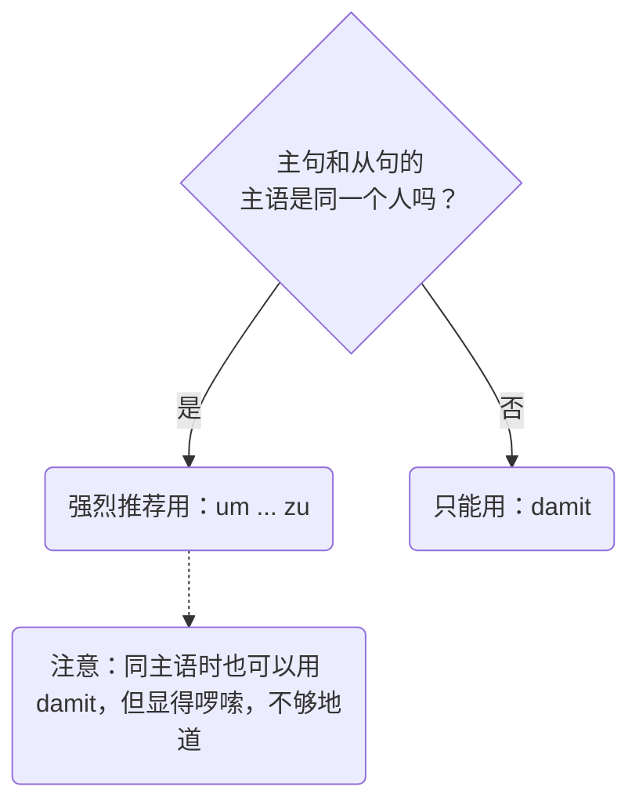
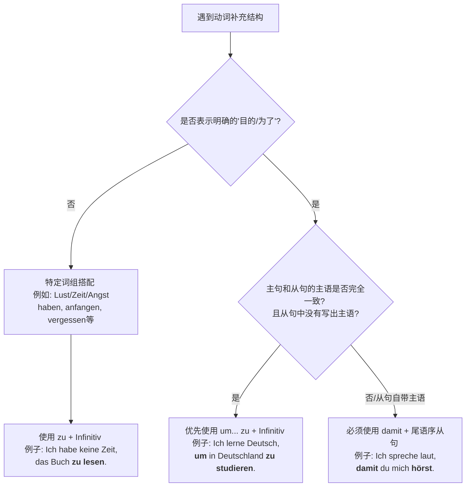

# 目的从句

今天，我们要攻克的是 B 1-B 2 阶段非常核心且实用的语法点：**目的从句 (Finalsätze)**。

在德国的日常生活中，无论你是去外管局延签、跟房东争取看房机会，还是去医院看病，你都需要向对方解释你做某事的“目的”。学会了目的从句，你的德语表达就会从生硬的单句，升级为逻辑严密的高级表达。

---

### 核心概念：什么是目的从句？

想象一下你在**射箭**。

你的主句就是“拉弓射箭”这个动作，而目的从句就是你要击中的“靶心”。目的从句存在的唯一意义，就是回答 **Wozu? (为了什么？)** 或者 **Aus welchem Grund? (出于什么目的？)**

在德语这片箭台上，你有两把绝世好弓可以选：

1. **um ... zu** 2. **damit**

它们虽然都能射中靶心，但适用的场景完全不同。我们要根据“射箭人”（主语）是谁，来选择用哪把弓。这里有一张流程图帮你一秒理清思路 ：

代码段

---

### 第一把弓：独角戏 um ... zu (为了……)

**适用条件**：主句的主语和从句的逻辑主语**完全相同**。这就像是一场独角戏，你拉弓，也是为了实现你自己的目的。

**语法结构**：

主句**, um** + 句子其他成分 + **zu + 动词原形**。

**生动记忆**：`um` 就像是站在门口的保安，`zu` 就像是贴身保镖，永远紧紧贴在动词原形的前面，把它锁在句子的最末尾。

**生活实战例句**：

- **找工作场景**：

    Ich lerne jeden Tag intensiv Deutsch, **um** bald einen guten Job **zu** finden.

    _(我每天疯狂学德语，**为了**能尽快找个好工作。)_

    > 解析：谁学德语？我。谁找工作？还是我。主语一致，完美使用 `um...zu`。

- **租房场景**：

    Ich rufe den Vermieter an, **um** einen Besichtigungstermin **zu** vereinbaren.

    _(我给房东打电话，**为了**约一个看房时间。)_

**大师防坑提示**：

遇到**可分动词**时，`zu` 必须像夹心饼干一样，塞在动词前缀和词干中间！

例如：einkaufen (购物) -> ein**zu**kaufen。

- Ich gehe in den Supermarkt, **um** für das Wochenende ein**zu**kaufen.

---

### 第二把弓：团队战 damit (以便…… / 让……)

**适用条件**：主句的主语和从句的主语**不相同**。这就像是一场接力赛，你拼尽全力拉弓，是为了让另一个人击中靶心。

**语法结构**：

主句**, damit** + 从句主语 + 句子其他成分 + **变位动词**。

_(注意：这是一个标准的副句，变位动词必须踢到最后面！)_

**生活实战例句**：

- **医疗场景**：

    Der Arzt verschreibt mir ein starkes Medikament, **damit** ich schnell wieder gesund werde.

    _(医生给我开了一服猛药，**以便**我能赶紧好起来。)_

    > 解析：开药的主语是“医生”(Der Arzt)，好起来的主语是“我”(ich)。主语不同，必须用 `damit`。

- **行政事务 (外管局) 场景**：

    Ich reiche alle Unterlagen heute ein, **damit** die Ausländerbehörde mein Visum rechtzeitig verlängert.

    _(我今天就把所有材料递交上去，**以便**外管局能及时延长我的签证。)_

**大师防坑提示**：

虽然当主句和从句主语相同时，你在语法上也可以用 `damit`（例如：Ich lerne Deutsch, damit ich einen Job finde），但这在德国人听来非常啰嗦和笨重。**记住大师的铁律：主语相同，优先用 `um...zu`！**

---

### B 2 级别进阶避坑指南：绝对不要画蛇添足！

很多中国学生在写目的从句时，特别喜欢在从句里加上情态动词 **wollen** (想要) 或者 **möchten** (想)。这是**绝对错误**的！

为什么？因为目的从句本身（um...zu / damit）就已经包含了“想要、希望”的意思了。再加 wollen，就像在说“我喝水是为了想要解渴”，在德语里是语义重复（Pleonasmus）。

- ❌ 错误：Ich lerne Deutsch, um einen Job finden _zu wollen_.
- ✅ 正确：Ich lerne Deutsch, **um** einen Job **zu** finden.

---

### 大师的课后练兵场

语法看懂了只是第一步，真刀真枪地练出来才是你的本事。现在，请你假设自己正处在真实的德国移民生活中，尝试用今天学到的 `um...zu` 或 `damit` 把下面这两个情境翻译成德文：

1. **情境一（租房）**：我正在写一封邮件（eine E-Mail schreiben），为了向房东介绍我自己（mich dem Vermieter vorstellen）。
2. **情境二（家庭/教育）**：我们搬到了德国（Wir sind nach Deutschland gezogen），为了我们的孩子（unsere Kinder）能有一个更好的未来（eine bessere Zukunft haben）。

请直接给出你的德语造句，我会为你进行最细致的批改和地道表达的升级建议！

# ❌

# 1

![[image-290.png|1024x655]]

![[clipboard_2026-04-06_14-33.png|1120x824]]
### 题目整体信息提取

**题目类型**：带 `zu` 的动词不定式结构、`um... zu` 目的不定式、`damit` 目的从句。

**题目要求**：请用 _um... zu_, _damit_ 或动词的不定式形式填空。

**原始题干**：（详见下方逐题分析）

---

### 1、逐题精析与纠正

**1. Ich habe nur selten Lust ______________ (einkaufen).**

- **翻译**：我很少有购物的兴致。
- **语法点 (A 2)**：名词词组 `Lust haben` 搭配带 `zu` 的不定式；可分动词的不定式形式。
- **诊断分析**：
    - **常见错误**：_zu einkaufen_
    - **错误根源**：母语负迁移，认为 `zu` 像英语的 `to` 一样永远放在整个动词前面。
    - **正确形式**：**einzukaufen**。对于可分动词（如 ein|kaufen），`zu` 必须嵌在前缀和词根之间，连写成一个词。

**2. Aber man muss Lebensmittel einkaufen, ______________ (kochen können).**

- **翻译**：但是人们必须买菜，为了能做饭。
- **语法点 (B 1)**：`um... zu` 表示目的；情态动词的不定式结构。
- **诊断分析**：
    - **常见错误**：_um zu kochen können_ 或 _damit kochen zu können_
    - **错误根源**：对包含情态动词的 `um... zu` 句尾语序不熟悉。
    - **正确形式**：**um kochen zu können**。主句主语是 `man`，目的从句隐含的主语也是 `man`，同主语优先使用 `um... zu`。情态动词 `können` 位于最后，`zu` 加在情态动词前。

**3. Ich habe auch oft keine Lust ______________ (kochen).**

- **翻译**：我也经常没有兴致做饭。
- **语法点 (A 2)**：`Lust haben` + `zu` + Infinitiv。
- **诊断分析**：
    - **常见错误**：_kochen_ (漏掉 zu)
    - **正确形式**：**zu kochen**。不可分动词/简单动词，`zu` 直接放在动词原形前并分写。

**4. Aber ich muss kochen, ______________ (essen können).**

- **翻译**：但是我必须做饭，为了能吃上饭。
- **语法点 (B 1)**：`um... zu` 表示目的；同主语原则。
- **诊断分析**：
    - **常见错误**：_damit essen können_ (混淆 damit 和 um...zu 的用法)。
    - **正确形式**：**um essen zu können**。主句主语 `ich` 与吃东西的人是同一人，使用 `um... zu` 结构，句尾处理同第 2 题。

**5. Ich habe Angst, ______________ (dick werden).**

- **翻译**：我害怕变胖。
- **语法点 (A 2/B 1)**：抽象名词词组 `Angst haben` 搭配带 `zu` 的不定式。
- **诊断分析**：
    - **常见错误**：_zu dick werden_ 或 _dick werden zu_。
    - **错误根源**：不知道 `zu` 应该放在哪个词前面。在动宾词组或表语+系动词（如 dick werden）中，`zu` 只加在真正的核心动词前。
    - **正确形式**：**dick zu werden**。

**6. ______________ mein Mann doch etwas ______________ , geht er manchmal auch alleine ins Restaurant (essen können).**

- **翻译**：为了我丈夫到底能吃点东西，他有时也会一个人去餐厅。
- **语法点 (B 1)**：`damit` 目的从句的强制触发。
- **诊断分析**：
    - **常见错误**：_Um ... essen zu können_ (看到前后指代同一个人，盲目使用 um... zu)。
    - **错误根源**：**这是本题最大的陷阱！** 虽然逻辑上主句的 `er` 和从句的 `mein Mann` 是同一个人，但在语法结构上，前半句已经给出了明确的名词主语 `mein Mann`。`um... zu` 结构是**绝对不允许**自带主语的。一旦填空处包含了独立的主语，必须使用 `damit` 引导的有限动词从句。
    - **正确形式**：**Damit** mein Mann doch etwas **essen kann**。`damit` 从句是尾语序，变位动词 `kann` 放在句末。

**7. Einmal hat er vergessen Geld ______________ (mitnehmen).**

- **翻译**：有一次他忘记带钱了。
- **语法点 (A 2)**：特定动词 `vergessen` 搭配带 `zu` 的不定式；可分动词。
- **诊断分析**：
    - **常见错误**：_zu mitnehmen_
    - **正确形式**：**mitzunehmen**。`mitnehmen` 是可分动词，`zu` 必须放在中间 (`mit` + `zu` + `nehmen`)。

**8. ______________ , musste er die Teller abwaschen (bezahlen).**

- **翻译**：为了买单（抵债），他不得不去洗盘子。
- **语法点 (B 1)**：前置的 `um... zu` 目的从句。
- **诊断分析**：
    - **常见错误**：_Zu bezahlen_ (漏掉 um)。
    - **错误根源**：没有意识到这里表达的是“目的（为了...）”，而不仅仅是动词的补充说明。
    - **正确形式**：**Um zu bezahlen**。

**9. Er hat mich angerufen, ______________ ich nicht so lange auf ihn ______________ (warten).**

- **翻译**：他给我打了电话，为了让我不要等他太久。
- **语法点 (B 1)**：`damit` 目的从句；不同主语原则。
- **诊断分析**：
    - **常见错误**：_um ... zu warten_
    - **错误根源**：忽视了前后主语不一致（主句主语是 `Er`，从句主语是 `ich`）。
    - **正确形式**：**damit** ich nicht so lange auf ihn **warte**。前后主语不同，必须用 `damit`，并且从句动词 `warten` 要根据 `ich` 变位为 `warte`，放在句末。

---

### 2、深度教学解析（聚焦：目的表达与带 zu 的不定式）

为了彻底理清这三者的使用边界，我们用一个决策树来将你的大脑武装起来：

代码段

#### 核心规则与正反对比例证

**1. 带 zu 的不定式 (Infinitiv mit zu)**

- **规则**：当句子中已经有一个完整的动词，我们需要引入另一个动词来补充说明时（且不表示目的），通常使用带 `zu` 的不定式。如果动词是**可分的**，`zu` 必须塞在中间！
- **经典反例**：Ich versuche, das Fenster _aufzumachen_. (错误写法：zu aufmachen ❌)

**2. um... zu vs. damit (目的的对决)**

- **规则**：
    - `um... zu` 是一个精简结构，**没有自己的主语**，它必须“蹭”主句的主语。
    - `damit` 是一个完整的从句，**必须有自己的主语和变位动词**。
- **深度拓展**：如果主从句主语相同，可以强制用 `damit` 吗？
    - _可以，但显得啰嗦。_ "Ich lerne Deutsch, damit ich in Deutschland studieren kann."（语法正确，但德语母语者更喜欢用精简的 `um... zu`：Ich lerne Deutsch, um in Deutschland studieren zu können.）
- **本例高光（第 6 题）**：虽然丈夫(`mein Mann`)和他(`er`)是同一个人，但因为句式强制写出了 `mein Mann`，你就失去了使用 `um... zu` 的权利，必须老老实实写变位的 `damit... kann`。

#### 防错要点速记口诀

> **“目的从句看主语，相同 um zu 省主语；不同主语写 damit，动词变位放句底；名词动词配对时，zu 字就找动词挤；遇到可分要注意，zu 字必须夹缝里。”**

#### 小试牛刀 (建议你尝试翻译这两句话，检验学习成果)

1. 为了不迟到，我定了一个闹钟。 (提示：迟到 = zu spät kommen)
2. 老师说得很慢，为了让学生们能听懂。 (提示：听懂 = verstehen)

---

### 3、总结与回顾

从这套题目来看，你正在经历从德语句子“单核运行”（简单句）向“多核协同”（复杂从句与不定式结构）过渡的关键时期。填空题特别容易让人产生“只见树木，不见森林”的盲区。

**您的终极学习建议**：

在做此类语法题时，**永远不要一上来就看括号里的动词！** 请养成**“先找主语，再判逻辑”**的习惯。先画出主句的主语，再看逗号后的动作是谁发出的。只要你把主谓关系理清楚了，`um... zu` 和 `damit` 的选择就会像条件反射一样自然。继续加油，德语语法的逻辑之美正在向你展开！
