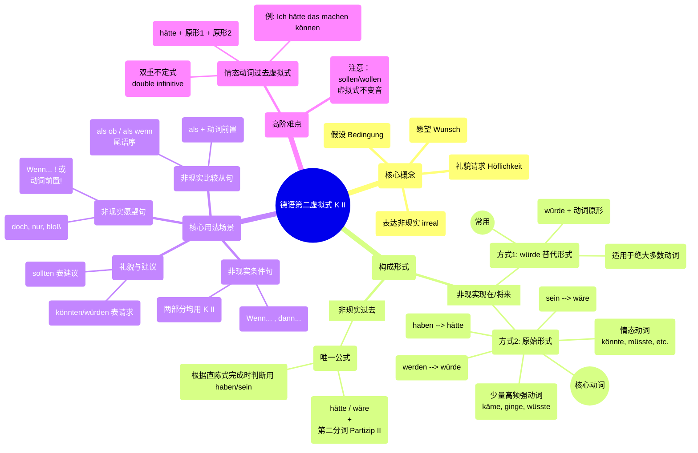
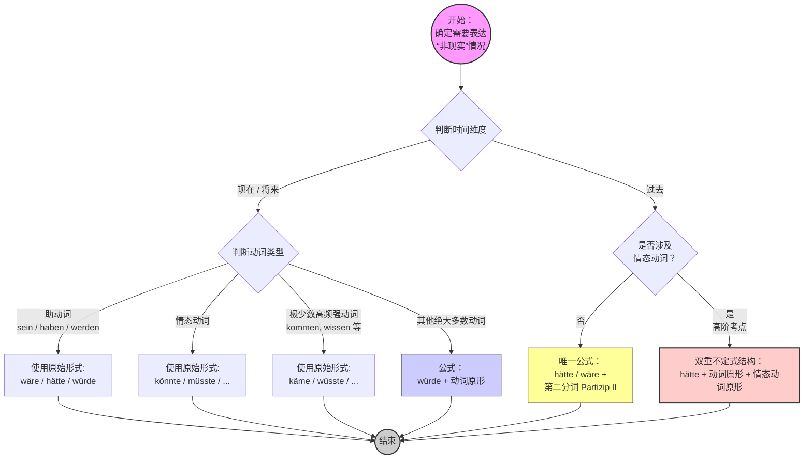

# 第二虚拟式

### 一、 德语第二虚拟式知识点系统全览（思维导图 Mermaid）

这是一个纯粹的 Mermaid `mindmap` 语法结构，清晰地梳理了 K II 的概念、构成和用法。

![[image-218.png|1337]]

代码段

---

### 二、 K II 时间与形式判定流程图（Graph Mermaid）

这是一个使用 Mermaid `graph TD` 语法的流程图，帮助你在选择时态和形式时进行逻辑判断。

---

### 一、 第二虚拟式的核心概念

在德语中，直陈式（Indikativ）用来描述客观事实（例如：“我有钱”），而**第二虚拟式**专门用来描述**非现实的情况**：

- **假设与条件**（如果我有钱...）
- **愿望**（但愿我有钱...）
- **礼貌与委婉**（能不能借我点钱...）

第二虚拟式**只有两个时间维度**：

1. **非现实的现在/将来**（现在不是这样，或将来不会这样）
2. **非现实的过去**（过去没有发生的事）

---

### 二、 第二虚拟式的构成形式 (Formen) 非现实的现在过去将来

- 现在将来用 wurde 和情态动词
- 过去用wäre / hätte + 动词的第二分词

#### 1. 非现实的现在/将来时

表达现在或将来不可能发生，或者纯属假设的情况。它有两种构成方式：

- [l] 假如我将来很有钱

**方式 A：替代形式（würde + 动词原形）**

这是最常用、最简单的形式，适用于**绝大多数动词**（尤其是规则的弱变化动词，因为它们的虚拟式和一般过去时同型，容易混淆）。

- **公式：** `würde(n) + 句末动词原形`
- _例子：_ Ich **würde** ein Auto **kaufen**. (我可能会买辆车。/ 如果怎样，我就会买辆车。)

**方式 B：原始形式（由一般过去时变化而来）**

少数常用动词会使用它们自己的“专属虚拟式变位”，不加 würde。

- **公式：** `过去时词干 + 虚拟式词尾 (-e, -est, -e, -en, -et, -en)`。如果是强变化动词，词干中的 a, o, u 通常要变音为 **ä, ö, ü**。
- **必须使用原始形式的动词（重点记忆）：**
    - 三大助动词：**sein** (wäre), **haben** (hätte), **werden** (würde)
    - 情态动词：können (**könnte**), müssen (**müsste**), dürfen (**dürfte**), mögen (**möchte**), sollen (**sollte**), wollen (**wollte**) -> _注意：sollen 和 wollen 不变音。_
    - 极少数高频强变化动词：kommen (**käme**), gehen (**ginge**), finden (**fände**), wissen (**wüsste**), lassen (**ließe**)。

**核心变位对照表：**

|**人称**|**sein (wäre)**|**haben (hätte)**|**werden (würde)**|**können (könnte)**|
|---|---|---|---|---|
|**ich**|wäre|hätte|würde|könnte|
|**du**|wärst|hättest|würdest|könntest|
|**er/sie/es**|wäre|hätte|würde|könnte|
|**wir**|wären|hätten|würden|könnten|
|**ihr**|wärt|hättet|würdet|könntet|
|**sie/Sie**|wären|hätten|würden|könnten|

#### 2. 非现实的过去时

表达过去**没有发生**的事情（类似于英语的 "would have done"）。它只有一种固定的组合方式，所有动词一视同仁。

- **公式：** `wäre / hätte + 动词的第二分词 (Partizip II)`
- _例子：_
    - [l] Ich **hätte** das Auto **gekauft**. (我当时本来会买那辆车的。—— 事实：没买)
    - Er **wäre** nach Berlin **gefahren**. (他当时本来会去柏林的。—— 事实：没去)

---

### 三、 第二虚拟式的核心用法 (Verwendung) 应用场景

掌握了形式后，我们来看它在句子中的五大应用场景：

#### 1. 非现实条件句 (Irreale Konditionalsätze)

这是最常见的用法，通常由 `wenn` 引导。主句和从句都要用虚拟式。

- **现在的条件：** 如果我有时间，我就会帮你。
    - _Wenn_ ich Zeit **hätte**, **würde** ich dir **helfen**.
- **过去的条件：** 如果我当时有时间，我当时就帮你了。
    - _Wenn_ ich Zeit **gehabt hätte**, **hätte** ich dir **geholfen**.
- **高阶语法（省略 wenn）：** 可以将从句的动词提前，省略 wenn。
    - **Hätte** ich Zeit, **würde** ich dir **helfen**. (句意不变，更加紧凑)

#### 2. 非现实愿望句 (Irreale Wunschsätze)

表达无法实现的愿望，通常伴随语气词 `doch` , `nur` , `bloß` 以增强语气。动词可以放在句首，也可以用 wenn 引导。

- **现在：** 但愿我现在有钱就好了！
    - _Wenn_ ich doch Geld **hätte**! / **Hätte** ich doch Geld!
- **过去：** 要是我昨天没去那儿就好了！
    - _Wenn_ ich gestern nur nicht dorthin **gegangen wäre**! / **Wäre** ich gestern nur nicht dorthin **gegangen**!

#### 3. 非现实比较从句 (Irreale Vergleichssätze)

用 `als ob` / `als wenn` (仿佛，好像) 或者单用 `als` 引导。表示一种并不真实的假象。

- **用 als ob / als wenn (动词在句末)：**
    - Er tut so, **als ob** er der Chef **wäre**. (他表现得好像他是老板一样。—— 事实：他不是)
- **用 als (动词紧跟在 als 后面，占第二位)：**
    - Er tut so, **als wäre** er der Chef.

#### 4. 礼貌请求与委婉建议 (Höfliche Bitten und Ratschläge)

在日常生活中，为了显得客气、不生硬，德国人极频繁地使用第二虚拟式（此时不表示“非现实”，只表示“客气”）。

- **礼貌请求（通常用 könnten / würden）：**
    - **Könnten** Sie mir bitte helfen? (您能帮我一下吗？ 比 Können 委婉得多)
    - Ich **hätte** gern einen Kaffee. (我想要一杯咖啡。 比 Ich will 礼貌)
- **委婉建议（通常用 sollten）：**
    - Du **solltest** zum Arzt gehen. (你应该去看医生。)

#### 5. 非现实结果从句 (Irreale Folgesätze)

固定句型 `zu ..., als dass...` (太...以至于不能...)。

- Das Auto ist **zu** teuer, **als dass** ich es mir **kaufen könnte**.

    (这辆车太贵了，以至于我买不起。—— 事实：车贵，买不起)

---

### 四、 高阶避坑与核心考点

1. **情态动词的过去时虚拟式（双重不定式结构）**

    这是考试中最爱考的难点。如果非现实的过去时遇到了情态动词，不要使用 Partizip II，而是要**把助动词 hätte 放在句尾（或从句中特殊位置），后面跟两个动词原形**。

    - _事实：_ 他昨天本来可以来的。
    - _错误：_ Er hätte gestern kommen gekonnt. ❌
    - _正确：_ Er **hätte** gestern **kommen können**. ✅ (hätte + 动词原形 + 情态动词原形)
    - _如果在 wenn 从句中：_ Wenn er gestern **hätte kommen können**,... (注意 hätte 跑到两个不定式前面去了！)
        
2. **würde 还是 原始形式？**
    
    - 不要对所有动词都生硬地套用原始形式。比如买 (kaufen)，它的虚拟式原始形式是 _kaufte_，这和一般过去时完全一样。为了避免歧义，现代德语规定：**除了助动词、情态动词和极少数强变化动词外，一律使用 `würde + Infinitiv`。**
        
3. **时态的对应法则**

    在做题或写作时，先判断中文/逻辑里的时间状语。

    - 看到 "jetzt, morgen, heute"，立刻锁定 -> **würde/hätte/wäre/könnte**。
    - 看到 "gestern, früher, letztes Jahr"，立刻锁定 -> **hätte/wäre + Partizip II**。

# 德语的如果：

- **常规带“如果”的从句：** **Wenn** ich Zeit **hätte**, ginge ich ins Kino. （如果我有时间，我就去看电影。） _解析：这里用 wenn 表达“如果”，动词 hätte 被踢到句末。_
- **高级的“动词前置”条件句（也就是你说的变了动词就成了如果）：** **Hätte** ich Zeit, ginge ich ins Kino. （**要是**我有时间，我就去看电影。） _解析：这里**没有** wenn，而是直接把变了形的 **Hätte** 放在了第 1 位！此时，这个 Hätte 自己就兼任了“如果 + 有”两个含义！_

# 什么时候选择情态动词什么时候选择助动词

这是一个非常深刻且直击要害的问题！能跳出死记硬背，去探究它们在底层逻辑上的“本质”，说明你的德语思维正在发生质的飞跃。

在德语中，助动词（Hilfsverben：sein, haben, werden）和情态动词（Modalverben：können, müssen, sollen, wollen, dürfen, mögen）虽然都不能单独成句（通常需要搭配实义动词），但它们的**核心使命完全不同**。

理解了它们的本质，在第二虚拟式（Konjunktiv II）中的选择逻辑就会变得非常清晰。

---

### 一、 本质上的区别：骨架 vs. 调料

#### 1. 助动词 (sein, haben, werden) = 纯粹的“语法工具人”（骨架）

助动词在句子里**不提供任何新的意义或态度**。它们的存在，纯粹是为了满足语法的硬性需求，用来搭建句子的“骨架”：

- **改变时间**：用 _haben/sein_ 搭建完成时（过去）。
- **改变语态**：用 _werden_ 搭建被动语态。
- **改变现实性**：用 _würde/wäre/hätte_ 搭建虚拟式。

#### 2. 情态动词 (können, müssen, dürfen 等) = 态度与条件的“调味品”（调料）

情态动词不改变动作的发生时间或语态，它们负责给动作加上一层**主观色彩或客观条件**。

- 它回答的是：这个动作是“有能力/有可能”做（können），还是“有义务/必须”做（müssen），或者是“被允许”做（dürfen）？

---

### 二、 在第二虚拟式 (K II) 中如何选择？

在第二虚拟式中，所有的场景都是“非现实（非真实）”的。你该用助动词还是情态动词，**完全取决于你想不想在这个“非真实的情境”里，额外加上你的主观态度（能力、义务、意愿）。**

#### 场景 1：纯粹的假设与结果（只用助动词）

如果你只想平铺直叙地表达一个与事实相反的假设：**“如果...就会...”**，不需要强调能力或义务，那就只召唤语法工具人（助动词）。

- **现在/将来的假设：用助动词 `würde` **
    - _事实：_ 我没钱，我不买车。 (Ich habe kein Geld, ich kaufe kein Auto.)
    - _K II：_ 如果我有钱，我**就会**买车。 (Wenn ich Geld hätte, **würde** ich ein Auto kaufen.)
    - _本质：_ `würde` 只是个纯粹的语法标记，告诉你“买”这个动作是虚拟的。
- **过去的假设：用助动词 `hätte/wäre` + Partizip II**
    - _事实：_ 我昨天没时间，我没去。
    - _K II：_ 如果我昨天有时间，我**就会**去了。 (Wenn ich gestern Zeit gehabt hätte, **wäre** ich gegangen.)

#### 场景 2：假设中带有能力、义务、许可（必须用情态动词）

如果在非现实的情境中，你想强调**“本可以”、“本应该”、“本必须”**，你就必须把情态动词拉进来当调料。

- **现在/将来的虚拟态度：用情态动词自身的虚拟形式 (`könnte, müsste, sollte` 等)**
    - _事实：_ 我不会德语，我无法帮你翻译。
    - _K II：_ 如果我会德语，我**就能**帮你翻译了。 (Wenn ich Deutsch könnte, **könnte** ich dir beim Übersetzen helfen.)
    - _对比思考：_ 这里的 könnte 替换了场景 1 中的 würde。它不仅表达了虚拟，还表达了“具备这个能力”。

#### 场景 3：终极融合——过去的非真实能力与义务（助动词 + 情态动词联手）

这是德语语法中最精密的设计。当你要表达**过去本可以发生、但实际没发生的事情**时，你需要：

1. 用助动词 `hätte` 提供“过去+虚拟”的语法骨架。
2. 用情态动词提供“能力/义务”的调料意义。

    这会形成德语中的**双重不定式结构 (hätte + 动词原形 + 情态动词原形)**。

- _情境：_ 你昨天错过了一场极好的演唱会，而你本来是有票的（具备去的能力）。
- _表达：_ 我昨天**本来可以去**看演唱会的。 (但事实没去)
    - _德语逻辑：_ 虚拟过去骨架 (`hätte`) + 看 (`sehen`) + 能力 (`können`)
    - _最终成句：_ Ich **hätte** das Konzert **sehen können**.
- _其他例子：_
    - 你**本来必须**早点告诉我的！(Du **hättest** es mir früher **sagen müssen**!)
    - 她**本该**待在家的。(Sie **hätte** zu Hause **bleiben sollen**.)

---

### 三、 总结：你的选择清单

在开口或下笔之前，问自己两个问题：

1. **这事儿发生在现在还是过去？**
    
    - 现在/将来 -> 选 `würde` 或 `könnte/müsste...`
    - 过去 -> 必然用到 `hätte/wäre`
        
2. **句子里有没有隐含着“能够/必须/应该”这样的词眼？**
    
    - 没有（纯粹的会发生） -> 用助动词（`würde` 或 `hätte + P.II`）
    - 有 -> 必须加入情态动词（现在用 `könnte...`，过去用 `hätte + Inf + Modal Inf`）

在这三个场景中，场景 3 的“过去+情态（双重不定式）”通常是中国学生在口语中最容易卡壳的地方，因为它违背了我们的母语语序习惯。你需要我设定几个特定的生活纠纷场景，带你实战推演一下这个双重不定式句型吗？

# 三个助动词的使用场景

- **werden** -> **würde**
- **haben** -> **hätte**
- **sein** -> **wäre**

要区分它们什么时候上场，核心在于认清它们的**“双重身份”**：它们有时是**实义动词**（自己本身就有意思），有时是**纯助动词**（自己没意思，只帮别人搭框架）。

### 一、 würde (变身自 werden) —— “万能替身”与“动作主导”

`würde` 在虚拟世界里，**绝对不表示“成为”（werden 的本意）**，它在这里完完全全是一个“语法工具人”。

#### 出场时机 1：作为绝大多数动词的“虚拟替身”（现在/将来时）

当你要表达“如果...我**就会做**某事”，且这个动作不是助动词、不是情态动词时，一律用 `würde` 把动作原形推到句末。

- **逻辑：** 表达非现实的**动作**。
- **例子：**
    - 如果我有时间，我就**去旅游**。-> Wenn ich Zeit hätte, **würde** ich **reisen**.
    - 我（本来）**会买**这辆车。-> Ich **würde** das Auto **kaufen**.

#### 出场时机 2：构建虚拟式的被动语态

当你要表达“某事**本来会被**怎样”，你需要用到虚拟被动语态。

- **例子：**
    - 这台电脑**本来会被**修好的。（事实：没修）-> Der Computer **würde repariert werden**.

---

### 二、 hätte (变身自 haben) —— “拥有”与“常规动作的过去”

`hätte` 的使用取决于它是作为主角还是配角。

#### 出场时机 1：作为实义动词（现在/将来时）

当你想表达“如果我**拥有/有**...”时，直接用 `hätte`。

- **逻辑：** 虚拟的**占有/拥有**。
- **例子：**
    - 如果我**有**钱... -> Wenn ich Geld **hätte**...
    - 如果我**有**时间... -> Wenn ich Zeit **hätte**...

#### 出场时机 2：作为过去时虚拟式的助动词（配角）

当你要表达**“过去本来发生了某事（但没发生）”**，且这个动词在普通的直陈式完成时（Perfekt）里是用 `haben` 构成的，你就必须用 `hätte + 第二分词`。**（德语中 90% 的动词都属于这一类）**

- **逻辑：** 搭建非现实的**过去**框架。
- **例子：**
    - 直陈式完成时：Ich **habe** Pizza **gegessen**. (我吃了披萨)
    - 虚拟式过去时：Ich **hätte** Pizza **gegessen**. (我本来会吃披萨的。——事实：没吃)
    - 直陈式完成时：Ich **habe** das Buch **gelesen**.
    - 虚拟式过去时：Ich **hätte** das Buch **gelesen**.

---

### 三、 wäre (变身自 sein) —— “状态属性”与“位移改变的过去”

`wäre` 同样要看它是当主角还是当配角，但它永远和**“状态”**或**“位置”**强相关。

#### 出场时机 1：作为实义动词（现在/将来时）

当你想表达“如果我**是**...”或者“如果我**处于...状态**”时，直接用 `wäre`。

- **逻辑：** 虚拟的**身份、特征、状态**。
- **例子：**
    - 如果我**是**你... -> Wenn ich du **wäre**...
    - 如果我**健康**的话... -> Wenn ich gesund **wäre**...
    - 如果我**在**柏林... -> Wenn ich in Berlin **wäre**...

#### 出场时机 2：作为过去时虚拟式的助动词（配角）

当你要表达**“过去本来发生了某事”**，且这个动词表示**位置移动**（如 gehen, fahren, fliegen, kommen）或**状态改变**（如 aufwachen 醒来, sterben 死亡），在直陈式完成时里是用 `sein` 构成的，你就必须用 `wäre + 第二分词`。

- **逻辑：** 搭建非现实的**过去**框架（针对特定动词）。
- **例子：**
    - 直陈式完成时：Ich **bin** nach Berlin **gefahren**. (我去了柏林)
    - 虚拟式过去时：Ich **wäre** nach Berlin **gefahren**. (我本来会去柏林的。——事实：没去)
    - 直陈式完成时：Er **ist** früh **aufgewacht**. (他醒得很早)
    - 虚拟式过去时：Er **wäre** früh **aufgewacht**. (他本来会早醒的。)

---

### 四、 终极实战检验：一句话搞懂它们的区别

为了让你直观感受，我们用同一个主语“我”和同一个情境来造三个句子：

1. **用 würde (强调假设的动作)：**
    
    - Ich **würde** dir **helfen**.
    - 我（现在）**会帮助**你的。（事实：现在由于某种原因帮不了）
        
2. **用 hätte (强调假设的过去动作，helfen 的完成时用 haben)：**
    
    - Ich **hätte** dir **geholfen**.
    - 我（当时）**本来会帮助**你的。（事实：当时没帮）
        
3. **用 wäre (强调假设的过去动作，kommen 的完成时用 sein)：**
    
    - Ich **wäre** zu dir **gekommen**.
    - 我（当时）**本来会来**找你的。（事实：当时没来，kommen 是位移词，用 wäre）

**核心判定法则：**

- 说现在的事？动词有实意选 `würde`；表“有”选 `hätte`；表“是/状态”选 `wäre`。
- 说过去的事？看动词的完成时跟谁混，跟 haben 混就用 `hätte + P.II`，跟 sein 混（位移/状态改变）就用 `wäre + P.II`。

# 题目

## Wenn Thomas gestern Zeit **gehabt hätte**, **wäre** er zur Party **gekommen**.

### 题目 1：第二虚拟式（过去时的非真实条件句）

> **原题：** _Thomas hatte gestern keine Zeit. Deshalb ist er nicht zur Party gekommen._
> 
> **你的答案：** Wenn Thomas gestern Zeit _ich hätte_, _wäre ich komme_ er zur Party...
> 
> **正确答案：** Wenn Thomas gestern Zeit **gehabt hätte**, **wäre** er zur Party **gekommen**.

---

### 📝 错误分析与知识补充

你的语感很好，知道要用 `hätte` 和 `wäre`，但在这里有几个小陷阱需要注意：

1. **人称不要变**：题目描述的是 **Thomas (er)**，所以我们在改写时主语仍然是 er，不能换成 ich 哦。
2. **时态（过去的第二虚拟式）**：题目中有关键时间词 **gestern**（昨天），并且原句用的是过去时（hatte）和现在完成时（ist ... gekommen）。这意味着我们要表达的是**“对过去事实的虚拟”**（如果昨天...就好了）。
    
    - **公式**：过去时的第二虚拟式 = **hätte / wäre + 动词的过去分词 (Partizip II)**
        
3. **句子结构与动词位置**：
    
    - **Wenn 引导的从句（条件从句）**：动词变位要放在句末。
        - 拥有时间：Zeit haben -> 变成虚拟式：Zeit **gehabt hätte**。
    - **主句（结果）**：因为 Wenn 从句占了第一位，主句要**紧跟变位动词**。
        - 来派对：zur Party kommen -> 变成虚拟式：**wäre** ... **gekommen**（注意 kommen 的过去分词是 gekommen，且表示位置移动，助动词用 sein/wäre）。

---

### 💡 针对性巩固练习

既然在“过去时的第二虚拟式”这里卡了一下，我们趁热打铁再练一道同类型的题目，看看你是否掌握了这个“公式”：

> **请改写为非真实条件句：**
> 
> _Ich war gestern krank. Deshalb bin ich im Bett geblieben._ (我昨天病了。因此我待在了床上。)
> 
> **Wenn ich gestern nicht krank ______ ______ , ______ ich nicht im Bett ______ ______ .**

另外，你刚才没有写第 2 题和第 3 题哦。**你是想先试试上面这道巩固题，还是想继续挑战原来的第 2（关系从句）和第 3（被动语态）题呢？**

## 为什么都要用 ge
因为句子用 gestern