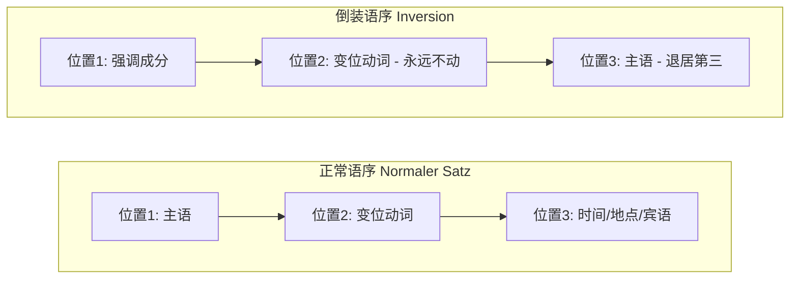
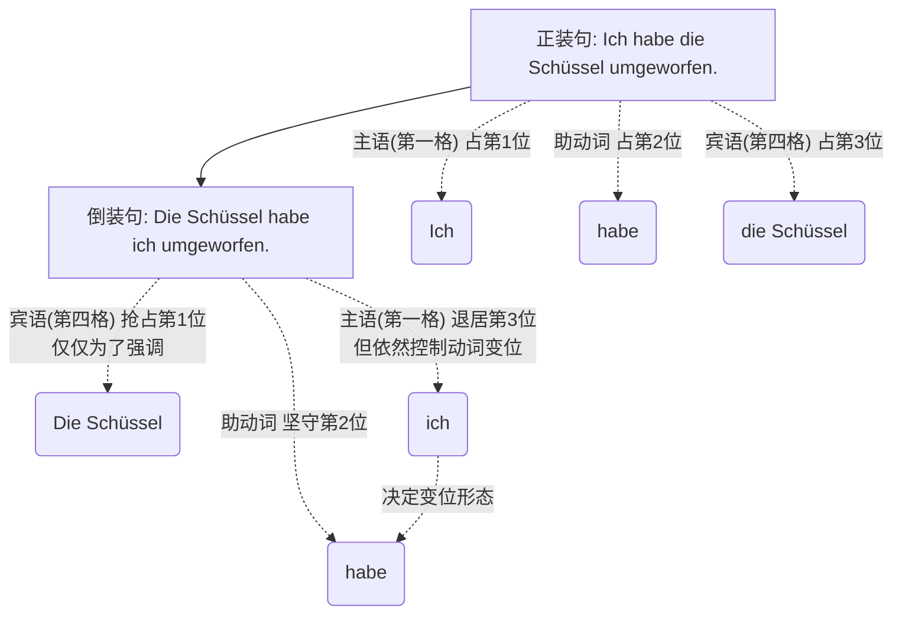

# 倒装句

### 1. 核心概念：什么是倒装句？

很多初学者习惯了中文或英文的语序：**主语 + 动词 + 其他**（我 + 昨天 + 去看了医生）。如果你每句德语都这么说（*Ich bin gestern zum Arzt gegangen.*），考官或面试官立刻就会觉得你的德语还停留在 A 1 水平。

在德语中，为了强调某个时间、地点或重要事件，我们经常把它们放在句首。这个时候，就要用到**倒装**。

**💡 大师类比：动词是“永远的国王”**

想象一下，德语的主句是一个拥有严格座次表的高级餐厅。

* **二号专座（位置 2）**是属于“变位动词”的王座。国王永远、绝对、不可撼动地坐在第二位！
* **一号专座（位置 1）**通常是给“主语”留的。
* **但是！** 如果今天来了一位“重要贵宾”（比如表示时间的“昨天”，或者表示地点的“在柏林”），这位贵宾抢占了一号专座，那么原本的主语怎么办？它只能委屈地挪到国王的另一边，也就是**三号座位（位置 3）**。

这就是倒装：**强调成分 + 动词（第二位） + 主语 + 其他。**

---

### 2. 图解倒装句结构

---

### 3. 实战演练：移民生活场景

让我们把这个规则带入到你未来六个月在德国最常遇到的真实场景中。

#### 场景一：找工作与面试 (Jobsuche)

* **平淡无奇 (A 1):** ***Ich* habe *heute*** einen Termin für das Vorstellungsgespräch. (我今天有个面试预约。)
* **地道倒装 (B 1/B 2):** ***Heute*** **habe** *ich* einen Termin für das Vorstellungsgespräch.
* *(把“今天”放前面强调，动词 habe 稳居第二位，主语 ich 退居第三位。)*

#### 场景二：行政事务 - 外管局 (Ausländerbehörde)

* **平淡无奇 (A 1):** *Wir* müssen <mark style="background:#d4b106">*nächste Woche*</mark> die Dokumente einreichen. (我们下周必须提交文件。)
* **地道倒装 (B 1/B 2):** <mark style="background:#d4b106">Nächste Woche</mark> **müssen** *wir* die Dokumente einreichen.
* *(强调“下周”这个时间限制，向办事员表达紧迫感。)*

#### 场景三：租房与看房 (Wohnungssuche)

* **平淡无奇 (A 1):** *Ich* bezahle *die Kaution* sofort. (我立刻支付押金。)
* **地道倒装 (B 1/B 2):** ***Die Kaution*** **bezahle** *ich* sofort.
* *(强调“押金”，表明你的诚意和财力，房东最爱听这句！在这里，宾语变成了抢占一号座位的贵宾。)*

---

### 4. 学习规划建议 (B 2 冲刺指南)

针对你六个月达到 B 2 的目标，倒装句只是我们“长句构建”的第一步。未来的学习我们这样规划：

1. **第 1-2 个月（夯实框架）：** 彻底吃透各种时态的倒装句、情态动词的框架结构（框形结构）。确保在医疗急诊或警局报案时能快速、准确地说出“时间+地点+发生了什么”。
2. **第 3-4 个月（逻辑升华）：** 引入各类从句（原因、条件、让步），学习动词在从句中“被踢到句尾”的规则。这是 B 1 迈向 B 2 的绝对分水岭。
3. **第 5-6 个月（高级润色）：** 专攻被动语态（用于阅读冗长的租房合同和工作合同）以及第一/第二虚拟式（用于写得体的商务邮件和表达礼貌的请求）。

---

### 轮到你了！

要真正掌握倒装句，最好的方法就是开口练习。假设你现在生病了，需要打电话给全科医生（Hausarzt）预约。

**请尝试将下面这句话改写为强调时间“明天 (Morgen)”的倒装句：**

*Ich brauche morgen dringend einen Termin beim Arzt.* (我明天急需一个看医生的预约。)

你想不想现在就试着改写一下？把你改写的句子发给我，我来为你点评和纠错！

# 我打翻了碗；还是碗打翻了我

**核心解答与语法诊断**

- **德语（工牌法则）：** 德语是靠格（Kasus）**来识别身份的。每个词出场时都挂着一个“工牌”。只要你挂着**第一格（Nominativ）**的工牌，你走到哪里都是主语（老板）；只要你挂着**第四格（Akkusativ）的工牌，哪怕你坐到最前面的尊贵位置，你也依然是个直接宾语（被作用的对象）。

---

**德语原句拆解与对比分析**

我们用德语的现在完成时（表示已经发生的动作）来翻译“我打翻了那只碗”。

**正常语序（正装句）：**

**Ich habe die Schüssel umgeworfen.**

（我打翻了那只碗。）

**强调“碗”的倒装句：**

**Die Schüssel habe ich umgeworfen.**

（那只碗，我打翻了。/ 打翻那只碗的人，是我。）

在这个倒装句中，为什么德国人绝对不会误解成“碗打翻了人”？我们来逐词拆解：

- **Die Schüssel**: 名词 (Substantiv)。在这里它是**第四格 (Akkusativ)**。虽然阴性名词的第一格和第四格长得一模一样（都是 die Schüssel），但后面的成分会揭示它的真实身份。它被提前到了第一位（前场 Vorfeld），目的是为了**强调**（比如：我打翻的是那只碗，不是那个杯子）。
- **habe**: 助动词 (Hilfsverb)。占据雷打不动的**第二位**。注意它的变位！它是第一人称单数变位。这就给出了强烈暗示：主语是“我”。
- **ich**: 人称代词 (Personalpronomen)。**第一格 (Nominativ)**，这才是它不可剥夺的“老板工牌”。虽然它被挤到了第三位，但它永远是动作的发出者。
- **umgeworfen**: 可分动词 umwerfen 的第二分词 (Partizip II)。位于句末，和 habe 构成框形结构。

**如果真的想表达“碗成精了，打翻了我”，德语该怎么说？**

你需要给“碗”换上第一格的工牌，给“我”换上第四格的工牌，并改变动词的变位来配合“碗”：

**Die Schüssel hat mich umgeworfen.**

（_hat_ 配合第三人称单数；_mich_ 是“我”的第四格形式，戴上了被打翻的工牌）。

---

**Mermaid 逻辑树状图：倒装句的乾坤大挪移**

通过下面这幅图，你可以直观地看到：在德语倒装句中，只是**位置**发生了交换，但**语法功能（工牌）**和**动词的配合关系**丝毫没有改变。

代码段

---

**举一反三与知识考核**

德语的这种“工牌机制”给了说话人极大的自由度，你可以把任何你想强调的信息（时间、地点、宾语）放在句首，只要保证**动词在第二位，主语紧跟其后**即可。

现在，导师来考考你：

在德语中，“狗”是阳性名词（第一格 der Hund，第四格 den Hund）；“男人”也是阳性名词（第一格 der Mann，第四格 den Mann）；“咬”是动词 beißen。

如果我想说倒装句“Den Mann beißt der Hund.”，请问运用今天学到的“工牌法则”，这句话到底意思是“男人咬了狗”，还是“狗咬了男人”？为什么？
