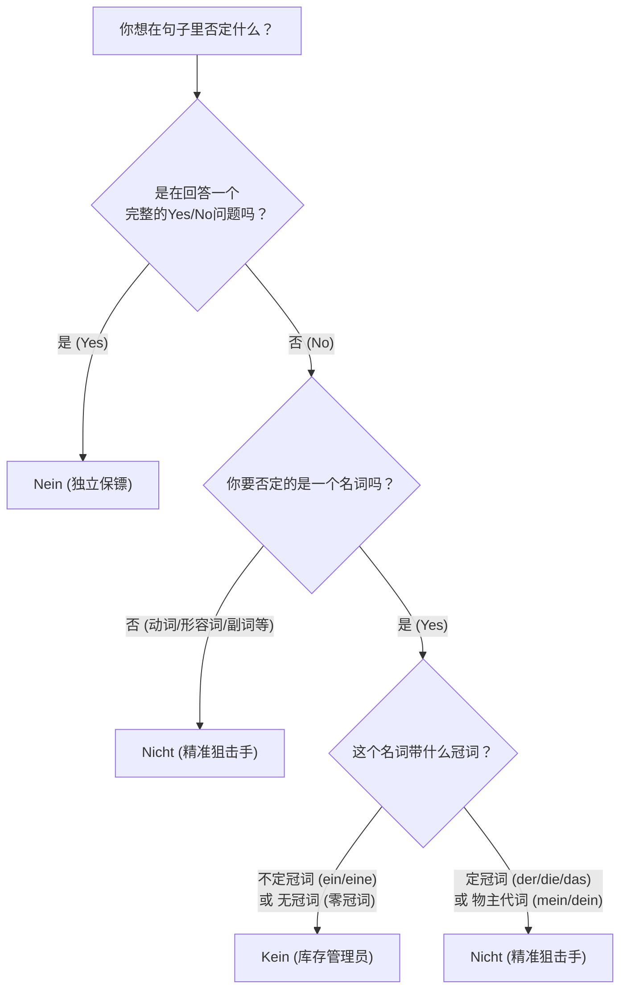

# 全面讲解否定，nein,kein,nicht等

六个月冲刺B2，不仅需要毅力，更需要极其高效的方法。你即将面临的是在德国真实的生存场景——租房、看病、找工作、和外管局（Ausländerbehörde）斗智斗勇。在这些场景中，你不仅要会表达“是”，更要学会准确、有力地表达“不”。

很多初学者会被德语里的 `nein`, `kein`, `nicht` 搞晕，其实它们的分工极其明确。今天，我们不背死板的语法书，我们用**“职场角色类比法”**来彻底啃下这块硬骨头。

在我们深入之前，先来看一下这张“否定词决策流程图”。遇到需要否定的时候，在脑海里走一遍这个流程：

1. nein否定句子
2. nicht否定名词
3. kein 否定动/adj/adv

代码段

---

### 一、 Nein —— 霸气侧漏的“门卫保镖”

`Nein` 是最好理解的。你可以把它想象成夜店门口的霸气保镖，它的作用是**把整个问题拒之门外**。它永远独立存在，用逗号和后面的句子隔开，或者干脆单独成句。

- **核心法则**：只用来回答以动词开头的“一般疑问句”（Yes/No Questions）。
- **【行政事务场景】**
    - **签证官**：Haben Sie Ihren Pass dabei? (您带护照了吗？)
    - **你**：**Nein**, ich habe ihn vergessen. (**不**，我忘带了。)
    - _解析_：这里的 Nein 直接否定了对方的整个提问。

---

### 二、 Kein (keine/keinen...) —— 无情的“库存管理员”

`Kein` 并不是一个纯粹的副词，它的真实身份是**冠词**（和 ein/eine 是一家人）。你可以把它想成一个无情的库存管理员，它的潜台词是**“数量为零”**。

- **核心法则**：专门用来否定**带有不定冠词 (ein/eine)** 或者 **无冠词 (表示泛指的复数或不可数名词)** 的名词。
- **变形法则**：Kein 的词尾变化和 Ein 一模一样！（主格 kein, 第四格 keinen 等）。

**【租房与找工作场景】**

1. **否定不定冠词 (ein/eine) -> 变成 kein/keine**
    
    - **房东**：Haben Sie **einen** Arbeitsvertrag? (您有一份工作合同吗？)
    - **你**：Ich habe leider noch **keinen** Arbeitsvertrag. (很遗憾我目前**没有（零份）**工作合同。)
    - _解析_：因为 Arbeitsvertrag 是阳性第四格（einen），所以否定时直接变成 keinen。
        
2. **否定无冠词 (不可数名词或泛指复数)**
    
    - **医生**：Trinken Sie Alkohol? (您喝酒吗？- 泛指，无冠词)
    - **你**：Ich trinke **keinen** Alkohol. (我**不**喝酒 / 我的酒精摄入量为零。)
    - _解析_：Alkohol 是阳性第四格，虽然原句没有 ein，但表示数量为零，必须用 kein。
    - **雇主**：Haben Sie Fragen? (您有问题吗？- 复数泛指)
    - **你**：Ich habe **keine** Fragen. (我**没有**问题。)

---

### 三、 Nicht —— 指哪打哪的“精准狙击手”

如果不是用来回答问题，也不是为了把名词数量清零，那么剩下的所有否定任务，全都交给 `Nicht`！它就像一个狙击手，专门瞄准动词、形容词、副词，甚至是特定的名词。

- **核心法则**：否定一切不需要用到 Kein 的地方。特别是**带有定冠词 (der/die/das) 或 物主代词 (mein/dein) 的名词，必须用 Nicht 否定！**
- **最难点：Nicht 的位置！**（请牢记以下“狙击位”）

**狙击位 1：==全句否定==（瞄准整个动作）—— Nicht 放在句末**

- **【医疗场景】**
    - Ich rauche **nicht**. (我不抽烟。)
    - Der Arzt kommt heute **nicht**. (医生今天不来。)

**狙击位 2：精准==否定某个特定成分== —— Nicht 放在该成分的正前方**

- **【找工作场景】**
    - Ich arbeite **nicht** am Wochenende. (我**不在**周末工作。- 瞄准时间短语)
    - Das Gehalt ist **nicht** hoch. (工资**不**高。- 瞄准形容词)
    - Ich spreche **nicht** schnell. (我说话**不**快。- 瞄准副词)

**狙击位 3：德语独有的“框形结构” —— Nicht 放在第二动词的前面**

这句话怎么理解, 什么是独有的结构? 就是情态动词和可分动词的句型结构都是固定的, 那么 nicht 也只能放在固定的地方.

- **【生活场景】**
    - _完成时_：Ich habe das Formular **nicht** unterschrieben. (我**没有**在表格上签字。-> Nicht 放在过去分词前)
    - _情态动词_：Sie dürfen hier **nicht** parken. (您**不能**在这里停车。-> Nicht 放在动词原形前)
    - _可分动词_：Ich rufe dich morgen **nicht** an. (我明天**不**给你打电话。-> Nicht 放在可分前缀 an 的前面)

**⚠️ 易错大坑预警：定冠词/物主代词名词的否定**

- **错误**：Das ist _kein_ mein Pass. (❌ 库存管理员 Kein 不能管已经明确归属的东西)
- **正确**：Das ist **nicht** mein Pass. (✅ 这是精准狙击，否定“我的”护照)
- **正确**：Ich kaufe **nicht** das Haus, sondern die Wohnung. (我不买那栋房子，而是买这套公寓。)

---

### 四、 B1/B2 进阶否定武器库（高分必备）

为了达到B2水平，你不能永远只会用 nicht 和 kein，你需要掌握更高级的“否定替代词”。

1. **Niemand (没有人)** vs. _Jemand (某人)_
    - **场景**：**Niemand** in der Ausländerbehörde spricht Englisch. (外管局里**没有人**说英语。)
2. **Nichts (什么都没有/无)** vs. _Etwas (某物)_
    - **场景**：Der Arzt hat gesagt, mir fehlt **nichts**. (医生说我**什么事都没有**。- 身体健康)
3. **Nie / Niemals (从不/绝不)** vs. _Immer (总是)_
    - **场景**：Ich war **noch nie** in Deutschland. (我**以前从来没有**去过德国。)
4. **Weder ... noch ... (既不... 也不...)** - _B2核心连词_
    - **场景**：Für diese Wohnung habe ich **weder** das Geld **noch** die Zeit. (对于这套公寓，我**既没有**钱**也没有**时间去打理。)

---

其他否定词语
