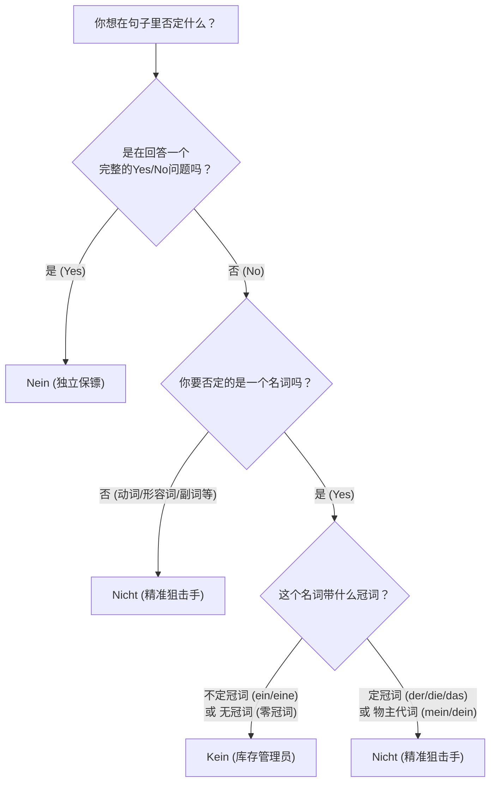
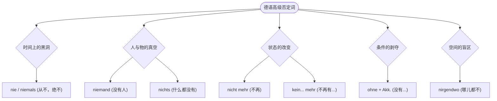
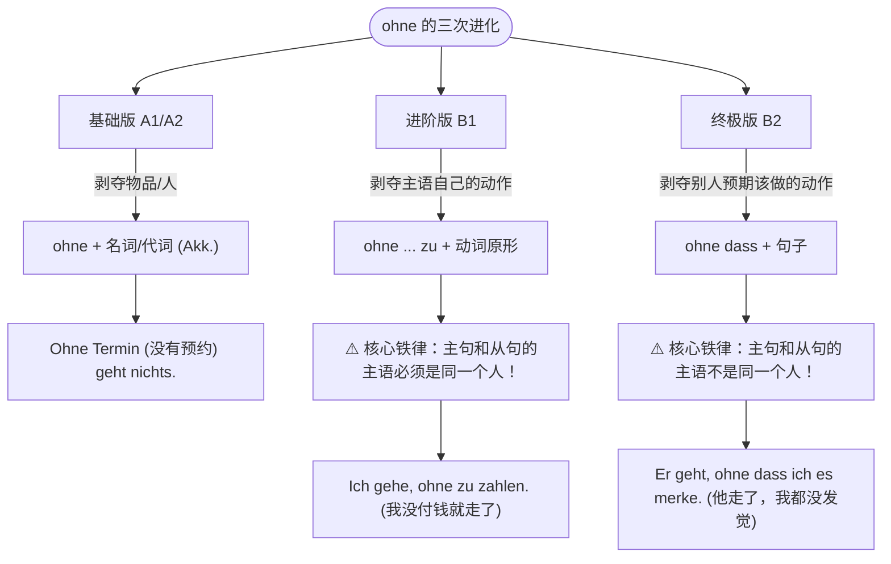
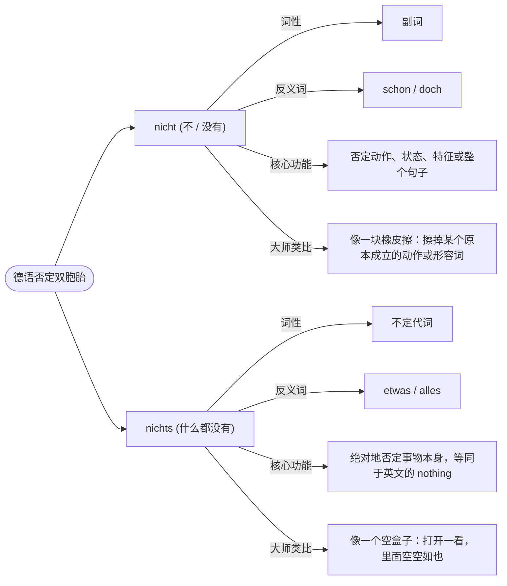

# 全面讲解否定，nein,kein,nicht等

六个月冲刺B2，不仅需要毅力，更需要极其高效的方法。你即将面临的是在德国真实的生存场景——租房、看病、找工作、和外管局（Ausländerbehörde）斗智斗勇。在这些场景中，你不仅要会表达“是”，更要学会准确、有力地表达“不”。

很多初学者会被德语里的 `nein`, `kein`, `nicht` 搞晕，其实它们的分工极其明确。今天，我们不背死板的语法书，我们用**“职场角色类比法”**来彻底啃下这块硬骨头。

在我们深入之前，先来看一下这张“否定词决策流程图”。遇到需要否定的时候，在脑海里走一遍这个流程：

1. nein否定句子
2. nicht否定名词
3. kein 否定动/adj/adv

代码段

---

### 一、 Nein —— 霸气侧漏的“门卫保镖”

`Nein` 是最好理解的。你可以把它想象成夜店门口的霸气保镖，它的作用是**把整个问题拒之门外**。它永远独立存在，用逗号和后面的句子隔开，或者干脆单独成句。

- **核心法则**：只用来回答以动词开头的“一般疑问句”（Yes/No Questions）。
- **【行政事务场景】**
    - **签证官**：Haben Sie Ihren Pass dabei? (您带护照了吗？)
    - **你**：**Nein**, ich habe ihn vergessen. (**不**，我忘带了。)
    - _解析_：这里的 Nein 直接否定了对方的整个提问。

---

### 二、 Kein (keine/keinen...) —— 无情的“库存管理员”

`Kein` 并不是一个纯粹的副词，它的真实身份是**冠词**（和 ein/eine 是一家人）。你可以把它想成一个无情的库存管理员，它的潜台词是**“数量为零”**。

- **核心法则**：专门用来否定**带有不定冠词 (ein/eine)** 或者 **无冠词 (表示泛指的复数或不可数名词)** 的名词。
- **变形法则**：Kein 的词尾变化和 Ein 一模一样！（主格 kein, 第四格 keinen 等）。

**【租房与找工作场景】**

1. **否定不定冠词 (ein/eine) -> 变成 kein/keine**
    
    - **房东**：Haben Sie **einen** Arbeitsvertrag? (您有一份工作合同吗？)
    - **你**：Ich habe leider noch **keinen** Arbeitsvertrag. (很遗憾我目前**没有（零份）**工作合同。)
    - _解析_：因为 Arbeitsvertrag 是阳性第四格（einen），所以否定时直接变成 keinen。
        
2. **否定无冠词 (不可数名词或泛指复数)**
    
    - **医生**：Trinken Sie Alkohol? (您喝酒吗？- 泛指，无冠词)
    - **你**：Ich trinke **keinen** Alkohol. (我**不**喝酒 / 我的酒精摄入量为零。)
    - _解析_：Alkohol 是阳性第四格，虽然原句没有 ein，但表示数量为零，必须用 kein。
    - **雇主**：Haben Sie Fragen? (您有问题吗？- 复数泛指)
    - **你**：Ich habe **keine** Fragen. (我**没有**问题。)

---

### 三、 Nicht —— 指哪打哪的“精准狙击手”

如果不是用来回答问题，也不是为了把名词数量清零，那么剩下的所有否定任务，全都交给 `Nicht`！它就像一个狙击手，专门瞄准动词、形容词、副词，甚至是特定的名词。

- **核心法则**：否定一切不需要用到 Kein 的地方。特别是**带有定冠词 (der/die/das) 或 物主代词 (mein/dein) 的名词，必须用 Nicht 否定！**
- **最难点：Nicht 的位置！**（请牢记以下“狙击位”）

**狙击位 1：==全句否定==（瞄准整个动作）—— Nicht 放在句末**

- **【医疗场景】**
    - Ich rauche **nicht**. (我不抽烟。)
    - Der Arzt kommt heute **nicht**. (医生今天不来。)

**狙击位 2：精准==否定某个特定成分== —— Nicht 放在该成分的正前方**

- **【找工作场景】**
    - Ich arbeite **nicht** am Wochenende. (我**不在**周末工作。- 瞄准时间短语)
    - Das Gehalt ist **nicht** hoch. (工资**不**高。- 瞄准形容词)
    - Ich spreche **nicht** schnell. (我说话**不**快。- 瞄准副词)

**狙击位 3：德语独有的“框形结构” —— Nicht 放在第二动词的前面**

这句话怎么理解, 什么是独有的结构? 就是情态动词和可分动词的句型结构都是固定的, 那么 nicht 也只能放在固定的地方.

- **【生活场景】**
    - _完成时_：Ich habe das Formular **nicht** unterschrieben. (我**没有**在表格上签字。-> Nicht 放在过去分词前)
    - _情态动词_：Sie dürfen hier **nicht** parken. (您**不能**在这里停车。-> Nicht 放在动词原形前)
    - _可分动词_：Ich rufe dich morgen **nicht** an. (我明天**不**给你打电话。-> Nicht 放在可分前缀 an 的前面)

**⚠️ 易错大坑预警：定冠词/物主代词名词的否定**

- **错误**：Das ist _kein_ mein Pass. (❌ 库存管理员 Kein 不能管已经明确归属的东西)
- **正确**：Das ist **nicht** mein Pass. (✅ 这是精准狙击，否定“我的”护照)
- **正确**：Ich kaufe **nicht** das Haus, sondern die Wohnung. (我不买那栋房子，而是买这套公寓。)

---

### nie, nicht 添加 noch：

|**表达方式**|**德语例句**|**中文含义**|**强调重点**|**移民生活应用**|
|---|---|---|---|---|
|**nicht**|Ich rauche **nicht**.|我不抽烟。|此时此刻的状态|医生问你现在抽不抽。|
|**nie**|Ich rauche **nie**.|我从不抽烟。|频率为零，绝对否定|表达个人坚定的生活习惯。|
|**noch nicht**|Ich rauche **noch nicht**.|我还没抽烟。|**时间未到**，将来可能|某种还没开始的计划或动作。|
|**noch nie**|Ich habe **noch nie** geraucht.|我从来没抽过烟。|**过往经验**，直到现在|强调人生中从未有过该体验。|

## 其他否定, 进阶

为了达到B2水平，你不能永远只会用 nicht 和 kein，你需要掌握更高级的“否定替代词”。

1. **Niemand (没有人)** vs. _Jemand (某人)_
    - **场景**：**Niemand** in der Ausländerbehörde spricht Englisch. (外管局里**没有人**说英语。)
2. **Nichts (什么都没有/无)** vs. _Etwas (某物)_
    - **场景**：Der Arzt hat gesagt, mir fehlt **nichts**. (医生说我**什么事都没有**。- 身体健康)
3. **Nie / Niemals (从不/绝不)** vs. _Immer (总是)_
    - **场景**：Ich war **noch nie** in Deutschland. (我**以前从来没有**去过德国。)
4. **Weder ... noch ... (既不... 也不...)** - _B2核心连词_
    - **场景**：Für diese Wohnung habe ich **weder** das Geld **noch** die Zeit. (对于这套公寓，我**既没有**钱**也没有**时间去打理。)

现在，让我们把这些词代入到你未来在德国找房、求职、看病和延签的真实场景中，逐一攻克！

---

### 1. 时间上的黑洞：`nie` / `niemals` (从不，绝不)

**大师类比：**

想象一个吞噬一切时间的黑洞。`nie`（或者语气更强烈的 `niemals`）是 `immer`（总是）和 `oft`（经常）的==绝对反义词==。当你用这个词时，意味着在时间轴上，这件事的发生概率是 **0%**。

**核心语法点：**

它们是时间副词，通常放在句子中场（Mittelfeld），紧跟在变位动词之后，或者放在你想强调的成分之前。

**移民生活场景：**

* **【求职面试】** 面试官问你是否有迟到的习惯。
    * *Ich komme **nie** zu spät zur Arbeit.* (我上班**从不**迟到。)
* **【看医生】** 医生问你是否有抽烟史。
    * *Ich habe **niemals** geraucht.* (我**绝没有**抽过烟。—— 注意这里搭配了完成时，表示过去到现在从未发生。)

---

### 2. 人与物的真空：`niemand` (没有人) & `nichts` (什么都没有)

**大师类比：**

这里是一座“鬼城”。`niemand` 针对的是“人”的消失（jemand 的反义词），而 `nichts` 针对的是“事物”的消失（etwas 的反义词）。

**核心语法点：**

* **`nichts`** 是一块不可变形的石头，永远不发生词尾变化。
* **`niemand`** 则是一个需要穿戴整齐的绅士，它**必须根据格（Kasus）来变化**（与定冠词 der 的词尾类似）：
    * 第一格 (Nom.): niemand
    * 第四格 (Akk.): niemand**en**
    * 第三格 (Dat.): niemand**em**

**移民生活场景：**

* **【租房】** 你去参观一个空荡荡的房子（nichts）。
    * *In der neuen Wohnung gibt es noch **nichts**.* (新公寓里还**什么都没有**。)
* **【外管局延签】** 你在大厅里迷路了，找不到人帮忙（niemand 的第四格）。
    * *Ich kenne hier **niemanden**. Kann mir **niemand** helfen?* (我在这里**谁也不**认识。**没人**能帮我吗？)
    * *注意：第一个 niemanden 是 kennen 的宾语（第四格）；第二个 niemand 是 helfen 的主语（第一格）。*

---

### 3. 状态的改变：“油箱见底”的 `nicht mehr` & `kein... mehr` (不再)

**大师类比：**

这组词非常关键！它们表示**状态的转变**——以前油箱是满的（以前是有的/发生过的），但现在“Game Over”了，油箱见底了。它们是 `noch`（仍然、还）的死对头。

**核心语法点：**

* **`nicht mehr`**：用来否定动词或形容词（即以前做某事，现在不做了）。
* **`kein [名词] mehr`**：用来否定带不定冠词或无冠词的名词（即以前有某物，现在没有了）。注意，`kein` 必须跟着名词的性、数、格发生词尾变化，比如你提到的 `keinen... mehr` 就是阳性单数第四格，或者复数第三格的形态。

**移民生活场景：**

* **【搬家注销户口 Abmeldung】** 告诉办事员你不住这儿了。
    * *Ich wohne **nicht mehr** in München.* (我**不再**住慕尼黑了。—— 否定动词 wohnen)
* **【超市购物/找工作】** 某个职位或商品没有了。
    * *Tut mir leid, wir haben **keinen** freien Termin **mehr**.* (很抱歉，我们**不再有**空余的预约了。—— Termin 是阳性 der，这里做 haben 的第四格，所以是 k**einen**... mehr)
    * *Ich brauche **keine** Hilfe **mehr**.* (我**不再**需要帮助了。—— Hilfe 是阴性 die)

---

### 4. 条件的剥夺（“裸奔”介词）：`ohne` (没有... 地)

**大师类比：**

`ohne` 是一个非常霸道的“安检员”。它是一个**介词**，意味着它后面必须跟一个名词或代词。而这个安检员的规矩是：凡是通过它的人，必须脱掉原来的衣服，换上**第四格（Akkusativ）**的制服！

**核心语法点：**

`ohne` 支配第四格（Akkusativ）。在实际使用中，如果后面跟着的是泛指的、抽象的名词，通常**省略冠词**（即零冠词）。

**移民生活场景：**

* **【行政审批】** 办理任何德国官方事务。
    * ***Ohne** einen gültigen Reisepass* (Akk.) *können Sie kein Konto eröffnen.* (**没有**有效护照，您无法开户。)
* **【日常沟通】** * *Ich trinke meinen Kaffee immer **ohne** Zucker* (零冠词).* (我喝咖啡总是**不加**糖。)

---

### 5. 补充拓展：空间盲区 `nirgendwo` / `nirgends` (哪儿都不)

作为冲刺 B 2 的学员，你的词汇库里还应该装上这个词。它是 `überall`（到处）的反义词。

* **【找文件】** * *Ich kann meinen Mietvertrag **nirgendwo** finden!* (我**哪儿都**找不到我的租房合同！)

---

### 德语大师的半年通关学习建议 (针对 B 1-B 2 语法)

既然你的目标是六个月拿下 B 2，我们需要把语法学习“模块化”和“实战化”：

1.  **第 1-2 个月（巩固与进阶）：** 彻底吃透各类从句（Weil/Dass/Ob/Relativsätze）以及所有否定词、介词的格。**不要死记硬背，要把它们写进你的自我介绍和求职信里。**
2.  **第 3-4 个月（攻克大山）：** 集中搞定**被动语态（Passiv）**和**带情态动词的被动语态**（这在看懂德国租房合同、工作合同中极其重要）。
3.  **第 5-6 个月（高级表达）：** 重点突破**第二虚拟式（Konjunktiv II）**（用于礼貌请求、提建议、假设——比如“我要是有钱就能买房了”），以及动名词转换（Nomen-Verb-Verbindungen）。

---

### 你的实战演练 (Hausaufgabe)

理论必须通过实践来巩固！请尝试运用今天学到的高级否定词（nie, niemand, nichts, nicht mehr, kein... mehr, ohne），将以下三个常见的德国移民生活场景翻译成德语：

1.  *(找房场景 - 使用 kein... mehr)*：**很遗憾，我们不再有带阳台的公寓了。** (带阳台的公寓：Wohnung mit Balkon)
2.  *(医疗场景 - 使用 niemand)*：**候诊室（das Wartezimmer）里没有人能懂英语。**
3.  *(工作场景 - 使用 ohne)*：**没有您的签名（die Unterschrift），我们什么都做不了（使用 nichts）。**

请写下你的答案，我会像导师一样为你批改，并纠正其中的细节。你想先尝试翻译哪一句？

# 解答

## nichts 和 nicht 区别

我非常理解你的困惑，它们长得就像双胞胎，仅仅差了一个字母“s”，但在德语的语法宇宙里，它们的职能简直是天壤之别。很多在德国生活了好几年、甚至在准备 B 2 考试的同学，在语速一快的时候还是会把它们用串。

---

### 1. `nicht`：动作与状态的“橡皮擦” (不)

**大师类比：**

想象 `nicht` 是一块橡皮擦或者一个红色的“X”印章。它本身不能单独存在，它必须依附在某个**动作（动词）**、**特征（形容词）**或者**其他副词**上，把它们“抹掉”或“打叉”。

**核心语法点：**

作为副词，`nicht` 永远不会发生词尾变化。它的位置非常灵活，通常放在它想要否定的那个词的前面；如果是否定整个句子，通常放在句末（或者第二动词/小品词的前面）。

**移民生活场景实战：**

* **【租房场景 - 否定形容词】**
    * *Die Miete ist **nicht** teuer.* (这个房租**不**贵。—— 用橡皮擦擦掉了“贵”这个特征。)
* **【医疗场景 - 否定动作】**
    * *Ich kann heute **nicht** arbeiten.* (我今天**不能**工作。—— 打叉了“工作”这个动作。)
* **【外管局交涉 - 否定整个句子】**
    * *Ich verstehe diesen Satz **nicht**.* (我**不**理解这句话。—— 你理解的动作没发生，但句子里有具体的宾语“这句话”。)

---

### 2. `nichts`：事物的“绝对真空” (什么都没有)

**大师类比：**

想象 `nichts` 是一个黑洞，或者一个倒着拿的空钱包。它是一个**代词（Pronomen）**，这意味着它可以像名词一样，自己在句子里当主语或者宾语。它是 `etwas`（某物/一些东西）或 `alles`（所有东西）的绝对死对头。

**核心语法点：**

`nichts` 是一个不可变形的代词（不需要变格）。当你想要表达“nothing”、“什么都没有”、“没有任何东西”时，直接甩出这个词。**德语里绝对没有“nicht etwas”这种说法，必须用“nichts”替代！**

**移民生活场景实战：**

* **【职场沟通 - 作为宾语】**
    * *Ich habe im Meeting **nichts** verstanden.* (我在会议上**什么都没**听懂。—— 这里你没有提到具体的句子或单词，而是强调接收到的信息是“零”。)
* **【超市购物/冰箱扫雷 - 作为主语或表语】**
    * *Es gibt **nichts** im Kühlschrank.* (冰箱里**什么都没有**。)
* **【看医生 - 描述症状】**
    * *Ich habe heute **nichts** gegessen.* (我今天**什么都没**吃。—— 你的胃里是一个空盒子。)

---

### 3. 终极对比：一张表看懂它们的区别

为了让你在日常交流中不再卡壳，请把这张表刻在脑子里：

| 维度 | `nicht` (橡皮擦) | `nichts` (空盒子) |
| :--- | :--- | :--- |
| **词性** | 副词 (Adverb) | 代词 (Pronomen) |
| **对应英文** | not | nothing |
| **否定对象** | 动词、形容词、副词、全句 | 泛指的事物 (代替名词的位置) |
| **反义词** | 肯定句本身 | etwas (某物) / alles (一切) |
| **黄金对比句** | Ich sehe den Arzt **nicht**. (我**没**看到那位医生。—— 医生可能在，但我没看见他) | Ich sehe **nichts**. (我**什么都**看不见。—— 我的眼前一片漆黑) |

---

### 4. 德语大师的纠错小雷区 ⚡

很多冲刺 B 2 的同学在写邮件时，会犯这样一个错误：

❌ *Ich weiß nicht.* (德语里很少这么单独说，除非上下文极其明确。)

✅ 纯正地道的表达应该是：**Ich weiß nichts.** (我什么都不知道。) 或者 **Das weiß ich nicht.** (这件事我不知道。—— 这里的 nicht 否定的是知道 "Das" 这个动作)。

---

### 你的实战演练 (Hausaufgabe)

趁热打铁，让我们把刚刚学到的规则用在实际生活中。请你运用 `nicht` 和 `nichts`，帮我把下面这两个在德国极其常见的句子翻译成德语：

1.  *(找工作场景)*：**我还没有找到工作。**(提示：找动作本身没发生，还是找到了一个“空盒子”？注意，工作是具体的名词 die Arbeit/den Job)
2.  *(行政场景)*：**这没关系 / 这不碍事。**(提示：德国人的一句经典口头禅，字面意思是“这没有导致任何事物”，动词用 ausmachen)

你想先尝试翻译哪一句？写下你的答案，我会为你做详细的拆解和发音节奏上的指导！
