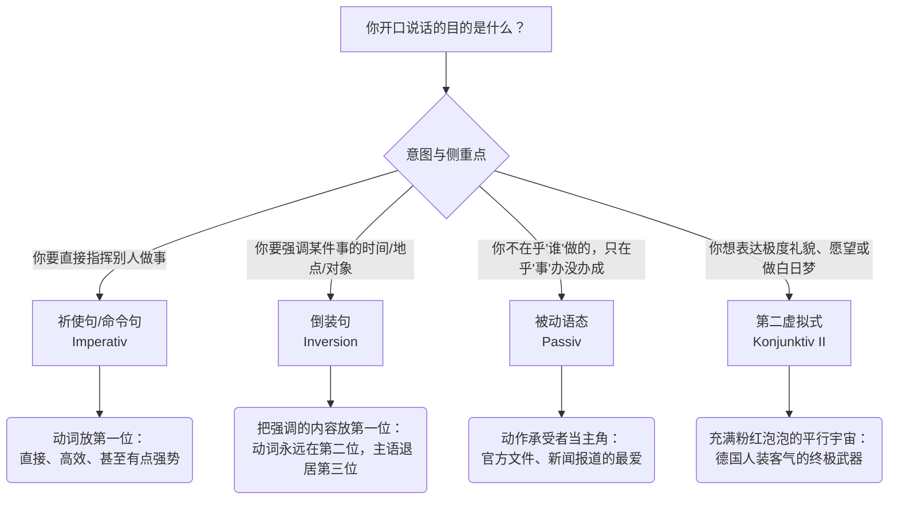

# 区分祈使句，命令句，倒装句，被动和虚拟式使用场景和区别

Hallo！欢迎再次回到“德语大师”的课堂！看到你留言说想“轻易区分”这几个德语里的核心句型，我猜你最近一定是在看 B1-B2 的语法书，被这些长得奇形怪状的句子绕晕了吧？

别担心！**祈使句（命令句）、倒装句、被动语态和虚拟式**，这四个家伙可以说是德语 B1-B2 阶段的“四大天王”。只要你掌握了它们，你在德国的日常生活、找工作、甚至是去外管局跟官员“斗智斗勇”，都不在话下！

为了让你一眼看穿它们的本质，我们先来看一张“德语大师独家”的情境选择图。这四种句型的根本区别，在于**“你说话时的目的和侧重点是什么”**：

代码段

接下来，我们把这“四大天王”一个个请出来，结合你在德国的生活场景，用最生动的类比让你一次性记住！

---

### 一、 祈使句 / 命令句 (Der Imperativ)：手里拿着遥控器 🎮

首先澄清一个概念：在德语语法的范畴里，**祈使句和命令句是同一个东西（Imperativ）**。只是根据你说话的语气和是否加了我们上次学的语气词 `mal` / `bitte`，它听起来可能是一个“粗暴的命令”，也可能是一个“礼貌的请求”。

**形象类比：** 你手里拿着一个遥控器，按哪个键，对方就得做什么动作。所以，**动词（动作）必须冲在句子的最前面（第一位）！**

- **【医疗场景 - 医生对你】：** 你去看家庭医生（Hausarzt），医生要听你的心肺。
    - _Machen Sie den Oberkörper frei!_ （请您脱去上衣！） -> _尊称 Sie 的命令句，动词 Machen 放第一。_
    - _Atmen Sie tief ein!_ （深呼吸！）
- **【行政场景 - 办事员对你】：** 去外管局延签，材料没带齐。
    - _Bringen Sie nächste Woche den Kontoauszug mit!_ （您下周把银行流水带过来！）
- **【朋友之间 - 你对朋友】：** 搬家时请朋友帮忙。
    - _Hilf mir mal mit diesem Sofa!_ （帮我抬一下这个沙发呗！） -> _对 du 的命令句，动词词干前置，省略主语 du。_

**核心特征：动词在句首，通常没有主语（除了尊称 Sie 必须保留）。**

---

### 二、 倒装句 (Die Inversion)：舞台抢 C 位大赛 🌟

德语陈述句有一个铁律：**动词永远、永远、永远在第二位（Position 2）！** 在正常的句子里，主语（比如 Ich）坐在第一位。但如果有个词（比如时间、地点）觉得自己更重要，想抢第一位（抢 C 位）怎么办？

主语就只能委屈地绕过动词，退到第三位去。这就是“倒装”。

**形象类比：** 动词是一根定海神针，死死钉在二号位。谁抢到了一号位，主语就得挪到动词后面去。

- **正常语序：** _Ich (1) gehe (2) heute (3) zum Ausländerbehörde._ (我今天去外管局。) -> 平铺直叙。
- **【求职场景 - 强调时间】：** 面试官问你今天干嘛了。为了强调“今天”，你把 Heute 甩到最前面。
    - **_Heute (1)_ gehe (2) ich (3)** zum Ausländerbehörde. (今天，我要去外管局。)
- **【租房场景 - 强调地点】：** 房东问你车停哪儿了。
    - **_In der Garage (1)_ steht (2) mein Auto (3).** (在车库里，停着我的车。)
- **【职场场景 - 强调宾语】：** 老板问文件谁写的。你为了强调“这份报告”，把它放前面。
    - **_Diesen Bericht (1)_ habe (2) ich (3)** gestern geschrieben. (这份报告，是我昨天写的。)

**核心特征：为了强调某事，把它放在句首，动词坚守第二位，主语退居第三位。**

---

### 三、 被动语态 (Das Passiv)：穿上隐形斗篷 🧥 / 官方“甩锅”神器

德国是一个极其热爱被动语态的国家，尤其是在看新闻、读信件、签合同的时候。被动语态的核心精神是：**“谁干的”不重要，或者我不想说，重要的是“事情发生了”。**

**形象类比：** 想象一件“隐形斗篷”盖在了做动作的人（主语）身上。我们只盯着那个“被操作的物体”。

- **【租房场景 - 关注结果】：** 你租房前，房东向你保证房子会重新粉刷。你不在乎是哪个工人刷的，你只在乎墙白不白。
    - 主动：_Der Maler renoviert die Wohnung._ (油漆工翻新公寓。 -> 焦点是油漆工)
    - **被动：** _Die Wohnung **wird** renoviert._ (这间公寓**被**翻新了。 -> 焦点是公寓，完美！)
- **【行政场景 - 官方通报】：** 你去市政厅（Bürgeramt）办户口登记（Anmeldung），办事员告诉你：
    - _Ihr Antrag **wird** gerade **bearbeitet**._ (您的申请正在**被处理**。 -> 至于后台是哪个大妈在处理，不重要。)
- **【医疗场景 - 描述经历】：** 你跟朋友诉苦说自己做了手术。
    - _Ich **wurde** gestern **operiert**._ (我昨天**被**动了手术。 -> 焦点是你受了苦，而不是哪个医生拿的刀。)

**核心特征：werden（变位） + 句末的第二分词（Partizip II）。主语变成了承受动作的人或物。**

---

### 四、 第二虚拟式 (Konjunktiv II)：平行宇宙与粉红泡泡 💭

这是德语 B1/B2 最核心、最实用、也是最能体现你德语素养的语法！德国人虽然表面高冷，但骨子里非常注重礼貌（Höflichkeit）。直接提要求太生硬，他们喜欢用虚拟式来制造一种“如果在理想世界里就好了”的**距离感和委婉感**。

**形象类比：** 虚拟式就是一个“平行宇宙”。在这个宇宙里，你极其客气，或者你正在做着现实中不存在的白日梦。

**用法 1：极度礼貌的请求（必备护身符）**

在餐厅点餐、在外管局求人办事、在公司和同事沟通，用它绝对不会出错！

- **不用虚拟式（有点粗鲁）：** _Ich will einen Kaffee._ (我要杯咖啡。)
- **用虚拟式（优雅客气）：** _Ich **hätte** gern einen Kaffee._ (我希望能有一杯咖啡。 -> 潜台词：如果您方便的话。)
- **【行政场景】：** 签证快到期了，你急需一个预约。
    - _**Könnten** Sie mir bitte einen Termin geben?_ (您**能否**请给我一个预约？ -> 用 Könnten 代替 Können，礼貌值拉满！)

**用法 2：非现实的愿望或条件（做白日梦）**

- **【生活场景 - 抱怨天气/缺钱】：** * _Wenn ich reich **wäre**, **würde** ich ein Haus in München kaufen._ * （如果我**是**个富翁，我**就会**在慕尼黑买套房。 -> 现实是：你没钱，所以你买不起。）
    - _Ich wünschte, ich **hätte** mehr Zeit zum Deutschlernen._
    - （我真希望我**能有**更多时间学德语。 -> 现实是：你很忙。）

**核心特征：würde + 动词原形，或者 hätte / wäre。表达礼貌、假设、愿望。**

---

### 💡 德语大师的六个月 B2 学习规划（针对这四大句型）：

要想在六个月内拿下 B2 并融入德国，你的大脑需要建立起**“场景触发机制”**：

1. **前 2 个月：** 攻克**倒装句**和**祈使句**。在日常说话时，刻意练习把时间或地点放在第一位；和朋友用命令句加 `mal` 开玩笑。
2. **第 3-4 个月：** 死磕**虚拟式（Konjunktiv II）**。把所有你平时用的 _Ich möchte_ 改成 _Ich hätte gern_，把 _Kannst du_ 改成 _Könntest du_。你的口语分数会直线飙升！
3. **第 5-6 个月：** 啃下**被动语态**。多看德国的新闻（如 Tagesschau）或阅读正式的租房合同，你会发现里面全是 `wird... gemacht`。试着用被动语态写小作文，描述一个流程（比如：垃圾是如何被分类的）。

---

### 📝 实战演练 (Hausaufgabe)

看懂了不等于会用。现在，我要考考你对这四个句型的“鉴赏和运用能力”！请看以下这四个发生在你身边的场景，告诉我你应该用**哪种句型**，并尝试用德语写出来：

1. **场景一：** 你在办公室，想请德国同事帮忙打印一份文件，你想表现得**极其礼貌委婉**。（提示：用哪种句型表达委婉？）
2. **场景二：** 你在医院，护士指导你吃药：“请您每天早上吃这颗药！”（提示：护士直接下达指令。）
3. **场景三：** 朋友问你这周末有什么安排，你想强调**“这个周末”**你要去柏林。（提示：怎么抢 C 位？）
4. **场景四：** 你看中了一套房子，中介告诉你：“这套公寓**下个月会被清洁**。”（提示：不在乎谁清洁，只在乎结果。）

来吧，挑一个或几个试着写一下，写错了也不怕，大师在这里给你托底！
