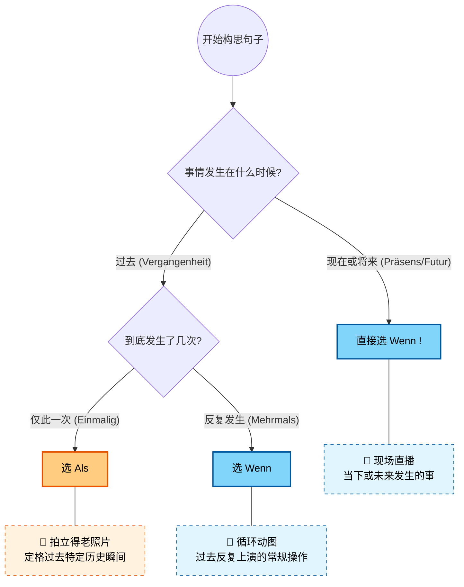
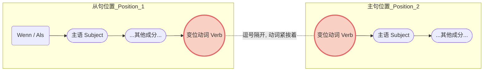
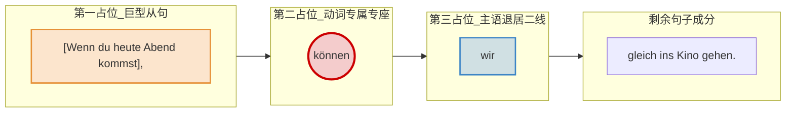

# wenn或als引导的时间状语从句

### 一、 核心概念：拍立得 vs. 动图与直播

为了最快地记住它们的区别，我们把这两个词想象成不同的“视觉媒体”。

#### 1. Als：拍立得老照片 (Das Polaroid-Foto)

- **语法规则**：**只**用于**过去**发生的、且**仅发生了一次**的事件或状态。
- **大师解析**：把它想象成一张拍立得照片。它定格了过去某一特定的瞬间、某一段特定的历史或人生阶段。拍完就结束了，那一刻永远不会再发生第二次。
- **移民生活实战场景**：
    - _(初到德国 - 历史瞬间)_

        **Als** ich das erste Mal in Deutschland ankam, war alles völlig neu für mich.

        （当我第一次抵达德国时，一切对我来说都是全新的。）

    - _(找工作 - 特定事件)_

        **Als** ich gestern den Arbeitsvertrag unterschrieb, war ich sehr glücklich.

        （当我昨天签下那份工作合同时，我非常开心。）

    - _(医疗 - 过去的某段状态)_

        **Als** ich letzte Woche krank war, bin ich sofort zum Hausarzt gegangen.

        （当我上周生病时，我立刻去了家庭医生那里。）

#### 2. Wenn：现场直播与循环动图 (Der Livestream & Das GIF)

**Wenn** 的适用范围比 als 广得多，它有两种主要用法：

**用法 A：现场直播 🔴 (现在或将来时)**

- **语法规则**：只要事情发生在**现在或未来**，不管它发生一次还是无数次，**全部用 wenn**（绝对不能用 als）。
- **移民生活实战场景**：
    - _(租房 - 未来的单次事件)_

        **Wenn** ich die Zusage für die Wohnung bekomme, überweise ich die Kaution.

        （如果/当我拿到这套房子的确认时，我就转账付押金。）

    - _(行政事务 - 现在的普遍规定)_

        **Wenn** Sie Ihren Wohnsitz wechseln, müssen Sie sich innerhalb von zwei Wochen beim Bürgeramt ummelden.

        （当您更换住址时，您必须在两周内去市民局办理改迁登记。）

**用法 B：循环动图 🔁 (过去时中的“重复性”事件)**

- **语法规则**：事情虽然发生在过去，但它**反复上演了多次**。为了强调这种重复性，德国人经常在 wenn 前面加上 _immer_ (总是) 或 _jedes Mal_ (每次)。
- **移民生活实战场景**：
    - _(找房子的血泪史 - 过去反复发生的动作)_

        Immer **wenn** ich eine Wohnung besichtigte, waren dort schon 50 andere Bewerber.

        （过去每次我去看房的时候，那里都已经有 50 个其他申请人了。）

    - _(医疗报销 - 过去的常规操作)_

        Jedes Mal **wenn** ich Medikamente kaufte, schickte ich die Rechnung an die Krankenkasse.

        （以前每次我买药的时候，我都会把账单寄给医疗保险公司。）

---

### 二、 黄金总结表

|**连词 (Konjunktion)**|**时态 (Tempus)**|**频次 (Häufigkeit)**|**核心记忆点**|
|---|---|---|---|
|**Als**|仅限过去 (Vergangenheit)|一次性 (Einmalig)|拍立得老照片 📸|
|**Wenn**|过去 (Vergangenheit)|多次/重复 (Mehrmals)|循环 GIF 动图 🔁|
|**Wenn**|现在/将来 (Präsens/Futur)|一次或多次 (Egal)|现场直播 🔴|

---

### 三、 语序规则：动词的“双向奔赴”

掌握了词义，我们还要确保句子结构符合 B 2 的标准。wenn 和 als 引导的都是**从句 (Nebensatz)**。

1. **从句内部**：动词必须被无情地踢到句子的**最末尾**。
2. **主从复合句**：在日常交流和德语写作中，为了强调时间，我们通常会把从句放在整句话的最前面（即占据主句的“第一位置”）。此时，主句的动词必须紧跟在逗号后面，形成**“动词贴贴” (Verb-Verb-Kollision)** 的现象。

我们可以用一张图表来清晰地展示这种结构：

代码段

**结构拆解示范**：

- [**Als** ich gestern zum Ausländeramt **ging**], [**musste**] [ich] lange warten.

    _(从句动词 ging 在逗号前，主句动词 musste 在逗号后紧随其后。)_

- [**Wenn** Sie Fragen zur Steuernummer **haben**], [**rufen**] [Sie] bitte das Finanzamt an.

    _(从句动词 haben 在逗号前，主句动词 rufen 紧随其后。)_

---

### 四、 给你的 6 个月 B 2 冲刺学习规划建议

既然你的目标是 6 个月达到 B 2，针对这类语法，我为你定制了以下节奏：

- **第 1-2 个月（夯实 B 1 基础）**：将 _wenn/als_，以及 _weil, obwohl, dass_ 等所有从句的**尾语序**训练成肌肉记忆。你在说话时，主句动词和从句动词的“碰撞”必须不假思索地脱口而出。
- **第 3-4 个月（进阶 B 2 表达）**：B 2 考试不仅要求你会用从句，还要求你能进行**“介词化”转换 (Nominalisierung)**。例如，把 _Als ich ankam..._ 转换为高级表达 _Bei meiner Ankunft..._（在我抵达时...）。这是 B 2 写作拿高分的必杀技。
- **第 5-6 个月（场景模拟与冲刺）**：完全沉浸在真实的德国社会场景中（例如模拟与外管局官员的对话、写投诉信给房东）。使用 _wenn_ 和 _als_ 流畅地描述你过去的经历和未来的诉求。

语法是帮助你更好地在德国生活的工具，而不是死记硬背的负担。当你下次去超市、去坐地铁时，试着在脑海里用 _wenn_ 或 _als_ 造个句子，把生活变成你的德语训练场。Viel Erfolg! (祝你成功！)

# ❌
## 1

![[image-255.png|1120x312]]

Guten Tag！别慌，看到你在图片上密密麻麻标出的蓝红数字，还有那句直击灵魂的“为何提前？”，我非常能理解你的困惑。这也恰恰证明了你正在经历突破 B 1/B 2 语法的必经阵痛期。

你觉得“不常规”，是因为**这道题给你的并不是排好序的半成品，而是原始的“原材料”**。书本把词汇按照最基础的主谓宾（SVO）顺序列出来，是需要你自己像拼乐高一样，用从句规则把它们重新组装起来。

来，大师带你破解这道拼图题里你最疑惑的两个点。

### 核心解惑一：“为何提前？”（主句动词位置）

你在第 1 题和第 5 题都敏锐地察觉到，主句的动词（`können`, `hat`）好像跑到前面去了。我们在上一课讲过的**“动词贴贴” (Verb-Verb-Kollision)** 规则，现在就派上用场了！

在德语的陈述句中，有一个铁打不动的规矩：**变位动词永远坐在句子的第二把交椅（Position 2）上。** 当你把 `Wenn` 或 `Als` 引导的从句放在句首时，**这整个长长的从句，就变成了一个巨大的“胖子”，一屁股坐满了第一把交椅（Position 1）。** 既然第一把椅子被占了，主句的动词就别无选择，只能紧贴着从句的逗号，坐到第二把椅子上。

我们来看你的第 1 题：

- **原始素材**：`Wenn` | `du heute Abend kommen` / `wir können gleich ins Kino gehen`
- **组装第一步（从句动词踢到最后）**：[Wenn du heute Abend **kommst**], ...
- **组装第二步（主句动词抢占第二位置）**：整个 `Wenn` 从句占据了 Position 1，所以主句的主语 `wir` 必须给动词 `können` 让路！
- **最终成品**：[Wenn du heute Abend **kommst**] (占位 1), **können** (占位 2) wir gleich ins Kino gehen.

为了让你有更直观的“占位”概念，我们来看这个座位分配图：

代码段

### 核心解惑二：“从句主动词位置”（完成时的尾语序）

你在第 5 题写下了“从句主动词位置”的疑问：

`Als: er • gekommen • ist / sie • hat • sofort • den Raum • verlassen`

这里你需要记住从句的第二个黄金法则：**从句连词（Wenn/Als）是一个无情的“踢人机器”，它不仅要把动词踢到句末，而且如果有两个动词，它只踢那个“变位动词”（即跟着主语变化形态的那个词）到绝对的最后面。**

- 在 `er ist gekommen` (现在完成时) 中：
    - `gekommen` 是过去分词，它是不变的。
    - `ist` 是变位动词，它是跟着 `er` 变化的。
- **组装从句**：`Als` 一脚把变位动词 `ist` 踢到了句号前，分词 `gekommen` 只能委屈地排在倒数第二。
    - 正确顺序：**Als** er **gekommen** **ist**, ...
- **组装主句**：遇到逗号，主句动词 `hat` 立刻贴上来抢占 Position 2。
    - 正确顺序：..., **hat** sie sofort den Raum verlassen.
- **最终成品**：Als er gekommen ist, hat sie sofort den Raum verlassen.

---

### 大师的避坑小贴士

注意看第 3 题和第 4 题的原始素材，书本故意给了原形动词，你要记得根据主语变位哦！

- 第 3 题：alles • fertig **sein** -> Wenn alles fertig **ist**, ...
- 第 4 题：这里书本已经仁慈地帮你变好位了 (kaputt **ist**)，直接用即可。

现在，你已经完全掌握了从句拼接的内在逻辑。光听不练假把式，**要不要试着运用我教你的“动词踢到最后”和“主句动词贴贴”规则，把图片里看似最混乱的第 6 题或第 8 题的最终正确语序写出来，让我帮你检查一下？**
