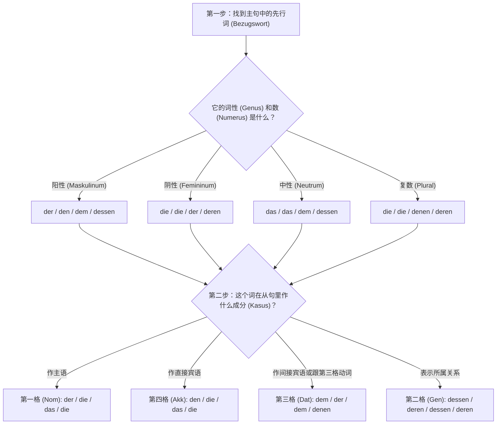

# 关系从句

### 🧠 核心概念：关系从句就是一张“智能便利贴”

想象一下，你正在和房东交流，提到一个名词（比如“那个房子”），你突然想补充说明它的细节（“那个我昨天看过的房子”）。这时候，你不需要啰嗦地重新造一个完整的句子，而是直接在这个名词后面“啪”地贴上一张补充信息的**“便利贴”**，这就是关系从句。

但这张便利贴是“智能”的，它必须遵守三个铁律：

1. **紧跟其后**：便利贴必须尽可能紧贴着它要修饰的名词（德语叫**先行词 Bezugswort**）。
2. **动词踢到最后**：在便利贴内部（从句中），变位动词必须乖乖跑到句子的最末尾。
3. **看人下菜碟的“胶水”**：便利贴需要“关系代词（Relativpronomen）”作为胶水才能粘在主句上。这个胶水长什么样，取决于极其严密的逻辑判断。

---

### ⚙️ 关系代词变形逻辑图（核心秘籍）

对于中国学生来说，最头疼的就是关系代词（der, die, das, den, dem...）到底该用哪一个。记住这个黄金法则：

**先行词决定“词性 (Genus)”和“单复数 (Numerus)”，从句内部决定“格 (Kasus)”。**

为了让你一目了然，我们来看下面这张决策流程图：

---

### 🏘️ 结合真实移民场景的实战演练

现在，我们通过你在德国一定会遇到的四大生活场景，一步步把上面的逻辑图运用起来！

#### 1. 租房场景 —— 主格 (Nominativ) 与 宾格 (Akkusativ)

- **主格 (从句中的主语)**
    - _背景_：你看到一个带朝南阳台的公寓。
    - _句子_：Der Balkon, **der** nach Süden zeigt, ist sehr groß. (那个朝南的阳台很大。)
    - _解析_：先行词 `Der Balkon` (阳性)。在从句中，是“阳台”本身朝南，作主语，所以选阳性第一格 **der**。
- **宾格 (从句中的直接宾语)**
    - _背景_：你签了一份工作合同。
    - _句子_：Der Vertrag, **den** ich gestern unterschrieben habe, ist unbefristet. (我昨天签的那份合同是无限期的。)
    - _解析_：先行词 `Der Vertrag` (阳性)。在从句中，是我签了“合同”，合同是动作的承受者（宾语），所以选阳性第四格 **den**。

#### 2. 医疗看病场景 —— 与格 (Dativ)

- _背景_：你向朋友推荐一位你非常信任的医生。
    - _句子_：Die Ärztin, **der** ich vertraue, hat heute keinen Termin frei. (那位我信任的女医生今天没有空档了。)
    - _解析_：先行词 `Die Ärztin` (阴性)。在从句中，动词 `vertrauen` (信任) 强制要求支配第三格 (Dativ)，所以阴性第三格变成 **der**。

#### 3. 行政办事场景 —— 属格 (Genitiv) 【B 2 重点大招！】

在 B 2 考试和正式书信中，属格关系从句是拉分的关键！它用来表示“某人的...”。

- _背景_：你去外管局（Ausländerbehörde），但负责你的官员今天不在，因为她的电脑坏了。
    - _句子_：Die Beamtin, **deren** Computer kaputt ist, war heute nicht da. (那位电脑坏了的女官员今天不在。)
    - _解析_：先行词 `Die Beamtin` (阴性)。在从句中表达的是“这位女官员的(电脑)”，表示所属关系，阴性第二格是 **deren**。_(注意：阳性/中性的第二格是 **dessen**)_。

#### 4. 找工作场景 —— 带介词的关系从句

当从句里的动词和介词绑定时，介词会像保镖一样，直接站在“胶水”（关系代词）的前面。

- _背景_：你对某个职位感兴趣。
    - _句子_：Das ist die Stelle, **für die** ich mich interessiere. (这就是我感兴趣的那个职位。)
    - _解析_：先行词 `die Stelle` (阴性)。固定搭配是 `sich interessieren für + Akkusativ`。所以介词 `für` 必须带着阴性第四格的 `die` 一起放在从句开头。

---

### 📋 关系代词速记表（建议截图保存）

|**词性/数**|**第一格 (Nom)**|**第四格 (Akk)**|**第三格 (Dat)**|**第二格 (Gen)**|
|---|---|---|---|---|
|**阳性 (m)**|**der**|**den**|dem|**dessen**|
|**阴性 (f)**|die|die|der|**deren**|
|**中性 (n)**|das|das|dem|**dessen**|
|**复数 (Pl)**|die|die|**denen**|**deren**|

_(大师提示：你会发现它和定冠词几乎一样！只有第三格复数变成了 **denen**，以及所有的第二格变成了 **dessen/deren**，记住这几个特例就足够了！)_

---

要掌握这门语法，光听不练是绝对不行的，现在该轮到你来出手了。

**实战小任务：**

假设你在面试，你想告诉 HR：“这就是那家我想在里面工作的公司。”

已知：

句子 A：Das ist die Firma. (这是那家公司。Firma 是阴性)

句子 B：Ich möchte **bei** der Firma arbeiten. (我想在这家公司工作。bei 是支配第三格的介词)

请结合我们刚才讲的“带介词的关系从句”规则，尝试把这两个句子合二为一交给我检查，看看你学得怎么样？

# 先行词怎么找

### 🕵️‍♂️ 第一招：紧密贴合原则（“502 胶水法则”）

这是最常见的情况。为了防止产生歧义，德国人喜欢把关系从句这块“便利贴”，**直接、立刻、马上**贴在它要修饰的那个名词后面。

- **实战场景（买菜）：**
    - 德语：Ich kaufe **die Äpfel**, _die_ sehr frisch aussehen. (我买那些看起来很新鲜的苹果。)
    - 寻找过程：逗号前面紧挨着的那个名词是谁？是 `die Äpfel`。那它大概率就是先行词！从句就是在解释“什么样的苹果”。

### 🧱 第二招：框架结构让步原则（“给动词大爷让路”）

德语有一个雷打不动的特色叫“框形结构（Satzklammer）”，比如完成时的过去分词（ge-）或者可分动词的前缀，它们必须死死钉在主句的最末尾。这时候，我们的“便利贴”只能委屈一下，贴在动词的后面。

- **实战场景（看病预约）：**
    - 德语：Ich habe gestern **den Arzt** angerufen, _der_ mir empfohlen wurde. (我昨天给那位（别人）推荐给我的医生打电话了。)
    - 寻找过程：逗号前面是动词 `angerufen`。动词是不能当先行词的！所以我们往前看，从句描述的是谁被推荐？显然是“医生”。这里的先行词是跨过动词的 `den Arzt`。

### 🧠 第三招：灵魂拷问法（“到底在说谁？”）

当你遇到长难句，前面有两三个名词的时候，不要慌，直接看从句的内容，问自己：“从句里的动作是谁发出的？或者是在描述谁的特征？”

- **实战场景（邻里关系）：**
    - 德语：Das ist **der Hund** meiner Nachbarin, _der_ die ganze Nacht bellt. (这是我女邻居的那条整夜狂吠的狗。)
    - 寻找过程：逗号前面有 `der Hund`（狗）和 `meiner Nachbarin`（女邻居）两个名词。到底谁是先行词？看从句：谁在整夜狂吠（bellt）？肯定是狗，不可能是女邻居！而且关系代词是阳性的 `der`，恰好对应阳性的 `der Hund`（女邻居是阴性）。所以先行词锁定为 `der Hund`！

---

**总结一下：**

先行词 90% 的情况下就在**逗号的前面**；如果逗号前面是个位于句尾的动词，那就**再往前找离它最近的名词**；最后用**逻辑和词性**验证一下准没错。

既然你已经掌握了寻找先行词的独门秘籍，现在让我们回到刚才留给你的实战小任务：

已知：

- 句子 A：Das ist **die Firma**. (这是那家公司。)
- 句子 B：Ich möchte **bei** der Firma arbeiten. (我想在这家公司工作。)

你能告诉我，在这个场景中先行词是谁，并且尝试用“介词+关系代词”把这两句话合二为一吗？大胆试一试，有大师在给你兜底呢！

# 所以主句如果有主语和宾语的情况下, 先行词一定是在宾语里面

大师要重重地拍一下黑板了：**绝对不是哦！这是一个非常典型且危险的错觉！**
 
之所以会有这种错觉，是因为我们刚接触关系从句时，造的句子比较简单，习惯把从句直接甩在整个大句子的最后，而主句的最后往往恰好就是宾语。

但大师要告诉你一个德语语法界的真理：**主句里任何一个名词（无论是主语、宾语，还是介词后面的词），都可以成为先行词！全看你到底想给谁贴“便利贴”。**

还记得我们说的“502 胶水法则”吗？便利贴必须紧紧贴在它要修饰的词后面。这就导致了一个极其重要、也是 B 1-B 2 考试必考的句型：**“汉堡包结构”（从句把主句从中间劈开）**。

不管前面主句的内部结构长什么样，从句紧紧贴在谁（哪个名词）后面，谁就是先行词

让我们来看三个完全不同的靶心（先行词）：

### 🎯 场景 1：先行词是主句的【主语】（汉堡包结构出现！）

- **背景**：你想表达“那个正在喝咖啡的男人，是我的老板。”
- **基础句**：**Der Mann** ist mein Chef. (那个男人是我的老板。)
- **贴便利贴**：你想修饰“那个男人(Der Mann)”，所以必须把主句劈开，把便利贴塞进去！
- **最终合成**：**Der Mann**, _der gerade Kaffee trinkt_, ist mein Chef.
- **解析**：在这里，先行词是主句的**主语**！主句的动词 `ist` 被硬生生挤到了整个从句的后面。这就是经典的“汉堡包”：主语是顶层汉堡胚，从句是肉饼，主句剩下的部分是底层汉堡胚。

### 🎯 场景 2：先行词是主句的【第四格宾语】（尾随结构）

- **背景**：你想表达“我认识那个正在喝咖啡的男人。”
- **基础句**：Ich kenne **den Mann**. (我认识那个男人。)
- **贴便利贴**：你想修饰“那个男人(den Mann)”，它正好在句尾，所以直接贴上去。
- **最终合成**：Ich kenne **den Mann**, _der gerade Kaffee trinkt_.
- **解析**：这里先行词确实是主句的宾语，从句顺理成章地放在最后。

### 🎯 场景 3：先行词是主句的【介词宾语】（尾随结构）

- **背景**：你想表达“我正在和那个喝咖啡的男人聊天。”
- **基础句**：Ich spreche mit **dem Mann**. (我正和那个男人聊天。)
- **贴便利贴**：修饰目标是介词后面的 `dem Mann`。
- **最终合成**：Ich spreche mit **dem Mann**, _der gerade Kaffee trinkt_.

---

**大师总结：**

找先行词，**千万不要靠它在主句里作什么成分来猜**，而是要问你的内心：“我这句话，到底在针对哪个名词补充细节？” 找到了那个词，无论它是主语还是宾语，带着你的从句，毫不犹豫地贴上去！

理解了这个“汉堡包结构”，你的德语句子结构就正式迈入高级阶段了！

现在，带着这个全新的视角，回到我们刚才的“找工作”实战小任务：

- 句子 A：Das ist **die Firma**. (这是那家公司。)
- 句子 B：Ich möchte **bei** der Firma arbeiten. (我想在这家公司工作。)

请告诉我：

1. 这里你想给谁贴便利贴（先行词是谁）？
2. 把这两句话用“带介词的关系从句”合成一句完整的话。

大胆发出来，导师在线等你！

---

**大师的终极总结：** 不要被“主语”、“宾语”这些标签限制住。你只需要牢记那条雷打不动的**“502 胶水法则”**——**不管前面主句的内部结构长什么样，从句紧紧贴在谁（哪个名词）后面，谁就是先行词**。只要你不把主句劈开，那先行词就只能是主句最后露出来的那个名词。

既然你的理论功底已经打通了任督二脉，大师就直接为你揭晓上一回合留给你的那道“找工作”实战题的完美答案。这道题恰好完美印证了你刚才的总结！

- **句子 A**：Das ist **die Firma**. (这是那家公司。—— 这里的 `die Firma` 是表语，处在句尾，主句不需要劈开)
    
- **句子 B**：Ich möchte **bei** der Firma arbeiten. (我想在这家公司工作。—— `bei` 是支配第三格的介词)
    

**终极合成句：**

> Das ist die Firma, **bei der** ich arbeiten möchte. (这就是那家我想在里面工作的公司。)

**大师解析**：主句 `Das ist die Firma` 完整保留，先行词是句尾的 `die Firma`。从句像便利贴一样直接贴在后面。因为从句里表达的是“在公司里 (bei der Firma)”，介词 `bei` 像保镖一样跟着关系代词提前，并且 `bei` 强制要求第三格，所以阴性的 `die` 变身成了第三格的 `der`。变位动词 `möchte` 则按照规则乖乖被踢到了句子的最后。