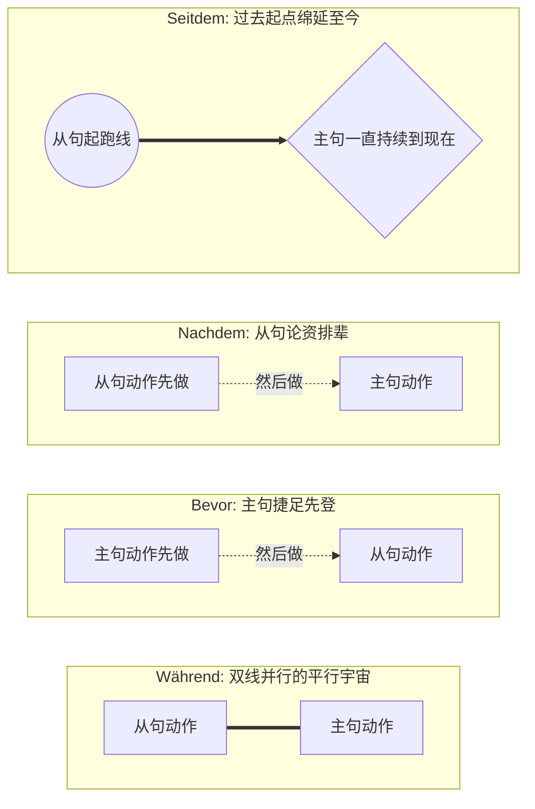

# **时间状语从句 (Temporale Nebensätze)**。

你可以把这四个连词（**während, bevor, nachdem, seit/seitdem**）想象成你生活剧本的“场记打板员”。它们决定了你的动作是“同时进行”、“谁先谁后”，还是“从过去一直延续到现在”。

在正式认识这“四大金刚”之前，我们必须先牢记一条**从句铁律（Nebensatz-Regel）**：

> **大师秘籍：** 只要看到这四个词带头的从句，请立刻把从句里的**变位动词**当成班里最调皮的学生——**直接罚站到句子的最末尾！**

为了让你一目了然，我为你准备了一张“时间逻辑关系图”：

代码段

---

### 1. Während：双线并行的“平行宇宙”

**生活场景：在延签处（Ausländerbehörde）排队漫长的等待**

- **逻辑类比：** 就像手机的“分屏功能”，两件事情在**同一时间**发生。主句和从句的动作手拉手，时态通常保持一致。
- **图片原句：** Während ich frühstücke, höre ich Radio. (我一边吃早饭，一边听收音机。)
- **大师实战造句：**
    - **德语：** **Während** ich stundenlang auf der Ausländerbehörde **warte**, **lese** ich ein deutsches Buch.
    - **解析：** 我在延签处苦等（从句）的同时，我在读一本德语书（主句）。注意从句动词 _warte_ 被踢到了逗号前面（即从句末尾），紧接着主句马上跟上动词 _lese_。这叫“动词贴动词”（逗号两边都是动词）。

### 2. Bevor：未雨绸缪的“抢跑者”

**生活场景：租房（Wohnungssuche）签合同**

- **逻辑类比：** Bevor 意思是“在...之前”。千万别搞混逻辑！它引导的动作**还没发生**，主句的动作“抢先一步”先做了。
- **图片原句：** Bevor ich frühstücke, putze ich meine Zähne. (在吃早饭之前，我先刷牙。 -> 先刷牙，后吃饭)
- **大师实战造句：**
    - **德语：** **Bevor** ich den Mietvertrag **unterschreibe**, **prüfe** ich alle Nebenkosten.
    - **解析：** 在我签租房合同（从句，后发生）**之前**，我先仔细检查所有的附加费（主句，先发生）。在德国租房处处是坑，一定要有这种 _Bevor_ 的精神！

### 3. Nachdem：等级森严的“时差制造者”（B 1-B 2 核心考点！）

**生活场景：找工作（Jobsuche）投递简历**

- **逻辑类比：** Nachdem 意思是“在...之后”。它表示从句的动作**彻底做完、结案了**，主句的动作才慢吞吞地上场。
- **大师高能预警（时态差）：** 这是图片中最关键、也是 B 级别考试必考的重点！因为从句动作先完成，所以它和主句之间必须存在**“时态差” (Zeitsprung)**。它就像一个有时差的跨国航班：
    - **情况 A（主句是现在时）：** 从句必须用**现在完成时 (Perfekt)** 或 **过去时 (Präteritum)**。
        - _图片原句：_ Nachdem ich gefrühstückt **habe** (完成时), **mache** ich Gymnastik (现在时).
    - **情况 B（主句是过去时）：** 从句必须往更早的过去推，使用**过去完成时 (Plusquamperfekt = hatte/war + 第三分词)**。
        - _图片原句：_ Nachdem ich gefrühstückt **hatte** (过去完成时), **machte** ich Gymnastik (过去时).
- **大师实战造句：**
    - **德语 (情况 A)：** **Nachdem** ich meine Zeugnisse übersetzen lassen **habe**, **bewerbe** ich mich um die Stelle.
    - **解析：** 在我找人把学历证明翻译完**之后**（现在完成时，动作已结束），我才去申请这个职位（现在时）。
    - **德语 (情况 B)：** **Nachdem** ich das Vorstellungsgespräch bestanden **hatte**, **bekam** ich den Arbeitsvertrag.
    - **解析：** （回想过去的一件事）在我通过了面试**之后**（过去完成时），我拿到了工作合同（过去时）。

### 4. Seit / Seitdem：绵延不绝的“长明灯”

**生活场景：医疗保险（Krankenversicherung）与就医**

- **逻辑类比：** 就像按下了一个秒表的开始键。从句给出了一个过去的“起跑点”，而主句的状态从那个点开始，一直持续到今天（所以主句通常用现在时）。
- **图片原句：** Seitdem ich immer meine Zähne putze, muss ich nicht mehr zum Zahnarzt. (自从我坚持刷牙，我就再也不用去看牙医了。)
- **大师实战造句：**
    - **德语：** **Seitdem** ich in Deutschland **lebe**, **bin** ich bei der TK gesetzlich krankenversichert.
    - **解析：** **自从**我生活在德国（过去的起点延续至今），我就**一直**在 TK 保法定医疗险（现在的状态）。

---

### 🌟 大师的半年 B 2 通关学习建议（语法模块）

为了在 6 个月内达到 B 2 水平，你需要将这种“场景化”学习法贯彻始终：

- **第 1-2 个月（夯实 B 1 基础）：** 死磕**从句语序**和**时态差**。像今天学的 _Nachdem_ 的过去完成时，必须做到脱口而出。每天用 _weil, dass, wenn, obwohl, nachdem_ 写 5 句你在德国当天的真实生活记录。
- **第 3-4 个月（进阶 B 2 核心）：** 集中攻克**被动语态 (Passiv)**（比如：_我的签证被批准了_）和**带 zu 的不定式 (Infinitiv mit zu)**（比如：_我打算去德国寻找工作_）。这些是你跟政府部门写信、看懂官方文件的刚需。
- **第 5-6 个月（高级表达与应试）：** 熟练掌握**第二虚拟式 (Konjunktiv II)**（用于礼貌请求、提建议，比如：_您要是能帮我把合同看了就好了_）以及**第一虚拟式 (Konjunktiv I)**（用于转述别人的话，常出现在新闻和阅读中）。

### ✍️ 随堂实战测验 (Hausaufgabe)

现在，运用刚才讲的铁律，把你自己在德国的实际情况代入到这四个句型中，大声朗读并感受动词的位置：

1. **Während** ich Deutsch lerne, _________ (一边学德语，一边做什么？)
2. **Bevor** ich nach Deutschland kam, _________ (来德国之前，你做了什么？注意时态)
3. **Nachdem** ich mein Visum bekommen hatte, _________ (拿到签证后，你做了什么？注意时态差)
4. **Seitdem** ich dieses Tutorial lese, _________ (自从读了这篇教程，你感觉如何？)
