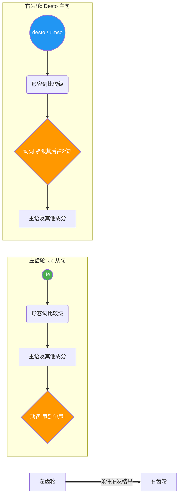

---
aliases:
  - je
  - desto
  - umso
---

# 比较从句

### 第一派：真实天平 —— 同等与不等比较 (so ... wie / Komparativ ... als)

这一派是最基础的，主要用来描述现实中真实存在的比较关系。你可以把它想象成一把**现实天平**。当我们在主句和从句之间搭建比较关系时，从句作为一个完整的句子，**动词必须乖乖跑到句尾**。

#### 1. 同等比较（天平两端一样重）：so ... wie (像……一样)

当两件事情在某种程度上相等时，我们用 `so` (或者 _genauso_, _ebenso_) 加上形容词原级，然后在从句首放上 `wie`。

- **生活场景（租房）：** 比如你在慕尼黑看房，发现新房子的租金和你预想的一样高。
    - _主句：_ Die neue Wohnung ist **genauso** teuer. (这套新公寓就是这么贵。)
    - _从句：_ Ich habe es erwartet. (我之前预计到了。)
    - _合体：_ Die neue Wohnung ist **genauso** teuer, **wie** ich es erwartet **habe**.
    - _大师解析：_ 注意到了吗？`wie` 引导的从句里，助动词 `habe` 被一脚踢到了最后。

#### 2. 不等比较（天平倾斜了）：Komparativ ... als (比……更)

当一方胜过另一方时，主句要用形容词的**比较级 (Komparativ)**，然后用 `als` 来引导从句。

- **生活场景（职场）：** 你在和朋友分享你在德国的新工作。
    - _句子：_ In Deutschland verdiene ich **mehr** Geld, **als** ich in meinem Heimatland verdient **habe**.
    - _中文：_ 在德国我赚的钱，比我在祖国时赚的还要多。
    - _大师解析：_ `mehr` 是比较级，`als` 引导从句，动词 `habe` 依然在句尾雷打不动。

---

### 第二派：齿轮效应 —— 比例比较 (je ... desto/umso ...)

这是 B 1 过渡到 B 2 的一个核心考点，也是很多中国学生容易绊倒的地方。它表示“越……就越……”。

你可以把它想象成两个咬合在一起的**齿轮**：左边齿轮（Je）转动了多少，右边齿轮（desto）就会产生相应的结果。

**⚠️ 核心口诀：Je 带从句（动词甩尾），Desto/Umso 带主句（动词紧跟/占二位）。**

- 和其他从句的区别：
	- 正常情况下：如果从句开头，主句

为了让你一眼看懂这个复杂的语序，我为你绘制了一张结构图：

代码段

- **生活场景（行政事务/延签）：** 你在准备去外管局（Ausländerbehörde）面谈。
    - _句子：_ **Je** _besser_ ich Deutsch **spreche**, **desto** _schneller_ **bekomme** ich die Niederlassungserlaubnis.
    - _中文：_ 我的德语说得**越**好，我得到永居的速就**越**快。
    - _大师解析：_ 仔细看语序！`Je besser` 后面跟着主语 `ich`，动词 `spreche` 在**句尾**；而逗号一过，`desto schneller` 仿佛一个巨大的磁铁，直接把动词 `bekomme` 吸到了它**紧挨着的后面（第二位）**，然后才是主语 `ich`。
- **生活场景（医疗保健）：** * _句子：_ **Je** _früher_ Sie einen Termin beim Facharzt **vereinbaren**, **umso** _kürzer_ **ist** die Wartezeit.
    - _中文：_ 您**越**早预约专科医生，等待的时间就**越**短。（`umso` 和 `desto` 完全同义，可以互换）。

---

### 第三派：奥斯卡戏精 —— 非真实比较 (als ob / als wenn / als ...)

这是 B 2 级别最具表现力的语法点！它用来表达“好像……”、“仿佛……”，但实际上**并不是这样**。既然是“非真实”的，是演出来的戏，那就必须请出我们的“戏精专属语态” —— **第二虚拟式 (Konjunktiv II)**！

这类从句有三种穿衣打扮的方式，表达的意思完全一样，但语序有微小的差别：

#### 1. als ob / als wenn (就好像……一样) -> 动词在句尾

- **生活场景（职场碰壁）：** 你刚结束一场面试，面试官态度很冷淡。
    - _句子：_ Der Chef tat so, **als ob** er meinen Lebenslauf nie gelesen **hätte**.
    - _中文：_ 那个老板表现得**就好像**他从来没看过我的简历一样。（实际上他肯定看过，只是装作不知道）。
    - _大师解析：_ `als ob` 是标准的从句连词，所以动词（而且必须是第二虚拟式 `hätte`）放在最后。

#### 2. als (仿佛……) -> 动词占位在第二位 (高级且常用！)

在口语和书面语中，德国人非常喜欢直接用 `als` 来引导非真实比较。**注意：一旦只用 `als`（扔掉了 ob/wenn），它就不再遵循从句语序，而是采用主句语序（动词在第二位，紧挨着 als）！**

- **生活场景（外管局的白眼）：**
    - _句子：_ Der Beamte guckt mich an, **als käme** ich von einem anderen Planeten.
    - _中文：_ 那个办事员看着我，**仿佛我是**从另一个星球来的一样。
    - _大师解析：_ `als` 后面紧跟着虚拟式动词 `käme` (kommen 的第二虚拟式)，这是一种非常地道、简练的高级表达。

---

### 🌟 六个月 B 2 学习规划建议（语法篇）

要在 6 个月内拿下 B 2，你不能像散步一样学习，必须要像练肌肉一样有计划：

1. **第 1-2 个月（巩固 B 1 底盘）：** 把从句语序（dass, weil, obwohl）和基础的时态、被动语态搞得像条件反射一样熟练。不要带着基础语法的漏洞进入 B 2。
2. **第 3-4 个月（攻坚 B 2 大山）：** 重点拿下今天讲的**比较从句**、**第二虚拟式的非真实条件/比较**、**带 zu 的不定式结构**。每天用“找工作”、“看医生”的场景自己造 5 个复杂的长句。
3. **第 5-6 个月（书面语与口语实战）：** 学习**介词结构与从句的转换**（Nominalisierung vs. Verbalisierung，这是 B 2 考试阅读和写作的核心），并大量刷题，把学过的长难句用到你的口语表达中。

### ✍️ 随堂小测验 (Hausaufgabe)

听懂了不等于会用了。现在，轮到你来当“奥斯卡戏精”和“齿轮大师”了。请尝试把下面这两个跟移民生活息息相关的句子翻译成德语，发给我，我来帮你纠错：

1. **（比例比较）** 我发出的求职信（die Bewerbung, -en）越多，我获得面试（das Vorstellungsgespräch, -e）的几率（die Chance, -n）就越大（hoch 的比较级是 höher）。
2. **（非真实比较）** 我的房东（der Vermieter）表现得（tut so），就好像这套老房子（alte Wohnung）是一座宫殿（ein Palast）一样。_(提示：用 als ob + Konjunktiv II)_

大胆试着写一写，德语就是在不断犯错和纠错中变得流利的。Ich warte auf deine Antwort! (我等你的回复！)
