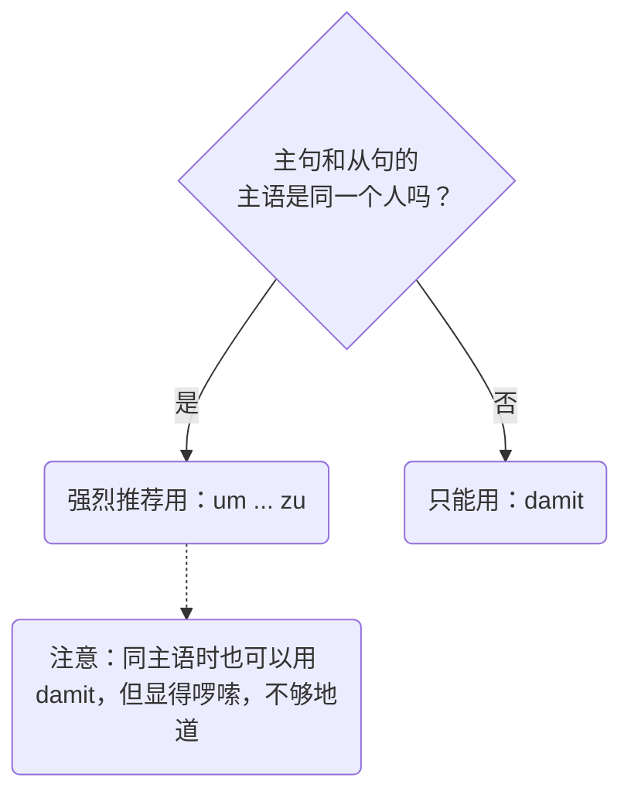

# 目的从句

今天，我们要攻克的是 B 1-B 2 阶段非常核心且实用的语法点：**目的从句 (Finalsätze)**。

在德国的日常生活中，无论你是去外管局延签、跟房东争取看房机会，还是去医院看病，你都需要向对方解释你做某事的“目的”。学会了目的从句，你的德语表达就会从生硬的单句，升级为逻辑严密的高级表达。

---

### 核心概念：什么是目的从句？

想象一下你在**射箭**。

你的主句就是“拉弓射箭”这个动作，而目的从句就是你要击中的“靶心”。目的从句存在的唯一意义，就是回答 **Wozu? (为了什么？)** 或者 **Aus welchem Grund? (出于什么目的？)**

在德语这片箭台上，你有两把绝世好弓可以选：

1. **um ... zu** 2. **damit**

它们虽然都能射中靶心，但适用的场景完全不同。我们要根据“射箭人”（主语）是谁，来选择用哪把弓。这里有一张流程图帮你一秒理清思路 ：

代码段

---

### 第一把弓：独角戏 um ... zu (为了……)

**适用条件**：主句的主语和从句的逻辑主语**完全相同**。这就像是一场独角戏，你拉弓，也是为了实现你自己的目的。

**语法结构**：

主句**, um** + 句子其他成分 + **zu + 动词原形**。

**生动记忆**：`um` 就像是站在门口的保安，`zu` 就像是贴身保镖，永远紧紧贴在动词原形的前面，把它锁在句子的最末尾。

**生活实战例句**：

- **找工作场景**：

    Ich lerne jeden Tag intensiv Deutsch, **um** bald einen guten Job **zu** finden.

    _(我每天疯狂学德语，**为了**能尽快找个好工作。)_

    > 解析：谁学德语？我。谁找工作？还是我。主语一致，完美使用 `um...zu`。

- **租房场景**：

    Ich rufe den Vermieter an, **um** einen Besichtigungstermin **zu** vereinbaren.

    _(我给房东打电话，**为了**约一个看房时间。)_

**大师防坑提示**：

遇到**可分动词**时，`zu` 必须像夹心饼干一样，塞在动词前缀和词干中间！

例如：einkaufen (购物) -> ein**zu**kaufen。

- Ich gehe in den Supermarkt, **um** für das Wochenende ein**zu**kaufen.

---

### 第二把弓：团队战 damit (以便…… / 让……)

**适用条件**：主句的主语和从句的主语**不相同**。这就像是一场接力赛，你拼尽全力拉弓，是为了让另一个人击中靶心。

**语法结构**：

主句**, damit** + 从句主语 + 句子其他成分 + **变位动词**。

_(注意：这是一个标准的副句，变位动词必须踢到最后面！)_

**生活实战例句**：

- **医疗场景**：

    Der Arzt verschreibt mir ein starkes Medikament, **damit** ich schnell wieder gesund werde.

    _(医生给我开了一服猛药，**以便**我能赶紧好起来。)_

    > 解析：开药的主语是“医生”(Der Arzt)，好起来的主语是“我”(ich)。主语不同，必须用 `damit`。

- **行政事务 (外管局) 场景**：

    Ich reiche alle Unterlagen heute ein, **damit** die Ausländerbehörde mein Visum rechtzeitig verlängert.

    _(我今天就把所有材料递交上去，**以便**外管局能及时延长我的签证。)_

**大师防坑提示**：

虽然当主句和从句主语相同时，你在语法上也可以用 `damit`（例如：Ich lerne Deutsch, damit ich einen Job finde），但这在德国人听来非常啰嗦和笨重。**记住大师的铁律：主语相同，优先用 `um...zu`！**

---

### B 2 级别进阶避坑指南：绝对不要画蛇添足！

很多中国学生在写目的从句时，特别喜欢在从句里加上情态动词 **wollen** (想要) 或者 **möchten** (想)。这是**绝对错误**的！

为什么？因为目的从句本身（um...zu / damit）就已经包含了“想要、希望”的意思了。再加 wollen，就像在说“我喝水是为了想要解渴”，在德语里是语义重复（Pleonasmus）。

- ❌ 错误：Ich lerne Deutsch, um einen Job finden _zu wollen_.
- ✅ 正确：Ich lerne Deutsch, **um** einen Job **zu** finden.

---

### 大师的课后练兵场

语法看懂了只是第一步，真刀真枪地练出来才是你的本事。现在，请你假设自己正处在真实的德国移民生活中，尝试用今天学到的 `um...zu` 或 `damit` 把下面这两个情境翻译成德文：

1. **情境一（租房）**：我正在写一封邮件（eine E-Mail schreiben），为了向房东介绍我自己（mich dem Vermieter vorstellen）。
2. **情境二（家庭/教育）**：我们搬到了德国（Wir sind nach Deutschland gezogen），为了我们的孩子（unsere Kinder）能有一个更好的未来（eine bessere Zukunft haben）。

请直接给出你的德语造句，我会为你进行最细致的批改和地道表达的升级建议！
