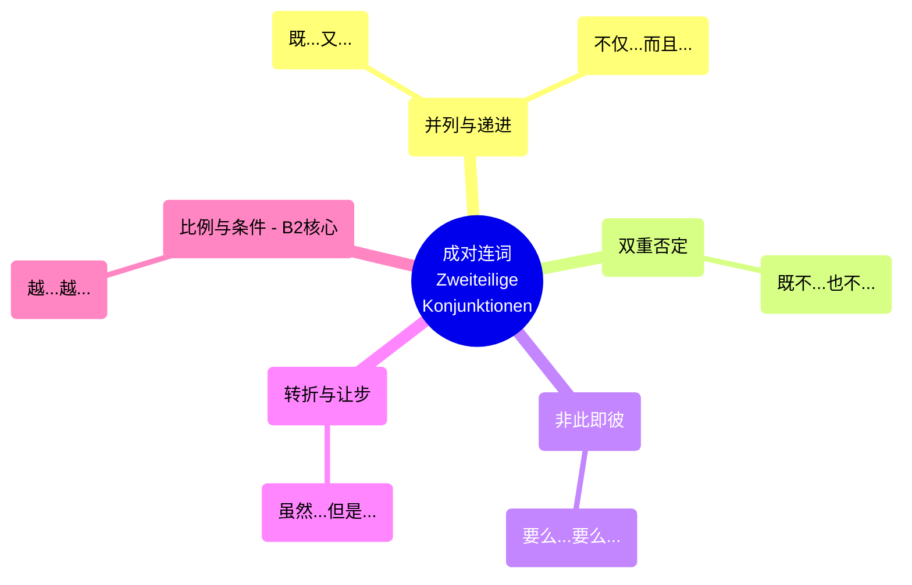
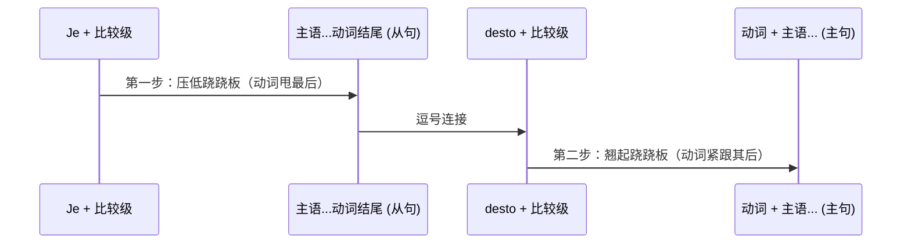

# 连词成对

---

### 第一组：“加法双煞” (并列与递进)

这一组的作用是做加法：A 要有，B 也要有！

#### 1. sowohl ... als auch ... (既...又...)

> [!note] 
> sowohl"是由德语词根"so"和"wohl"组成的。词根"so"表示"这样"或"那样"，而词缀"wohl"表示"好"或"很"。因此，"sowohl"可以理解为"既"或"同样"，表示两者都是同样重要或有价值的意思。

- **大师生动解析：** 这就像你去外管局（Ausländerbehörde），办事员大妈冷酷地告诉你，这两个材料你**都得**带，缺一不可。
- **语法铁律：** 它们中间**绝对不能加逗号**！连接主语时，谓语动词通常用复数。
- **移民生活场景（延签/行政）：**

    > Um Ihre Aufenthaltserlaubnis zu verlängern, brauchen Sie **sowohl** Ihren gültigen Reisepass **als auch** die Meldebescheinigung.
    > 
    > （为了延长您的居留许可，您**既**需要有效的护照，**也**需要户口登记证明。）

#### 2. nicht nur ..., sondern auch ... (不仅...而且...)

- **大师生动解析：** 这个比 `sowohl... als auch` 语气更强，有一种“不仅如此，甚至还有惊喜（或惊吓）”的递进感。
- **语法铁律：** `sondern` 前面**必须有逗号**！`sondern` 占据第 0 位，不影响句子语序。
- **移民生活场景（职场求职）：**

    > Für diese IT-Stelle in München spricht er **nicht nur** fließend Deutsch, **sondern** er hat **auch** fünf Jahre Berufserfahrung.
    > 
    > （对于慕尼黑的这个 IT 职位，他**不仅**德语流利，**而且**还有五年工作经验。）

---

### 第二组：“绝对清零” (双重否定)

#### 3. weder ... noch ... (既不...也不...)

- **大师生动解析：** 做减法，统统没有！这是两个大大的叉号。注意，这个词组本身就已经包含了否定意味，所以句子里**绝对不能再出现 nicht 或 kein**，否则就变成“负负得正”了。
- **语法铁律：** 如果 `weder` 放在句首，它占据第 1 位，后面必须紧跟动词（即主谓倒装）。`noch` 引导的后半句也要紧跟动词。
- **移民生活场景（租房/就医）：**

    > **租房之痛：** Ich habe im Moment **weder** eine passende Wohnung **noch** einen festen Arbeitsvertrag.
    > 
    > （我现在**既没有**合适的公寓，**也没有**固定的工作合同。）
    > 
    > **就医问诊：** Der Patient hat **weder** Fieber **noch** Husten, nur leichte Kopfschmerzen.
    > 
    > （这位病人**既没有**发烧**也没有**咳嗽，只有轻微头痛。）

---

### 第三组：“岔路口” (二选一)

#### 4. entweder ... oder ... (要么...要么...)

- **大师生动解析：** 人生总是充满选择。在德国，垃圾分类就是个典型的例子——你要么扔进蓝桶，要么扔进黄桶，不能瞎扔。
- **语法铁律：** `entweder` 是个“灵活的胖子”，它可以放在第 1 位（动词紧随其后），也可以放在第 0 位（不占位，主语在前）。但 `oder` 永远是个死板的“第 0 位”。
- **移民生活场景（租房决策）：**

    > Wir können **entweder** eine teure Wohnung in der Stadtmitte mieten, **oder** wir ziehen in einen günstigeren Vorort.
    > 
    > （我们**要么**租市中心昂贵的公寓，**要么**搬到便宜些的郊区。）

---

### 第四组：“欲扬先抑” (让步与转折)

#### 5. zwar ..., aber ... (虽然/诚然...但是...)

- **大师生动解析：** 德国人说话很严谨，他们喜欢先肯定一个事实（zwar），然后再给你一个转折（aber）。这就像你买二手车，卖家先夸它便宜，然后再告诉你它经常抛锚。
- **语法铁律：** `aber` 前面**必须有逗号**。`aber` 占第 0 位。
- **移民生活场景（生活适应）：**

    > Das deutsche Gesundheitssystem ist **zwar** sehr komplex, **aber** es bietet eine hervorragende medizinische Versorgung.
    > 
    > （德国的医疗系统**虽然**非常复杂，**但是**它提供了卓越的医疗保障。）

---

### 第五组：B 2 终极 Boss —— “跷跷板法则”

#### 6. je ..., desto/umso ... (越...越...)

- **大师生动解析：** 为什么叫跷跷板？因为一边变重，另一边也会随之变化。这是 B 2 级别出镜率最高、也最容易出错的语法点！
- **语法铁律（请刻在脑子里）：**
    
    1. `je` 和 `desto` 后面**必须立刻接形容词或副词的比较级**！
    2. `je` 引导的是**从句（Nebensatz）**，动词必须被一脚踢到**句子最后**！
    3. `desto/umso` 引导的是**主句（Hauptsatz）**，比较级本身占了第 1 位，所以**动词必须紧跟在比较级之后（即第 2 位）**！

为了防止你被绕晕，大师给你画个结构图：

代码段

- **移民生活场景（融入与成长）：**

    > **Je** _schneller_ Sie Deutsch **lernen**, **desto** _leichter_ **finden** Sie einen guten Job in Berlin.
    > 
    > （您德语**学**得**越**快，在柏林**找**好工作就**越**容易。）
    > 
    > _大师拆解：schneller 和 leichter 是比较级；lernen 被踢到了从句末尾；finden 紧跟在 desto leichter 后面。完美！_

---

### 📅 大师的六个月 B 2 学习规划建议 (针对成对连词)

既然我们要在六个月内拿下 B 2，你需要这样规划这个知识点：

- **今天（消化期）：** 彻底理解这 5 对连词的逻辑和语序（记住哪些占位，哪些不占位，尤其是 `je...desto` 的动词位置）。
- **本周（应用期）：** 尝试把你在找工作或看房时写的德语邮件/简历，用成对连词进行“句子升级”。把两个短句合并成一个高级复合句。
- **未来两个月（肌肉记忆期）：** 在口语练习中，强迫自己每周至少用出 3 次 `zwar... aber` 和 `nicht nur... sondern auch`。考官听到这两个结构，会对你的逻辑连贯性给出高分。

---

这就是成对连词的全部核心奥秘。语法不是死记硬背的规则，而是帮助你在德国社会表达自己、争取权益的武器。

为了检验你是否真的掌握了最难的“跷跷板法则”，大师给你留一个小任务。**请你尝试用 `je ..., desto ...` 把下面两句话连起来（注意比较级和动词位置），并回复给我，我来帮你批改：**

> Sie wohnen lange in Deutschland. (你在德国住得很长 / lang)
> 
> Sie verstehen die deutsche Bürokratie gut. (你对德国官僚系统的理解很好 / gut)

大胆地造句吧，写错了有大师在呢！
