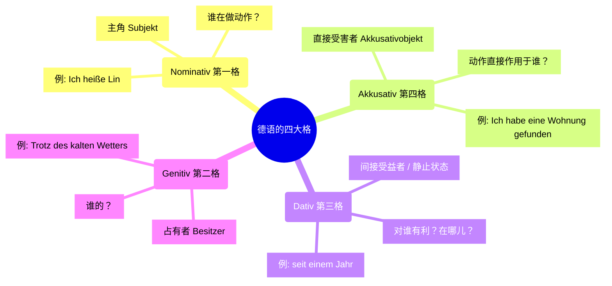
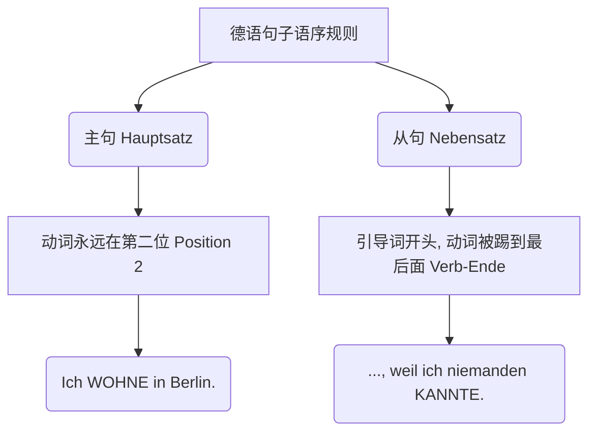

Guten Tag! 欢迎来到德语大师的课堂！很高兴看到你为自己设定了“六个月达到 B 2”的宏伟目标。作为移民，掌握德语不仅是拿到签证或找工作的敲门砖，更是你真正融入这片土地、把“异乡”变成“家”的钥匙。

我知道，从 A 1 到 B 1 的德语语法看起来就像是一座由无数规则、词尾变化和长句子堆砌而成的迷宫。但别怕，**德语语法本质上就像是严谨的德国工程**——只要你弄懂了它的底层逻辑（蓝图），一切都会严丝合缝地运转起来。

为了让你在六个月内高效攻克这些难关，我特意为你编写了一篇**“全家福”微型小说**。这篇文章不长，但它**浓缩了 A 1 到 B 1 阶段几乎所有的核心语法**（变格、时态、从句、被动语态、虚拟式等），且完全贴合你未来在德国的生活场景（租房、找工作）。

我们将先阅读这篇文章，然后我带你像解剖麻雀一样，把里面的语法机关一个个拆解开来！

---

### 📖 核心实战文章：Der große Umzug (大搬家)

> **(1)** Hallo! Ich heiße Lin und **wohne** seit *einem Jahr* in Berlin.
> **(2)** Früher **lebte** ich in China, aber ich **wollte** schon immer in Europa **arbeiten**.
> **(3)** **Als** ich letztes Jahr nach Deutschland **ankam**, **war** alles neu für mich.
> **(4)** Am Anfang **habe** ich oft meine Familie **vermisst**, **weil** ich noch niemanden hier **kannte**.
> **(5)** Gestern **ist** mir etwas Tolles **passiert**: Ich **habe** eine *wunderschöne, günstige* Wohnung **gefunden**, **die** direkt neben *einem großen* Park **liegt**.
> **(6)** *Trotz des kalten Wetters* bin ich sofort zur Besichtigung gefahren.
> **(7)** Die neue Wohnung **wird** gerade von *einem freundlichen Handwerker* **renoviert**.
> **(8)** Ich **stelle** mein *gemütliches* Sofa in *das* Wohnzimmer. Jetzt **steht** es in *dem* Wohnzimmer und ich **freue mich** sehr darüber.
> **(9)** Der Vermieter fragte mich gestern, **ob** ich Haustiere **habe**.
> **(10)** Ich antwortete, **dass** ich nur Fische **besitze**, **denn** laute Hunde sind in diesem Haus leider verboten.
> **(11)** **Wenn** ich reich **wäre**, **würde** ich natürlich *ein eigenes* Haus **kaufen**.
> **(12)** Nächste Woche **werde** ich meine erste Arbeit als Ingenieurin **anfangen**, **um** Geld für meine Zukunft **zu sparen**.
> **(13)** Ich lerne jeden Tag fleißig Deutsch, **damit** mein Chef und meine Kollegen mich besser **verstehen**.
> **(14)** **Geh** deinen Weg mutig weiter und **gib** niemals auf!

---

### 🛠️ 德语大师的“庖丁解牛”：语法深度解析

现在，让我们戴上透视镜，看看这篇短文里藏着哪些 A 1-B 1 的通关密码。为了方便你理解，我将用生动的类比为你拆解。

#### 第一层地基：四大格（Kasus）与形容词词尾（Adjektivdeklination）

德语的“格”就像是电影剧组里的**角色分配**。动词是导演，它决定谁来演主角，谁演配角。

* **A 1-A 2 核心难点：静三动四 (Wechselpräpositionen)**
    看第 8 句：*Ich stelle mein Sofa in **das** Wohnzimmer (Akk). Jetzt steht es in **dem** Wohnzimmer (Dat).*
    **大师点拨：** 想象你在搬家具。你拿着沙发**走进**客厅，这是一个**动态跨越边界**的动作，此时用**第四格 (Akkusativ - in das)**；当你把沙发放下，沙发**静止**在客厅里了，这是一个**状态**，此时用**第三格 (Dativ - in dem)**。

* **B 1 噩梦终结者：形容词词尾变化**
    看第 5 句：*eine wunderschöne, günstige Wohnung* (第四格，不定冠词) / *neben einem großen Park* (第三格，不定冠词)。
    **大师点拨：** 形容词变化其实是个**“懒惰原则”**。德语必须有人来标明“性数格”。如果前面的冠词（比如 der, dem, des）已经把标志穿在身上了，形容词就可以偷懒，只加一个 `-e` 或 `-en`。如果前面没有冠词，或者冠词没体现出特征（比如 ein），形容词就得挺身而出，穿上标志性的衣服（比如 ein groß**er** Park）。

#### 第二层框架：动词与时间旅行（时态 Tempus）

德语的时态并不复杂，它更像是一个工具箱，你只需要根据场景掏出不同的工具。

1.  **现在时 (Präsens)** - 句(1): *Ich wohne...* 用于描述现在的事实或普遍状态。
2.  **过去时 (Präteritum)** - 句(2)(3): *lebte, wollte, war...*
    **大师点拨：** 这是“书面或讲故事专用”的时态。但在日常口语中，有三个词我们永远用过去时：**sein (war), haben (hatte), 以及所有的情态动词 (wollte, konnte, musste)**。
3.  **现在完成时 (Perfekt)** - 句(4)(5): *habe... vermisst, ist... passiert, habe... gefunden.*
    **大师点拨：** 这是德国人**口语中**最爱的时态！结构是“助动词 (haben/sein) + 过去分词 (ge-t/ge-en)”。记住，只要动作表示“位置的移动”（比如去、来、跑）或“状态的改变”（发生、醒来、死），助动词就用 **sein**，其余 90%都用 **haben**。
4.  **将来时 (Futur I)** - 句(12): *werde... anfangen.*
    **大师点拨：** 结构是 `werden + 动词原形`。就像英语的 will + do。

#### 第三层承重墙：德语语序与从句（Nebensätze）

这是 A 2 到 B 1 最重要的分水岭。德语的句子结构有着钢铁般的纪律！

在我们的文章中，到处都是从句的身影：
* **时间从句 (als)** - 句(3): *Als ich ankam,...* （注意：als 只用于过去发生过**一次**的事情。如果是一般条件，用 *wenn*）。
* **原因从句 (weil)** - 句(4): *..., weil ich niemanden hier kannte.* （动词 kannte 在最后）。
* **关系从句 (Relativsatz)** - 句(5): *..., die direkt neben einem Park liegt.* （像个小尾巴，用来补充说明前面的 Wohnung。die 是关系代词，liegt 在最后）。
* **宾语从句 (dass/ob)** - 句(9)(10): *ob ich Haustiere habe* (是否...) / *dass ich Fische besitze* (陈述事实)。
* **目的从句 (damit / um...zu)** - 句(12)(13):
    **大师点拨：** 如果是为了自己的目的（主语一致），用小巧灵活的 **um... zu + 动词原形** (*Ich arbeite, um Geld zu sparen*)。如果前后主语不一样（我学德语，是为了**老板**能听懂），就必须用完整的从句 **damit** (*Ich lerne Deutsch, damit mein Chef mich versteht*)。

#### 第四层精装修：B 1 级别的高级工具

* **被动语态 (Passiv)** - 句(7): *Die Wohnung wird gerade von einem freundlichen Handwerker renoviert.*
    **大师点拨：** 当你不想强调“谁”干的，只想强调“事情被做了”，就用被动语态。公式：`werden + 过去分词`。这里的 *von* (Dativ) 引出动作的执行者。在德国办手续，你会看到满屏幕的被动语态（比如：Ihre Dokumente werden geprüft - 您的文件正在被审核）。
* **第二虚拟式 (Konjunktiv II)** - 句(11): *Wenn ich reich wäre, würde ich ein Haus kaufen.*
    **大师点拨：** 这是德语里的“滤镜”功能，用来表达**非真实**的愿望、假设或极度礼貌的请求。*wäre* 是 sein 的虚拟式，*würde... kaufen* 是通用虚拟式结构。找工作面试时，多用 *Ich hätte gern...* (我想要...) 或 *Könnten Sie bitte...* (您能...吗)，德国 HR 会觉得你教养极佳！

---

### 📅 为你量身定制的“6 个月 B 2 冲刺规划”

作为移民，你的时间非常宝贵。我们的学习必须“以终为始，学以致用”。以下是我为你规划的实战路径：

#### 第 1-2 个月：夯实 A 1-A 2（生活生存期）
* **目标：** 搞定“动词变位”、“四大格”和“静三动四”。能独立去超市、看医生、租房。
* **实战任务：**
    * **租房场景：** 练习写找房邮件。熟练使用带情态动词的句子（*Ich möchte eine Wohnung mieten.*）和 Wechselpräpositionen 描述家具摆放。
    * **词汇积累：** 掌握最核心的 1000 个高频词。名词必须连同**冠词(der/die/das)**和**复数**一起背！(比如：*die Wohnung, -en*)

#### 第 3-4 个月：攻克 B 1（语法主结构与从句期）
* **目标：** 熟练掌握所有从句（dass, weil, obwohl, wenn, als）和现在完成时（Perfekt）。能流畅地与德国邻居聊天，讲述自己的过去。
* **实战任务：**
    * **职场场景：** 准备一份德文简历（Lebenslauf）。用完成时和过去时描述自己以前的工作经历（*In China habe ich als Ingenieurin gearbeitet.*）。
    * **造句练习（大师作业）：** 每天用连词写 3 个长句。从“主句+主句”（und, aber, denn）过渡到“主句+从句”。

#### 第 5-6 个月：冲刺 B 2（表达升级与复杂输入期）
* **目标：** 掌握被动语态（Passiv）、虚拟式（Konjunktiv II）、形容词词尾变化。能够阅读政府信件，进行工作面试，表达复杂的观点和辩论。
* **实战任务：**
    * **行政事务场景（Behörden）：** 收集外管局（Ausländerbehörde）、保险公司（Krankenkasse）的信件，找出里面的被动语态并翻译。
    * **面试演练：** 用 Konjunktiv II 练习得体、礼貌的职场沟通（*Es wäre toll, wenn ich die Position bekommen könnte.*）。
    * **听力与口语：** 每天收听 *Tagesschau in 100 Sekunden* 或 *Easy German* 播客，模仿他们的语音语调。

**德语大师的寄语：**
学德语就像是在德国的高速公路（Autobahn）上开车。一开始你可能在右侧车道慢吞吞地熟悉规则，但只要你把“动词位置”和“格”的方向盘握紧，配合大量的实战练习，六个月后，你绝对能在这条路上踩下油门，畅通无阻！

现在，告诉大师，上面这篇《Der große Umzug》里的哪一句话或哪个语法点，你觉得最难理解？我们马上开始第一轮的造句实战！