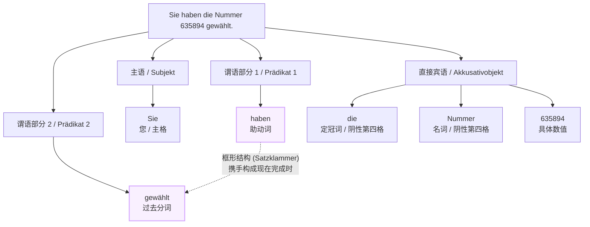
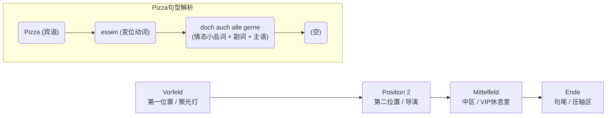
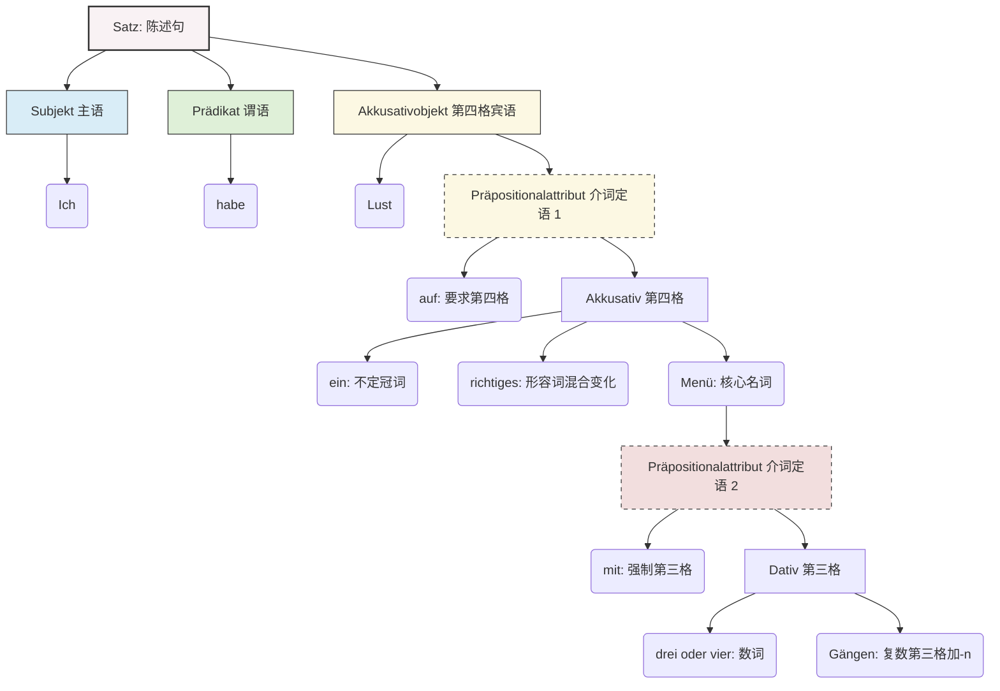

# 陈述句

## 从句：代词连在一起？

- Ja, sie kommt um 19 19 Uhr an, dann bring **ich sie** zum Hotel.
	- Q: 为什么 ich, sie 连在一起？
		- A：因为从句的 22 V 是陈述句，陈述句的第二位必须是动词，所以主语 is 排到了第三个和宾语 sie 连接了

# 主语 + 助动词 + 宾语 + 过去分词

### "Sie haben die Nummer 635894 gewählt" 

笔记：

- [[53 时态 二分词 （P.II）#过去式]]

标准的“现在完成时 (Perfekt)”陈述句。它的骨架是“主语 + 助动词 + 宾语 + 过去分词”。这里最值得注意的德语特色是“框形结构 (Satzklammer)”。在德语的完成时态中，充当助动词的变位动词（haben）占据句子的第二位，而真正表达动作含义的过去分词（gewählt）则被远远地踢到了句子的最末尾，两者就像一对括号，把其他所有的成分（如宾语）牢牢框在中间。

> 想象一下德语的现在完成时就是一个巨无霸汉堡。顶部的面包是助动词“haben”（或者 sein），底部的面包是过去分词“gewählt”。中间的夹心（生菜、肉饼等）就是句子里的其他信息，比如这里的“die Nummer 635894”。如果你只吃上面的面包（只听半句），你根本不知道这顿饭的主菜是什么；直到吃到底部的面包（听到句末的过去分词），你才恍然大悟：“哦，原来动作是‘拨打’啊！”

---

**逐词拆解 (Wort-für-Wort-Analyse)**

- **Sie**
    - **词性**：人称代词 (Personalpronomen)。
    - **形态**：主格 (Nominativ)，也就是句子的主语，负责发出动作。
    - **解析**：注意这里的“S”是大写的。在德语中，大写的“Sie”代表尊称“您”（或“您们”），无论在句首还是句中都要大写。如果小写“sie”，则可能表示“她”或者“他们”，句意就会完全不同。
- **haben**
    - **词性**：助动词 (Hilfsverb)。原形即为 _haben_。
    - **形态**：现在时 (Präsens)，针对尊称“Sie”的第一/第三人称复数变位。
    - **解析**：很多初学者一看到 _haben_ 就翻译成“有”。但在这里，它是一块“失去灵魂的积木”，仅仅作为助动词用来搭配句末的过去分词，共同构建出现在完成时，本身不翻译成“有”。
- **die**
    - **词性**：定冠词 (Bestimmter Artikel)。
    - **形态**：阴性 (Femininum)，单数 (Singular)，第四格 (Akkusativ)。
    - **解析**：由于修饰的名词是阴性且作为动作的直接承受对象，因此冠词使用第四格的 _die_（阴性名词的第一格和第四格长得一样）。
- **Nummer**
    - **词性**：名词 (Substantiv)。
    - **形态**：阴性名词，原形为 _die Nummer_（号码）。在这里处于第四格宾语的位置。
    - **语法类比（弓箭手与靶子）**：主格（主语）就像是射箭的弓箭手（Sie），动词是射出的箭（haben...gewählt），而第四格宾语（die Nummer）就是被箭射中的“靶子”。在这个句子里，号码就是被“拨打”这个动作击中的靶子。
- **635894**
    - **词性**：数词 (Numerale)。
    - **解析**：在这里充当名词 _Nummer_ 的同位语或后置定语，确切地说明具体是哪一个数字串。
- **gewählt**
    - **词性**：动词过去分词 (Partizip II)。原形为 _wählen_（选择，这里引申为“拨号”）。
    - **形态**：这是一个规则变化的==弱变化动词== (Schwaches Verb)。构成法则非常规整：**ge** + 词干 (**wähl**) + **t** = gewählt。
    - **解析**：安静地待在句末，和第二位的 _haben_ 遥相呼应，完成句意。

---

**视觉化逻辑图 (Strukturbaum)**

通过下面的图表，你可以更直观地看到这个“汉堡包”框形结构是如何把整个句子包裹起来的：

代码段

---

**实战考核 (Übungszeit)**

为了确保你已经完全掌握了今天讲到的“完成时框形结构”和“第四格宾语（靶子）”的概念，我们来做一个小测试吧：

请尝试运用今天的知识，将下面这句话翻译成德语：

**“您（尊称）买了这个苹果（der Apfel）。”**

_提示：_

- “买”的原形是 _kaufen_，它的过去分词规则变化也是 “ge + 词干 + t”。
- 注意“苹果”是阳性名词（der Apfel），当它变成动作的承受者（第四格）时，定冠词 der 应该变成什么形态呢？

你想先自己尝试翻译一下，让我来为你批改吗？

# doch auch 是什么

>  Pizza essen doch auch alle gerne.

在这个句子里：

- **Pizza (Vorfeld)**: 站在聚光灯下。说话人想强调“披萨”（而不是沙拉或面条）。
- **essen (Position 2)**: 动词永远是导演，稳坐第二把交椅。
- **doch auch alle gerne (Mittelfeld)**: 所有的配角、香料都在这个“VIP休息室”里挤着。

---

🧐 核心解答：你的三个好问题

1. 为什么 "doch auch" 放这里？

在德语中，**doch** 是一个情态小品词（Abtönungspartikel），它的作用就像做菜时的盐，用来表达情绪（意思是：“毕竟嘛 / 难道不是大家都知道吗”）。**auch** 是副词（“也”）。

在这个“VIP休息室”里，排座位的基本规则是：**代词 > 动词相关副词 > 强调成分**。

这里的 "doch auch" 放在 "alle"（主语：所有人）前面，起到了**强烈的聚焦作用**。它在修饰紧挨着它的词。

- 👉 _Pizza essen [doch auch] **alle** gerne._ = 毕竟**所有人**也都喜欢吃披萨嘛。（潜台词：不仅仅是你我喜欢，**所有人都**喜欢。）

2. "auch" 可以放在 "alle" 后面吗？

**绝对可以！** 而且意思会发生微妙的变化，这也是B2级别常考的语感测试。

当位置发生改变，强调的重点就变了：

- 👉 _Pizza essen doch alle **[auch]** gerne._ 在这里，"auch" 靠近了 "gerne"（喜欢）。

    意思变成了：大家毕竟**也**喜欢吃披萨。（潜台词：大家可能喜欢吃烤肉，但他们**也同样**喜欢吃披萨。）

**类比理解**："auch" 就像一个手电筒，它**照亮紧跟在它后面的那个词**。

- auch **alle** -> 照亮“所有人”（即使是那些挑食的人，也都喜欢）。
- auch **gerne** -> 照亮“喜欢这个动作”（不仅吃，而且是愉快地吃）。

3. 这两个词 ("doch auch") 可以放到句末吗？

**NEIN! 绝对不行！** 🚫

这也是很多初学者常犯的错误。在德语陈述句中，句末通常是留给第二动词（比如过去分词、可分前缀、动词不定式）的“专属车位”。如果只有单个变位动词，句末通常是留给**情态副词**（比如 gerne, gut, schnell）或地点/时间副词的。

像 "doch" 这样的情态小品词，**永远只能住在句子中间（Mittelfeld）**。它们就像人的内心情感，不能挂在最外面的衣服上（句尾），必须藏在句子的心里。

- ❌ 错误示范：_Pizza essen alle gerne doch auch._ （听起来就像是一个人话说完了，突然又硬塞了几个词进去，非常不自然。）

🌍 B1-B2 实战演练：移民生活场景

为了让你在六个月内不仅能过考试，还能在德国生活得游刃有余，我们把这个语法点带入真实的德国生活场景中（注意看 "doch" 和 "auch" 的神奇作用）：

**场景一：找房租房 (Wohnungssuche)**

- _语境：你和朋友抱怨租房太难，大家都想租带阳台的房子。_
- **德语**：Einen Balkon wollen **doch auch viele** Mieter.
- **解析**：毕竟**许多**租客也都想要个阳台嘛。（doch auch 强调 viele）

**场景二：外管局延签 (Ausländerbehörde)**

- _语境：办事员要求你补充一份材料，你原本以为不需要的。_
- **德语**：Diesen Nachweis brauchen wir **doch auch**.
- **解析**：这份证明我们毕竟**也**是需要的。（doch 缓和了语气，auch 强调了材料的必要性）

**场景三：找工作面试 (Vorstellungsgespräch)**

- _语境：讨论某项技能（比如德语B2证书）。_
- **德语**：Das B2-Zertifikat haben **doch alle** Bewerber **auch**.
- **解析**：毕竟所有的应聘者**也都有**B2证书嘛。（强调“拥有”这个事实，意味着你需要其他特长来脱颖而出）

# Ich habe Lust auf ein richtiges Menü mit drei oder vier Gängen.

**德语原句**：Ich habe Lust auf ein richtiges Menü mit drei oder vier Gängen.

**中文翻译**：我想吃一顿有三四道菜的真正的正餐。

**句式判定**：Aussagesatz（陈述句），Hauptsatz（独立主句）。

**句法全局分析**：

这是一个结构非常经典的单句，核心主干十分简练：“Ich habe Lust”（我有兴致）。然而，句子通过两个介词短语（Präpositionalphrase）像俄罗斯套娃一样进行了层层扩展。

第一个扩展是“auf ein richtiges Menü”（对一顿真正的正餐），作为名词“Lust”的介词定语（说明是对什么有兴致）；第二个扩展是“mit drei oder vier Gängen”（带有三到四道菜的），紧跟在“Menü”后面，作为“Menü”的介词定语（说明是怎样的正餐）。

---

**单词逐个拆解与语法解析**

**1. Ich**

* **词性**：Personalpronomen（人称代词）。
* **形态变化**：第一人称，Singular（单数），Nominativ（第一格/主格）。
* **功能**：句子的 Subjekt（主语）。

**2. habe**

* **词性**：Verb（动词）。
* **形态变化**：原形为 haben（有），这里是 Präsens（现在时），第一人称单数变位。
* **功能**：句子的 Prädikat（谓语），占据陈述句中铁打的第二位。

**3. Lust**

* **词性**：Nomen（名词）。
* **形态变化**：原形 die Lust（兴致，阴性），Singular（单数），这里作 Akkusativ（第四格/宾格）。
* **功能**：Akkusativobjekt（第四格宾语）。

**4. auf**

* **词性**：Präposition（介词）。
* **功能**：德语中有个固定搭配 “Lust auf etwas (Akk.) haben”，表示“对某事/某物有兴趣/欲望”。这里的 auf 受到 Lust 的强制支配，并且要求后面的名词必须是第四格（Akkusativ）。

**5. ein**

* **词性**：Unbestimmter Artikel（不定冠词）。
* **形态变化**：匹配后面的 Menü。因为 Menü 是中性（das），且这里受 auf 支配需要第四格，所以变成 ein。

**6. richtiges**

* **词性**：Adjektiv（形容词）。
* **形态变化**：原形 richtig（真正的）。因为前面是不定冠词 ein，属于 Gemischte Deklination（形容词混合变化）。中性、单数、第四格的词尾是 -es。

**7. Menü**

* **词性**：Nomen（名词）。
* **形态变化**：原形 das Menü（正餐/套餐，中性），Singular（单数），Akkusativ（第四格）。
* **功能**：介词 auf 引导的宾语核心词。

**8. mit**

* **词性**：Präposition（介词）。
* **功能**：表示“带有、伴随”。这是一个“硬核”介词，它后面永远、无条件地只加 Dativ（第三格）。

**9. drei oder vier**

* **词性**：Numerale（数词）+ Konjunktion（连词）+ Numerale（数词）。
* **功能**：修饰后面的名词 Gängen，表示数量“三或者四”。

**10. Gängen**

* **词性**：Nomen（名词）。
* **形态变化**：原形 der Gang（一道菜，阳性）。因为数量是三或四，所以必须用 Plural（复数）形式 die Gänge。又因为前面的介词 mit 强制要求第三格（Dativ），复数名词在第三格时，词尾必须加 -n。因此 Gänge 变成了 Gängen。

---

**语法难点与直观类比**

在这句话中，有两个非常值得注意的语法难点，我来为你打个比方：

**难点一：形容词词尾变化 (ein richtiges Menü)**

* **类比：接力赛跑规则**
你可以把德语的词尾变化看作一场表明“名词性别”的接力赛。中性词第四格本来应该有明显的标志（比如定冠词 das），但这里第一棒是不定冠词“ein”，它长得和阳性第一格一模一样，等于是在赛道上“把标明性别的接力棒给弄丢了”。
这时候，作为第二棒的形容词“richtig”为了拯救大局，必须捡起接力棒，穿上带有中性标志的制服（加上 -es 词尾，变成 richtiges），大声告诉读者：“别误会，后面的 Menü 是个中性宝宝！”这就是为什么它是 richtiges 而不是 richtige。

**难点二：复数第三格的“小尾巴” (mit ... Gängen)**

* **类比：VIP 俱乐部的强制手环**
介词“mit”就像是一个规矩森严的 VIP 俱乐部保安，他只允许“第三格（Dativ）”身份的词进入。
名词 der Gang 的复数本来叫 die Gänge。当“Gänge”想跟着数词进入 mit 的俱乐部时，保安说：“你是复数名词，进我这第三格的场子，除了变身之外，还必须在手上戴一个专属的 VIP 手环——字母 'n'。”
于是，Gänge 乖乖戴上了手环，变成了 Gänge**n**。这就是德语中著名的“Dativ Plural -n”规则（除了本身以 -n 或 -s 结尾的复数名词外，其他复数名词变第三格都要加 -n）。

---

**句子逻辑关联可视化**

为了让你更直观地看清这个句子的结构，我为你生成了一张句法逻辑树状图。你可以看到句子是如何从主干一步步长出枝叶的：

---

**举一反三：随堂小测验**

导师可不能光讲不练，来看看你有没有彻底掌握上面的两个知识点（形容词接力赛规则 & 第三格 VIP 手环规则）。请尝试填空并完成下面的句子变形：

**题目**：我想喝一杯冰啤酒（das Bier, 中性），和两个大学朋友（der Freund, 阳性）一起。

**德语翻译**：Ich habe Lust auf ein ________ (kalt) Bier mit zwei ________ (Freund) aus der Uni.

你可以先在心里想一下答案，准备好了的话，随时告诉我你的答案，我会为你批改！需要我为你揭晓答案并解释吗？

# Die alten Pharaonen würden sich im Grabe umdrehen

**7. Grabe**

- **词性：** 名词（Substantiv），原形为 das Grab（中性 Neutrum，坟墓）。
- **形态依据：** 如上所述，处于**第三格（Dativ）、单数（Singular）**。
- **拓展提示：** 细心的你可能发现它多了一个 **-e** 尾巴。这在现代德语中叫做“古语与格词尾（altes Dativ-e）”。在现代日常德语中，我们通常只说 im Grab，但在一些固定习语、诗歌或带有历史感的表达中（比如这里提到古老的法老），经常会保留这个 -e，显得更有戏剧张力和古典韵味。
- 
**【三、 错误现场还原：如果去掉 sich 会怎样？】**
如果你对德国人说：_Die alten Pharaonen würden im Grabe umdrehen._ 德国人的语法雷达会立刻疯狂报警，他们的第一反应一定会是追问：“**Wen oder was** drehen sie um?”（他们把谁、或者把什么东西翻转过来？）
在德国人的脑海里，画面会瞬间突变：古老的法老们在坟墓里苏醒，但他们自己没有翻身，而是伸出双手，开始疯狂地给旁边的陪葬品、金字塔里的砖头、甚至是旁边的木乃伊护卫“翻面”！这显然完全违背了我们想表达的“气得自己翻身”的本意。
