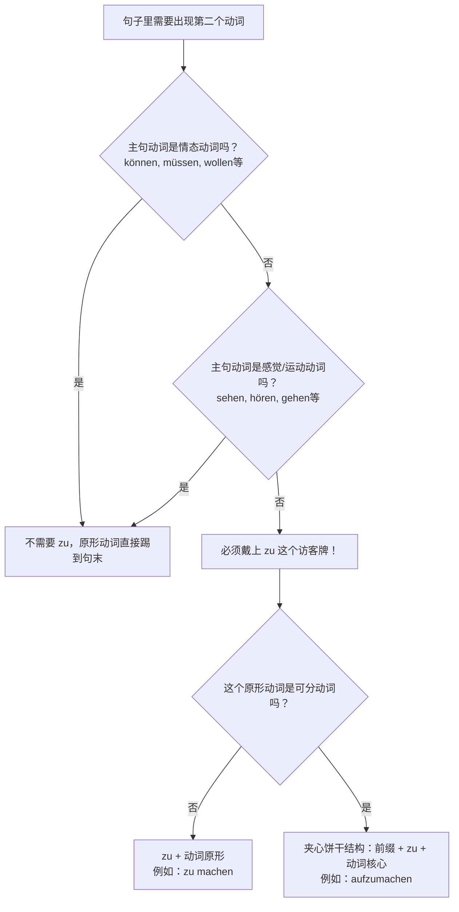

# 带zu的不定式

今天我们要彻底攻克的，是德语 B 1-B 2 阶段的绝对核心语法：**带 `zu` 的不定式（Infinitiv mit "zu"）**。

### 🧠 核心概念类比：一山不容二虎，除非带上“访客牌”

想象一下，一个德语从句就像是一个公司部门。在这个部门里，只能有一位“发号施令的经理”——这就是**变位动词**（根据主语变化了人称的动词，通常在陈述句中排第二位）。

如果这个句子里还需要出现第二个动词怎么办？很抱歉，第二个动词不能穿正装（不能变位），它必须保持出厂设置的**原形（不定式）**，并且被发配到句子的**最末尾**。更重要的是，为了证明它只是来帮忙的，它通常需要在胸前挂上一个“访客通行证”——这就是 ** `zu` **。

为了让你一目了然地掌握这个逻辑，我为你制作了下面这个决策流程图 ：

代码段

---

### 📍 第一招：`zu` 到底放在哪里？（位置的艺术）

挂“访客牌”也是有讲究的。这取决于动词的类型：

**1. 普通动词（不可分动词）：** `zu` 直接放在动词原形前面，分开写。

- **医疗场景：** Ich versuche, einen Termin beim Augenarzt **zu vereinbaren**.

    _(我尝试预约一个眼科医生的门诊。)_

    _解析：versuche 是主句的变位动词，vereinbaren（预约）是第二个动词，戴上 zu 放在最后。_

**2. 可分动词（夹心饼干结构）：** 德语的可分动词（如 `ausfüllen` 填写）平时喜欢分离，但遇到 `zu` 时，`zu` 会像楔子一样，**硬生生卡在前缀和核心动词之间，连写成一个词**。

- **行政场景：** Bitte vergessen Sie nicht, das Antragsformular **auszufüllen**.

    _(请您不要忘记填写申请表。)_

    _解析：aus-füllen 变成了 aus-zu-füllen。这也是 B 2 考试中最爱考的拼写陷阱！_

---

### 🏢 第二招：三大核心应用场景（移民生活实战）

带 `zu` 的不定式在哪些情况下必须出场？我们结合你未来在德国的实际生活场景来分类：

#### 场景 A：表达个人计划、企图、想法（主句主语与从句主语必须一致！）

当你使用 _vorhaben (打算)_, _versuchen (尝试)_, _hoffen (希望)_, _vergessen (忘记)_, _anfangen (开始)_ 等动词时。

- **找工作场景：** Ich habe vor, einen gut bezahlten Job in München **zu finden**.

    _(我打算在慕尼黑找一份高薪工作。)_

    _⚠️ 核心考点：_ 如果希望别人做某事（主语不一致），则**绝对不能**用 `zu`，必须用 `dass` 从句！

    _对：Ich hoffe, dass **du** den Job bekommst. (我希望你能得到这份工作。)_

    _错：Ich hoffe dich den Job zu bekommen._ (德语里没有英文 "I hope you to..." 的句型！)

#### 场景 B：无人称句型 "Es ist + 形容词" (评价某事)

在德国办手续，你每天都会听到别人对你做评价或者提要求。

- **租房场景：** Es ist momentan sehr schwer, eine günstige Wohnung im Zentrum **zu mieten**.

    _(目前在市中心租一套便宜的公寓非常困难。)_

- **医疗场景：** Es ist wichtig, die Medikamente nach dem Essen **einzunehmen**.

    _(饭后服用这些药物很重要。)_

#### 场景 C：B 1/B 2 必备魔法三兄弟（目的、伴随、替代）

这是 B 2 写作和口语拿高分的杀手锏，不仅能把句子拉长，还能展现你的逻辑能力：

1. **um ... zu ... (为了...... / 目的)**
    
    - **生活场景：** Ich lerne fleißig Deutsch, **um** mich besser in die Gesellschaft **zu integrieren**. _(我努力学习德语，是为了更好地融入社会。)_
        
2. **ohne ... zu ... (却没有...... / 伴随状语)**
    
    - **职场/法律场景：** Unterschreiben Sie niemals einen Arbeitsvertrag, **ohne** ihn vorher genau **durchzulesen**. _(绝对不要在没有事先仔细通读的情况下就签署劳动合同！)_ -> 注意 _durchzulesen_ 的夹心结构！
        
3. **anstatt ... zu ... (本该...却... / 替代)**
    
    - **日常场景：** Er surft den ganzen Tag auf Instagram, **anstatt** Deutsch **zu üben**. _(他整天刷 Ins，而不是练习德语。)_

---

### 🚀 第三招：B 2 拔高绝技 (被动语态的强力平替)

在德国看官方文件、租房合同或者医生处方时，你会遇到一个非常高级的用法：** `haben/sein + zu + 不定式` **。在这个用法里，`zu` 赋予了动词“必须”或“能够”的含义，并且经常带有被动色彩。

1. **sein + zu + Infinitiv (可以被... / 必须被...) = können/müssen + Partizip II + werden**
    
    - **租房合同场景：** Die Miete **ist** bis zum dritten Werktag des Monats **zu zahlen**.

        _(租金必须在每个月第三个工作日之前支付。 = Die Miete muss gezahlt werden.)_

    - **官僚场景：** Das Problem **ist** leicht **zu lösen**.

        _(这个问题很容易解决。 = Das Problem kann gelöst werden.)_

2. **haben + zu + Infinitiv (主动的必须) = müssen + Infinitiv**
    
    - **工作场景：** Du **hast** heute viel **zu tun**.

        _(你今天有很多事必须做。)_

---

### 🛑 避坑指南：什么时候千万别戴“访客牌”？

为了不惹怒外管局的签证官（开个玩笑），请务必记住以下情况**不要加 `zu` **：

1. **情态动词** (müssen, können, dürfen, wollen, sollen, mögen)：他们是副总，自带通行证。_Ich muss gehen._ (而不是 Ich muss zu gehen.)
2. **表示运动的动词** (gehen, kommen, fahren)：_Ich gehe einkaufen._ (我去买东西。)
3. **感官动词** (sehen, hören, spüren)：_Ich sehe den Bus kommen._ (我看见公交车来了。)
4. **lassen (让/使)**：_Ich lasse mir die Haare schneiden._ (我让人给我剪头发。)

---

### 📝 德语大师的课后实战演练

光看不用是学不好德语的！请你尝试将下面三个移民生活中的情境翻译成德语。翻译时请注意 `zu` 的位置和句子的逗号结构：

1. _(找工作)_：**我打算，写一份完美的求职信 (die Bewerbung)。**

    (提示词：vorhaben / schreiben)

2. _(看病)_：**按时吃药 (die Tabletten rechtzeitig einnehmen) 是很重要的。**

    (提示词：Es ist wichtig... / einnehmen 是可分动词)

3. _(行政)_：**为了拿到签证 (das Visum)，我必须提交所有的文件 (alle Unterlagen einreichen)。**

    (提示词：um... zu... / einreichen)

掌握了这些，你在 6 个月内拿下 B 2 的征途上，就已经跨越了一座最关键的语法大山！ Viel Erfolg! (祝你成功！)
