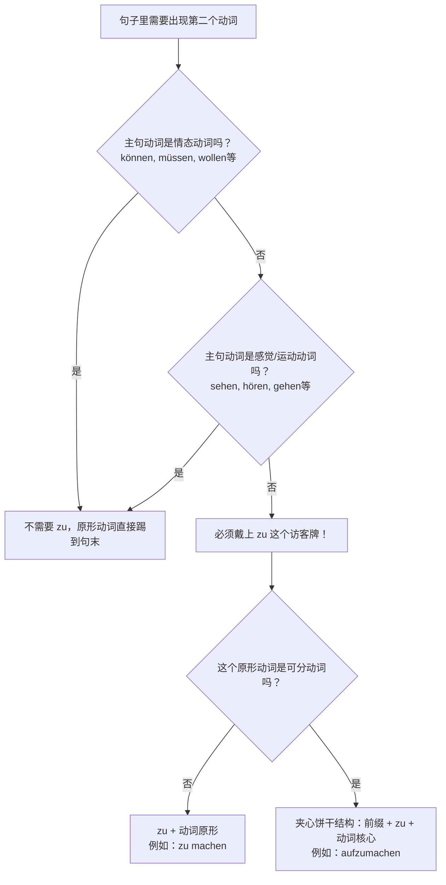
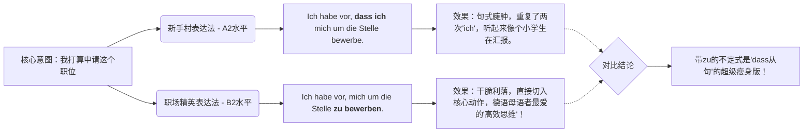

# 带zu的不定式

今天我们要彻底攻克的，是德语 B 1-B 2 阶段的绝对核心语法：**带 `zu` 的不定式（Infinitiv mit "zu"）**。

### 🧠 核心概念类比：一山不容二虎，除非带上“访客牌”

想象一下，一个德语从句就像是一个公司部门。在这个部门里，只能有一位“发号施令的经理”——这就是**变位动词**（根据主语变化了人称的动词，通常在陈述句中排第二位）。

如果这个句子里还需要出现==第二个动词==怎么办？很抱歉，第==二个动词不能穿正装（不能变位==），它必须保持出厂设置的**原形（不定式）**，并且被发配到句子的**最末尾**。更重要的是，为了证明它只是来帮忙的，它通常需要在胸前挂上一个“访客通行证”——这就是 ** `zu` **。

为了让你一目了然地掌握这个逻辑，我为你制作了下面这个决策流程图 ：

代码段

---

### 📍 第一招：`zu` 到底放在哪里？（位置的艺术）

挂“访客牌”也是有讲究的。这取决于动词的类型：

**1. 普通动词（不可分动词）：** `zu` 直接放在动词原形前面，分开写。

- **医疗场景：** Ich versuche, einen Termin beim Augenarzt **zu vereinbaren**.
    _(我尝试预约一个眼科医生的门诊。)_
    _解析：versuche 是主句的变位动词，vereinbaren（预约）是第二个动词，戴上 zu 放在最后。_

**2. 可分动词（夹心饼干结构）：** 德语的可分动词（如 `ausfüllen` 填写）平时喜欢分离，但遇到 `zu` 时，`zu` 会像楔子一样，**硬生生卡在前缀和核心动词之间，连写成一个词**。

- **行政场景：** Bitte vergessen Sie nicht, das Antragsformular **auszufüllen**.

    _(请您不要忘记填写申请表。)_

    _解析：aus-füllen 变成了 aus-zu-füllen。这也是 B 2 考试中最爱考的拼写陷阱！_

---

### 三大核心应用场景）

带 `zu` 的不定式在哪些情况下必须出场？我们结合你未来在德国的实际生活场景来分类：

#### 场景 A：表达个人计划、企图、想法（主句主语与从句主语必须一致！）

当你使用 _vorhaben (打算)_, _versuchen (尝试)_, _hoffen (希望)_, _vergessen (忘记)_, _anfangen (开始)_ 等动词时。

- **找工作场景：** Ich habe vor, einen gut bezahlten Job in München **zu finden**.

    _(我打算在慕尼黑找一份高薪工作。)_

    _⚠️ 核心考点：_ 如果希望别人做某事（主语不一致），则**绝对不能**用 `zu`，必须用 `dass` 从句！

    _对：Ich hoffe, dass **du** den Job bekommst. (我希望你能得到这份工作。)_
    _错：Ich hoffe dich den Job zu bekommen._ (德语里没有英文 "I hope you to..." 的句型！)

#### 场景 B：无人称句型 "Es ist + 形容词" (评价某事)

在德国办手续，你每天都会听到别人对你做评价或者提要求。

- **租房场景：** Es ist momentan sehr schwer, eine günstige Wohnung im Zentrum **zu mieten**.
    _(目前在市中心租一套便宜的公寓非常困难。)_

- **医疗场景：** Es ist wichtig, die Medikamente nach dem Essen **einzunehmen**.
    _(饭后服用这些药物很重要。)_

#### 场景 C：B 1/B 2 必备魔法三兄弟（目的、伴随、替代）

这是 B 2 写作和口语拿高分的杀手锏，不仅能把句子拉长，还能展现你的逻辑能力：

1. **um ... zu ... (为了...... / 目的)**
    - **生活场景：** Ich lerne fleißig Deutsch, **um** mich besser in die Gesellschaft **zu integrieren**. _(我努力学习德语，是为了更好地融入社会。)_
        
2. **ohne ... zu ... (却没有...... / 伴随状语)**
    - **职场/法律场景：** Unterschreiben Sie niemals einen Arbeitsvertrag, **ohne** ihn vorher genau **durchzulesen**. _(绝对不要在没有事先仔细通读的情况下就签署劳动合同！)_ -> 注意 _durchzulesen_ 的夹心结构！
        
3. **anstatt ... zu ... (本该...却... / 替代)**
    - **日常场景：** Er surft den ganzen Tag auf Instagram, **anstatt** Deutsch **zu üben**. _(他整天刷 Ins，而不是练习德语。)_

---

### 🚀 第三招：B 2 拔高绝技 (被动语态的强力平替)

在德国看官方文件、租房合同或者医生处方时，你会遇到一个非常高级的用法：** `haben/sein + zu + 不定式` **。在这个用法里，`zu` 赋予了动词“必须”或“能够”的含义，并且经常带有被动色彩。

1. **sein + zu + Infinitiv (可以被... / 必须被...) = können/müssen + Partizip II + werden**
    
    - **租房合同场景：** Die Miete **ist** bis zum dritten Werktag des Monats **zu zahlen**.

        _(租金必须在每个月第三个工作日之前支付。 = Die Miete muss gezahlt werden.)_

    - **官僚场景：** Das Problem **ist** leicht **zu lösen**.

        _(这个问题很容易解决。 = Das Problem kann gelöst werden.)_

2. **haben + zu + Infinitiv (主动的必须) = müssen + Infinitiv**
    
    - **工作场景：** Du **hast** heute viel **zu tun**.

        _(你今天有很多事必须做。)_

---

### 🛑 避坑指南：什么时候千万别戴“访客牌”？

为了不惹怒外管局的签证官（开个玩笑），请务必记住以下情况**不要加 `zu` **：

1. **情态动词** (müssen, können, dürfen, wollen, sollen, mögen)：他们是副总，自带通行证。_Ich muss gehen._ (而不是 Ich muss zu gehen.)
2. **表示运动的动词** (gehen, kommen, fahren)：_Ich gehe einkaufen._ (我去买东西。)
3. **感官动词** (sehen, hören, spüren)：_Ich sehe den Bus kommen._ (我看见公交车来了。)
4. **lassen (让/使)**：_Ich lasse mir die Haare schneiden._ (我让人给我剪头发。)

---

### 📝 德语大师的课后实战演练

光看不用是学不好德语的！请你尝试将下面三个移民生活中的情境翻译成德语。翻译时请注意 `zu` 的位置和句子的逗号结构：

1. _(找工作)_：**我打算，写一份完美的求职信 (die Bewerbung)。**

    (提示词：vorhaben / schreiben)

2. _(看病)_：**按时吃药 (die Tabletten rechtzeitig einnehmen) 是很重要的。**

    (提示词：Es ist wichtig... / einnehmen 是可分动词)

3. _(行政)_：**为了拿到签证 (das Visum)，我必须提交所有的文件 (alle Unterlagen einreichen)。**

    (提示词：um... zu... / einreichen)

掌握了这些，你在 6 个月内拿下 B 2 的征途上，就已经跨越了一座最关键的语法大山！ Viel Erfolg! (祝你成功！)

# 这个柱的不定是存在的意义是什么为什么要用它，用它和不用它又有什么区别和效果强调一下

在德语学习的初期（A 1-A 2），我们只要能把意思表达清楚就算胜利；但到了 B 1-B 2 阶段，我们的目标是**融入、专业、高效**。带 `zu` 的不定式（Infinitiv mit "zu"），正是帮你实现这一跨越的“秘密武器”。

为了回答你的问题，我们先来看一张直观的对比图，体会一下这两种表达方式在“气质”上的巨大差异：

代码段

---

### 🌟 在连词句中少一个主语和变位

德国人以严谨和追求效率著称，这在他们的语言中体现得淋漓尽致。

**区别与效果：**

如果你不用带 `zu` 的不定式，你就必须依赖 `dass`（连词“因为/所以/那”）来引导一个完整的从句。这意味着你必须再造一个主语，再变位一次动词。

- **不用 zu（啰嗦版）：** Es ist wichtig, **dass man** die Mietkaution pünktlich **überweist**. (重要的是，**人们**要把租房押金按时**汇过去**。)
- **用 zu（精简版）：** Es ist wichtig, die Mietkaution pünktlich **zu überweisen**. (按时**汇**租房押金很重要。)

**强调了什么？**

它强调了**“省去废话，直奔主题”**。当主句和从句的执行者是同一个人，或者在无人称句型中（大家都要遵守的客观事实）时，重复主语是极度浪费唇舌的。带 `zu` 的不定式就像是给句子做了一次“抽脂手术”，让你的德语听起来不再像个初学者，而是像一个思维敏捷的成年人。

---

### 聚焦于表达核心

当你使用带 `zu` 的不定式时，你实际上在引导听众的注意力。

**区别与效果：**

- **找工作场景（不用 zu）：** Ich hoffe, _dass ich_ den Arbeitsvertrag bald unterschreibe.
    _听者的注意力被分散了：我希望..._我_...很快签合同。_

- **找工作场景（用 zu）：** Ich hoffe, den Arbeitsvertrag bald **zu unterschreiben**.
    _听者的注意力瞬间聚焦：我希望...**签合同**！_

**强调了什么？**

它强烈地强调了**动作（Handlung）和事件本身**，弱化了做动作的人。在德国的职场、租房谈判、与外管局（Ausländerbehörde）的交涉中，往往“事情办成”比“谁去办”更重要。这种表达方式显得更加**客观、专业、有礼貌**。

---

### 🌟 存在意义三：B 2/C 1 高阶语法的基石

如果你仔细观察德国的官方文件、信件和新闻，你会发现带 `zu` 的不定式无处不在。它是很多高级表达的“地基”。如果不用它，很多更高级的、充满逻辑感的修辞你根本无法使用。

**比如我们上节课提到的“魔法三兄弟”：**

如果没有 `zu` 的不定式，你将无法优雅地表达复杂的逻辑。

- **医疗场景（你想表达：他没吃药就去上班了）**
    - **不用 zu（A 2 拼凑法）：** Er ist zur Arbeit gegangen. Und er hat seine Medikamente nicht eingenommen. (他去上班了。而且他没吃药。—— 像两个生硬的石块堆在一起)
    - **用 zu（B 2 伴随状语）：** Er ist zur Arbeit gegangen, **ohne** seine Medikamente **einzunehmen**. (他去上班了，却**没吃**药。—— 逻辑紧密，一气呵成！)

**强调了什么？**

它强调了你作为新移民的**教育水平和语言素养**。在德国，一口流利且结构复杂的德语（即大量使用不定式和从句结构）是获得尊重、顺利通过面试、赢得房东好感的重要隐形筹码。

---

### 🎯 总结：为什么要逼自己用它？

1. **脱离“娃娃音”：** 停止每句话都用 _Ich... dass ich..._ 这种重复结构。
2. **符合德国人的阅读/听觉习惯：** 他们的大脑在等待那个挂着“访客牌”的动词原形出现在句末，这会给他们一种“句子完美闭环”的舒适感。
3. **考试拿分硬指标：** 无论是 Goethe-Zertifikat B 2 还是 Telc B 2，考官在口语和写作中都在“竖着耳朵”听你有没有用 `um...zu...`, `ohne...zu...` 或者简单的 `zu + Infinitiv`。不用？很难上高分。

现在，感受到了这个小小的 `zu` 背后蕴含的巨大力量了吗？它是你从“能说德语”向“能把德语说得很漂亮”进阶的必经之路！

**来，趁热打铁，感受一下效果的区别！**

请你把这句极其啰嗦的“A 2 德语”用 `zu` 改造为“B 2 精英德语”（租房场景）：

_A 2 啰嗦版：_ Ich versuche, **dass ich** den Vermieter heute Nachmittag **anrufe**. (我尝试，我今天下午给房东打电话。)

_你的 B 2 改造版是：___________________
