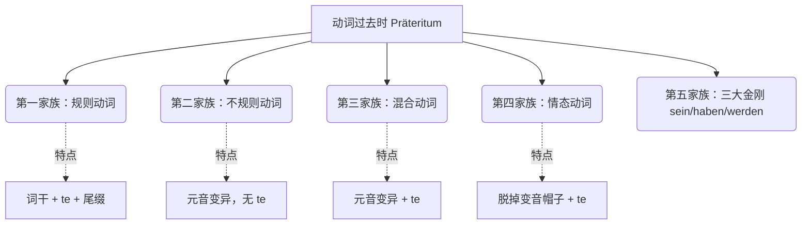

# 动词的过去时

### 🌟 核心概念：什么是过去时（Präteritum）？它和现在完成时（Perfekt）有什么恩怨情仇？

在德语中，过去时通常作为一种**文学载体**，一般用于书面记叙过去发生的事情。在口语、信件或 Email 中，德国人通常习惯用**现在完成时（Perfekt）**来表达已经发生的事情。

**但是！这里有几个“超级特权阶层”是惯例：**

情态动词、**sein**（是）以及 **haben**（有），它们基本只用过去时，常以过去时态替代现在完成时。此外，像 **wusste**（知道）、**fand**（认为/找到）、**es ging**（进展）、**es gab**（有）这些词，在日常口语中也经常以过去时的形式出现。

为了让你从宏观上把握，我们先来看一幅“德语动词过去时家族图谱”：

现在，我们一字不漏地、彻底地拆解这五个家族！

---

### 第一家族：遵纪守法的“规则动词”（Regelmäßige Verben）

**形象类比：** 它们就像是在外管局（Ausländerbehörde）排队办事的乖乖牌市民，严格遵守统一着装规定——**穿上代表过去时的制服“-te”**。

**核心公式：** 词干 + **te** + 人称词尾

以 **machen**（做）、**wohnen**（居住）、**sagen**（说）为例：

| **人称**            | **machen (做)** | **wohnen (居住)** | **sagen (说)** |
| ----------------- | -------------- | --------------- | ------------- |
| **ich**           | mach**te**     | wohn**te**      | sag**te**     |
| **du**            | mach**test**   | wohn**test**    | sag**test**   |
| **er/es/sie/man** | mach**te**     | wohn**te**      | sag**te**     |
| **wir**           | mach**ten**    | wohn**ten**     | sag**ten**    |
| **ihr**           | mach**tet**    | wohn**tet**     | sag**tet**    |
| **sie/Sie**       | mach**ten**    | wohn**ten**     | sag**ten**    |

- **大师划重点：** 请注意观察！在过去时中，**ich（我）和 er/es/sie（他/它/她）的长相是一模一样的！** 这是一个贯穿所有过去时态的铁律，记住了能省去一半的记忆量。

**⚠️ 特殊规则（喘息法则）：**

如果词干是以 **-t, -d, -chn, -ffn, -gn, -tm, -dm** 为词尾的动词，发音会卡在喉咙里，所以要在词尾加一个 **-e-** 作为“润滑剂/喘息空间”，其过去时变化形式在词尾加 **-e**。比如：

- **antworten**（回答） -> antwort**e**te
- **arbeiten**（工作） -> arbeit**e**te
- **baden**（洗澡） -> bad**e**te

---

### 第二家族：叛逆的“不规则动词”（Unregelmäßige Verben）

**形象类比：** 它们就像是柏林街头的朋克青年，拒绝穿统一的“-te”制服。它们改变的是自己的“内核”（发生元音变音）。这类动词需要记忆。

**核心规则：** 词干元音改变 + **不加 te** + 人称词尾（且 ich 和 er/es/sie 连人称词尾都不加！）。

以 **kommen**（来）、**trinken**（喝）、**fahren**（乘车）为例：

|**人称**|**kommen -> kam**|**trinken -> trank**|**fahren -> fuhr**|
|---|---|---|---|
|**ich**|**kam**|**trank**|**fuhr**|
|**du**|kam**st**|trank**st**|fuhr**st**|
|**er/es/sie**|**kam**|**trank**|**fuhr**|
|**wir**|kam**en**|trank**en**|fuhr**en**|
|**ihr**|kam**t**|trank**t**|fuhr**t**|
|**sie/Sie**|kam**en**|trank**en**|fuhr**en**|

---

### 第三家族：双面间谍“混合动词”（Mischverben）

**形象类比：** 它们是混血儿。一方面像叛逆青年一样改变了内部的元音；另一方面又像乖乖牌一样，穿上了“-te”的制服。这类词数量不多，但极其常用。

- **denken**（想） -> **dachte**
- **bringen**（带来） -> **brachte**
- **nennen**（命名/称呼） -> **nannte**
- **wissen**（知道） -> **wusste** (极高频词汇！)

---

### 第四家族：氛围制造者“情态动词”（Modalverben）

**形象类比：** 情态动词进入过去时，就像是一个人走回室内摘掉了头上的变音帽子（去掉 Umlaut：ä/ö/ü 变成 a/o/u），然后穿上“-te”制服。

变化形式如下：

- **können**（能够） -> **konnte**
- **müssen**（必须） -> **musste**
- **dürfen**（允许） -> **durfte**
- **mögen**（喜欢/想要，图表中注为 möchten） -> **mochte**
- **sollen**（应该） -> **sollte**
- **wollen**（想要） -> **wollte**

_(变位规律同样遵循：ich 和 er/es/sie 同形，例如 ich konnte, du konntest, er konnte)_

---

### 第五家族：三大金刚 sein, haben, werden

这是德语的基石，无论你在书面语还是口语中，只要表达过去的状态或占有，它们基本只用过去时。

|**人称**|**sein (是) -> war**|**haben (有) -> hatte**|**werden (成为) -> wurde**|
|---|---|---|---|
|**ich**|**war**|**hatte**|**wurde**|
|**du**|war**st**|hat**test**|wurd**est**|
|**er/es/sie**|**war**|**hatte**|**wurde**|
|**wir**|war**en**|hat**ten**|wurd**en**|
|**ihr**|war**t**|hat**tet**|wurd**et**|
|**sie/Sie**|war**en**|hat**ten**|wurd**en**|
|_(数据来源：)_||||

---

### 💼 B 2 移民生活场景实战演练 (Praxis)

理解了规则，我们来看如何在德国的真实生活中运用它们：

1. **租房场景 (Wohnungssuche):**

    "Die Wohnung **war** (sein) sehr schön, aber sie **hatte** (haben) keinen Balkon, deshalb **wollte** (wollen) ich sie nicht mieten."

    _(这套公寓过去很好看，但它过去没有阳台，所以我当时不想租它。)_

2. **求职场景 (Jobcenter):**

    "In meinem Heimatland **arbeitete** (arbeiten) ich fünf Jahre lang als Ingenieur."

    _(在我的祖国，我过去作为工程师工作了五年。 - 注意 arbeiten 词尾加 e)_

3. **行政事务 (Ausländerbehörde):**

    "Ich **wusste** (wissen) nicht, dass ich diesen Termin online buchen **musste** (müssen)."

    _(我当时不知道，我必须在线预约这个 Termin。 - 混合动词+情态动词过去时的完美结合)_

### 🗓️ 你的六个月 B 2 进阶规划建议：

- **第 1-2 个月（死磕三大金刚与情态动词）：** 在日常口语中彻底戒掉 "Ich bin gewesen" 或 "Ich habe gehabt"，强制自己使用 **war** 和 **hatte** 以及 **konnte/musste**。这能立刻让你的德语听起来地道 50%。
- **第 3-4 个月（攻克不规则动词与混合动词）：** B 1/B 2 考试的写作部分通常要求你写一封投诉信或描述一次经历。每天背诵 5 个常用的不规则动词过去时（如 kam, fand, dachte）。
- **第 5-6 个月（语态切换自如）：** 训练自己在陈述背景（用 Präteritum）和描述具体动作（用 Perfekt）之间的自由切换，这是 B 2 考核的核心语感。

怎么样，看到这些动词各自归队，是不是觉得过去时也没有那么可怕了？那么，作为今天的验收：

**你能试着用过去时（Präteritum），结合上面学到的“三大金刚”或“情态动词”，造一个德语句子，描述一下你刚来准备移民时的第一印象或碰到的困难吗？**
