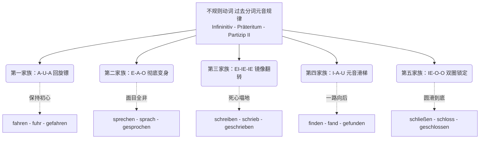

# 过去分词不规则变化

Guten Tag！欢迎再次回到你的“B 2 德语速成突击营”！

上一课我们扒光了“过去时（Präteritum）”的底裤，今天我们要迎战的是德国移民和生活中最常用、但也最让人头秃的——**不规则动词的过去分词（Partizip II）元音变化规律**。

为什么过去分词这么重要？因为在德国的日常生活里，无论是跟房东诉苦（现在完成时 Perfekt），还是听外管局官员打官腔（被动语态 Passiv），都绝对离不开它！

对于不规则动词（强变化动词），它们的过去分词核心结构通常是：**ge + 变音词干 + en**（注意词尾是 **-en**，而不是规则动词的 -t）。

面对几百个不规则动词，死记硬背是反人性的。今天，德语大师带你把它们分成**“五大变异家族”**。只要看透了它们的“基因序列（元音变化：原形 - 过去时 - 过去分词）”，你就能举一反三！

我们可以先通过这张图谱，在大脑里建立一个“元音变异分类抽屉”：

代码段

现在，我们逐一攻破这五大阵营，并直接植入你的移民生活场景中！

---

### 🪃 第一家族：A - U - A （回旋镖家族）

**形象类比：** 无论中间（过去时）经历了怎样的风波（变成 u），到了最终的结局（过去分词），它们又**回归了初心**，变回了原本的元音 **a**。

**核心成员：**

- **fahren** (乘车) -> fuhr -> **gefahren**
- **tragen** (搬运/穿) -> trug -> **getragen**
- **waschen** (洗) -> wusch -> **gewaschen**
- **schlagen** (打) -> schlug -> **geschlagen**

**🏡 移民生活实战（租房/搬家场景）：**

当你终于租到心仪的房子，搬家累得半死时，你可以跟朋友抱怨：

> "Ich habe gestern alle Möbel in die neue Wohnung **getragen**."
> 
> （我昨天把所有家具都搬进新公寓了。）

---

### 🎭 第二家族：E - A - O （彻底变身家族）

**形象类比：** 这是戏最多的一组。从现在，到过去，再到完成，每一次出场都要换一套全新的行头（元音完全不同）。这类词也是德语里最最最核心的高频词！

**核心成员：**

- **sprechen** (说) -> sprach -> **gesprochen**
- **helfen** (帮助) -> half -> **geholfen**
- **nehmen** (拿/取) -> nahm -> **genommen** (注意 m 双写了)
- **sterben** (死亡) -> starb -> **gestorben**
- **treffen** (遇见) -> traf -> **getroffen**

**🏥 移民生活实战（看病/面试场景）：**

去医院看病，或者去 Jobcenter（就业中心）面试完，这组词就是你的救命稻草：

> "Der Arzt hat mir sehr **geholfen**. Wir haben ausführlich über meine Krankheit **gesprochen**."
> 
> （医生帮了我大忙。我们详细谈论了我的病情。）

---

### 🪞 第三家族：EI - IE - IE （镜像翻转家族）

**形象类比：** 这种词干元音原本是 **ei**。到了过去时，它们像照镜子一样翻转成了 **ie**。更奇妙的是，到了过去分词阶段，它们彻底“死心塌地”了，**保持 ie 不变**。

**核心成员：**

- **schreiben** (写) -> schrieb -> **geschrieben**
- **bleiben** (停留) -> blieb -> **geblieben** (注意：搭配助动词 sein)
- **steigen** (攀登/上升) -> stieg -> **gestiegen** (搭配助动词 sein)
- **entscheiden** (决定) -> entschied -> **entschieden** (不可分前缀，无 ge-)

**🏢 移民生活实战（行政事务/外管局场景）：**

在外管局递交签证材料，或者签劳动合同时：

> "Ich habe den Arbeitsvertrag endlich **unterschrieben**. Deshalb bin ich in Deutschland **geblieben**."
> 
> （我终于签了工作合同。因此我留在了德国。）

---

### 🛝 第四家族：I - A - U （元音滑梯家族）

**形象类比：** 读这组词的时候，你的嘴巴形状就像在滑滑梯。从嘴巴咧开的 **i**，滑到张大的 **a**，最后滑到嘴唇收圆的 **u**。

**核心成员：**

- **finden** (找到/认为) -> fand -> **gefunden**
- **singen** (唱) -> sang -> **gesungen**
- **trinken** (喝) -> trank -> **getrunken**
- **binden** (绑定) -> band -> **gebunden**

**💼 移民生活实战（找工作/融入场景）：**

当你经历重重困难，终于在德国安顿下来时：

> "Nach drei Monaten habe ich endlich einen guten Job **gefunden** und ein Bier mit meinen Kollegen **getrunken**."
> 
> （三个月后我终于找到了一份好工作，并和同事们喝了杯啤酒。）

---

### ⭕ 第五家族：IE - O - O （圈圈家族）

**形象类比：** 原形是 **ie**，一旦进入过去状态，它们就变得非常“圆滑”，全都变成了嘴型圆圆的 **o**，并且在过去分词里死死锁住这个 **o**。

**核心成员：**

- **ziehen** (拉/搬家) -> zog -> **gezogen** (搬家搭配助动词 sein)
- **fliegen** (飞) -> flog -> **geflogen** (搭配助动词 sein)
- **schließen** (关闭) -> schloss -> **geschlossen**
- **verlieren** (丢失) -> verlor -> **verloren** (不可分前缀，无 ge-)

**✈️ 移民生活实战（出行/安居场景）：**

当你弄丢了护照，或者搬去另一个城市：

> "Ich bin letzten Monat nach Berlin **umgezogen**, aber leider habe ich auf dem Weg meinen Pass **verloren**."
> 
> （我上个月搬到了柏林，但倒霉的是我在路上把护照弄丢了。）

---

### 🗓️ 大师的 B 2 进阶半年规划建议（元音变异篇）

要在六个月内拿下 B 2，千万不要抱着一本字典死背 A-Z，请按照以下节奏植入你的大脑：

1. **第 1-2 个月：归类法集中突破（被动输入转主动输出）**
    
    - **任务：** 不要孤立地背 Partizip II！永远把**“原形 - 过去时 - 过去分词”**当成一首歌来背诵（比如：_helfen - half - geholfen_）。
    - **方法：** 按照我上面给你划分的“五大家族”，用不同颜色的笔做一套抽任闪卡（Flashcards）。每天只攻克一个家族，造 3 个属于你自己的生活例句。
        
2. **第 3-4 个月：强攻 B 1/B 2 核心语法——被动语态（Passiv）**
    
    - **任务：** 过去分词是构成被动语态的灵魂（_werden + Partizip II_）。在德国听新闻、看租房合同，全是被动语态。
    - **练习：** 试着把主动句变成被动句。比如把 "Der Chef hat den Vertrag unterschrieben" 转换为 "Der Vertrag ist vom Chef **unterschrieben** worden." (重点感受 unterschreiben 的镜像翻转规律)。
        
3. **第 5-6 个月：高阶状态被动与形容词化**
    
    - **任务：** 在 B 2 级别，过去分词经常直接当形容词用。
    - **练习：** 例如 "schließen"（关闭），你要能脱口而出："Die Tür ist **geschlossen**."（门是关着的 - 状态被动语态）。这能让你的表达瞬间高级。

掌握了元音变化的五大阵营，不规则动词就不再是随机的密码，而是有迹可循的乐谱。大胆地去用这些词造句吧，说错了大不了重来，德国人听到你能熟练运用 _gezogen_, _gesprochen_ 绝对会对你的德语水平刮目相看！
