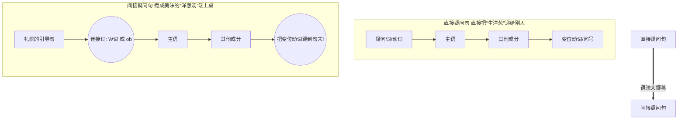

# 间接疑问句

Hallo！欢迎来到德语大师的语法课堂！听到你计划在六个月内达到 B 2 水平，并为未来的移民生活做准备，我为你感到非常骄傲。这个目标充满挑战，但只要我们把语法拆解成生活中的实际场景，你绝对可以做到！

今天我们要攻克的是 B 1-B 2 级别的核心堡垒之一：**间接疑问句（Indirekte Fragesätze）**。

在德国生活，无论是去外管局（Ausländerbehörde）延签、去面试找工作，还是看医生，**“礼貌（Höflichkeit）”**是沟通的黄金法则。直接问问题有时听起来像警察审问，而“间接疑问句”就像是给你的问题包上了一层精美的礼貌包装纸。

[cite_start]为了让你更直观地理解，我用 Mermaid 为你绘制了一张核心结构转换图。你可以看到，从上到下（`flowchart TD`）的结构 [cite: 229, 230][cite_start]，节点之间通过箭头（`-->`）连接 [cite: 332]：

看到图里那个红色的警告了吗？**把变位动词踢到句末！**这是德语从句（Nebensatz）的铁律。无论疑问句多长，那个负责根据人称变化的动词，必须像火车的最后一节车厢一样，老老实实呆在最后。

接下来，我们把间接疑问句分成两大家族来系统破解：

---

### 第一家族：特殊疑问句 (W-Fragen) 的间接化

**什么是特殊疑问句？**

就是带有 W 开头疑问词的句子，比如：wer（谁）、was（什么）、wo（哪里）、wann（什么时候）、warum（为什么）、wie（怎么）。

**变身秘籍：**

保留原来的 W 疑问词作为连接主句和从句的“桥梁”，然后**把变位动词踢到句末**！

#### 🏡 场景 1：市政厅（Bürgeramt）办事

你刚到德国，在市政厅迷路了，想问工作人员签证处在哪里。

* **直接问（像审问）：** *Wo ist die Ausländerbehörde?* (外管局在哪？)
* **间接问（礼貌满分）：** *Können Sie mir sagen, **wo** die Ausländerbehörde **ist**?* (您能告诉我，外管局在哪里吗？)
    * *解析：* “Wo”留作桥梁，“ist”被一脚踢到了最后。

#### 💼 场景 2：求职面试（Vorstellungsgespräch）

面试到了尾声，你想了解薪资待遇。

* **直接问（太生硬）：** *Wie viel verdiene ich hier?* (我在这赚多少？)
* **间接问（专业委婉）：** *Ich möchte gerne wissen, **wie viel** ich hier **verdiene**.* (我想了解一下，我在这里能赚多少。)
    * *解析：* “Wie viel”是一个整体，作为桥梁。“verdiene”踢到最后。请注意，因为主句“Ich möchte gerne wissen”是一个陈述句，所以整个句子结尾用**句号**。

---

### 第二家族：一般疑问句 (Ja/Nein-Fragen) 的间接化

**什么是一般疑问句？**

就是没有疑问词，对方只能回答“是 (Ja)”或“否 (Nein)”的句子。比如：“可以养狗吗？”、“我需要预约吗？”。

**变身秘籍：**

因为没有 W 疑问词可以当桥梁了，所以我们需要请出德语里神奇的万能胶水词——**“ob”（是否）**。用“ob”连接句子，然后同样**把变位动词踢到句末**！

#### 🔑 场景 3：租房看房（Wohnungssuche）

你看到一套很棒的公寓，想问房东能不能养你的宠物猫。

* **直接问（略显突兀）：** *Sind Haustiere erlaubt?* (允许养宠物吗？)
* **间接问（让人舒服）：** *Darf ich fragen, **ob** Haustiere erlaubt **sind**?* (请问，是否允许养宠物呢？)
    * *解析：* 用“ob”当桥梁，原来的表语“erlaubt”往前挪，变位动词“sind”放在绝对的句末。

#### 🏥 场景 4：诊所看病（Beim Arzt）

你想去专科医生那里看病，但不确定需不需要提前预约。

* **直接问（干巴巴）：** *Brauche ich einen Termin?* (我需要预约吗？)
* **间接问（标准德式表达）：** *Können Sie mir bitte sagen, **ob** ich einen Termin **brauche**?* (您能告诉我，我是不是需要一个预约？)
    * *解析：* 没有疑问词，立刻想到用“ob”。主语“ich”紧跟在 ob 后面，动词“brauche”去结尾。

---

### 💡 德语大师的标点符号小贴士

间接疑问句结尾到底是用“问号（?）”还是“句号（.）”，**完全取决于前面的主句！**

* 主句是问句 ➡️ *Können Sie mir sagen, ... ?* （结尾用问号）
* 主句是陈述 ➡️ *Ich weiß nicht, ... .* / *Ich möchte wissen, ... .* （结尾用句号）

### 📅 针对你 6 个月 B 2 目标的学习建议：

间接疑问句在 B 1 的口语考试（Teil 1 共同规划事物）和 B 2 的正式书信（Bitte um Informationen 请求信息）中是**必考且绝对的加分项**。

在接下来的两周内，我建议你每次去超市、坐火车或者看德语视频时，在脑海里玩“包装游戏”：把你能想到的每一个直接问题，都试着用 *“Ich möchte wissen, ...”* 或者 *“Wissen Sie, ...”* 给它包装起来。

准备好用间接疑问句来检验你的学习成果了吗？想象一下，你现在正在德国的医疗保险公司（Krankenkasse）前台，你想问：“保险公司会支付这个费用吗？（Zahlt die Krankenkasse das?）” 请你用“Können Sie mir sagen, ...”作为主句，把这句话改写成一句完美礼貌的间接疑问句，好吗？
