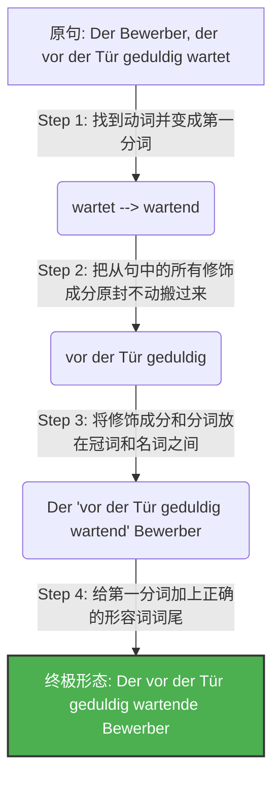

# 第一分词作定语

要顺利在德国定居、找工作和处理各类行政事务，你需要能够精准、地道地表达复杂的逻辑。你今天提到的**第一分词作定语 (Partizip I als Attribut)**，正是从 B 1 跨越到 B 2 的一把“黄金钥匙”。掌握了它，你的德语就不再是简单句的堆砌，而是像母语者一样紧凑、高级。

为了让你彻底弄懂，我们不背枯燥的教条。让我们用“抓拍相机”和“德式汉堡包”的类比，把这个硬核语法拆解得明明白白！

---

## 一、 核心概念：什么是第一分词？

你可以把第一分词 (Partizip I) 想象成一台**“抓拍相机”**或者一场**“现场直播”**。

它永远具有两个核心特征：

- **主动**：动作是这个名词自己发出的。
- **正在进行**：动作此刻正在发生，没有结束。

就像中文里的“**正在……的**”或英语里的“-ing”形式。

### 变形规则（极度简单）

**动词原形 (Infinitiv) + d = 第一分词**

- lachen (笑) -> lachend (正在笑的)
- weinen (哭) -> weinend (正在哭的)
- suchen (寻找) -> suchend (正在寻找的)

---

## 二、 第一分词作定语：穿上形容词的外套

当第一分词被放在名词前面作定语（修饰名词）时，它就完全变成了一个**形容词**。既然是形容词，它就必须遵守一个铁律：**加上形容词词尾 (Adjektivendung)！**

我们来看几个生活中的高频场景：

- **找工作场景**：

    Das ist ein _gut bezahlender_ Arbeitgeber. (这是一家薪水给得很好的雇主。)

    _分析：bezahlen + d + er (因为是 ein，阳性第一格)_

- **租房场景**：

    Die _steigenden_ Mieten in München sind ein Problem. (慕尼黑不断上涨的租金是个问题。)

    _分析：steigen + d + en (复数特定冠词后的词尾)_

- **医疗场景**：

    Das _weinende_ Kind braucht einen Arzt. (这个正在哭泣的孩子需要医生。)

    _分析：weinen + d + e (中性特定冠词后的词尾)_

---

## 三、 B 2 级别的终极 BOSS：扩展定语 (Erweitertes Partizipialattribut)

在 B 2 的阅读和写作考试中，你几乎每一篇都会遇到“扩展定语”。德国人非常喜欢把一个很长的关系从句 (Relativsatz) 压缩成一个巨大的“定语汉堡包”，塞在冠词和名词之间。

代码段

### 解密“德式汉堡包”结构

这个结构之所以让很多学生头疼，是因为它的阅读顺序和中文是相反的（左分支结构）。我们用汉堡包来拆解它：

- **顶层汉堡胚**：冠词 (Der, Die, Das, Ein...)
- **里面的蔬菜烤肉**：所有的状语、介词短语 (vor der Tür geduldig - 在门外耐心地)
- **核心芝士**：第一分词 + 词尾 (wartende - 正在等待的)
- **底层汉堡胚**：名词 (Bewerber - 申请人)

当你阅读或者造句时，**看到冠词后，如果紧跟着的不是名词，请立刻跳到名词前面的那个分词（芝士），然后再回头看中间的修饰成分。**

---

## 四、 移民实战场景解析

为了让你在六个月内不仅能考试通关，还能直接在德国用上，我们把这个语法代入到你即将面对的真实生活中。

### 场景 1：外管局延签 (Ausländerbehörde)

- **关系从句**：Die Antragsteller, _die stundenlang auf dem Flur stehen_, sind müde. (那些在走廊里站了几个小时的申请人很累了。)
- **第一分词定语**：Die _stundenlang auf dem Flur stehenden_ Antragsteller sind müde.
- **大师点评**：直接把“stundenlang auf dem Flur”这块烤肉夹进去，动词 stehen 变成 stehenden，句子瞬间变得极其正式、紧凑，这就是标准的 B 2 官方公文语体。

### 场景 2：租房看房 (Wohnungssuche)

- **关系从句**：Ich suche eine Wohnung, _die in der Nähe der U-Bahn liegt_. (我在找一套位于地铁附近的公寓。)
- **第一分词定语**：Ich suche eine _in der Nähe der U-Bahn liegende_ Wohnung.
- **大师点评**：写租房求职信 (Anschreiben) 时用这种句型，房东一看就知道你的德语水平极高，从而增加给你看房机会的概率。

### 场景 3：银行与税务 (Bank und Finanzamt)

- **关系从句**：Bitte senden Sie uns das Formular, _das noch fehlt_. (请将还缺失的表格发给我们。)
- **第一分词定语**：Bitte senden Sie uns das _noch fehlende_ Formular.
- **大师点评**：在处理德国繁琐的行政信件时，“das fehlende Dokument”（缺失的文件）是一个你必须刻在脑子里的高频搭配。

---

## 五、 大师的学习规划建议

要在六个月内稳扎稳打冲刺 B 2，你需要科学的规划：

1. **前两个月（巩固 B 1，引入 B 2 初级）**：
    
    - 复习所有的形容词词尾变化 (Adjektivdeklination)，这是第一分词作定语的基础。词尾变错，分词用得再高级也会大打折扣。
    - 开始习惯将简单的 Relativsatz（关系从句）转换成 Partizip I，每天练习写 3 个句子。
        
2. **中间两个月（攻克 B 2 核心难点）**：
    
    - 大量阅读德国新闻（如 Tagesschau）或官方租房、求职网站。拿着荧光笔，专门寻找“冠词......分词+名词”的汉堡包结构。
    - 训练自己的眼睛：一眼锁定冠词和名词，精准识别中间包裹的第一分词。
        
3. **最后两个月（实战输出与备考）**：
    
    - 在你的 B 2 写作训练（如写正式投诉信、求职信、询价信）中，强制要求自己每篇文章至少使用一次“扩展的第一分词定语”。
    - 练习“逆向还原”：看到复杂的第一分词定语，在脑海里瞬间把它还原成关系从句，这对 B 2 的阅读理解提速至关重要。

语法并不是死记硬背的规则，而是你在这个新国家表达诉求、争取权利的工具。把这台“主动进行时的抓拍相机”装进你的武器库，无论是面对外管局的签证官，还是未来的雇主，你都能展现出自信且专业的德语水准！加油！
