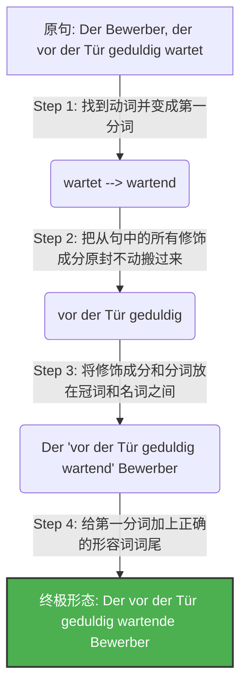
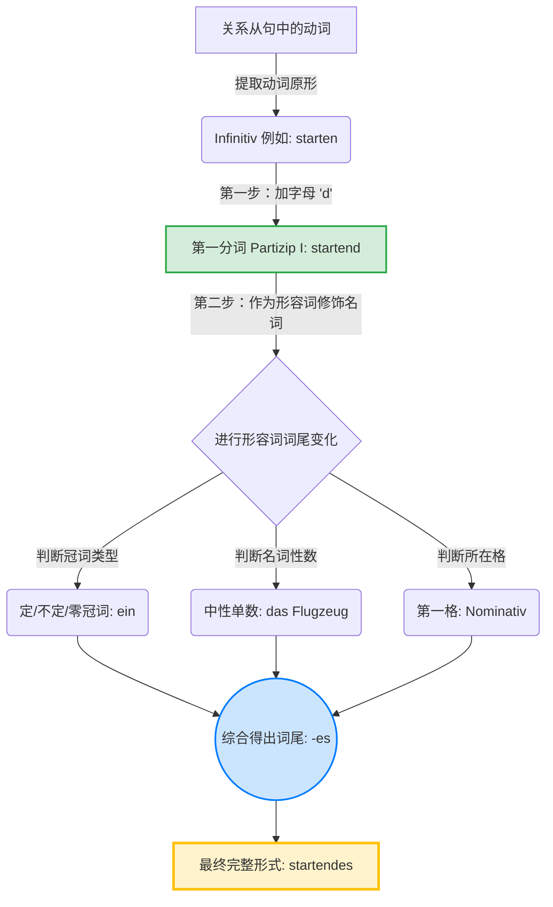

# 第一分词作定语

要顺利在德国定居、找工作和处理各类行政事务，你需要能够精准、地道地表达复杂的逻辑。你今天提到的**第一分词作定语 (Partizip I als Attribut)**，正是从 B 1 跨越到 B 2 的一把“黄金钥匙”。掌握了它，你的德语就不再是简单句的堆砌，而是像母语者一样紧凑、高级。

为了让你彻底弄懂，我们不背枯燥的教条。让我们用“抓拍相机”和“德式汉堡包”的类比，把这个硬核语法拆解得明明白白！

---

## 一、 核心概念：什么是第一分词？

你可以把第一分词 (Partizip I) 想象成一台**“抓拍相机”**或者一场**“现场直播”**。

它永远具有两个核心特征：

- **主动**：动作是这个名词自己发出的。
- **正在进行**：动作此刻正在发生，没有结束。

就像中文里的“**正在……的**”<font color="#d83931">或英语里的“-ing”形式。</font>

### 变形规则（极度简单）

**动词原形 (Infinitiv) + d = 第一分词**

- lachen (笑) -> lachend (正在笑的)
- weinen (哭) -> weinend (正在哭的)
- suchen (寻找) -> suchend (正在寻找的)

---

## 二、 第一分词作定语：穿上形容词的外套

当第一分词被放在名词前面作定语（修饰名词）时，它就完全变成了一个**形容词**。既然是形容词，它就必须遵守一个铁律：**加上形容词词尾 (Adjektivendung)！**

我们来看几个生活中的高频场景：

- **找工作场景**：

    Das ist ein _gut bezahlender_ Arbeitgeber. (这是一家薪水给得很好的雇主。)

    _分析：bezahlen + d + er (因为是 ein，阳性第一格)_

- **租房场景**：

    Die _steigenden_ Mieten in München sind ein Problem. (慕尼黑不断上涨的租金是个问题。)

    _分析：steigen + d + en (复数特定冠词后的词尾)_

- **医疗场景**：

    Das _weinende_ Kind braucht einen Arzt. (这个正在哭泣的孩子需要医生。)

    _分析：weinen + d + e (中性特定冠词后的词尾)_

---

## 三、 B 2 级别的终极 BOSS：扩展定语 (Erweitertes Partizipialattribut)

在 B 2 的阅读和写作考试中，你几乎每一篇都会遇到“扩展定语”。德国人非常喜欢把一个很长的关系从句 (Relativsatz) <font color="#d83931">压缩成一个巨大的“定语汉堡包”，塞在冠词和名词之间。</font>

代码段



### 解密“德式汉堡包”结构

这个结构之所以让很多学生头疼，是因为它的阅读顺序和中文是相反的（左分支结构）。我们用汉堡包来拆解它：

- **顶层汉堡胚**：冠词 (Der, Die, Das, Ein...)
- **里面的蔬菜烤肉**：所有的状语、介词短语 (vor der Tür geduldig - 在门外耐心地)
- **核心芝士**：第一分词 + 词尾 (wartende - 正在等待的)
- **底层汉堡胚**：名词 (Bewerber - 申请人)

当你阅读或者造句时，**看到冠词后，如果紧跟着的不是名词，请立刻跳到名词前面的那个分词（芝士），然后再回头看中间的修饰成分。**

---

## 四、 移民实战场景解析

为了让你在六个月内不仅能考试通关，还能直接在德国用上，我们把这个语法代入到你即将面对的真实生活中。

### 场景 1：外管局延签 (Ausländerbehörde)

- **关系从句**：Die Antragsteller, _die stundenlang auf dem Flur stehen_, sind müde. (那些在走廊里站了几个小时的申请人很累了。)
- **第一分词定语**：Die _stundenlang auf dem Flur stehenden_ Antragsteller sind müde.
- **大师点评**：直接把“stundenlang auf dem Flur”这块烤肉夹进去，动词 stehen 变成 stehenden，句子瞬间变得极其正式、紧凑，这就是标准的 B 2 官方公文语体。

### 场景 2：租房看房 (Wohnungssuche)

- **关系从句**：Ich suche eine Wohnung, _die in der Nähe der U-Bahn liegt_. (我在找一套位于地铁附近的公寓。)
- **第一分词定语**：Ich suche eine _in der Nähe der U-Bahn liegende_ Wohnung.
- **大师点评**：写租房求职信 (Anschreiben) 时用这种句型，房东一看就知道你的德语水平极高，从而增加给你看房机会的概率。

### 场景 3：银行与税务 (Bank und Finanzamt)

- **关系从句**：Bitte senden Sie uns das Formular, _das noch fehlt_. (请将还缺失的表格发给我们。)
- **第一分词定语**：Bitte senden Sie uns das _noch fehlende_ Formular.
- **大师点评**：在处理德国繁琐的行政信件时，“das fehlende Dokument”（缺失的文件）是一个你必须刻在脑子里的高频搭配。

---

## 五、 大师的学习规划建议

要在六个月内稳扎稳打冲刺 B 2，你需要科学的规划：

1. **前两个月（巩固 B 1，引入 B 2 初级）**：
    
    - 复习所有的形容词词尾变化 (Adjektivdeklination)，这是第一分词作定语的基础。词尾变错，分词用得再高级也会大打折扣。
    - 开始习惯将简单的 Relativsatz（关系从句）转换成 Partizip I，每天练习写 3 个句子。
        
2. **中间两个月（攻克 B 2 核心难点）**：
    
    - 大量阅读德国新闻（如 Tagesschau）或官方租房、求职网站。拿着荧光笔，专门寻找“冠词......分词+名词”的汉堡包结构。
    - 训练自己的眼睛：一眼锁定冠词和名词，精准识别中间包裹的第一分词。
        
3. **最后两个月（实战输出与备考）**：
    
    - 在你的 B 2 写作训练（如写正式投诉信、求职信、询价信）中，强制要求自己每篇文章至少使用一次“扩展的第一分词定语”。
    - 练习“逆向还原”：看到复杂的第一分词定语，在脑海里瞬间把它还原成关系从句，这对 B 2 的阅读理解提速至关重要。

语法并不是死记硬背的规则，而是你在这个新国家表达诉求、争取权利的工具。把这台“主动进行时的抓拍相机”装进你的武器库，无论是面对外管局的签证官，还是未来的雇主，你都能展现出自信且专业的德语水准！加油！

# ❌

# 1

![[image-321.png|1024x622]]

你好！我是你的德语语法导师。很高兴看到你正在进行**第一分词（Partizip I）作定语**的练习。

观察你图片上的作答，我发现了一个非常典型且令人惊喜的现象：**你敏锐且准确地写出了所有的形容词词尾（用蓝色笔写的 es, e, er 等），这证明你的“形容词词尾变化（Adjektivdeklination）”基础非常扎实！** **但是，你漏掉了填空题最核心的部分——分词的词干。** 填空处不仅需要词尾，还需要由动词变化而来的第一分词本身。让我们秉持“纠一错，通一类”的原则，一起来彻底攻克这个 B 1-B 2 级别的核心语法点。

---

### 1、逐题精析与纠正

**题目类型：** 关系从句（Relativsatz）转化为第一分词作定语（Partizip I als Attribut）。

**题目要求：** 请用句中动词的第一分词形式填空（并补充正确的词尾）。

**【第 1 题】** Ein Flugzeug, das startet, ist ein ________ es Flugzeug.

- **翻译与语法（A 2-B 1）：** 一架正在起飞的飞机，是一架起飞中的飞机。这里用到 A 2 的关系从句 `das startet` 来修饰中性名词 `das Flugzeug`。
- **诊断与分析：** * _你的答案：_ 仅填写了词尾 `es`。
    - _错误原因（认知遗漏）：_ 你知道这是一个不定冠词中性第一格的形容词词尾（ein ...**es** Flugzeug），但忽略了要把从句动词 `startet` 转换为第一分词 `startend`。
    - _正确形式：_ **startendes** (starten + d + es)

**【第 2 题】** Die Sonne, die aufgeht, ist die ________ e Sonne.

- **翻译与语法：** 正在升起的太阳，是初升的太阳。
- **诊断与分析：** 动词为可分动词 `aufgehen`。第一分词直接在原形后加 d 变成 `aufgehend`。定冠词阴性第一格词尾为 `e`。
    - _正确形式：_ **aufgehende** (aufgehen + d + e)

**【第 3 题】** Eine Kerze, die brennt, ist eine ________ e Kerze.

- **翻译与语法：** 一根正在燃烧的蜡烛。
- **诊断与分析：** 动词 `brennen` $\rightarrow$ `brennend`。不定冠词阴性第一格词尾为 `e`。
    - _正确形式：_ **brennende** (brennen + d + e)

**【第 4 题】** Temperaturen, die sinken, sind ________ e Temperaturen.

- **翻译与语法：** 正在下降的温度，是下降的温度。
- **诊断与分析：** 动词 `sinken` $\rightarrow$ `sinkend`。零冠词复数第一格，词尾同强变化定冠词 `die`，即 `e`。
    - _正确形式：_ **sinkende** (sinken + d + e)

**【第 5 题】** Wasser, das kocht, ist ________ es Wasser.

- **翻译与语法：** 正在沸腾的水，是开水。
- **诊断与分析：** 动词 `kochen` $\rightarrow$ `kochend`。零冠词中性第一格，词尾同 `das`，即 `es`。
    - _正确形式：_ **kochendes** (kochen + d + es)

**【第 6 题】** Preise, die steigen, sind ________ e Preise.

- **翻译与语法：** 正在上涨的价格。
- **诊断与分析：** 动词 `steigen` $\rightarrow$ `steigend`。零冠词复数第一格词尾为 `e`。
    - _正确形式：_ **steigende** (steigen + d + e)

**【第 7 题】** Ein Bus, der ankommt, ist ein ________ er Bus.

- **翻译与语法：** 一辆正在到达的公交车。
- **诊断与分析：** 动词 `ankommen` $\rightarrow$ `ankommend`。不定冠词阳性第一格词尾为 `er`。
    - _正确形式：_ **ankommender** (ankommen + d + er)

**【第 8 题】** Fische, die fliegen, sind ________ e Fische.

- **翻译与语法：** 会飞的鱼，是飞鱼。
- **诊断与分析：** 动词 `fliegen` $\rightarrow$ `fliegend`。零冠词复数第一格词尾为 `e`。
    - _正确形式：_ **fliegende** (fliegen + d + e)

**【第 9 题】** Eine Mutter, die ihr Kind alleine erzieht, ist eine allein________ e Mutter.

- **翻译与语法：** 一位独自抚养孩子的母亲，是一位单亲妈妈。
- **诊断与分析：** 这里考察了合成词的构成。副词 `allein` + 动词 `erziehen` 构成分词 `alleinerziehend`。不定冠词阴性第一格。
    - _正确形式：_ **erziehende** （因为题干已经给出了 allein，所以填 erziehende 即可合成 alleinerziehende）

**【第 2 题 连线搭配扩展解析】**

要求将左侧动词转化为第一分词，修饰右侧名词：

- **sprechen (说)** + der Mann $\rightarrow$ **der sprechende Mann** (正在说话的男人)
- **lesen (读)** + der Mann $\rightarrow$ **der lesende Mann** (正在阅读的男人)
- **fließen (流)** + das Wasser $\rightarrow$ **das fließende Wasser** (流动的水)
- **kochen (煮/沸腾)** + das Wasser $\rightarrow$ **das kochende Wasser** (沸腾的水)
- **fliegen (飞)** + der Vogel / das Flugzeug $\rightarrow$ **der fliegende Vogel** (飞翔的鸟) / **das fliegende Flugzeug** (飞行中的飞机)

---

### 2、深度教学解析（聚焦：第一分词作定语 Partizip I als Attribut）

为了让你彻底理清从“动词”到“修饰名词的定语”这一转换过程，我们用一张流程图来看看第一分词是如何“组装”出来的：

代码段



- **核心规则：**
    
    1. **形态构成：** 第一分词 = 动词原形 (Infinitiv) + **d** （例如：lachen $\rightarrow$ lachend）。
    2. **句法功能：** 它等同于一个**形容词**，放在名词前面作定语时，**必须**根据前面的冠词和后面的名词进行“形容词词尾变化”。
    3. **核心意义：** 表达“**主动的**”（Akteur）且“**正在进行的 / 同时发生的**”（Gleichzeitigkeit）动作。它是关系从句（... der/die/das + 动词）的高级且简洁的替代形式。
        
- **正反对比例证：**
    - **本例（主动进行）：** das **kochende** Wasser (正在沸腾的水)。水主动在开，且动作正在进行。 = das Wasser, das (gerade) kocht.
    - **反例（对比第二分词 Partizip II - 被动完成）：** das **gekochte** Wasser (煮开过的水/凉白开)。水是被煮开的，且动作已经完成。 = das Wasser, das gekocht wurde.
    - **拓展例（带扩展语）：** 第一分词的强大之处在于可以把整个句子压缩在名词前。
        - 从句：Die Sonne, _die im Osten langsam aufgeht_.
        - 分词短语：Die _im Osten langsam_ **aufgehende** Sonne. (在东方缓缓升起的太阳)。
- **防错要点口诀：**

    > **“找动词，加个 d，看名词，定词尾！”** > (千万不要像这次练习一样，只加了词尾，忘了带上“加了 d”的动词本体哦！)

- **小试牛刀 (建议你可以在心里默答)：**

    将句子转化为第一分词作定语的形式：

    Ein Kind, das weint, braucht Trost.

    $\rightarrow$ Ein _____________ Kind braucht Trost.

    _(答案揭晓：weinendes。weinen + d + es)_

---

### 3、总结与回顾

- **您的学习建议：** 你在形容词词尾判断上表现出了极高的准确度，这对于德语学习者来说是非常难得的优势！你目前的唯一盲区只是**没有理解题目的完整意图**（漏填了词干）。在后续的学习中，请牢记 **“第一分词 = 动词原形 + d”** 这个形态标志。下次做填空题时，先写下带有 'd' 的词干，再接上你已经掌握得非常好的词尾，这个语法点你就完全通关了！继续保持这种对语法细节的敏感度，你会学得越来越好！

# 2

![[PixPin_2026-04-07_22-23-04.png|1285x700]]
你好！我是你的德语语法导师。很高兴能帮你解析这份关于**第一分词（Partizip I）作定语**的练习题。这篇名为《Meine Urlaubsreise》（我的度假之旅）的短文非常生动地考察了分词构成的基本功以及**形容词词尾变化（Adjektivdeklination）**的综合运用。

由于图片是一份未作答的空白试卷，我将为你进行一次全方位的“通关演示”，带你彻底扫清这 8 个填空的语法障碍。

---

### 1、逐题精析与纠正

**题目类型：** 第一分词（Partizip I）的构成及其作为定语时的形容词词尾变化。

**题目要求：** 请用括号内动词的第一分词形式填空，并在必要处加上正确的词尾。

**【第 1 题】** Nach vielen ________ (anstrengen) Wochen bei der Arbeit hatte ich endlich Urlaub und wollte verreisen.

- **翻译：** 在经历了许多周劳累的工作之后，我终于有了假期并想去旅行。
    
- **诊断与分析：** * 第一步（变分词）：动词 `anstrengen`（使…疲劳） $\rightarrow$ `anstrengend`。
    
    - 第二步（定词尾）：介词 `Nach` 要求接第三格（Dativ）。名词 `Wochen` 是复数。前面有 `vielen`。在复数第三格中，形容词词尾为 **-en**。
        
    - **正确形式：** **anstrengenden** **【第 2 题】** Meine Reise begann bei ________ (strömen) Regen.
        
- **翻译：** 我的旅行在倾盆大雨中开始了。
    
- **诊断与分析：** * 第一步：动词 `strömen`（流淌/倾注） $\rightarrow$ `strömend`。
    
    - 第二步：介词 `bei` 要求第三格（Dativ）。名词 `Regen` 是阳性（der Regen）。这里是零冠词（没有 der/ein 等）。阳性单数、零冠词、第三格，形容词需承担强变化词尾 **-em**。
        
    - **正确形式：** **strömendem**
        

**【第 3 题】** Am Bahnhof sah ich gleich viele ________ (warten) Menschen.

- **翻译：** 在火车站，我立刻看到了许多正在等候的人。
    
- **诊断与分析：** * 第一步：动词 `warten`（等待） $\rightarrow$ `wartend`。
    
    - 第二步：动词 `sah` (sehen) 要求第四格（Akkusativ）。`Menschen` 是复数。前面有不定代词 `viele`，其后的形容词按零冠词复数强变化处理，第四格词尾为 **-e**。
        
    - **正确形式：** **wartende**
        

**【第 4 题】** Als der Zug ankam, drückten sich sofort viele Leute durch die sich gerade ________ (öffnen) Tür.

- **翻译：** 当火车到达时，许多人立刻从刚刚正在打开的门挤了进去。
    
- **诊断与分析：** * 第一步：反身动词 `sich öffnen` 的分词为 `öffnend`。
    
    - 第二步：介词 `durch` 要求第四格（Akkusativ）。名词 `Tür` 是阴性（die Tür）。前面有定冠词 `die`。阴性单数、定冠词、第四格，形容词弱变化词尾为 **-e**。
        
    - **正确形式：** **öffnende**
        

**【第 5 题】** Ich musste während der ganzen Fahrt zwischen ________ (streiten) Jugendlichen stehen.

- **翻译：** 在整个旅途中，我不得不站在正在争吵的年轻人中间。
    
- **诊断与分析：** * 第一步：动词 `streiten`（争吵） $\rightarrow$ `streitend`。
    
    - 第二步：介词 `zwischen` 表示静止状态（站在中间），这里接第三格（Dativ）。`Jugendlichen` 是复数名词。这里是零冠词。复数、零冠词、第三格，强变化词尾为 **-en**。
        
    - **正确形式：** **streitenden**
        

**【第 6 题】** Nachdem ich ausgestiegen war und dem ________ (abfahren) Zug nachsah, bemerkte ich, dass ich meinen Koffer vergessen hatte.

- **翻译：** 在我下车并目送正在开走的火车之后，我发现我把行李箱忘（在车上）了。
    
- **诊断与分析：** * 第一步：动词 `abfahren`（驶离） $\rightarrow$ `abfahrend`。
    
    - 第二步：动词短语 `etw.(Dat) nachsehen`（目送某物）要求第三格。`Zug` 是阳性（der Zug）。前面有定冠词 `dem`。阳性单数、定冠词、第三格，弱变化词尾为 **-en**。
        
    - **正确形式：** **abfahrenden**
        

**【第 7 题】** Aber schon vom Bahnhof aus konnte ich den See und die ________ (aufgehen) Sonne sehen!

- **翻译：** 但是从火车站我已经能看到湖泊和正在升起的太阳了！
    
- **诊断与分析：** * 第一步：动词 `aufgehen`（升起） $\rightarrow$ `aufgehend`。
    
    - 第二步：作为 `sehen` 的宾语，第四格（Akkusativ）。`Sonne` 是阴性（die Sonne）。前面有定冠词 `die`。阴性单数、定冠词、第四格，弱变化词尾为 **-e**。
        
    - **正确形式：** **aufgehende**
        

**【第 8 题】** Es war dann noch ein sehr ________ (entspannen) Urlaub.

- **翻译：** 那后来还是一个非常令人放松的假期。
    
- **诊断与分析：** * 第一步：动词 `entspannen`（放松） $\rightarrow$ `entspannend`。
    
    - 第二步：系动词 `sein` (war) 要求第一格（Nominativ）。`Urlaub` 是阳性（der Urlaub）。前面有不定冠词 `ein`。阳性单数、不定冠词、第一格，强变化词尾为 **-er**。
        
    - **正确形式：** **entspannender**
        

---

### 2、深度教学解析（聚焦：第一分词作定语及词尾变化）

德语中，分词作定语是一个非常高级且地道的表达方式（通常在 B 1-B 2 阶段重点训练）。它可以将冗长的关系从句（Relativsatz）完美压缩成一个“形容词”。

为了让你不再对这种题型感到头疼，我们用一个思维导图来看看它的“加工流水线”：

代码段

```
graph TD
    A[动词原形 Infinitiv] -->| 加上字母 'd' | B(第一分词 Partizip I)
    B --> C{是否放在名词前作定语?}
    C -->|是| D[进行形容词词尾变化]
    D --> E[判断名词的 性/数]
    D --> F[判断句子所在的 格 Kasus]
    D --> G[判断前面的 冠词类型]
    E -.-> H
    F -.-> H
    G -.-> H
    H((查表确定最终词尾)) --> I[完整的分词定语形式]
    
    style B fill:#d4edda,stroke:#28a745,stroke-width:2px
    style H fill:#cce5ff,stroke:#007bff,stroke-width:2px
    style I fill:#fff3cd,stroke:#ffc107,stroke-width:3px
```

- **核心规则：**
    
    1. **主动与进行：** 第一分词表达的是一个**主动的**、且**正在进行**的动作。（例如本题的 `strömender Regen`，雨主动在下，且正在下）。
        
    2. **词性转换：** 一旦它加上了 `d` 变成了分词，并且放在名词前面，它就**彻底变成了一个形容词**。你必须像对待 `gut`, `schön` 这些词一样，严格给它加形容词词尾！
        
- **正反对比例证：**
    
    - **本例（第一分词 - 主动进行）：** die **öffnende** Tür (正在打开的门)。门正在进行“开”这个动作。等同于从句：die Tür, die sich gerade öffnet。
        
    - **反例（第二分词 - 被动完成）：** die **geöffnete** Tür (（被）打开的门)。门已经被打开了，呈现开着的状态。等同于从句：die Tür, die geöffnet wurde。
        
- **防错要点：**
    
    > **“做定语，分两步：先加 d 变分词，再查表定词尾！”** > 很多同学要么忘了加 `d` 直接加词尾（错误：streitenen），要么加了 `d` 却忘了加形容词词尾（错误：streitend Jugendlichen）。记住这首两步走口诀，就能百发百中。
    
- **小试牛刀：**
    
    尝试将下面的关系从句转换为第一分词定语短语：
    
    Ein Kind, das weint. (一个正在哭泣的孩子)
    
    $\rightarrow$ Ein _______________ Kind.
    
    _(答案提示：weinen -> weinend -> 中性单数不定冠词第一格 -> weinendes)_
    

---

### 3、总结与回顾

- **您的终极学习建议：** 这类题型的本质是**“披着动词外衣的形容词词尾变化题”**。只要动词变分词的规则（+d）你掌握了，剩下的全是在考查你的形容词词尾基本功。建议你在复习时，重点回顾**“零冠词（强变化）”**和**“不定冠词混合变化”**这两张词尾表，尤其要对介词（如 bei, durch, zwischen）后面接什么格保持高度敏感。词尾表背熟了，这类题就是送分题！加油！
# 3
![[image-328.png|867x311]]
Hallo! 作为你的德语语法导师，我很高兴能和你一起攻克这道题目。

### 1) 精准识别与提取

**题目类型**：第一分词（Partizip I）的构成及其作为**定语时的形容词词尾变化**（Adjektivdeklination）。

**题目要求**：Ein Rätsel: Wo bin ich? 请从方框里选出适合的动词并用其第一分词形式填空。

**候选词库**：schimpfen（骂/抱怨）, laufen（跑/运转）, hupen（按喇叭）, schlafen（睡觉）, spielen（玩耍）, stehen（站/停）, laufen（跑/运转）

**完整题干**：

Ich höre _________ Autos und laut _________ Leute. Vor, neben und hinter mir sehe ich _________ Autos, manche mit _________ Motor. Im Auto hinter mir sitzt ein _________ Kind neben seiner _________ Mutter. Ich konzentriere mich auf das _________ Radio. ich möchte wissen, wann es endlich weiter geht.

Lösung: Ich stehe im _________ .

---

### 1、逐题精析与纠正

由于你提供的是空白题目，我将为你提供标准答案，并基于我多年教学经验中学生最容易犯的“典型错误”进行逆向诊断。

- **[空格 1 & 2]：Ich höre `hupende` Autos und laut `schimpfende` Leute.**
    
    - **翻译**：我听到按着喇叭的汽车和大声抱怨的人们。
        
    - **典型错误**：填入 _hupend_ / _schimpfend_（忘记加词尾），或 _hupenden_ / _schimpfenden_（词尾判断错误）。
        
    - **错误剖析**：学生常忘记第一分词作定语时**必须像形容词一样变格**。这里 `Autos` 和 `Leute` 均为复数（Plural），在句中作听觉的宾语（第四格 Akkusativ），且前面**没有冠词**（零冠词，强变化）。
        
    - **正确推导**：hupen -> hupend + e = **hupende**；schimpfen -> schimpfend + e = **schimpfende**。
        
- **[空格 3]：Vor, neben und hinter mir sehe ich `stehende` Autos...**
    
    - **翻译**：在我前面、旁边和后面，我看到停滞不前的汽车...
        
    - **典型错误**：_stehenden_。
        
    - **错误剖析**：同样受介词干扰，但请注意，这里的 `Autos` 是动词 `sehen` 的直接宾语（第四格），前面的介词短语只是地点状语。复数、第四格、零冠词 -> 词尾加 -e。
        
    - **正确推导**：stehen -> stehend + e = **stehende**。
        
- **[空格 4]：... manche mit `laufendem` Motor.**
    
    - **翻译**：...有些发动机还在运转着。
        
    - **典型错误**：_laufenden_。
        
    - **错误剖析**：未注意到介词 `mit`。**mit 永远支配第三格（Dativ）**。`Motor` 是阳性名词（der），前面无冠词，属于强变化。阳性第三格强变化的特征词尾是 -em (如同 d**em**)。
        
    - **正确推导**：laufen -> laufend + em = **laufendem**。
        
- **[空格 5 & 6]：Im Auto hinter mir sitzt ein `spielendes` Kind neben seiner `schlafenden` Mutter.**
    
    - **翻译**：在我后面的车里，一个正在玩耍的孩子坐在他正在睡觉的母亲旁边。_(注：将 schlafen 和 spielen 互换在语法上也完全正确，但“玩闹的孩子和疲惫入睡的母亲”更符合堵车时的生活常识语境)_。
        
    - **典型错误**：_spielende_ Kind / neben seiner _schlafende_ Mutter。
        
    - **错误剖析**：
        
        - 空格 5：`ein` 引导的中性（das Kind）第一格（Nominativ），属于混合变化，需体现中性特征，词尾加 **-es**。
            
        - 空格 6：静止状态的方位介词 `neben` + 第三格（Wo?）。`Mutter` 为阴性（die），物主代词 `seiner` 引导的混合变化，第三格形容词词尾一律加 **-en**。
            
    - **正确推导**：**spielendes** / **schlafenden**。
        
- **[空格 7]：Ich konzentriere mich auf das `laufende` Radio.**
    
    - **翻译**：我把注意力集中在正播放着的收音机上。
        
    - **典型错误**：auf das _laufendes_ Radio。
        
    - **错误剖析**：固定搭配 `sich konzentrieren auf + Akkusativ`（第四格）。定冠词 `das` 引导的中性第四格，属于弱变化。弱变化下，中性第四格词尾为 **-e**。
        
    - **正确推导**：laufen -> laufend + e = **laufende**。
        
- **[最终谜底]：Lösung: Ich stehe im `Stau`.**
    
    - **推理**：喇叭声、抱怨的人、停滞的汽车、运转的发动机、无聊等待……所有线索指向交通拥堵（der Stau）。
        

---

### 2、深度教学解析（聚焦：第一分词作定语及形容词词尾变化）

这道题表面上考查词汇，实际上是一张**形容词词尾变化的全面体检表**，涵盖了零冠词、不定冠词、定冠词以及各个格的变化。

#### 核心规则

1. **构成**：动词原形 (Infinitiv) + **d** = 第一分词 (Partizip I)。
    
    - _意义_：表示**主动**且**正在进行/同时发生**的动作。可以将其直接翻译为“正在……的”。
        
2. **用法**：当它放在名词前作定语时，**它的地位等同于一个普通的形容词**，必须严格按照形容词词尾变化表进行变格（Deklination）。
    

为了帮你理清思路，我为你制作了一个判断形容词/分词词尾的“三步决策树”：

代码段

```
graph TD
    A[遇到放在名词前的第一分词] --> B{前面有冠词吗？}
    B -- 没有 (零冠词) --> C[强变化: 词尾承担指明性数格的任务]
    B -- 有定冠词 (der/die/das等) --> D[弱变化: 冠词已指明, 词尾偷懒]
    B -- 有不定冠词/物主代词 (ein/mein等) --> E[混合变化: 视冠词是否明确而定]
    
    C --> F[如: mit laufendEM Motor 阳性三格]
    D --> G[如: auf das laufendE Radio 中性四格]
    E --> H[如: ein spielendES Kind 中性一格<br>neben seiner schlafendEN Mutter 阴性三格]
```

#### 正反对比例证

- **本例**：das _laufende_ Radio (正在播放的收音机 - 主动、进行中)
    
- **对比拓展（第二分词）**：das _gekaufte_ Radio (买来的收音机 - 被动、已完成)。_注意区别 Partizip I 和 Partizip II 的内在逻辑。_
    
- **反例（母语负迁移）**：中文里“的”字万能，学生常写出 `Ich sehe ein schlafen Kind.`（错！必须变为分词并加词尾：`ein schlafendes Kind`）。
    

#### 防错要点

> **“一变二看三定尾”**
> 
> 一变：动词先加 `d` 变身分词。
> 
> 二看：看前面的**冠词类型**（定/不定/无）和**介词**（决定是第几格）。
> 
> 三定尾：根据名词的**性、数、格**套用词尾表。尤其是看到 `mit`, `aus`, `von`, `zu`, `bei` 闭着眼睛也要知道后面名词是第三格（Dativ）！

#### 小试牛刀

请根据今天所学，翻译以下两个短语：

1. 一条正在吠叫（bellen）的狗（der Hund，第一格）
    
2. 喝着（trinken）流动的（fließen）水（das Wasser，第四格，零冠词）
    

_(答案见文末)_

---

### 3、总结与回顾

- **您的学习建议**：你目前的重点不应仅停留在背诵动词意思上，而是要**彻底攻克“形容词词尾变化表”这一德语 A 2-B 1 阶段的核心堡垒**。建议将定冠词、不定冠词和零冠词的三张表横向对比，不要死记硬背，而是去寻找规律（例如：复数第三格永远是 -en，带有定冠词的复数全部是 -en 等）。下次做题时，试着在每个填空处上方轻轻标注出它的（性/数/格/冠词类型），这能极大降低出错率！
    

_(小试牛刀答案：1. ein bellendes Hund; 2. fließendes Wasser trinken)_