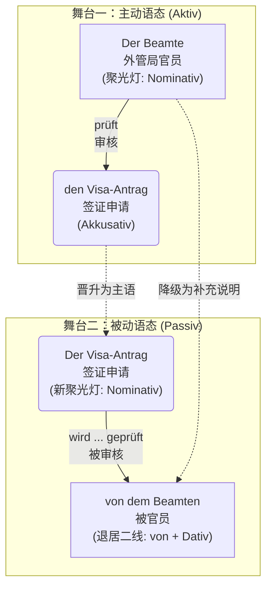

# 被动态

德语母语者特别偏爱被动态，因为它显得客观、官方，而且——如果你不想承担责任的话，它是最 ^372k8d好的语言外衣！

### 核心思维：被动态的“聚光灯效应”

想象你在看一场舞台剧。

* **主动语态**：聚光灯打在**动作的执行者（主语）**身上。大家都在看“谁”干了这件事。
* **被动语态**：导演把聚光灯移走了，直接打在**动作的承受者**或者**动作本身**上。执行者要么被赶下舞台（省略不提），要么退居二线充当背景板。

为了让你更直观地理解主动句如何“华丽转身”变成被动句，我们来看下面这个图解 ：

---

### 第一步：过程被动态的基础配方 (Vorgangspassiv) 与 框架结构

过程被动态强调的是**“动作正在进行的过程”**。

它的万能公式是：**werden 的变形 + 动词的第二分词 (Partizip II)**。

首先，你必须把助动词 `werden` 的现在时变位刻在脑子里：

* ich **werde**
* du **wirst** (注意不规则)
* er/sie/es **wird** (注意不规则)
* wir **werden**
* ihr **werdet**
* sie/Sie **werden**

#### 🏗️ 德语的灵魂：框形结构 (Satzklammer)

在主句中，`werden` 永远占据**第二位（Position 2）**，而第二分词 `Partizip II` 被一脚踢到了**句末（Position End）**。它们俩就像一个巨大的括号，把其他的信息（时间、地点、原因）死死抱在中间。

> **移民生活场景：医疗 (Beim Arzt)**
> * **主动**：Der Arzt operiert den Patienten heute. (医生今天给病人做手术。)
> * **被动**：Der Patient **wird** heute **operiert**. (病人今天被做手术。) 
> * *你看，在这个语境中，“谁”做手术不重要（肯定是医生），重要的是病人“正在经历手术”这个过程。*

---

### 第二步：时态大变身（结合移民生活场景）

被动语态也可以在时间的河流里穿梭。改变时态时，**只有助动词 werden 在变形，句末的第二分词稳如泰山！** 我们以“找工作/入职”场景为例：`Der Vertrag (合同) wird unterschrieben (被签署)`。

| 时态 (Tempus)                 | 公式形态                        | 例句 (租房/工作场景)                                                          | 中文解析                       |
| :-------------------------- | :-------------------------- | :-------------------------------------------------------------------- | :------------------------- |
| **Präsens (现在时)**           | **wird** + PII              | Der Mietvertrag **wird** heute **unterschrieben**.                    | 租房合同今天**被**签署。（正在发生）       |
| **Präteritum (过去时)**        | **wurde** + PII             | Der Vertrag **wurde** gestern **unterschrieben**.                     | 合同昨天**被**签署了。（常用于官方书面语）    |
| **Perfekt (完成时)**           | **ist** + PII + **worden**  | Der Vertrag **ist** gestern **unterschrieben worden**.                | 合同昨天**已经/被**签署了。（日常口语常用）   |
| **Plusquamperfekt (过去完成时)** | **war** + PII + **worden**  | Der Vertrag **war** schon **unterschrieben worden**, bevor ich ankam. | 在我到达之前，合同早就**被**签完了。       |
| **Futur I (将来时)**           | **wird** + PII + **werden** | Der Vertrag **wird** morgen **unterschrieben werden**.                | 合同明天**将要被**签署。（带有一种官方的承诺感） |

🚨 **大师避坑警告 (B 2 必考点)**：

在 Perfekt 和 Plusquamperfekt 中，werden 的第二分词本来是 *geworden*。但是！在被动态里，为了避免发音过于累赘，德国人把前缀 ge- 扔掉了，变成了 **worden**！

* ❌ Der Vertrag ist unterschrieben *geworden*. (错！)
* ✅ Der Vertrag ist unterschrieben **worden**. (对！)

---

### 第三步：终极 Boss——当被动态遇到情态动词

这是 B 1 升 B 2 的重点！在实际生活中，我们很少只说“房子被打扫”，我们通常说“房子**必须**被打扫”。

公式：**情态动词的变位 (Pos 2) + ... + PII + werden (句末)**。

这里框架结构变得更大了，句末变成了“两个动词”。

**1. 现在时 (Präsens)：**

> **场景：租房退房 (Wohnungsübergabe)**
> Die Wohnung **muss** beim Auszug besenrein **übergeben werden**.
> (退房时，公寓**必须被**打扫得干干净净地交接。)
> *框架：muss (Pos 2) ...... übergeben werden (句末)*

**2. 过去时 (Präteritum)：**

> **场景：行政事务 (Behördengänge)**
> Das Formular **musste** bis gestern **abgegeben werden**.
> (这份表格**昨天之前必须被**提交。)

**3. 完成时 (Perfekt) - 🔥 B 2 顶级难度：**

在完成时中，当情态动词、被动态相遇时，会出现传说中的**“双不定式 (Doppelinfinitiv)”**现象。此时不需要 Partizip II，而是把所有动词堆在句末！

> **场景：抱怨房东**
> Die Heizung **hat** schon gestern **repariert werden müssen**!
> (暖气本来昨天**就必须要被**修好的！)
> *框架：hat (助动词放第二位) ...... repariert (实义动词 PII) + werden (被动助动词) + müssen (情态动词原型).*
> *(大师建议：在口语中，面对这种情况，德国人也会绕道走，直接用过去时 musste repariert werden，但 B 2 考试阅读和写作里你必须能认出来！)*

---

### 第四步：谁干的？(von vs. durch)

既然执行者退居二线了，如果我们非要交代是谁干的，该怎么办？用介词 `von` 或 `durch` 把它请回舞台边缘。

* **von + Dativ (第三格)**：通常用于**人、机构**等“主动的执行者”。
    * *Das Visum wird **von der Ausländerbehörde** (外管局) erteilt.* (签证由外管局发放。)
* **durch + Akkusativ (第四格)**：通常用于**方法、手段、抽象的原因或自然力量**。
    * *Die Stadt wurde **durch das Unwetter** zerstört.* (城市被暴风雨摧毁了。)
    * *Ihr Deutsch wird **durch regelmäßiges Üben** verbessert.* (您的德语通过规律的练习得到了提高。)

---

### 第五步：动作结束后的余波——状态被动态 (Zustandspassiv)

刚才讲的都是“正在被做”（Vorgangspassiv，用 werden）。

如果动作已经做完了，尘埃落定，我们只看**结果和状态**，这时候就要用**状态被动态**。

公式：**sein 的变形 + Partizip II**。

对比一下：

1.  **Vorgangspassiv (动作进行中)**: Um 8 Uhr **wird** die Arztpraxis **geöffnet**. (早上 8 点，诊所门正在被打开。你仿佛听到了钥匙转动和开门的声音。)
2.  **Zustandspassiv (动作已完成，状态持续)**: Um 8:15 Uhr **ist** die Arztpraxis **geöffnet**. (8 点 15 分，诊所门已经是开着的了。你看到的是敞开的大门这个状态。)

> **移民生活场景**：你去超市买面包，发现门关了。
> 墙上挂着牌子："Das Geschäft **ist** sonntags **geschlossen**." (商店周日是关闭状态的。)

---

### 第六步：B 2 进阶避坑指南 (注意事项)

想要完美驾驭被动态，你还要避开这几个陷阱：

**1. 幽灵主语 "Es"**

如果一个主动句没有第四格宾语（Akkusativ），变成被动句时就没有东西可以提拔为主语。这时候我们需要一个幽灵主语 `es` 来占位（占住第一位）。

* *主动*: Man tanzt heute Abend. (人们今晚跳舞。)
* *被动*: **Es** wird heute Abend getanzt. (今晚有舞会/今晚跳舞。)
* *灵活变位*: 如果你把时间提前，"es" 就会像幽灵一样消失！-> *Heute Abend wird getanzt.* (这也是极其地道的德语表达！)

**2. 哪些动词天生与被动态“绝缘”？**

不是所有动词都能变成被动句！如果你的句子属于以下情况，千万别用被动态：

* **表示拥有的动词**：haben, besitzen, bekommen (你不能说“一辆车被我拥有” *Ein Auto wird von mir gehabt* ❌，这在德语里是灾难级的错误)。
* **表示“知道/认识”的动词**：wissen, kennen。
* **所有反身动词 (Reflexive Verben)**：比如 sich interessieren, sich freuen。
* **量度动词**：kosten (花费), wiegen (重)。
