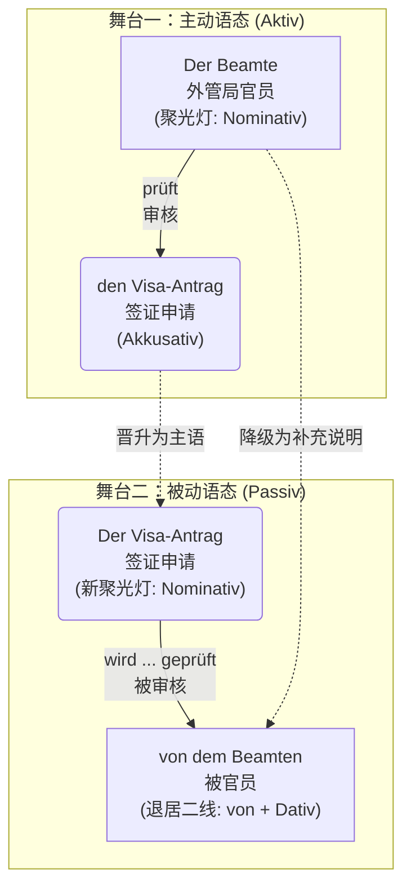
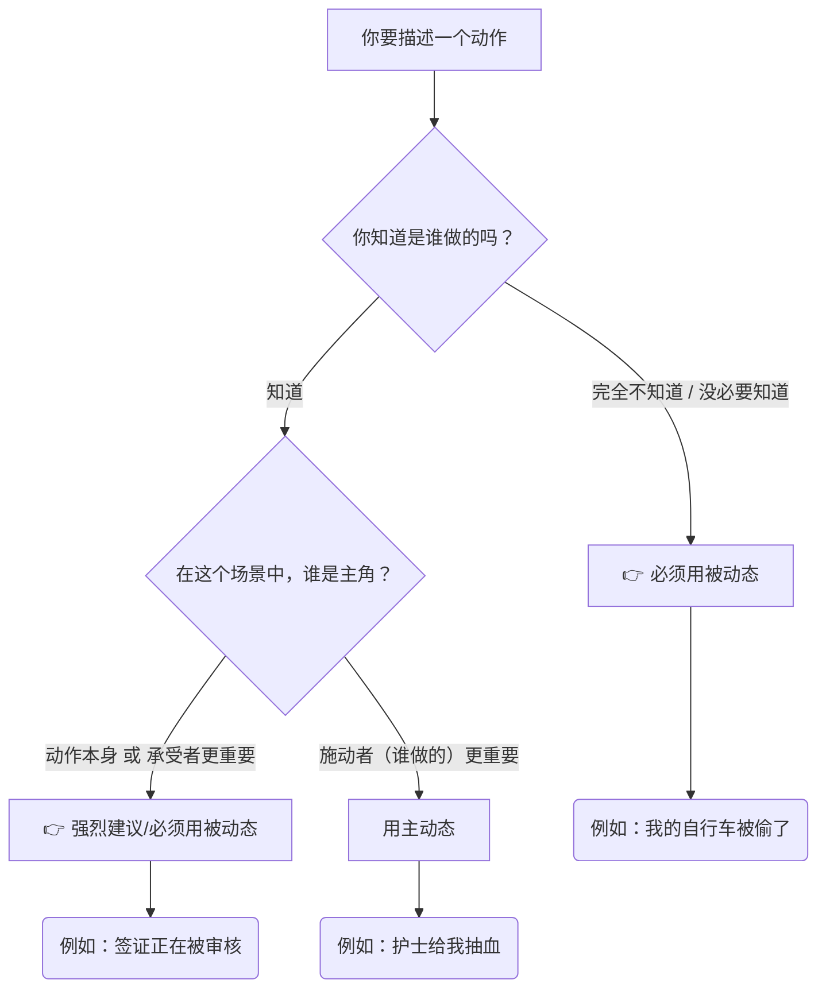

# 被动态

德语母语者特别偏爱被动态，因为它显得客观、官方，而且——如果你不想承担责任的话，它是最 ^372k8d好的语言外衣！

### 核心思维：被动态的“聚光灯效应”

想象你在看一场舞台剧。

* **主动语态**：聚光灯打在**动作的执行者（主语）**身上。大家都在看“谁”干了这件事。
* **被动语态**：导演把聚光灯移走了，直接打在**动作的承受者**或者**动作本身**上。执行者要么被赶下舞台（省略不提），要么退居二线充当背景板。

为了让你更直观地理解主动句如何“华丽转身”变成被动句，我们来看下面这个图解 ：

---

### 第一步：过程被动态的基础配方 (Vorgangspassiv) 与 框架结构

过程被动态强调的是**“动作正在进行的过程”**。

它的万能公式是：**werden 的变形 + 动词的第二分词 (Partizip II)**。

首先，你必须把助动词 `werden` 的现在时变位刻在脑子里：

* ich **werde**
* du **wirst** (注意不规则)
* er/sie/es **wird** (注意不规则)
* wir **werden**
* ihr **werdet**
* sie/Sie **werden**

#### 🏗️ 德语的灵魂：框形结构 (Satzklammer)

在主句中，`werden` 永远占据**第二位（Position 2）**，而第二分词 `Partizip II` 被一脚踢到了**句末（Position End）**。它们俩就像一个巨大的括号，把其他的信息（时间、地点、原因）死死抱在中间。

> **移民生活场景：医疗 (Beim Arzt)**
> * **主动**：Der Arzt operiert den Patienten heute. (医生今天给病人做手术。)
> * **被动**：Der Patient **wird** heute **operiert**. (病人今天被做手术。) 
> * *你看，在这个语境中，“谁”做手术不重要（肯定是医生），重要的是病人“正在经历手术”这个过程。*

---

### 第二步：时态大变身（结合移民生活场景）

被动语态也可以在时间的河流里穿梭。改变时态时，**只有助动词 werden 在变形，句末的第二分词稳如泰山！** 我们以“找工作/入职”场景为例：`Der Vertrag (合同) wird unterschrieben (被签署)`。

| 时态 (Tempus)                 | 公式形态                        | 例句 (租房/工作场景)                                                          | 中文解析                       |
| :-------------------------- | :-------------------------- | :-------------------------------------------------------------------- | :------------------------- |
| **Präsens (现在时)**           | **wird** + PII              | Der Mietvertrag **wird** heute **unterschrieben**.                    | 租房合同今天**被**签署。（正在发生）       |
| **Präteritum (过去时)**        | **wurde** + PII             | Der Vertrag **wurde** gestern **unterschrieben**.                     | 合同昨天**被**签署了。（常用于官方书面语）    |
| **Perfekt (完成时)**           | **ist** + PII + **worden**  | Der Vertrag **ist** gestern **unterschrieben worden**.                | 合同昨天**已经/被**签署了。（日常口语常用）   |
| **Plusquamperfekt (过去完成时)** | **war** + PII + **worden**  | Der Vertrag **war** schon **unterschrieben worden**, bevor ich ankam. | 在我到达之前，合同早就**被**签完了。       |
| **Futur I (将来时)**           | **wird** + PII + **werden** | Der Vertrag **wird** morgen **unterschrieben werden**.                | 合同明天**将要被**签署。（带有一种官方的承诺感） |

🚨 **大师避坑警告 (B 2 必考点)**：

在 Perfekt 和 Plusquamperfekt 中，werden 的第二分词本来是 *geworden*。但是！在被动态里，为了避免发音过于累赘，德国人把前缀 ge- 扔掉了，变成了 **worden**！

* ❌ Der Vertrag ist unterschrieben *geworden*. (错！)
* ✅ Der Vertrag ist unterschrieben **worden**. (对！)

---

### 第三步：终极 Boss——当被动态遇到情态动词

这是 B 1 升 B 2 的重点！在实际生活中，我们很少只说“房子被打扫”，我们通常说“房子**必须**被打扫”。

公式：**情态动词的变位 (Pos 2) + ... + PII + werden (句末)**。

这里框架结构变得更大了，句末变成了“两个动词”。

**1. 现在时 (Präsens)：**

> **场景：租房退房 (Wohnungsübergabe)**
> Die Wohnung **muss** beim Auszug besenrein **übergeben werden**.
> (退房时，公寓**必须被**打扫得干干净净地交接。)
> *框架：muss (Pos 2) ...... übergeben werden (句末)*

**2. 过去时 (Präteritum)：**

> **场景：行政事务 (Behördengänge)**
> Das Formular **musste** bis gestern **abgegeben werden**.
> (这份表格**昨天之前必须被**提交。)

**3. 完成时 (Perfekt) - 🔥 B 2 顶级难度：**

在完成时中，当情态动词、被动态相遇时，会出现传说中的**“双不定式 (Doppelinfinitiv)”**现象。此时不需要 Partizip II，而是把所有动词堆在句末！

> **场景：抱怨房东**
> Die Heizung **hat** schon gestern **repariert werden müssen**!
> (暖气本来昨天**就必须要被**修好的！)
> *框架：hat (助动词放第二位) ...... repariert (实义动词 PII) + werden (被动助动词) + müssen (情态动词原型).*
> *(大师建议：在口语中，面对这种情况，德国人也会绕道走，直接用过去时 musste repariert werden，但 B 2 考试阅读和写作里你必须能认出来！)*

---

### 第四步：谁干的？(von vs. durch)

既然执行者退居二线了，如果我们非要交代是谁干的，该怎么办？用介词 `von` 或 `durch` 把它请回舞台边缘。

* **von + Dativ (第三格)**：通常用于**人、机构**等“主动的执行者”。
    * *Das Visum wird **von der Ausländerbehörde** (外管局) erteilt.* (签证由外管局发放。)
* **durch + Akkusativ (第四格)**：通常用于**方法、手段、抽象的原因或自然力量**。
    * *Die Stadt wurde **durch das Unwetter** zerstört.* (城市被暴风雨摧毁了。)
    * *Ihr Deutsch wird **durch regelmäßiges Üben** verbessert.* (您的德语通过规律的练习得到了提高。)

---

### 第五步：动作结束后的余波——状态被动态 (Zustandspassiv)

刚才讲的都是“正在被做”（Vorgangspassiv，用 werden）。

如果动作已经做完了，尘埃落定，我们只看**结果和状态**，这时候就要用**状态被动态**。

公式：**sein 的变形 + Partizip II**。

对比一下：

1.  **Vorgangspassiv (动作进行中)**: Um 8 Uhr **wird** die Arztpraxis **geöffnet**. (早上 8 点，诊所门正在被打开。你仿佛听到了钥匙转动和开门的声音。)
2.  **Zustandspassiv (动作已完成，状态持续)**: Um 8:15 Uhr **ist** die Arztpraxis **geöffnet**. (8 点 15 分，诊所门已经是开着的了。你看到的是敞开的大门这个状态。)

> **移民生活场景**：你去超市买面包，发现门关了。
> 墙上挂着牌子："Das Geschäft **ist** sonntags **geschlossen**." (商店周日是关闭状态的。)

---

### 第六步：B 2 进阶避坑指南 (注意事项)

想要完美驾驭被动态，你还要避开这几个陷阱：

**1. 幽灵主语 "Es"**

如果一个主动句没有第四格宾语（Akkusativ），变成被动句时就没有东西可以提拔为主语。这时候我们需要一个幽灵主语 `es` 来占位（占住第一位）。

* *主动*: Man tanzt heute Abend. (人们今晚跳舞。)
* *被动*: **Es** wird heute Abend getanzt. (今晚有舞会/今晚跳舞。)
* *灵活变位*: 如果你把时间提前，"es" 就会像幽灵一样消失！-> *Heute Abend wird getanzt.* (这也是极其地道的德语表达！)

**2. 哪些动词天生与被动态“绝缘”？**

不是所有动词都能变成被动句！如果你的句子属于以下情况，千万别用被动态：

* **表示拥有的动词**：haben, besitzen, bekommen (你不能说“一辆车被我拥有” *Ein Auto wird von mir gehabt* ❌，这在德语里是灾难级的错误)。
* **表示“知道/认识”的动词**：wissen, kennen。
* **所有反身动词 (Reflexive Verben)**：比如 sich interessieren, sich freuen。
* **量度动词**：kosten (花费), wiegen (重)。

您提的问题非常关键，它涉及**德语语法与中文表达习惯的根本差异**。简单说：**在德语里，“被”字（即被动语态结构）是不能随便省略的，否则要么句子不通顺，要么意思完全改变。**

让我们一步步拆解您的疑问。

---

# _Der Mietvertrag muss unterschrieben werden._ 省略被 werden 行不行？

### 1. 中文的“模糊被动” vs 德语的“强制被动”

- **中文**：说“合同必须签署”，**没有“被”字，但大家自动理解成“合同必须（被）签署”**。因为合同不会自己签，所以即使没写“被”，意思也是被动。中文允许这种**零标记被动**。
- **德语**：德语语法**没有“零标记被动”**。如果主语是动作的承受者（合同），谓语动词必须用被动语态（`werden + 过去分词`），否则**每个词的位置、词尾、语法意义都会错**。

所以，不是“一定要交个被”，而是**德语语法强迫你显式表达动作方向**。

---

### 2. 如果硬要去掉“werden”（不加被）会怎样？

对比下面三个句子：

| 句子 | 语法分析 | 意思 |
|------|---------|------|
| (a) `Der Mietvertrag muss unterschrieben werden.` | 被动不定式（werden+过去分词） | 合同必须**被**签署 |
| (b) `Der Mietvertrag muss unterschrieben.` | 去掉 werden → 只剩过去分词 | ❌ 语法错误，不完整 |
| (c) `Der Mietvertrag ist unterschrieben.` | 用 sein+过去分词（状态被动） | 合同已签署（状态，不是动作） |

- 句子 (b) 在德语中是**病句**，因为情态动词 `muss` 后面必须接**动词原形（不定式）**，而 `unterschrieben` 是过去分词，不是不定式。只有 `unterschrieben werden` 整个才是不定式（被动不定式）。
- 如果换成 `sein`（如 c），则意思变成“已签署状态”，和“必须被签署”完全不同。

---

### 3. 用主动语态不行吗？比较一下：

**主动语态**（主语是执行者）：

> `Wir müssen den Mietvertrag unterschreiben.`  
> 我们必须签署合同。

**被动语态**（主语是承受者）：

> `Der Mietvertrag muss unterschrieben werden.`  
> 合同必须被签署。

如果您想表达“合同必须签署”而不指明谁签，德语只能选用被动语态（因为不出现执行者）。**主动语态必须有一个主语（如 wir, man）**，否则句子不成立。

- 用 `man` 也可以：`Man muss den Mietvertrag unterschreiben.` （人们必须签署合同）—— 这是主动语态，主语是“人们”，合同是宾语。但原句以“合同”为主语，所以必须被动。

---

### 4. 总结：为什么“被”不能省？

| 语言 | 主动 | 被动（显式） | 被动（隐式） |
|------|------|-------------|-------------|
| 中文 | 我们必须签署合同 | 合同必须**被**签署 | 合同必须签署 ✅（隐式被动） |
| 德语 | Wir müssen den Vertrag unterschreiben. | Der Vertrag muss **unterschrieben werden.** | ❌ 没有隐式被动，必须显式加 werden |

**所以回答您的问题：**  
“不加‘被’（werden）意思一样”——这句话只在中文成立。在德语里，**不加 werden，语法不通，意思无法正确传达**。德语必须用显式的被动结构，这是语法规则，不是可有可无的装饰。

如果您还有其他疑问，我们继续讨论 😊 

# 什么时候一定用被动
> [!question] 
被动态在什么情况下必须使用，因为我遇到了一些必须使用的场景而我分不清什么时候一定要用什么时候主观使用

现在，我们用一个生动的“舞台聚光灯”类比来深入拆解。

想象一下，每一个句子都是一出舞台剧。在主动态（Aktiv）**里，聚光灯打在“做事的人”（施动者/Täter）身上；而在**被动态（Passiv）**里，导演（也就是你）觉得“做事的人”太不重要了，直接把他踢下了舞台，把聚光灯死死地打在**“承受动作的人/物”**或者**“动作本身”上！

那么，什么时候你**必须**把施动者踢下舞台，强行使用被动态呢？主要有以下三大“必须”场景：

---

### 1. 必用：施动者“查无此人”或“完全不重要”

当你不知道动作是谁发出的，或者在这个语境下，谁发出的根本不重要时，如果你强行用主动态，句子会显得非常诡异且不符合逻辑。

- **生活场景：治安/突发事件**
    - ❌ _Jemand hat mein Fahrrad gestohlen._ (某人偷了我的自行车。—— 语法没错，但听起来像你在强调“有个人”干的，而不是你的车没了。)
    - ✅ **Mein Fahrrad wurde gestohlen.** (我的自行车被偷了。—— 绝对的重点是你可怜的自行车，小偷是谁你根本不知道，必须用被动态！)
- **生活场景：医疗/医院就诊**
    - 你在医院做完手术，你想表达手术很成功。
    - ✅ **Ich wurde gestern erfolgreich operiert.** (我昨天被成功手术了。—— 重点是你得到了救治，至于到底是 Müller 医生还是 Schmidt 医生拿的柳叶刀，在宏观表达上并不重要。)

### 2. 必用：强调“流程”和“规则”，屏蔽个人色彩（必须使用）

在德国，行政流程和规章制度是神圣不可侵犯的。官方文件、租房合同、工作手册为了显示**客观性和强制性**，会强制使用被动态。这种时候如果不使用被动态，就不符合德语的语言习惯（Idiomatik）。

- **生活场景：外管局办签证**
    - 你去问签证进度，办事员绝不会说：“我们办公室的 Peter 正在看你的材料（Peter prüft Ihre Unterlagen）”，因为这显得太私人、太随意了。
    - ✅ **Ihre Unterlagen werden zurzeit geprüft.** (您的材料目前正在被审核。—— 典型的官方回复，强调流程正在推进，这也是你必须听懂和使用的句型。)
- **生活场景：职场指令/租房规矩**
    - 公司规定报销单必须签字。
    - ✅ **Der Antrag muss unterschrieben werden.** (申请表必须被签字。—— 强调的是“签字”这个硬性规定，针对所有人，不针对特定的你我他。)

### 3. 必用：无人称被动态（Unpersönliches Passiv）：表达群体行为或绝对禁令（必须使用）

这是德语中非常有魅力（也很霸道）的一个用法。当动作本身就是全部的焦点，连宾语都没有的时候，我们用 "es" 或者把地点放在句首来占位。这种句子常用于公共场所的标语。

- **生活场景：公共场所/邻里关系**
    - 星期天在德国是休息日，邻居在院子里大声放音乐，你可以抱怨：
    - ✅ **Hier wird nicht laut Musik gehört!** (这里不准大声听音乐！—— 比 "Ihr dürft hier nicht..." 更有威慑力，表示“这是普遍的规矩”。)
    - 诊所候诊室的牌子上写着：
    - ✅ **Es wird um Ruhe gebeten.** (请保持安静。—— 字面意思是“安静正在被请求”，极为正式且不容拒绝。)

---

### 总结：如何区分“主观选择”还是“必须使用”？

- **主观选择：** 当你明明知道是谁干的，也完全可以说出他的名字，但你为了**礼貌、委婉或者推卸责任**，故意用被动态。比如在工作中犯了错：_Der Fehler wurde gemacht._（错误被犯了，暗指：不知道谁干的，反正不是我）。这就是主观选择的修辞手法。
- **必须使用：** 当你**不知道谁干的**，或者是在**谈论官方流程、法律法规、客观事实**时，请毫不犹豫地把那个不知名的人踢下舞台，打开被动态的聚光灯！

学习被动态最好的方法就是把自己代入到这些真实场景中去。现在，想象你刚搬进一个德国的新公寓，房东告诉你一条非常严格的规矩：“楼道里绝对不允许放置垃圾。”

为了练习我们刚才讲过的“强调规则和客观性”的被动态，你能试着用被动态（Passiv）把这句关于垃圾（der Müll）和楼道（der Flur）的规矩翻译成德语吗？
