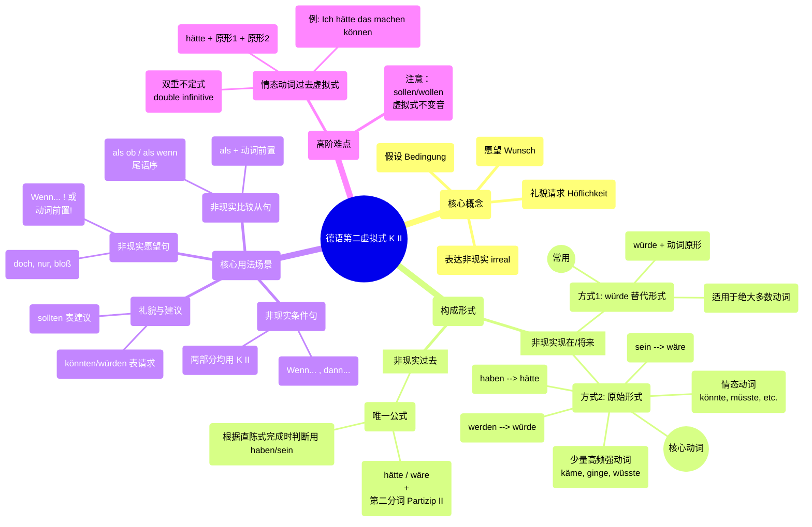
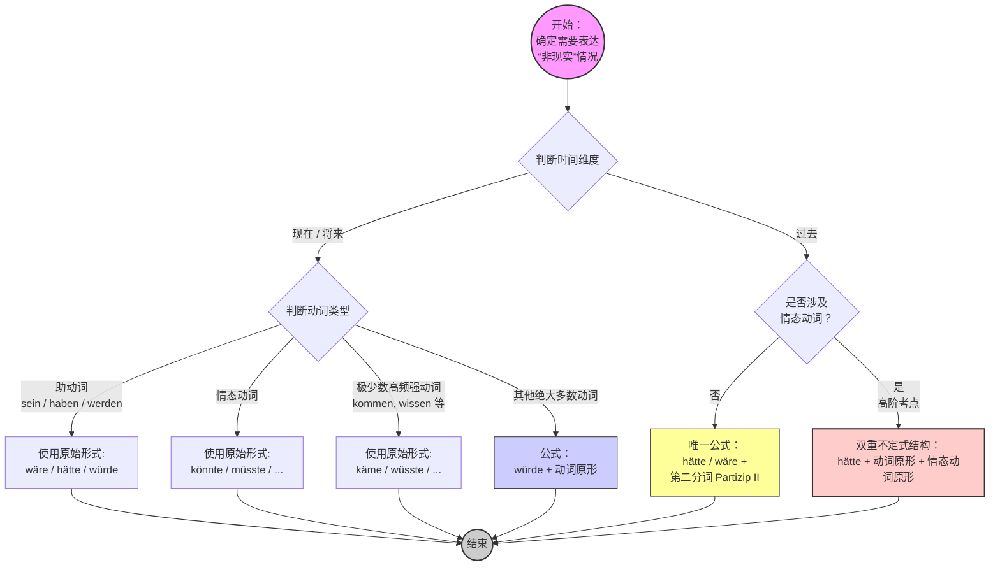

# 第二虚拟式

德语的**第二虚拟式（Konjunktiv II）**确实是语法中的一座大山，但它也是让你的德语听起来地道、高级、委婉的核心工具。只要理清它的**时间维度**（现在/将来 vs. 过去）和**使用场景**（非现实），它其实非常有逻辑。

以下为你系统、全面地梳理第二虚拟式的所有核心知识点。

---

### 一、 第二虚拟式的核心概念

在德语中，直陈式（Indikativ）用来描述客观事实（例如：“我有钱”），而**第二虚拟式**专门用来描述**非现实的情况**：

- **假设与条件**（如果我有钱...）
- **愿望**（但愿我有钱...）
- **礼貌与委婉**（能不能借我点钱...）

第二虚拟式**只有两个时间维度**：

1. **非现实的现在/将来**（现在不是这样，或将来不会这样）
2. **非现实的过去**（过去没有发生的事）

---

### 二、 第二虚拟式的构成形式 (Formen)

#### 1. 非现实的现在/将来时

表达现在或将来不可能发生，或者纯属假设的情况。它有两种构成方式：

**方式 A：替代形式（würde + 动词原形）**

这是最常用、最简单的形式，适用于**绝大多数动词**（尤其是规则的弱变化动词，因为它们的虚拟式和一般过去时同型，容易混淆）。

- **公式：** `würde(n) + 句末动词原形`
- _例子：_ Ich **würde** ein Auto **kaufen**. (我可能会买辆车。/ 如果怎样，我就会买辆车。)

**方式 B：原始形式（由一般过去时变化而来）**

少数常用动词会使用它们自己的“专属虚拟式变位”，不加 würde。

- **公式：** `过去时词干 + 虚拟式词尾 (-e, -est, -e, -en, -et, -en)`。如果是强变化动词，词干中的 a, o, u 通常要变音为 **ä, ö, ü**。
- **必须使用原始形式的动词（重点记忆）：**
    - 三大助动词：**sein** (wäre), **haben** (hätte), **werden** (würde)
    - 情态动词：können (**könnte**), müssen (**müsste**), dürfen (**dürfte**), mögen (**möchte**), sollen (**sollte**), wollen (**wollte**) -> _注意：sollen 和 wollen 不变音。_
    - 极少数高频强变化动词：kommen (**käme**), gehen (**ginge**), finden (**fände**), wissen (**wüsste**), lassen (**ließe**)。

**核心变位对照表：**

|**人称**|**sein (wäre)**|**haben (hätte)**|**werden (würde)**|**können (könnte)**|
|---|---|---|---|---|
|**ich**|wäre|hätte|würde|könnte|
|**du**|wärst|hättest|würdest|könntest|
|**er/sie/es**|wäre|hätte|würde|könnte|
|**wir**|wären|hätten|würden|könnten|
|**ihr**|wärt|hättet|würdet|könntet|
|**sie/Sie**|wären|hätten|würden|könnten|

#### 2. 非现实的过去时

表达过去**没有发生**的事情（类似于英语的 "would have done"）。它只有一种固定的组合方式，所有动词一视同仁。

- **公式：** `wäre / hätte + 动词的第二分词 (Partizip II)`
- _例子：_
    - Ich **hätte** das Auto **gekauft**. (我当时本来会买那辆车的。—— 事实：没买)
    - Er **wäre** nach Berlin **gefahren**. (他当时本来会去柏林的。—— 事实：没去)

---

### 三、 第二虚拟式的核心用法 (Verwendung)

掌握了形式后，我们来看它在句子中的五大应用场景：

#### 1. 非现实条件句 (Irreale Konditionalsätze)

这是最常见的用法，通常由 `wenn` 引导。主句和从句都要用虚拟式。

- **现在的条件：** 如果我有时间，我就会帮你。
    - _Wenn_ ich Zeit **hätte**, **würde** ich dir **helfen**.
- **过去的条件：** 如果我当时有时间，我当时就帮你了。
    - _Wenn_ ich Zeit **gehabt hätte**, **hätte** ich dir **geholfen**.
- **高阶语法（省略 wenn）：** 可以将从句的动词提前，省略 wenn。
    - **Hätte** ich Zeit, **würde** ich dir **helfen**. (句意不变，更加紧凑)

#### 2. 非现实愿望句 (Irreale Wunschsätze)

表达无法实现的愿望，通常伴随语气词 `doch` , `nur` , `bloß` 以增强语气。动词可以放在句首，也可以用 wenn 引导。

- **现在：** 但愿我现在有钱就好了！
    - _Wenn_ ich doch Geld **hätte**! / **Hätte** ich doch Geld!
- **过去：** 要是我昨天没去那儿就好了！
    - _Wenn_ ich gestern nur nicht dorthin **gegangen wäre**! / **Wäre** ich gestern nur nicht dorthin **gegangen**!

#### 3. 非现实比较从句 (Irreale Vergleichssätze)

用 `als ob` / `als wenn` (仿佛，好像) 或者单用 `als` 引导。表示一种并不真实的假象。

- **用 als ob / als wenn (动词在句末)：**
    - Er tut so, **als ob** er der Chef **wäre**. (他表现得好像他是老板一样。—— 事实：他不是)
- **用 als (动词紧跟在 als 后面，占第二位)：**
    - Er tut so, **als wäre** er der Chef.

#### 4. 礼貌请求与委婉建议 (Höfliche Bitten und Ratschläge)

在日常生活中，为了显得客气、不生硬，德国人极频繁地使用第二虚拟式（此时不表示“非现实”，只表示“客气”）。

- **礼貌请求（通常用 könnten / würden）：**
    - **Könnten** Sie mir bitte helfen? (您能帮我一下吗？ 比 Können 委婉得多)
    - Ich **hätte** gern einen Kaffee. (我想要一杯咖啡。 比 Ich will 礼貌)
- **委婉建议（通常用 sollten）：**
    - Du **solltest** zum Arzt gehen. (你应该去看医生。)

#### 5. 非现实结果从句 (Irreale Folgesätze)

固定句型 `zu ..., als dass...` (太...以至于不能...)。

- Das Auto ist **zu** teuer, **als dass** ich es mir **kaufen könnte**.

    (这辆车太贵了，以至于我买不起。—— 事实：车贵，买不起)

---

### 四、 高阶避坑与核心考点

1. **情态动词的过去时虚拟式（双重不定式结构）**

    这是考试中最爱考的难点。如果非现实的过去时遇到了情态动词，不要使用 Partizip II，而是要**把助动词 hätte 放在句尾（或从句中特殊位置），后面跟两个动词原形**。

    - _事实：_ 他昨天本来可以来的。
    - _错误：_ Er hätte gestern kommen gekonnt. ❌
    - _正确：_ Er **hätte** gestern **kommen können**. ✅ (hätte + 动词原形 + 情态动词原形)
    - _如果在 wenn 从句中：_ Wenn er gestern **hätte kommen können**,... (注意 hätte 跑到两个不定式前面去了！)
        
2. **würde 还是 原始形式？**
    
    - 不要对所有动词都生硬地套用原始形式。比如买 (kaufen)，它的虚拟式原始形式是 _kaufte_，这和一般过去时完全一样。为了避免歧义，现代德语规定：**除了助动词、情态动词和极少数强变化动词外，一律使用 `würde + Infinitiv`。**
        
3. **时态的对应法则**

    在做题或写作时，先判断中文/逻辑里的时间状语。

    - 看到 "jetzt, morgen, heute"，立刻锁定 -> **würde/hätte/wäre/könnte**。
    - 看到 "gestern, früher, letztes Jahr"，立刻锁定 -> **hätte/wäre + Partizip II**。

### 一、 德语第二虚拟式知识点系统全览（思维导图 Mermaid）

这是一个纯粹的 Mermaid `mindmap` 语法结构，清晰地梳理了 K II 的概念、构成和用法。
![[image-218.png|1337]]
代码段

---

### 二、 K II 时间与形式判定流程图（Graph Mermaid）

这是一个使用 Mermaid `graph TD` 语法的流程图，帮助你在选择时态和形式时进行逻辑判断。

代码段

