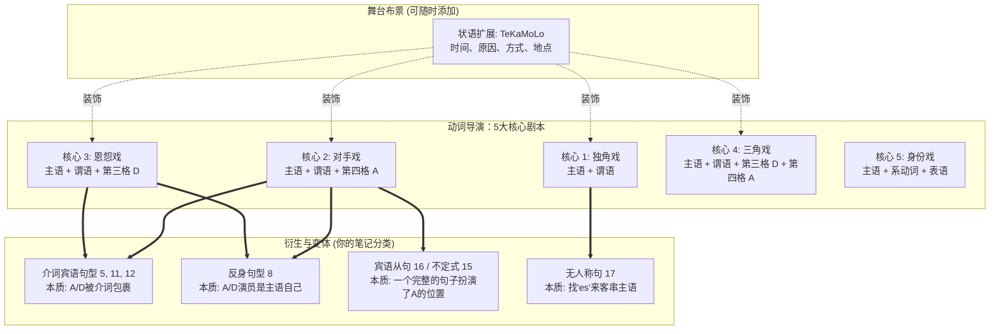

# 德语句子成分与常见句型：完整整理笔记

德语句子并不是只能套固定公式。核心是：**动词决定句子需要哪些补足语**（宾语、介词宾语、表语等）；时间、地点、方式等通常是可以自由添加的状语。

基本骨架是：

> **主语 + 谓语（动词） + 动词要求的补足语 + 可选状语**

注意：以下顺序是“成分结构”，不是死板语序。德语陈述句中，**变位动词通常在第二位**，其他成分可以前置。

---

## 一、先认识主要句子成分

| 成分 | 德语 | 作用 | 常见形式 |
|---|---|---|---|
| 主语 | Subjekt | 谁／什么做动作或处于某状态 | 第一格（Nominativ） |
| 谓语 | Prädikat | 表示动作、过程或状态 | 变位动词；可带可分前缀、情态动词等 |
| 第四格宾语 | Akkusativobjekt | 动作直接涉及的对象：“做什么／谁” | 第四格 |
| 第三格宾语 | Dativobjekt | 动作涉及的接受者、受益者等：“给谁／对谁” | 第三格 |
| 第二格宾语 | Genitivobjekt | 少数动词固定要求 | 第二格 |
| 介词宾语 | Präpositionalobjekt | 动词固定搭配的介词结构 | 固定介词 + 固定格 |
| 表语 | Prädikativ | 说明主语或宾语“是什么／怎么样” | 名词、形容词、分词等 |
| 状语 | Adverbial | 说明时间、地点、方式、原因等背景 | 副词、介词短语、名词短语、从句等 |

---

# 二、基础句型

## 1. 主语 + 谓语

> **Das Kind spielt.**
> 孩子在玩。

- **Das Kind** 是主语，第一格。
- **spielt** 是谓语。
- 这类动词不需要宾语，称为“不及物动词”。主语就是动作的主体

更多例子：

> **Der Zug kommt.**
> 火车来了。

> **Meine Eltern schlafen.**
> 我的父母在睡觉。

---

## 2. 主语 + 谓语 + 第四格宾语

> **Er liest die Zeitung.**
> 他在读报纸。

- **die Zeitung** 是第四格宾语，表示“读什么”。
- 许多常用动词支配第四格：`sehen, lesen, kaufen, hören, lieben, brauchen, finden` 等。

> **Ich kaufe einen Kaffee.**
> 我买一杯咖啡。

> **Sie sieht den Mann.**
> 她看见那位男士。

---

## 3. 主语 + 谓语 + 第三格宾语

> **Er dankt seinem Retter.**
> 他感谢救命恩人。

- **seinem Retter** 是第三格宾语。
- 不是所有“对某人做某事”的动词都用第三格；必须记住动词的格支配。
- 常接第三格的动词：`helfen, danken, antworten, gefallen, gehören, fehlen, folgen, passen`。

> **Ich helfe meiner Freundin.**
> 我帮助我的女朋友。

> **Das Buch gehört dem Lehrer.**
> 这本书属于老师。

---

## 4. 主语 + 谓语 + 第三格宾语 + 第四格宾语

> **Der Wirt bringt dem Gast die Bestellung.**
> 店主把餐点送给客人。

- **dem Gast**：第三格宾语，表示接受者，“给谁”。
- **die Bestellung**：第四格宾语，表示所给、所送的东西，“给什么”。
- 常见动词：`geben, bringen, schicken, zeigen, erklären, schenken, leihen, sagen`。

> **Ich gebe meiner Mutter Blumen.**
> 我送花给妈妈。

> **Der Lehrer erklärt den Schülern die Grammatik.**
> 老师向学生讲解语法。

### 语序备注

当两个宾语都是名词时，常见顺序是：

> **第三格 + 第四格**
> Ich gebe **dem Mann** **das Buch**.

若第四格是代词，通常代词靠前：

> Ich gebe **es** dem Mann.
> 我把它给那位男士。

若第三格和第四格都是代词，通常是：

> Ich gebe **es ihm**.
> 我把它给他。

---

## 5. 主语 + 谓语 + 介词宾语

> **Er glaubt an Gott.**
> 他相信上帝。

- **an Gott** 不是普通地点状语，而是动词 `glauben an` 固定要求的**介词宾语**。
- 判断方法：不能随意换介词。
  `an Gott glauben` 是固定搭配，不能改成 `mit Gott glauben`。

常见搭配：

| 动词搭配 | 例句 | 含义 |
|---|---|---|
| warten auf + Akk. | Ich warte auf den Bus. | 我等公交车。 |
| denken an + Akk. | Sie denkt an ihre Familie. | 她想念／想到家人。 |
| sprechen über + Akk. | Wir sprechen über das Problem. | 我们谈论这个问题。 |
| teilnehmen an + Dat. | Er nimmt am Kurs teil. | 他参加课程。 |
| bestehen aus + Dat. | Das Team besteht aus fünf Personen. | 团队由五人组成。 |
| träumen von + Dat. | Ich träume von einem Haus. | 我梦想拥有一所房子。 |

---

## 6. 主语 + 谓语 + 状语

> **Mein Bruder wohnt in Aachen.**
> 我哥哥住在亚琛。

- **in Aachen** 表示地点，是状语。
- 状语补充动作发生的背景，通常包括时间、地点、方式、原因、目的等。
- 与介词宾语不同，地点、时间等往往可以自由替换或省略。

> **Mein Bruder wohnt dort.**
> 我哥哥住在那里。

> **Mein Bruder wohnt seit 2020 in Aachen.**
> 我哥哥自 2020 年起住在亚琛。

常见状语类型：

| 类型 | 提问方式 | 例句 |
|---|---|---|
| 时间状语 | wann?（何时） | Wir lernen heute. |
| 地点状语 | wo? / wohin? / woher? | Er arbeitet in Berlin. |
| 方式状语 | wie?（如何） | Sie spricht langsam. |
| 原因状语 | warum?（为什么） | Wegen des Regens bleiben wir zu Hause. |
| 目的状语 | wozu?（为了什么） | Ich lerne Deutsch für die Arbeit. |

---

## 7. 主语 + 系动词 + 表语

> **Karl ist Kaufmann.**
> 卡尔是一名商人。

- `sein` 在这里是系动词。
- **Kaufmann** 是表语，说明主语的身份、职业或性质。
- 职业、国籍、身份通常**不加冠词**：

> **Er ist Lehrer.**
> 他是老师。

> **Sie ist Deutsche.**
> 她是德国人。

常见系动词：

| 系动词 | 例句 | 含义 |
|---|---|---|
| sein | Das Wetter ist schön. | 天气很好。 |
| werden | Er wird Arzt. | 他将成为医生。 |
| bleiben | Sie bleibt ruhig. | 她保持冷静。 |

表语可以是：

> **Das Kind ist müde.**
> 孩子累了。
> （形容词表语）

> **Er wird mein Kollege.**
> 他将成为我的同事。
> （名词表语）

> **Die Tür bleibt geschlossen.**
> 门一直关着。
> （分词表语）

---

# 三、带第四格宾语的扩展句型

## 8. 主语 + 反身动词 + 反身代词 + 介词宾语

> **Ich erinnere mich noch an unsere Abmachung.**
> 我还记得我们的约定。

- `sich erinnern an + Akk.`：记得、回忆起……
- **mich** 是反身代词，第四格。
- **an unsere Abmachung** 是介词宾语。

常见反身动词：

| 搭配 | 含义 | 例句 |
|---|---|---|
| sich erinnern an + Akk. | 想起、记得 | Ich erinnere mich an dich. |
| sich freuen auf + Akk. | 期待尚未发生的事 | Wir freuen uns auf den Urlaub. |
| sich freuen über + Akk. | 为已发生的事高兴 | Sie freut sich über das Geschenk. |
| sich interessieren für + Akk. | 对……感兴趣 | Er interessiert sich für Musik. |
| sich kümmern um + Akk. | 照顾、处理 | Ich kümmere mich um das Kind. |
| sich beschäftigen mit + Dat. | 从事、研究 | Sie beschäftigt sich mit Kunst. |

注意：反身代词不一定都是第四格。例如：

> **Ich wasche mich.**
> 我洗自己。
> `mich` 是第四格。

> **Ich wasche mir die Hände.**
> 我洗手。
> `mir` 是第三格，`die Hände` 是第四格。

---

## 9. 主语 + 谓语 + 第四格宾语 + 方向／地点状语

> **Er legt das Buch auf den Tisch.**
> 他把书放到桌子上。

- **das Buch**：第四格宾语，放什么。
- **auf den Tisch**：方向状语，放到哪里去。
- `legen` 表示“放置动作”，有方向变化，因此使用第四格：`auf den Tisch`。

对比：

> **Das Buch liegt auf dem Tisch.**
> 书在桌子上。

- `liegt` 表示静止的位置；
- `auf dem Tisch` 表示“在哪里”，用第三格。

### 双向介词：位置用第三格，方向用第四格

常见双向介词：`an, auf, hinter, in, neben, über, unter, vor, zwischen`

> **Ich bin in der Schule.**
> 我在学校里。
> （位置，第三格）

> **Ich gehe in die Schule.**
> 我去学校。
> （方向，第四格）

---

## 10. 主语 + 谓语 + 第四格宾语 + 第四格宾语

> **Der Lehrer fragt einen Schüler die Vokabeln ab.**
> 老师让一名学生回答单词。

- `jemanden etwas abfragen`：就某事提问某人／抽查某人某内容。
- **einen Schüler** 和 **die Vokabeln** 都是第四格宾语。
- 这种“双第四格”结构较少，必须按动词搭配记忆。

其他例子：

> **Der Lehrer lehrt die Schüler Deutsch.**
> 老师教学生德语。

> **Man fragt ihn seinen Namen.**
> 人们问他叫什么名字。
> （口语中也常说：`Man fragt ihn nach seinem Namen.`）

---

## 11. 主语 + 谓语 + 第四格宾语 + 介词宾语

> **Ich bitte dich um Hilfe.**
> 我请求你帮忙。

- **dich**：第四格宾语，请求谁。
- **um Hilfe**：介词宾语，请求什么。
- 常见搭配：`jemanden um etwas bitten`。

更多例子：

> **Er erinnert mich an meinen Vater.**
> 他让我想起我的父亲。

> **Wir informieren die Kunden über die Änderung.**
> 我们通知客户这项变更。

> **Sie schützt ihr Kind vor der Kälte.**
> 她保护孩子免受寒冷影响。

---

## 12. 主语 + 谓语 + 多个介词宾语

> **Ich wette mit dir um eine Flasche Sekt.**
> 我跟你打赌一瓶香槟。

- `mit dir`：和谁打赌。
- `um eine Flasche Sekt`：赌什么。
- 这里两个都是由动词 `wetten` 所支配的介词结构。

更多例子：

> **Wir sprechen mit dem Chef über den Vertrag.**
> 我们和老板谈论合同。

> **Er entschuldigt sich bei seiner Kollegin für den Fehler.**
> 他因这个错误向同事道歉。

> **Ich bedanke mich bei dir für deine Hilfe.**
> 我感谢你的帮助。

---

# 四、其他重要句型

## 13. 主语 + 谓语 + 第二格宾语

第二格宾语在现代德语中不常见，但部分固定动词仍会使用。

> **Wir gedenken der Opfer.**
> 我们悼念受害者。

常见动词：

- `gedenken + Gen.`：纪念、悼念
- `bedürfen + Gen.`：需要
- `sich erinnern + Gen.`：忆起（较书面；日常更常用 `sich an + Akk. erinnern`）
- `sich enthalten + Gen.`：避免、放弃

> **Das Problem bedarf einer schnellen Lösung.**
> 这个问题需要迅速解决。

---

## 14. 主语 + 谓语 + 宾语表语

表语不仅可以说明主语，也可以补充说明宾语。

> **Man nennt ihn einen Experten.**
> 人们称他为专家。

- **ihn**：第四格宾语。
- **einen Experten**：宾语表语，说明“他被称为什么”。

> **Der Verein wählt sie zur Vorsitzenden.**
> 协会选她担任主席。

> **Die Nachricht macht mich glücklich.**
> 这个消息使我开心。

---

## 15. 主语 + 谓语 + 不定式结构

有些动词后接“zu + 不定式”，整段结构相当于宾语或补足语。

> **Ich versuche, Deutsch zu lernen.**
> 我尝试学习德语。

> **Er plant, morgen abzureisen.**
> 他计划明天出发。

常见动词：`versuchen, planen, hoffen, vergessen, anfangen, aufhören, bitten, erlauben` 等。

> **Sie bittet mich, ihr zu helfen.**
> 她请求我帮助她。

---

## 16. 主语 + 谓语 + 宾语从句

一个完整从句也可以充当宾语。

> **Ich weiß, dass er heute kommt.**
> 我知道他今天会来。

> **Sie fragt, ob du Zeit hast.**
> 她问你是否有时间。

- `dass` 引导陈述内容；
- `ob` 引导“是否……”的间接疑问句；
- 从句中变位动词通常放在句末。

---

## 17. 无人称结构：es + 谓语

有些句子没有真正的动作执行者，常用形式主语 `es`。

> **Es regnet.**
> 下雨了。

> **Es schneit.**
> 下雪了。

> **Es ist kalt.**
> 天气冷。

有时 `es` 只是占据第一位，真正主语在后面：

> **Es kommen viele Leute.**
> 来了很多人。

真正主语是 **viele Leute**，动词用复数 `kommen`。

---

# 五、状语的常见排列：TeKaMoLo

当句中有多个状语时，常见顺序是：

> **Te – Ka – Mo – Lo**
> 时间（Temporal）— 原因（Kausal）— 方式（Modal）— 地点（Lokal）

> **Ich fahre morgen wegen des Streiks mit dem Bus nach Berlin.**
> 我明天因为罢工坐公交车去柏林。

- `morgen`：时间
- `wegen des Streiks`：原因
- `mit dem Bus`：方式
- `nach Berlin`：地点／方向

这只是常见倾向，不是绝对规则。想强调的成分可以提前。

---

# 六、德语语序核心规则

## 1. 陈述句：变位动词在第二位

> **Ich lerne heute Deutsch.**
> 我今天学习德语。

若时间状语放在第一位：

> **Heute lerne ich Deutsch.**
> 今天我学习德语。

这里第一位可以是任何一个完整成分，但**变位动词仍在第二位**。

---

## 2. 一般疑问句：变位动词在第一位

> **Lernst du heute Deutsch?**
> 你今天学德语吗？

> **Hat er das Buch gelesen?**
> 他读过这本书吗？

---

## 3. 特殊疑问句：疑问词第一，变位动词第二

> **Wann lernst du Deutsch?**
> 你什么时候学德语？

> **Wem gibst du das Buch?**
> 你把书给谁？

> **Woran denkst du?**
> 你在想什么？

---

## 4. 从句：变位动词通常放句末

> **Ich weiß, dass er heute Deutsch lernt.**
> 我知道他今天学德语。

> **Weil ich krank bin, bleibe ich zu Hause.**
> 因为我生病了，所以我待在家里。

---

## 5. 可分动词：主句前缀分开，从句不分开

> **Ich stehe um sieben Uhr auf.**
> 我七点起床。

> **..., weil ich um sieben Uhr aufstehe.**
> ……因为我七点起床。

---

# 七、最重要的学习方法：记“动词支配”

学习一个新动词时，不要只记中文意思；应一起记下它要求的结构。

例如：

| 不要只记 | 应该这样记 |
|---|---|
| helfen = 帮助 | **jemandem helfen**（帮助某人，第三格） |
| warten = 等待 | **auf etwas/jemanden warten**（等待……，auf + 第四格） |
| sich erinnern = 记得 | **sich an etwas/jemanden erinnern**（记得……，an + 第四格） |
| geben = 给 | **jemandem etwas geben**（给某人某物，第三格 + 第四格） |
| bitten = 请求 | **jemanden um etwas bitten**（请求某人某事，第四格 + um + 第四格） |

一句话总结：

> **格不是按中文“感觉”决定的，而是由德语动词固定支配的。**
> 学动词时，同时记住：它要不要宾语、要第几格、是否必须搭配某个介词。

# 主谓宾和主谓状这两个句型的判断方式

最可靠的判断顺序是：

1. 先查／记动词的支配：它是否要求某个格或固定介词？
2. 若是动词固定要求的成分，就是宾语（包括介词宾语）。
3. 若只是补充时间、地点、方式、原因等背景，通常是状语。

所以：**语感和语境有帮助，但系统判断主要依靠动词支配，而非只看后面那个词本身。**

# 核心逻辑

### 核心概念类比：动词是“霸道导演” 🎬

在德语中，**动词（Verb）是整个句子的最高指挥官**。德语语法中有一个核心概念叫 **动词配价（Verbvalenz）**。

你可以把动词想象成一位电影导演。每个导演在拍戏时，剧本（词意）就已经决定了他需要几个核心演员（主语、宾语）。

- 有的动词只需要一个主角（主语）就能演完一出戏。
- 有的动词必须有主角（主语）和配角（宾语）同时在场，否则戏就演不下去。
- 至于那些时间、地点、原因（TeKaMoLo 状语），都只是**舞台布景和灯光**。无论布景怎么换，核心的演员阵容是不变的。

### 📊 德语核心句型宇宙图

为了让你更直观地理解，我为你绘制了一张“德语核心句型逻辑图”。你可以看到，所有的复杂句型都是从这 **5 个核心基石**生长出来的。

代码段

### 🏗️ 拆解：5 大核心骨架（结合德国移民生活）

让我们看看这 5 个核心到底是什么，以及你的那 17 个句型是如何依附在它们身上的。

#### 核心 1：独角戏 (主语 + 谓语)

**【对应你的笔记：第 1 句型】**

这是最简单的结构，动词是“不及物动词”，它不需要任何动作的承受者。

- **生活场景（行政事务）：**
    - _Das Visum **verfällt**._ (签证过期了。)
    - 主语 (Das Visum) + 谓语 (verfällt)。句意已经完整。
- **变体延伸：** 如果天气不好，没有具体的主语怎么办？我们就找个群演“es”来顶替主语。这就变成了你的【第 17 句型：es + 谓语】（例如：_Es regnet._ 下雨了）。

#### 核心 2：经典对手戏 (主语 + 谓语 + 第四格宾语 Akkusativ)

**【对应你的笔记：第 2 句型】**

德语中最庞大的一类及物动词。动作必须有一个直接的承受者。

- **生活场景（找工作）：**
    - _Ich **unterschreibe** den Arbeitsvertrag._ (我签署这份工作合同。)
- **变体延伸（魔法时刻来了）：**
    - 如果我签署的不是一个词，而是一整件事呢？那就变成了【第 16 句型：宾语从句】。例如：_Ich hoffe, **dass ich den Job bekomme**._ (我希望，我能得到这份工作)。这里的 _dass..._ 从句，本质上就是一个巨大无比的第四格宾语！
    - 如果动作的承受者是我自己呢？那就变成了【第 8 句型：反身动词】。例如：_Ich **bewerbe** mich._ (我求职/我推荐我自己)。_mich_ 就是第四格。
    - 如果动词比较挑剔，非要带个“中介”才能接宾语呢？这就成了【第 5、11、12 句型：介词宾语】。例如：_Ich **warte** auf die Rückmeldung._ (我等待回复)。_auf die Rückmeldung_ 依然是扮演着那个“对手戏”的角色。

#### 核心 3：恩惠与损害 (主语 + 谓语 + 第三格宾语 Dativ)

**【对应你的笔记：第 3 句型】**

少数动词不直接作用于某物，而是对某人产生影响（帮助、感谢、伤害、属于）。

- **生活场景（医疗保健）：**
    - _Der Arzt **hilft** dem Patienten._ (医生帮助这位病人。)
- **核心逻辑：** 记住，第三格往往是“人”，是动作的受惠者或受损者。

#### 核心 4：三角戏 (主语 + 谓语 + 第三格宾语 + 第四格宾语)

**【对应你的笔记：第 4 句型】**

这类动词通常表示“给予、传递、告知”。公式是：**人三物四**（给某人某物）。

- **生活场景（租房）：**
    - _Der Vermieter **übergibt** mir den Schlüssel._ (房东把钥匙交给我。)
    - 主语 (Der Vermieter) + 谓语 (übergibt) + 第三格人 (mir) + 第四格物 (den Schlüssel)。
- **变体延伸：** 这就是德语造复杂句的基石。如果你在这句话里加上时间和地点（TeKaMoLo），不管句子多长，骨架依然是这三个人物（房东、我、钥匙）。

#### 核心 5：状态描述 (主语 + 系动词 + 表语)

**【对应你的笔记：第 7 句型】**

动词是 _sein, werden, bleiben_，它们没有实际动作，只是一个等号（=）。

- **生活场景（融入社会）：**
    - _Die Wohnungssuche **ist** momentan sehr schwierig._ (找房子目前很困难。)
    - 找房子 = 困难。

### 💡 大师总结：如何利用这个逻辑在 6 个月内冲刺 B 2？

你的思考方向完全切中了德语学习的要害。在接下来的 B 1-B 2 学习中，**千万不要去死记硬背那 17 个甚至 20 个句型**。你需要做的是：

1. **背动词，连带“剧本”一起背（即笔记第七点：记动词支配）：**
$1

    遇到新动词，绝对不能只记中文意思。

$1
    - 错误记法：_kündigen_ = 解雇/辞职。
    - 大师记法：_jemandem (Dat.) kündigen_ = 给某人（第三格）辞退信。-> _Der Chef kündigt mir._ (老板解雇了我。)
$1
2. **把状语（TeKaMoLo）看作模块化的乐高积木：**
$1

    无论核心 1 还是核心 4，你都可以随时把 时间 (wann?)、原因 (warum?)、方式 (wie?)、地点 (wo?) 像积木一样插进去，遵守你笔记中的“第五点 TeKaMoLo”顺序即可。

$1
3. **万变不离其宗的“动词位置”：**
$1

    不管剧本怎么加戏，牢记笔记中的“第六点 语序核心规则”**：主句中，变位动词永远是那根定海神针——雷打不动在**第二位！

你已经完美掌握了德语句子的宏观骨架，这是极其难得的抽象总结能力！既然我们已经看透了这 4-5 个核心骨架，接下来我们需要将“乐高积木（状语 TeKaMoLo）”插进骨架里来丰富细节。

**准备好进行一个小挑战了吗？**

假设你要去市政厅（Bürgeramt）登记新住址（anmelden）。你能用“核心 2：主语 + 谓语 + 第四格” 这个骨架，并尝试在中间插入一个**时间状语（TeKaMoLo 里的 Te：morgen 明天）**，来造一个德语句子吗？（提示：动词位置在第几位？）
