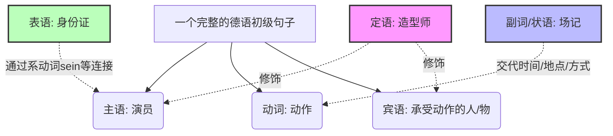
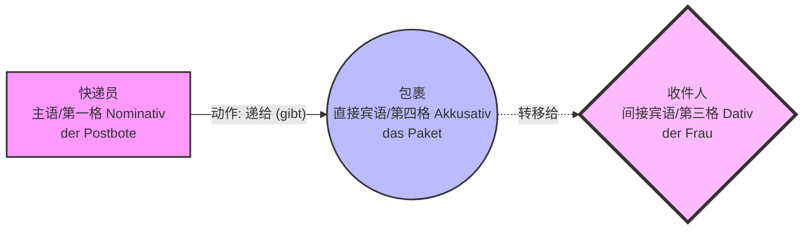
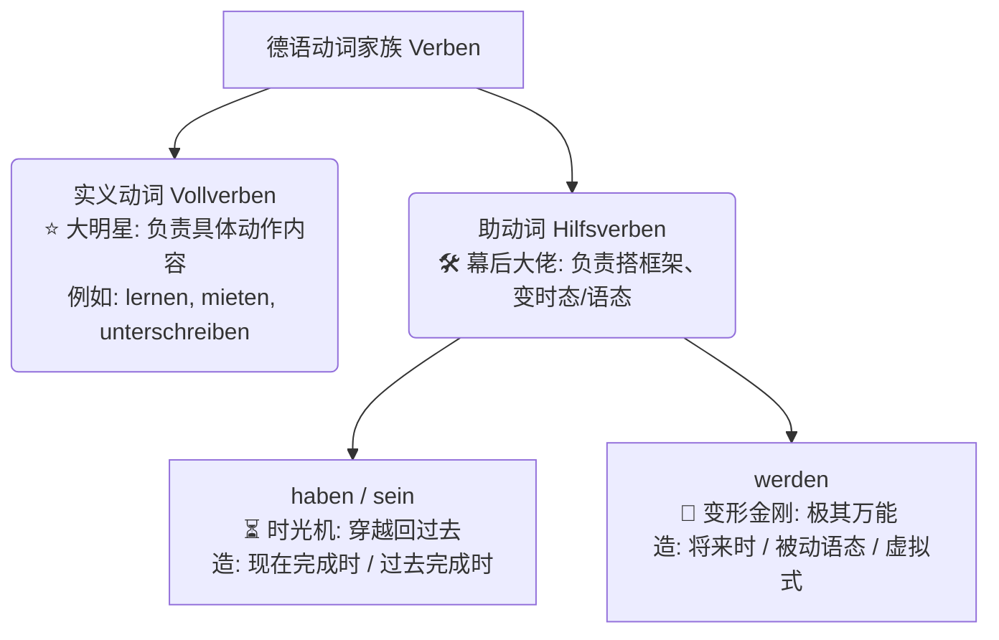
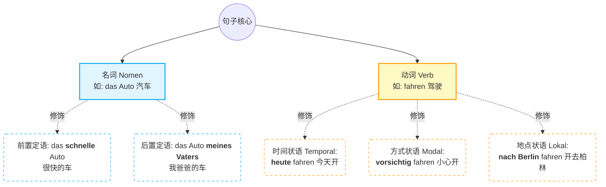

---
aliases:
  - 副词
  - 状语
  - 定语
  - 表语
---

# 句子结构术语：形容词/副词/表语/定语/状语...

# 其他

### 1. 表语 (Das Prädikativ) —— “主语的身份证与体检报告”

- **生动定义：** 想象一下你去外管局（Ausländerbehörde）办签证。工作人员看着你，问了两个核心问题：“你是谁？”和“你现在是什么状态？”。用来回答这两个问题的词，就是**表语**。
- **核心规则：** 表语**绝对不能**单独存在，==它必须和一个“系动词”绑定在一起==（最常见的是 **sein** 是, **werden** 变得, **bleiben** 保持），用来补充说明主语。它就像是贴在主语脑门上的标签。

> **移民生活场景例句：**
> 
> - Ich bin **Ingenieur**. (我是**工程师**。)
>     - _解析：_ `Ingenieur` 就是表语，说明“我”的身份（找工作场景）。
> - Die Wohnung in München ist extrem **teuer**. (慕尼黑的公寓极其**昂贵**。)
>     - _解析：_ `teuer`（贵）是表语，说明“公寓”的状态（租房场景）。

### 2. 定语 (Das Attribut) —— “名词的专属私人造型师”

- **生动定义：** 如果把“名词”比作一个素颜出门的人，那么“定语”就是它的衣服、帽子、首饰。定语的唯一工作，就是==**打扮名词**，让这个名词变得具体、独一无二。==
- **核心规则：** 没有定语，这个人（名词）依然是人，句子依然成立；但有了定语，信息才精准。在德语中，定语可以放在名词前面（前置定语），也可以放在名词后面（后置定语）。

> **移民生活场景例句：**
> 
> - **前置定语 (形容词充当)：** Ich suche eine **helle** Wohnung. (我正在找一间**明亮的**公寓。)
>     - _解析：_ `helle`（明亮的）给“公寓”穿上了一件衣服。你要的不是随便什么公寓，而是“明亮的”。
> - **后置定语 (介词短语充当)：** Der Termin **bei der Ausländerbehörde** ist morgen. (**在外管局的**预约是明天。)
>     - _解析：_ `bei der Ausländerbehörde` 给“预约 (Termin)”戴上了专属的帽子，说明不是看医生的预约，而是外管局的预约。

### 3. 副词 (Das Adverb) / 状语 (Die Adverbialbestimmung) —— “动作的场记与导演”

- _注意：副词是“词性”（它天生是什么），而状语是“句子成分”（它在句子里干什么活）。副词经常在句子里充当状语。_
- **生动定义：** 想象你在拍一部关于你移民德国的电影。状语就是打板的“场记”，它要大声喊出：这个动作是==**什么时候（时间）**、**在哪里（地点）**、**为什么（原因）**、**怎么做（方式）的！==它修饰的是动词、形容词或整个句子**。
- **核心规则：** 德国人思维非常严谨，他们喜欢把事情的背景交代得清清楚楚。德语状语有一个黄金排列顺序：**TE-KA-MO-LO** (Temporal 时间 - Kausal 原因 - Modal 方式 - Lokal 地点)。

> **移民生活场景例句：**
> 
> - Ich muss **morgen** (时间) **schnell** (方式) **zum Finanzamt** (地点) gehen. (我**明天**必须**赶紧**去**财政局**。)
>     - _解析：_ 这句话里，`morgen`（时间副词作状语）、`schnell`（形容词作方式状语）、`zum Finanzamt`（介词短语作地点状语），都在为动词 `gehen`（去）当导演，把“去”这个动作的具体背景安排得明明白白。

---

### 📊 一张图看懂它们的关系 (Mermaid 图解)

为了让你在脑海中有个视觉化的印象，你可以看下面这张关系图：

代码段

---

## 状语

**状语绝对不是用来补充说明“副词”的！状语是用来补充说明“动词（核心动作）”或整个句子的！**

让我们把刚刚的“公司比喻”再升级一下，彻底把你脑海里的这团乱麻理顺：

在德语这个“句子大公司”里：

- **动词 (Verb)**：是公司的**大老板（核心业务）**。比如“工作 (arbeiten)”、“发抖 (frieren)”。
- **状语 (Adverbial)**：是直接向大老板汇报的**“后勤保障部门”**。这个部门的唯一职责，就是向全公司交代大老板的业务细节：老板**什么时候**做这个动作？在**哪里**做？**为什么**做？**怎么**做？
- **副词 (Adverb)**：是碰巧被招进“后勤保障部门”打工的**员工**（他天生就是干这个的材料）。

所以，**不是状语去说明副词，而是副词站在状语的岗位上，去说明动词！**

---

### 🕵️‍♂️ 案发现场解析：你的练习题

现在，我们带着纠正后的“老板与员工”思维，重新回到你租房受冻的那个案发现场：

> 句子：Ich **friere** (动词老板) **in der Nacht** **sehr**. _(我在夜里觉得非常冷。)_

在这个句子里，大老板（核心动作）是 **friere（觉得冷/发抖）**。 后面的成分，全都是来伺候这个老板，解释老板是怎么“冷”的。我们来看看这两个员工的底细：

#### 1. in der Nacht (在夜里)

- **它的真实身份（词性/专业）：介词短语 (Präpositionalgruppe)**。它是由介词 `in` + 冠词 `der` + 名词 `Nacht` 拼凑起来的“外包团队”，这里面根本没有任何副词。
- **它在公司的岗位（句子成分）：时间状语 (Temporaladverbial)**。它向老板汇报：老板是**什么时候**发抖的？答：在夜里。

#### 2. sehr (非常/很)

- **它的真实身份（词性/专业）：副词 (Adverb)**。你查字典，`sehr` 天生就是一个副词。
- **它在公司的岗位（句子成分）：程度/方式状语 (Modaladverbial)**。它向老板汇报：老板发抖的**程度**有多深？答：非常深（冷得要命）。

---

### 💡 核心总结

你发现了没？

- `in der Nacht` 和 `sehr` 这两个员工，**互不干涉**。它们没有谁说明谁的关系。
- 它们俩并排站在一起，共同为一个大老板（动词 `friere`）服务。
- `in der Nacht` 是用**介词短语**来当**状语**；`sehr` 是用**副词**来当**状语**。

这就是为什么我反复强调：**副词是基因（它是什么词），状语是职业（它干什么活）。**

# 形容词副词区别？

### 形容词 (Das Adjektiv) —— “名词的专属裁缝” ✂️👗

- **服务对象：** 形容词是一个非常专一的职业，它**只为“名词（人或事物）”服务**。它的工作就是描述这个名词长什么样、是什么性质。
- **核心特征（穿制服）：** 如果形容词跑到了名词的前面（作定语），它就必须根据名词的性别（词性）和格（Kasus），**穿上特定的“制服”（这就是让无数人头疼的“形容词词尾变化 Adjektivdeklination”）**。

> **移民生活场景（买车代步）：**
> - Ich kaufe ein **schnelles** Auto. (我买了一辆**快的**汽车。)
> - _大师解析：_ 这里的 `schnell` 服务于名词 `Auto`（汽车）。因为它是形容词，修饰中性名词，所以它不能素颜出门，必须穿上 `es` 这件制服（词尾），变成 `schnelles`。

### 2. 副词 (Das Adverb) —— “动词的私人教练”与“形容词的放大镜” 🏋️‍♂️🔍

你要想他的德语单词就叫 Adverb，前缀词根 ad 就是在什么附近的意思

- **服务对象：** 副词比较博爱，它**绝对不伺候名词**！它只为**动词（动作）**、**其他形容词** 或者 **整个句子** 服务。
- **核心特征（永远素颜）：** 副词是一个非常崇尚自由的词性，它**永远不穿制服，绝对没有词尾变化！** 无论句子怎么变，它永远保持原形。

> **移民生活场景（开车去外管局）：**
> - **服务于动词（私人教练）：** Ich fahre **schnell** zur Ausländerbehörde. (我**很快地**开车去外管局。)
>     - _大师解析：_ 这里的 `schnell` 不是说“我”这个人是个快人，而是指 `fahre`（开）这个**动作**很快。它服务于动词，所以它是副词，**绝不加词尾**！
> - **服务于形容词（放大镜）：** Das Auto ist **sehr** teuer. (这辆车**非常**贵。)
>     - _大师解析：_ 这里的 `sehr`（非常）服务于形容词 `teuer`（贵），把“贵”的程度放大了。`sehr` 是纯正的副词，永远长这样。

# 定语和表语的区别？

定语绑定系动词

表语修饰名词

# 一、 什么是双宾语？直接宾语 vs. 间接宾语

在德语（其实英语和中文也一样）中，有些动作太复杂了，光有一个受害者（宾语）不足以演完这场戏，它必须同时涉及**“一个物品”**和**“一个接收人”**。这就是**双宾语 (Verben mit zwei Objekten)**。

为了让你秒懂，我们来想象一个**“快递员送货”**的场景：

在这个场景中：

- **动作发出者（第一格 Nominativ）**：快递员（主语，发力的那个人）。
- **直接宾语（第四格 Akkusativ）**：**包裹（被送的物品）**。
- **间接宾语（第三格 Dativ）**：**收件人（收到物品的VIP客户）**。

我们可以用一张图来拆解这个逻辑：

代码段

#### 怎么分辨直接宾语和间接宾语？

**1. 逻辑属性辨别法（最实用）：人三物四**

- **直接宾语（Akk.）通常是“物”**。它是被动作直接操控、移动、改变的“死物”或“道具”。
- **间接宾语（Dat.）通常是“人”**。他是动作的最终受益者、接收者或受损者。他通常静静地坐在那里，等着东西被递到他手上。

**2. 提问辨别法（最严谨）：**

- **直接宾语**回答的问题是 **Was? (什么？)** —— 快递员递了_什么_？（包裹）
- **间接宾语**回答的问题是 **Wem? (给谁？)** —— 快递员把包裹递_给谁_？（给那位女士）

> 🏢 **移民生活实战（外管局延签）：**
> 
> _德语原句：_ Ich zeige **dem Beamten** (Dat.) **meinen Pass** (Akk.). _直译分析：_ 我（主语）展示（动作）—— 展示什么？**我的护照（被展示的道具/直接宾语/第四格）** —— 展示给谁看？**签证官（接收信息的VIP/间接宾语/第三格）**。

# 动词与助动词

Guten Tag！欢迎再次来到“德语大师”的语法小课堂！

看到你开始深挖动词的底层逻辑，大师非常欣慰。如果你想在六个月内稳稳拿下B2，理清“动词”和“助动词”的关系是绝对的必修课！

首先，大师要在这里温柔但坚定地纠正你一个概念上的小误区（Candor）：**助动词（Hilfsverben）绝对不是“弱（弱动词）”！**

在德语里，“弱动词（schwache Verben）”指的是那些变位非常规则、老老实实听话的普通动词（比如 machen $\rightarrow$ machte $\rightarrow$ gemacht）。而我们今天要讲的**助动词，不仅不弱，它们简直是德语语法里的“最强王者”，而且变形极其不规则！**

准备好了吗？我们用一个“拍电影”的类比，带你彻底看透它们！

---

### 🎬 核心概念：剧组里的“大明星”与“幕后大佬”

如果把说一句德语比作拍一场电影，那么动词家族可以分为两大阵营：

1. **实义动词（Vollverben）—— 舞台上的“大明星”**

    它们有完整的、独立的含义。比如 _arbeiten_（工作）、_essen_（吃）、_wohnen_（居住）。在这场戏里，大明星负责具体的表演，你一听就知道他们在干什么。

2. **助动词（Hilfsverben）—— 剧组的“幕后大佬 / 特效师”**

    顾名思义，助动词是用来**“帮助（helfen）”**大明星的。它们本身在这个句子里**没有具体的实际意义**，但它们拥有魔法！它们可以给大明星加上“时光机特效”（改变时态），或者加上“替身特效”（改变语态）。

为了让你一目了然，大师给你画了一张“德语剧组架构图”：

代码段

德语里纯正的助动词只有**三个**：**haben** (有)、**sein** (是)、**werden** (变成)。

当它们作为“实义动词（大明星）”单打独斗时，是有意思的（比如：我有一只狗 _Ich habe einen Hund_）。**但是，当它们作为“助动词”给别人打下手时，它们原有的意思就消失了，纯粹变成了语法工具！**

下面我们来看看这三位幕后大佬是如何在你的移民生活中发挥作用的。

---

### ⏳ 大佬一与大佬二：haben 和 sein —— 你的“时光机”

在B1/B2阶段，你每天都要跟过去发生的事情打交道。要把“现在”的动作变成“过去完成”的状态，大明星自己做不到，必须请 `haben` 或 `sein` 来帮忙。

**黄金规则：** `haben / sein (变位) + ... + 大明星的过去分词 (Partizip II)`

**🎬 场景一：找工作（使用 haben 穿越时空）**

你想告诉HR，你已经签了合同了。_unterschreiben_（签字）是大明星，但它需要时光机：

> 💼 **Ich habe den Arbeitsvertrag gestern unterschrieben.**
> 
> (我昨天签了工作合同。)
> 
> _解析：这里的 `habe` 没有任何“拥有”的意思！它纯粹是个助动词，和句末的 `unterschrieben` 一起，把动作拉回了昨天。_

**🎬 场景二：外管局报到（使用 sein 穿越时空）**

你告诉外管局官员你是什么时候飞到德国的。表示“位置移动”或“状态改变”的大明星（如 fliegen 飞, gehen 走, ankommen 到达），必须请 `sein` 当助动词：

> 🛂 **Ich bin am Montag in Deutschland angekommen.**
> 
> (我周一到达了德国。)
> 
> _解析：这里的 `bin` 绝对不是“我是”的意思。它只是一个没感情的时态工具人！_

---

### 🤖 大佬三：werden —— 你的“全能变形金刚”

如果你觉得 haben 和 sein 只是时光机，那 **werden** 就是德语里的“万能瑞士军刀”。我们在前几节课讲的 B2 核心语法，全靠它撑场子！

**🎬 功能1：搭造将来时（Futur I）—— 预测未来**

`werden (变位) + ... + 大明星的原形`

> 🏠 租房许诺：
> 
> **Ich werde die Miete immer pünktlich überweisen.**
> 
> (我**将**总是按时转账房租。)

**🎬 功能2：搭造过程被动语态（Vorgangspassiv）—— 施工现场**

`werden (变位) + ... + 大明星的过去分词`

> 🩺 医疗场景：
> 
> **Ich werde morgen operiert.**
> 
> (我明天**将被**动手术。—— 这里的 werden 彻底失去了“变成”的意思，只提供“被动”的魔法。)

**🎬 功能3：搭造第二虚拟式（Konjunktiv II）—— 礼貌面具**

`würden (werden的虚拟式变位) + ... + 大明星的原形`

> 🏦 银行办事：
> 
> **Ich würde gern ein Konto eröffnen.**
> 
> (我**想要**开一个账户。—— werden 变身 würde，用来表达委婉客气。)

---

### 📊 大师的硬核总结对比

为了让你在脑海里形成绝对清晰的反射弧，我们用同一个大明星 **operieren（动手术）**，看看三位幕后大佬是怎么操纵它的：

|**句型**|**德语例句**|**助动词的功能**|**镜头聚焦**|
|---|---|---|---|
|**主动·过去**|Der Arzt **hat** mich gestern **operiert**.|**haben**: 时光机 (现在完成时)|医生昨天给我动了手术。|
|**主动·将来**|Der Arzt **wird** mich morgen **operieren**.|**werden**: 预测未来 (将来时)|医生明天将给我动手术。|
|**被动·现在**|Ich **werde** jetzt **operiert**.|**werden**: 替身特效 (过程被动)|我现在正在被动手术。|
|**被动·过去**|Ich **bin** gestern **operiert worden**.|**sein (+worden)**: 过去被动联合双打|我昨天被动了手术。(口语)|

---

### 📝 大师的随堂测试（你的舞台）

看明白“大明星”和“幕后大佬”的区别了吗？在德国的移民生活中，分清它们能让你少走很多弯路。现在，请你扮演一位正在办理落户（Anmeldung）的新移民，尝试填空并翻译下面两句话：

1. **（测试 haben 作为时光机）**

    我昨天**找**到了一个公寓。（大明星：找到 finden $\rightarrow$ gefunden）

    Ich ______ gestern eine Wohnung gefunden.

2. **（测试 werden 作为将来时工具）**

    我明天**将**带来我的护照。（大明星：带来 mitbringen）

    Ich ______ morgen meinen Reisepass mitbringen.

**不要害怕犯错，勇敢地把这两个助动词填进去并发给我吧！Would you like me to check your answers and give you some extra tips on pronunciation?**

# 定语 状语位置

**【一】 拨乱反正：定语与状语的“服务对象”**

看到你的问题，我必须先为你点个赞！因为你开始思考德语语序的底层逻辑了，这正是跨越 B 2 门槛的关键。

不过，在探讨位置之前，我们需要先纠正一个基础的术语误区。你刚才把它们的“服务对象”记反了：

- **定语（Attribut）永远只修饰“名词（Nomen）”或“代词”。**
    - _💡 形象类比：_ 定语是名词的**“专属皮肤”或“挂件”**。不管是前置的形容词（**das schöne** Bild 美丽的画），还是后置的第二格（das Bild **des Kindes** 孩子的画），它们像磁铁一样，必须死死吸附在名词身上，名词走到哪，它们就跟到哪。
- **状语（Adverbial）修饰“动词（Verb）”、“形容词”或“整个句子”。**
    - _💡 形象类比：_ 状语是动词的**“场景特效”**。它负责交代动作发生的时间、地点、原因或方式（例如：**gestern** vollendete ich... 我**昨天**完成了...）。

---

**【二】 逻辑图解：它们在句子中的依附关系**

为了让你清晰地看到这两者的区别，我们用一张成分依附图来看看它们是如何挂载到句子主干上的：

代码段

---

**【三】 语序规则：它们的位置是“死”的吗？**

答案是：**核心位置是死的，内部排列是活的！** 我们可以通过三个法则来精准判断把它们放在哪里：

**法则一：定语的“雷打不动”**

定语的位置是绝对**死的**。

- **前置定语**（通常是形容词、分词）：必须夹在冠词和名词之间。-> _das **schöne** Bild_
- **后置定语**（通常是第二格、介词短语、关系从句）：必须紧挨在名词屁股后面。-> _das Bild **an der Wand**_ (墙上的画)
- **绝对禁忌**：你不能把状语插进定语和名词之间。

**法则二：状语的“黄金法则 (Te-Ka-Mo-Lo)”**

当一个句子里有多个状语同时修饰一个动词时，它们在“中场（Mittelfeld）”的排列有一个默认的“死规则”：

1. **Te**mporal (时间)
2. **Ka**usal (原因)
3. **Mo**dal (方式)
4. **Lo**kal (地点)

- _例子：_ Ich fahre **heute** (时间) **wegen des Regens** (原因) **mit dem Bus** (方式) **zur Arbeit** (地点).

**法则三：打破规则的“魔法”——句尾重心与强调 (Fokus)**

这就是回答你问题的最关键部分。上面的 TeKaMoLo 只是“出厂默认设置”。一旦你想表达特定的情绪或强调，规则就“活”了！

- **提到句首（Pos. 1）**：如果你想特别强调某个状语，可以直接把它拉到句首。动词依然在第二位。

    -> **_Mit einem Farbstift_** _vollendete ich meine erste Zeichnung._ (强调：我偏偏是用**彩笔**，而不是水彩完成的！)

- **句尾高潮（Endgewicht）**：正如我们上一次解析的，把最重、最全新、最想给读者留下印象的成分（通常是宾语或重要的状语）放在句末收尾。

**总结一下判断思路：**

1. 拿到一个词，先问自己：它是修饰名词的（定语），还是修饰动词的（状语）？
2. 如果是定语，死死绑在名词上。
3. 如果是状语，扔进句子的中场，按照 Te-Ka-Mo-Lo 排好队。
4. 最后审视：我有没有特别想强调的词？如果有，把它放到句首或句尾。

---

**【四】 导师随堂考核 (Wissenstest)**

既然我们理清了定语和状语的区别，以及状语的排列顺序，现在轮到你来当一回“语法调度员”了。

这里有一堆散落的积木，请你根据 **Te-Ka-Mo-Lo 法则**，将它们拼成一句完美的主句（注意动词的位置和大小写）：

**积木碎片：**

- das Auto (这辆车 - 宾语，带有前置定语)
- repariert (修理 - 二分词，放句末)
- mein Vater (我爸爸 - 主语)
- in der Garage (在车库里 - 地点状语 Lokal)
- heute Morgen (今天早上 - 时间状语 Temporal)
- hat (已经 - 助动词，放第二位)
- schnell (快速地 - 方式状语 Modal)

**请将这组词排序组合出一个完整的德语句子，你会怎么排？**
