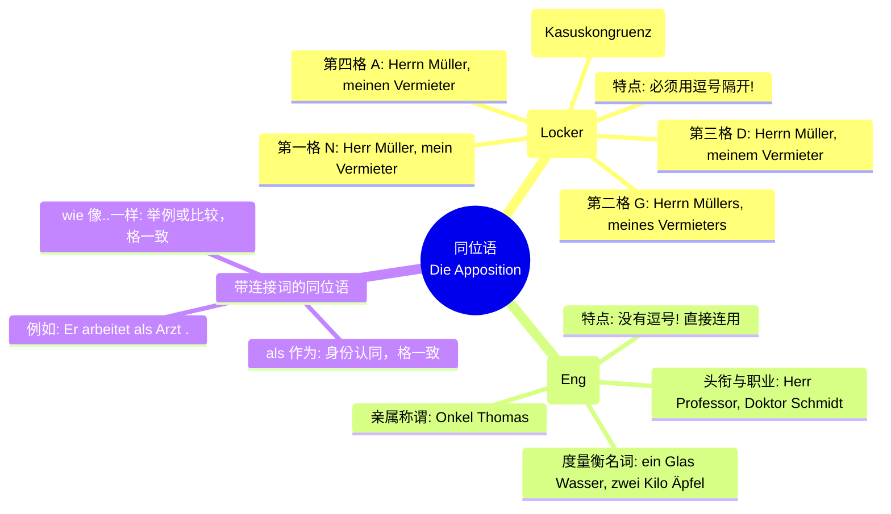

# 同位语

### 第一部分：核心概念解析

如果用一个极其生动的比喻来形容“同位语”，那就是——**德语名词的“小马甲”或“双胞胎”**。

想象一下，你有一个好朋友叫“张三”，但同时他也是“你的房东”。在句子里，你可以说“张三来了”，也可以说“我的房东来了”。为了让信息更丰富，德国人喜欢把这两个身份“绑”在一起：“张三，我的房东，来了。”

这里的“我的房东”就是“张三”的同位语。它们指向的是**绝对的同一个人或事物**。

**🚨 同位语的最高法则（黄金定律）：格的一致性 (Kasuskongruenz)** 因为中心名词和同位语是“双胞胎”，所以**中心名词穿什么衣服（第几格），它的同位语“马甲”就必须穿什么衣服（第几格）！** 这是所有 B 2 考生最容易栽跟头的地方。

为了让你一目了然，我们先用一张图表来鸟瞰德语同位语的整个系统：

代码段

### 第二部分：宽松同位语 (Die lockere Apposition) —— 四大格的“换装秀”

这是 B 1-B 2 阶段的绝对核心。宽松同位语的标志是：**它总是被逗号前后夹击（或者放在句末用一个逗号隔开）**。

我们以【租房场景】中的人物“Herr Müller（米勒先生）”和他的马甲“mein neuer Vermieter（我的新房东）”为例，看看他们是如何在四种格里“穿同款情侣装”的。

#### 1. 第一格 (Nominativ) —— 主语的马甲

当中心词是句子的主语时，同位语也必须是第一格。

- 🇩🇪 **Herr Müller, mein neuer Vermieter,** kommt morgen vorbei.
- 🇨🇳 米勒先生，我的新房东，明天会过来。
- _透视眼：Herr Müller 是主语(N)，所以同位语是 mein neuer Vermieter(N)。_

#### 2. 第四格 (Akkusativ) —— 宾语的马甲

当动词要求第四格宾语时，同位语也要跟着变第四格。

- 🇩🇪 Ich rufe **Herrn Müller, meinen neuen Vermieter,** sofort an.
- 🇨🇳 我马上给米勒先生，我的新房东，打电话。
- _透视眼：anrufen 要求第四格，因此是 Herrn Müller (阳性弱变化 A)，马甲变成了 meinen neuen Vermieter (A)。_

#### 3. 第三格 (Dativ) —— 介词或特殊动词的马甲

遇到要求第三格的介词（如 mit, bei, zu）或动词（如 helfen, danken）。

- 🇩🇪 Ich habe gestern mit **Herrn Müller, meinem neuen Vermieter,** gesprochen.
- 🇨🇳 我昨天和米勒先生，我的新房东，谈过了。
- _透视眼：介词 mit 强制要求第三格(D)，因此马甲穿上了第三格的衣服：meinem neuen Vermieter。_

#### 4. 第二格 (Genitiv) —— 所有格的马甲（🔥 B 2 高频考点）

在官方信件（如外管局信件、合同）中，第二格同位语无处不在。

- 🇩🇪 Das Büro **des Herrn Müller, meines neuen Vermieters,** befindet sich im Erdgeschoss.
- 🇨🇳 米勒先生，我的新房东的办公室，位于底楼。
- _透视眼：des Herrn Müller 是第二格，同位语必须紧跟其后加上"s"：meines neuen Vermieters。_

### 第三部分：紧密同位语 (Die enge Apposition) —— 隐形的保镖

并不是所有的同位语都需要逗号。有一些同位语就像“隐形保镖”一样，紧紧贴在中心名词旁边，**没有逗号隔开**。

**1. 头衔、尊称与职业（【行政/医疗场景】极常见）** 当提及官员、医生时，头衔直接作为紧密同位语。

- 🇩🇪 Ich habe einen Termin bei **Frau Dr. Schmidt**. (我预约了施密特博士/医生。)
- 🇩🇪 **Bundeskanzler Scholz** hält eine Rede. (联邦总理肖尔茨正在发表演讲。)

**2. 度量衡、包装与数量词（【生活购物场景】）** 这是一个极其特殊的德语现象！当我们说“一杯水”、“两公斤苹果”时，后面的物质名词其实是前面度量衡的同位语。

- 🇩🇪 Ich hätte gern **eine Tasse** (第四格) **heißer Kaffee** (通常保持第一格，或跟随变格). _但现代德语中最标准且常用的紧密同位语是：_ Ich trinke **ein Glas Wasser**. (一杯水。Wasser 是 Glas 的紧密同位语，没有介词 von！)
- 🇩🇪 Wir brauchen **zwei Kilo Kartoffeln**. (我们需要两公斤土豆。)

### 第四部分：带 als 和 wie 的特殊同位语

^jkkmzq

这也是 B 2 考试口语部分的“抢分神器”。当我们用 _als_ (作为...) 或 _wie_ (比如...) 引出补充说明时，**它们后面的名词同样要和前面的中心词保持格的一致！**

#### 1. als 表示身份/职位（【求职场景】必杀技）

- 🇩🇪 **Ich** arbeite in Deutschland als **Softwareentwickler**.
    - _解析：Ich (主语，第一格)，als 后面的 Softwareentwickler 也是第一格。_
- 🇩🇪 Man hat **mich** als **neuen Mitarbeiter** vorgestellt. (大家把我作为新员工介绍给了团队。)
    - _解析：mich 是第四格宾语，所以 als 后面跟着 neuen Mitarbeiter (第四格)。_

#### 2. wie 表示举例（【医疗/生活场景】）

- 🇩🇪 Bei **Symptomen** wie **starkem Husten** müssen Sie zum Arzt gehen. (如果出现像剧烈咳嗽这样的症状，您必须去看医生。)
    - _解析：介词 bei 要求第三格 (bei Symptomen, D)，所以 wie 后面的 Husten 也乖乖穿上了第三格的衣服 (starkem Husten, D)。_

### 大师总结与随堂挑战 🏆

把“同位语”拿下，你的德语句子就不再是干巴巴的简单句，而是充满细节、层次分明的高级表达。记住这句口诀：**同位语是马甲，有逗号宽松没逗号紧，中心词穿啥格它就穿啥格！**

现在，为了巩固你的战斗力，导师要给你布置一个【医疗与职场结合】的实战挑战：

请尝试把下面这两个简单的德语句子，**合并成一个带有“宽松同位语”的句子**，并注意**第三格**的变化。

1. Ich spreche mit Frau Weber. (我正和韦伯女士说话。)
2. Frau Weber ist meine neue Chefin. (韦伯女士是我的新老板。)

试着把它们拼起来，并在脑海里过一遍格的变化，然后发给我！不要怕错，只要你敢于输出，B 2 的大门就已经向你敞开了！
