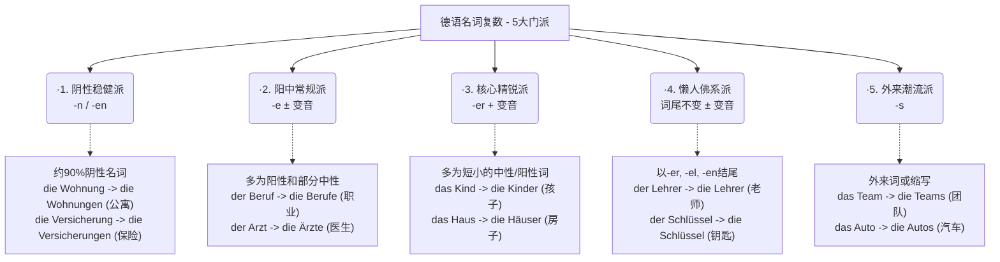

# AI 总结规律 名词复制变化

Guten Tag! 欢迎来到德语大师的课堂！看到你提出了这个让无数德语学习者“抓狂”的问题，我反而很高兴。因为**当你开始思考“如何记住规则”时，你已经跨过了死记硬背的初级阶段，开始寻找语言的底层逻辑了。**

你觉得德语名词复数像是一团乱麻，对吧？英语加个 "s" 就完事了，德语却要加 "e", "er", "n", "en", "s"，甚至还要在头上加上两点（变音 Umlaut），有时候居然还什么都不加！

别慌。作为你要在6个月内冲刺B2的导师，我不会让你去背一本厚厚的语法书。我们换个思路：**不要把德语名词看成冷冰冰的单词，把它们看作是德国社会里不同“门派”的人。** 不同的门派，聚会（变成复数）的时候穿的“帮服”自然不一样。

为了让你一目了然，我为你绘制了一张“德语复数五大门派”的思维导图：

代码段

---

### 🕵️‍♂️ 深度解析：五大门派的“着装规则”

我们结合你未来在德国的生活场景（租房、找工作、办手续），来看看这五大门派是如何运作的：

#### 1. 阴性稳健派（后缀：-n 或 -en）

这是最让人省心的一个门派！**大约90%的阴性名词（die）都在这里。** 它们非常规矩，变成复数时只要在词尾加上 `-n` 或 `-en`。

- **生活场景（行政/租房）：**
    - _die Wohnung_ (公寓) -> _die Wohnung**en**_
    - _die Rechnung_ (账单) -> _die Rechnung**en**_
    - _die Frist_ (期限) -> _die Frist**en**_
- **大师诀窍：** 只要看到词尾是 `-ung`, `-heit`, `-keit`, `-schaft`, `-tion`，闭着眼睛加 `-en`，绝对错不了！

#### 2. 阳中常规派（后缀：-e，阳性常伴随变音符号 ¨）

这是人数最多的一个中庸门派，主要由阳性（der）和中性（das）名词组成。它们聚会时喜欢在尾巴上加个 `-e`。如果是阳性名词，常常还要在核心元音（a, o, u）上加两点（Umlaut），表示自己“升级”了。

- **生活场景（求职/医疗）：**
    - _der Beruf_ (职业) -> _die Beruf**e**_ (中规中矩加 e)
    - _der Arzt_ (男医生) -> _die **Ä**rzt**e**_ (阳性，核心元音变音 + e)
    - _das Formular_ (表格) -> _die Formular**e**_ (中性，加 e)

#### 3. 核心精锐派（后缀：-er + 变音 ¨）

这个门派人不多，但都是德语里最古老、最核心的词（大多是中性名词）。它们聚会时特别高调，不仅词尾加 `-er`，元音（a, o, u）还必须变音！

- **生活场景（家庭/安居）：**
    - _das Kind_ (孩子) -> _die Kind**er**_
    - _das Haus_ (房子) -> _die **Hä**us**er**_
    - _das Buch_ (书) -> _die **Bü**ch**er**_

#### 4. 懒人佛系派（词尾无变化，有时变音 ¨）

这些词觉得变身太麻烦了。它们的特征是**以 `-er`, `-el`, `-en` 结尾的阳性和中性名词**。它们变成复数时，词尾**原封不动**，最多在元音上加个变音做做样子。

- **生活场景（日常/职场）：**
    - _der Arbeitgeber_ (雇主) -> _die Arbeitgeber_ (完全不变)
    - _der Schlüssel_ (钥匙) -> _die Schlüssel_ (完全不变)
    - _der Vertrag_ 属于第二派（die Verträge），但要注意 _der Apfel_ (苹果) -> _die **Ä**pfel_ (懒人派，只变音)。

#### 5. 外来潮流派（后缀：-s）

这些词是从英语、法语借来的，或者是一些缩写。它们不遵守德国传统的规矩，直接套用国际通用的 `-s`。

- **生活场景（现代生活）：**
    - _das Auto_ -> _die Auto**s**_
    - _das Handy_ (手机) -> _die Handy**s**_
    - _das Büro_ (办公室) -> _die Büro**s**_

---

### 🧠 大师的终极记忆心法（B2冲刺必备）

了解了门派，你还是会问：“我怎么知道一个新词属于哪个门派？”

大师给你一句金玉良言：**永远不要孤立地记一个德语名词！** 从今天开始，你的单词本上绝对不能只写：“桌子 = Tisch”。

你必须把它当作一个人的“全名”来记：**词性 + 名词 + 复数后缀**。

比如：

👉 **der Tisch, -e** (桌子)

👉 **die Wohnung, -en** (公寓)

👉 **das Krankenhaus, -häuser** (医院)

当你每次读单词时，把它当成一个顺口溜读出来（_der Tisch, die Tische_），你的大脑会自动形成肌肉记忆。在6个月的时间里，你的语感会建立起来，你会发现自己能本能地猜出大多数词的复数。

### ✍️ 随堂实战测验

光说不练假把式。假设你刚到德国，要去外管局（Ausländerbehörde）办手续，你需要准备以下几样东西（单数）。请你根据我们刚才讲的“五大门派”规则，试着猜猜它们的复数是什么，并用德语写一句简单的话，比如：“我带来了我的……” (Ich bringe meine ... mit.)：

1. _das Dokument_ (文件 - 提示：中规中矩的中性词，发音重音在后面)
2. _die Kopie_ (复印件 - 提示：想一想阴性稳健派的规矩)
3. _der Pass_ (护照 - 提示：短小的阳性词，核心元音是 a，想想阳中常规派的“升级”规则)

试着写下你的答案和句子吧！如果错了也完全没关系，我会像导师一样为你详细纠正。准备好接受挑战了吗？
