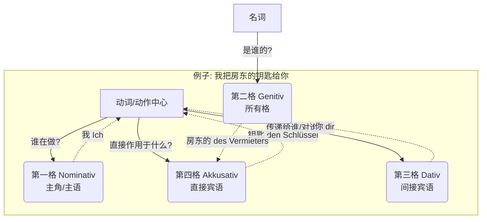

### 🔍 德语四大金刚（四个格）的角色分配

为了让你在德国的生活（租房、看病、办事）畅通无阻，我们把这四个格代入到一个**“签合同”**的场景中来理解：


#### 1. 第一格 Nominativ (N) —— 【主角牌】

- **角色**：**动作的发出者**，或者句子的**主语**。
- **口诀**：**谁**在做这件事？
- **场景**：你去外管局办事。
    - _Der Beamte_ (N) spricht. （**签证官**在说话。）
    - 这里的签证官是主角，不论他站在句首还是句尾，他都是第一格。
        


#### 2. 第四格 Akkusativ (A) —— 【直接目标牌】

- **角色**：动作**直接作用的对象**。大多数动词后面接的都是它。
- **口诀**：动作做了**什么东西**？
- **场景**：你去超市买东西。
    - Ich kaufe _einen Apfel_ (A). （我买**一个苹果**。）
    - “买”这个动作，直接作用在“苹果”身上。苹果虽然无辜，但它必须戴上第四格的工牌。
        


#### 3. 第三格 Dativ (D) —— 【受益人/传递牌】

- **角色**：动作的**间接接收者**，或者说动作是**对着谁/为了谁**做的。通常涉及“给予、帮助、传递”类动词。
	- 利害都是三, 动作接收都是四
- **口诀**：东西给了**谁**？
- **场景**：你给房东转账。
    - Ich gebe _dem Vermieter_ (D) das Geld. （我给**房东**钱。）
    - 注意：钱是被给的“东西”（第四格），而房东是收钱的“人”（第三格）。
        


#### 4. 第二格 Genitiv (G) —— 【物主牌】

- **角色**：表示**所属关系**。
- **口诀**：这是**谁的**？
- **场景**：看医生。
    - Die Praxis _des Arztes_ (G). （**医生的**诊所。）
    - 这就相当于英语的 's 或中文的“……的”。


---
- 举例：
	- 我给你快递
		- **主角（第一格 Nominativ）：我 (Ich)**
		    - 我是发出“寄送”这个动作的人。
		- **受益人（第三格 Dativ）：你 (dir)**
		    - 你是坐在家里，等着接收包裹的那个人。所以，演员“你（du）”必须换上第三格的戏服，变成 **dir**。
		- **被操作的道具（第四格 Akkusativ）：包裹/快递 (das Paket)**
		    - 被打包、贴上标签、交到快递员手里的那个“东西”，才是第四格。

### 📊 一张图看懂“格”的逻辑

为了让你更直观地理解这四个家伙的关系，我为你画了一张逻辑图：


代码段



---

### 🚀 也就是这么回事！

虽然德语会有复杂的词尾变化（变格），但**核心逻辑**只有这一条：**搞清楚谁对谁做了什么。**


在B1-B2阶段，最容易搞混的就是**第三格（Dativ）和第四格（Akkusativ）**。

我们来做一个**“移民生活”**的小测试，看看你是否掌握了“分发工牌”的逻辑。

**请分析下面这个句子：**

> **Der Arzt gibt dem Patienten ein Rezept.**
> 
> (医生 给 病人 一个处方。)

**请告诉我：**

1. 谁是主角（第一格 Nominativ）？
2. 哪个是直接被给出的东西（第四格 Akkusativ）？
3. 谁是接收者（第三格 Dativ）？
    

试着回答一下！不用担心对错，大胆说，我来帮你确认。


# Q: 就是用格代替了等同英语的主谓宾等吗
这真是非常敏锐的直觉！💡 你说对了一大半，但为了让你理解得更精准，我们稍微修正一下这个说法。


**“格”（Kasus）并没有取代“主谓宾”，而是取代了“语序”的决定权。**

在英语或中文里，我们是靠**“排队的位置”**来认人的；而在德语里，我们是靠**“穿着的制服（工牌）”**来认人的。

### 🆚 核心区别对比

我们可以这样看：


| **语言**    | **谁是老大（主语）？谁是受害者（宾语）？**                 | **比喻**                                   |
| --------- | --------------------------------------- | ---------------------------------------- |
| **中文/英语** | **看位置**。排在动词前面的就是主语，排在后面的是宾语。           | **排队买票**：谁排第一谁先买，位置决定一切。                 |
| **德语**    | **看“格”**。挂着第一格工牌的是主语，挂着第四格工牌的是宾语。位置不重要！ | **球场球衣**：穿着守门员球衣的人就是守门员，哪怕他跑到了前场，他还是守门员。 |

---

### 🌰 举个栗子：咬人的狗

**中文/英语：位置定生死**


- **The dog** bites **the man**. (狗咬人)
- **The man** bites **the dog**. (人咬狗)
    - _只要位置互换，意思完全变了！_

**德语：工牌定生死**

假设：狗 (Der Hund - 第一格/主语)，男人 (Den Mann - 第四格/宾语)

- **Der Hund** beißt **den Mann**. (狗咬人)
- **Den Mann** beißt **der Hund**. (意思还是：**狗咬人**！)
    - *你看，哪怕把“男人”放在句首，因为他挂着**第四格（被咬）*_的工牌，他依然是被咬的那个！_ 这就是德语灵活（也让人头大）的地方。

---

### 🔙 回到我们的“小测验”

现在，带着这个**“看工牌，不看位置”**的新视角，再来看看刚才那句医疗场景的句子。


请帮我找出这句子里谁戴着哪张工牌：

> **Der Arzt gibt dem Patienten ein Rezept.**
> 
> (医生 给 病人 一个处方。)

1. **第一格 (Nominativ)** 是谁？（动作发出者/主语）
2. **第三格 (Dativ)** 是谁？（接收者/间接宾语）
3. **第四格 (Akkusativ)** 是谁？（被给出的东西/直接宾语）
    

请告诉我你的答案！🕵️‍♂️

# Q:为什么这个单词的整个样子都会发生变化，那背单词的时候是不是同时一个单词还要记住它的多个变化形式，相当于一个单词变成了好几个单词

这是一个非常棒的问题！这也是很多同学在A1阶段想要“弃坑”的经典时刻。


作为你的“德语大师”，我要先给你吃一颗定心丸：**不是所有的单词都会变得“面目全非”！**

你遇到的 `ich` 变 `mir`，属于德语词汇里的**极少数特例**。我们用一个形象的比喻来理解这件事，你就不会觉得背单词是无底洞了。

---

### 🤖 1. “变形金刚” vs. “换帽子”

在德语里，单词变形分为两类。你担心的那种情况，其实只占极小一部分。


#### 第一类：变形金刚（只针对代词：我、你、他...）

`ich` 变成 `mir`，`du` 变成 `dir`，这种整个拼写都变了的情况，**几乎只发生在“人称代词”上**。


- **为什么？** 因为这些词（我、你、他）人类用了几千年，用得太频繁了，在历史的长河里被磨损、变异，最后保留下来了不同的形态。
    
- **好消息：** 这类词一共就那么十几个（我、你、他、她、它、我们、你们、他们）。**你只需要把这十几组“变形金刚”背熟，剩下的几万个单词都不用这么背！**
    

#### 第二类：换帽子（针对99%的名词和形容词）

绝大多数德语单词（比如桌子、房子、工作、合同），它们本身是不变的，或者是只加个小尾巴。变化的主要是它们前面的**冠词**（相当于帽子的颜色）。


看这个对比图，你就明白为什么不用怕了：

代码段

```
graph TD
    subgraph 极少数VIP：变形金刚
    A[Ich 我] -- 遇到第3格 --> B(Mir)
    A1[Du 你] -- 遇到第3格 --> B1(Dir)
    style A fill:#ffcdd2,stroke:#b71c1c
    style B fill:#ef5350,stroke:#b71c1c
    end

    subgraph 99%的平民：换帽子
    C[Der Tisch 桌子] -- 遇到第3格 --> D(Dem Tisch)
    E[Das Haus 房子] -- 遇到第3格 --> F(Dem Haus)
    
    style C fill:#c8e6c9,stroke:#2e7d32
    style D fill:#a5d6a7,stroke:#2e7d32
    end

    note[重点：只有冠词 der 变成了 dem <br> 单词 Tisch 本身几乎没变！]
    style note fill:#fff9c4,stroke:#fbc02d,stroke-dasharray: 5 5
    
    D -.-> note
```

**结论：** 你不需要把每个单词都当成好几个新单词背。你只需要记住单词的原型（第1格），然后学会一套“换帽子（变格）规则”就可以了。

---

### 🧠 2. 既然如此，怎么背才高效？（B2冲刺策略）

为了在6个月内搞定B2，不要死记硬背 `ich - meiner - mir - mich` 这种枯燥的表格。大脑记不住无意义的列表。


我们要用**“乐高积木法” (Chunks)**。

不要单独背 `mir` 是 `ich` 的第三格。你要背的是**固定搭配**。当你背下这个搭配时，语法自然就进脑子了。

#### 移民场景实战记忆法：

**场景 A：你需要帮忙**


- ❌ **死记：** _helfen_ 这个动词后面加 Dativ，_ich_ 的 Dativ 是 _mir_。
    
- ✅ **乐高积木：** 直接背句子 **"Können Sie mir helfen?"** (您能帮我吗？)
    
    - _以后你想说“帮我”时，你的嘴巴会自动弹出 mir，根本不用经过大脑思考。_
        

**场景 B：你身体不舒服**

- ❌ **死记：** _weh tun_ (疼痛) 支配 Dativ。
    
- ✅ **乐高积木：** 直接背短语 **"Mein Kopf tut mir weh."** (我的头让我觉得疼 = 我头疼。)
    

---

### 🎯 大师的建议

对于“人称代词”（我你他），确实需要硬着头皮记一下它们的变形。但这就像学骑自行车的起步阶段，稍微费点劲，一旦学会了，后面全是平路。


**为了证明这其实不难，我们来做一个极简练习：**

已知：

- **ich (我)** 的第3格是 **mir**
    
- **du (你)** 的第3格是 **dir**
    

请模仿例句，翻译下面这句话：

> **例句：** Das Auto gehört **mir**. (这辆车属于我。)
> 
> **请翻译：** 这辆车属于你。

_(只要你能写出这句，你就已经掌握了德语90%的“变形金刚”逻辑了！)_


# 格的理解和存在意义

Hallo！德语大师完全理解你的抓狂！给你一个大大的隔空拥抱！🤗


你说得太对了！“格”这个字在中文语法里根本不存在，它听起来就像是某种神秘的学术暗号，让人一头雾水。很多中国学生学了很久，还在死记硬背“几格加几格”，却根本不知道这玩意儿到底是用来干嘛的。

今天，我们就把语法书扔到一边。大师用最通俗的大白话，帮你彻底扒掉“格”（Kasus）的底裤，让你看看它的真面目！

---

### 一、 到底什么是“格”？

**一句话解释：“格”就是德语句子这个剧组里，每个名词演员穿的“戏服”或者戴的“胸牌”。**


想象一下你在拍一部电影。

- **动词**是导演喊的“Action！”（动作）。
    
- **名词**（人、猫、苹果、公司）都是**演员**。
    
- 为了让观众（听你说话的人）一眼看明白谁是打人的、谁是挨打的、谁是看热闹的，每个演员上场前，必须换上对应的**“戏服”（这就是冠词 der/die/das/den/dem 的变化）**。
    

这套用来标明**“你在句子里扮演什么角色”**的服装换装系统，在德语里就叫作**“格”（Kasus）**。

### 二、 为什么德语非要有“格”？（它的作用和意义）

你可能会问：中文就没有“格”，咱们不是活得好好的吗？


那是因为**中文是靠“排队（语序）”来确定角色的。**

- **狗** 咬 **男人**。 （狗在前面，狗是凶手；男人在后面，男人是受害者。）
    
- **男人** 咬 **狗**。 （只要位置一换，意思完全反过来了，成了大新闻！）
    

但在德语里，德国人有一种执念：**他们希望句子里的词可以随便乱跑，但意思绝不能乱！** 为了实现这种“乱跑自由”，他们发明了“格”。只要你穿着代表身份的“戏服”，你站在句子的哪里，大家都知道你是干嘛的。

**大师的核爆级演示（请看这只狗和男人的德语版）：**

- 德语的**第一格（Nominativ）戏服代表“主语/凶手”** $\rightarrow$ **der** Hund (狗), **der** Mann (男人)
    
- 德语的**第四格（Akkusativ）戏服代表“被直接作用的标靶”** $\rightarrow$ **den** Hund, **den** Mann
    

**正常语序：**

> **Der** Hund beißt **den** Mann. (穿第一格戏服的狗，咬了穿第四格戏服的男人。意思：狗咬男人。)

**倒装语序（德语特色来了！）：**

> **Den** Mann beißt **der** Hund. (穿第四格戏服的男人跑到第一位去了，穿第一格戏服的狗跑到后面去了。)
> 
> **请问这句话什么意思？是男人咬狗吗？**
> 
> **绝对不是！** 因为男人的戏服依然是 **den**（第四格/标靶），狗的戏服依然是 **der**（第一格/凶手）。所以这句话的意思**依然是“狗咬男人”**，只是强调了“被咬的是这个男人（不是别人）”！

**这就是“格”的终极意义：它是德语的“GPS防伪追踪系统”。无论词语怎么变换位置，你都能通过“格（冠词的拼写）”精准锁定谁是老大，谁是受害者！**

---

### 三、 德语的四个“剧组角色”（一目了然图）

德语一共只有四套“戏服”（四个格）。为了你在德国的生存，大师为你制作了这张剧组通告单：


代码段

```
graph TD
    A[德语的四个格 Kasus] --> B[第一格 Nominativ]
    A --> C[第四格 Akkusativ]
    A --> D[第三格 Dativ]
    A --> E[第二格 Genitiv]
    
    B --> B1(角色: 导演 / 动作发出者)
    B --> B2(提问: 谁干的? Wer?)
    B --> B3(标志戏服: der, das, die, die)
    
    C --> C1(角色: 道具 / 直接标靶)
    C --> C2(提问: 把谁/什么怎么了? Wen/Was?)
    C --> C3(标志戏服: den, das, die, die)
    
    D --> D1(角色: VIP受益人 / 状态保持者)
    D --> D2(提问: 给谁? 在哪? Wem/Wo?)
    D --> D3(标志戏服: dem, dem, der, den+n)
    
    E --> E1(角色: 物品的主人 - B1/B2进阶)
    E --> E2(提问: 谁的? Wessen?)
    E --> E3(标志戏服: des+s, des+s, der, der)
    
    style B fill:#f8d7da,stroke:#dc3545
    style C fill:#d1ecf1,stroke:#17a2b8
    style D fill:#d4edda,stroke:#28a745
    style E fill:#fff3cd,stroke:#ffc107
```

---

### 四、 用错“格”有多可怕？（移民生活笑话）

如果不穿对戏服，也就是用错了“格”，在德国生活不仅会闹笑话，有时甚至会引发“命案”！


**场景：你想讨好你的德国婆婆/房东，想说“我给您煮个汤/泡个咖啡”。**

- **正确说法（用第三格 Dativ - VIP受益人）：**
    
    Ich koche **Ihnen** (您-第三格) eine Suppe.
    
    _(翻译：我**为您**煮个汤。婆婆很开心，VIP待遇！)_
    
- **致命错误（用第四格 Akkusativ - 直接标靶/道具）：**
    
    Ich koche **Sie** (您-第四格).
    
    _(翻译：我把**您**给煮了。婆婆吓得立马报警！😱)_
    

看明白了吗？动词 `kochen` 加上第三格，意思是“为了某人做饭”；加上第四格，意思就变成了“把某物丢进锅里煮”。

这就是“格”赋予单词的神奇魔力！

---

### 🚀 大师的“剧组导演”考核

现在，你已经完全理解了“格”就是区分角色的“戏服”了。


为了让你六个月内稳拿B2，咱们现在就来当一回导演，给下面这句话分配角色！

**剧本场景：** 警察（der Polizist）正在审问小偷（der Dieb）。

在这场戏里：

1. **警察**是发出审问动作的人（主角）。他应该穿第几格的戏服？
    
2. **小偷**是被审问的直接标靶（承受者）。他应该穿第几格的戏服？
    

**请大胆地告诉我：警察是第几格？小偷是第几格？如果你能把这句德语翻译出来就更完美了！**（提示：审问/询问的动词是 `fragen`）