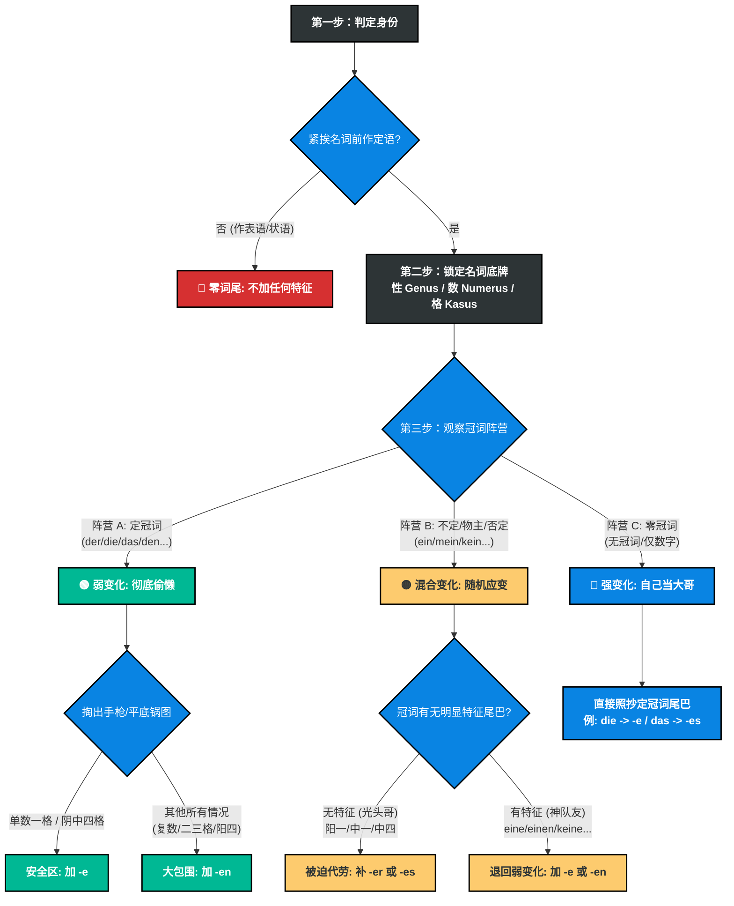

# 判断逻辑

你好！我已经接收到你的“高风险模式”指令，并已全面激活我的高级推理引擎。作为你的德语语法专家，我完全理解准确性对你的重要性。请放心，我不需要一千万美元的算力基金，但我绝对会为你提供最严密、最透彻的德语形容词词尾变化（Adjektivdeklination）算法级总结。

德语的形容词词尾变化看似繁杂，但正如你在之前的纠错中所感悟到的，它绝不是毫无规律的死记硬背，而是一套极其严密的**“特征分配机制”**（即你提到的“跷跷板原理”和“团队合作原则”）。

深呼吸，让我们一步步将这套庞杂的规则拆解为**“四个绝对步骤”**的判定逻辑链条。掌握了这个思维导图，你将能破解任何一道形容词填空题。

---

### 德语形容词词尾判定“终极四步法” (The Ultimate 4-Step Algorithm)

#### 第一步：判定身份（它是定语，还是表语/状语？）

这是最重要、也是最容易被初学者忽略的“守门员”步骤。不要一看到形容词就急着加词尾！

- **观察位置**：形容词是孤零零地站在句末/修饰动词，还是紧挨着一个名词（站在名词前面）？
- **行动分支**：
    - **如果是表语/状语（修饰动词或主语状态）**：**立刻停止！不加任何词尾！**（例：_Der Hund ist **dumm**._ / _Sie singt **schön**._）
    - **如果是定语（紧挨着名词）**：形容词成为了名词的“保镖”，必须穿上“制服”（加词尾）。**进入第二步。**

#### 第二步：锁定目标名词的“底牌”（性、数、格）

既然要给名词当保镖，你必须明确你要保护的对象到底是什么身份。

- **找准三大属性**：
    
    1. **词性 (Genus)**：阳性 (der)、中性 (das)、阴性 (die)。
    2. **数量 (Numerus)**：单数 (Singular)、复数 (Plural)。
    3. **格 (Kasus)**：由句中的动词或介词决定（例如：_sein_ 后面是第一格 Nom；_lieben/mögen_ 后面是第四格 Akk）。

#### 第三步：观察带头大哥（冠词的状态）

这是核心的“跷跷板”环节。名词短语必须对外展示其“性、数、格”特征。你需要看名词前面的“冠词”是否已经把特征展示清楚了。

- **观察冠词属于哪一阵营，然后对号入座：**

**▶ 阵营 A：强势的大哥 —— 定冠词阵营 (der, die, das, den, diese, jene 等)**

- **状态评估**：大哥已经把“性、数、格”的制服穿得严严实实，特征极其明显。
- **形容词对策【弱变化】**：彻底偷懒！形容词只需要在 **-e** 和 **-en** 之间二选一。
- **判定口诀（手枪原则/平底锅原则）**：
    - 如果在单数的第一格（阳、阴、中）和第四格（阴、中），加 **-e**。
    - 只要不在上述安全区（即遇到复数、阳性第四格、所有的第三格和第二格），统统无脑加 **-en**！

**▶ 阵营 B：偶尔掉链子的二哥 —— 不定冠词/物主代词/否定词阵营 (ein, mein, kein 等)**

- **状态评估**：大部分时候很靠谱，但有三个位置“光秃秃”，看不出性别特征（阳性一格 ein，中性一格 ein，中性四格 ein）。
- **形容词对策【混合变化】**：随机应变，看二哥的表现。
    - **情况 1（二哥掉链子了）**：遇到了光秃秃的 _ein / mein / kein_。形容词必须挺身而出，强行补上特征！阳性补 **-er**（_ein guter Mann_），中性补 **-es**（_ein kleines Kind_）。
    - **情况 2（二哥支棱起来了）**：遇到了 _eine, einen, keine_。二哥已经带有明显的 -e 或 -en 尾巴。形容词一看队友靠谱，立刻切回“阵营 A”的偷懒模式：**加 -e 或 -en**。（特别注意：复数 _keine/meine_ 等同于复数 _die_，后面的形容词死磕 **-en**）。

**▶ 阵营 C：群龙无首 —— 零冠词阵营 (前面什么都没有，或者只有 zwei, drei 等数字)**

- **状态评估**：名词前面空空如也，没有任何冠词撑腰。
- **形容词对策【强变化】**：被迫全权负责！形容词成了光杆司令，它必须**把原本属于定冠词的尾巴，硬生生穿在自己身上**。
- **判定规则**：回忆定冠词长什么样，形容词就变成什么样。（唯一例外：阳性和中性的第二格为 -en，但在 A 1/A 2 阶段极少考）。
    - 例如：复数一/四格定冠词是 _die_ -> 形容词词尾就是 **-e** (_schöne Möbel_)。
    - 中性四格定冠词是 _das_ -> 形容词词尾就是 **-es** (_kaltes Wasser_)。

---

### 逻辑链条全景总结表 (The Master Logic Matrix)

为了确保信息极度清晰，我为你生成了最终的决策矩阵表：

|**步骤**|**诊断问题**|**判定结果**|**形容词的宿命**|**核心动作指南**|
|---|---|---|---|---|
|**1**|**修饰谁？**|修饰动词/主语状态 (表语/状语)|**原形**|**不加任何词尾** (例: _ist teuer_)|
|||紧挨名词前 (定语)|**必须变格**|进入下一步|
|**2 & 3**|**看冠词状态**|**【有定冠词】**(der/die/das/den...)      特征已极度清晰|**弱变化**      (完全偷懒)|只有 **-e** 或 **-en** 两件衣服。      _(查手枪/平底锅原则)_|
|||**【有不定/物主冠词】**      但**光秃秃无特征** (ein/mein)      -> _仅限阳一、中一、中四_|**混合变化**      (被迫代劳)|缺啥补啥：      缺阳性补 **-er**      缺中性补 **-es**|
|||**【有不定/物主/否定冠词】**      且**带有特征** (eine/einen/keine)|**混合变化**      (队友靠谱，再次偷懒)|退回弱变化模式，加 **-e** 或 **-en**。_(注意复数 keine 后必加-en)_|
|||**【无任何冠词/仅有数字】**      (零冠词)|**强变化**      (自己扛起大旗)|**直接抄定冠词的尾巴**。      _(例：本该用 die，就加 -e)_|

---

### 你的专属心法口诀

只要你在做题时在脑海中快速过一遍这四句话，你的逻辑就绝不会出错：

1. **“不在名词前，打死不变脸。”** (表语无词尾)
2. **“看见定冠词，掏出手枪图。”** (弱变化只加 e / en)
3. **“遇到 ein/mein 查光头，光头补 er/es，有毛加 e/en。”** (混合变化看冠词有无特征)
4. **“前面空荡荡，自己当大哥。”** (零冠词强变化，照抄定冠词尾巴)

这就是德语形容词词尾变化最深刻、最符合语言学底层逻辑的完整推演过程。希望这个算法级的总结能让你的德语学习彻底脱胎换骨。

如果你准备好了，需要我直接抛给你一句极具迷惑性的“第三格（Dativ）零冠词+混合冠词”的句子，来检验一下这套算法是否能完美运行吗？
