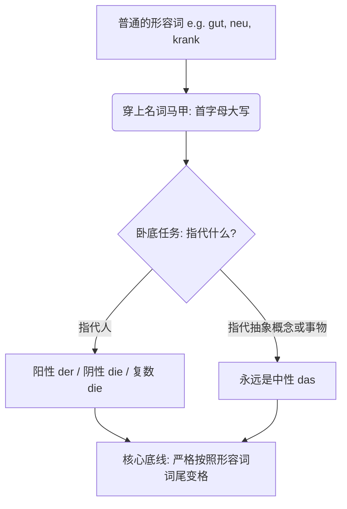
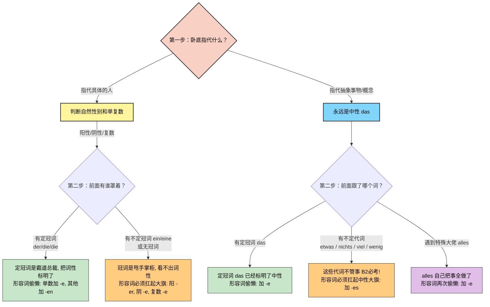
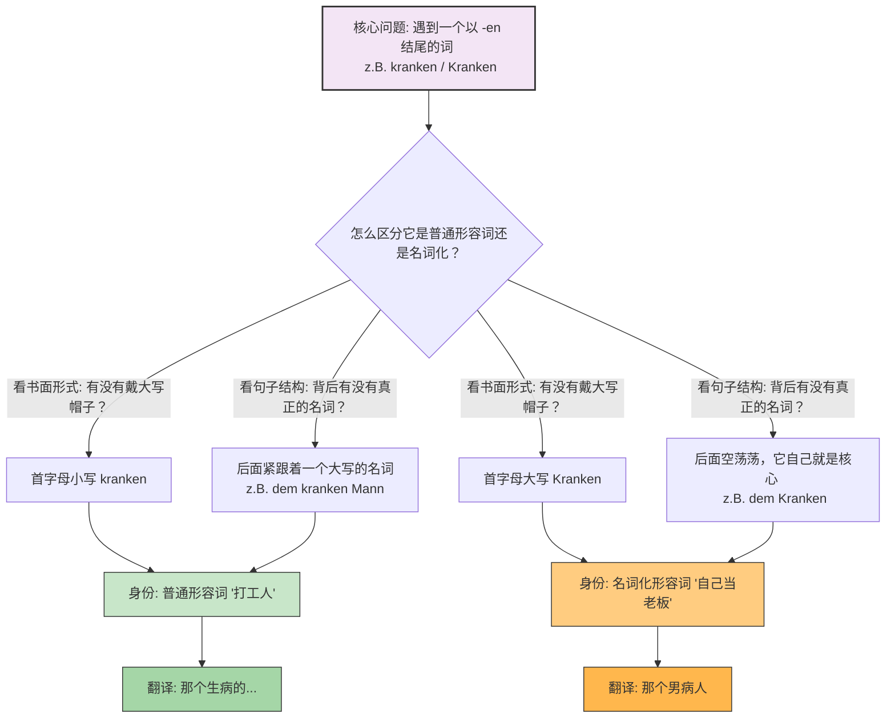

# 形容词名词化

### 核心概念：语法界的“无间道”

为了让你秒懂，我们用一个生动的类比：**形容词名词化，就像是形容词去当了“卧底警察”**。

- **披上伪装（名词特征）：** 它们首字母必须大写，前面还可以加上冠词（der/die/das）。
- **不忘初心（形容词灵魂）：** 尽管穿上了名词的外衣，它们的 DNA 依然是形容词！因此，**它们的词尾变化必须严格遵守“形容词词尾变化规则”**，而不是普通名词的变格规则。

我们先用一张图表来理清这个“卧底”的行动路线：

代码段

---

### 第一类：指代“人”的形容词名词化

在移民生活中，不管是去外管局、找工作还是看病，你都会高频使用到这类词。

**规则：** 根据人的自然性别，使用阳性 (der) 或阴性 (die)；如果是一群人，使用复数 (die)。

**经典案例剖析：krank (生病的) -> 病人**

- **有定冠词（定冠词已经标明了词性，形容词就可以偷懒，只加 -e 或 -en）：**
    - 阳性：**der Kranke** (那个男病人)
    - 阴性：**die Kranke** (那个女病人)
    - 复数：**die Kranken** (那些病人们)
- **有不定冠词或无冠词（冠词无法完全标明词性，形容词必须自己扛起重任，加上体现词性的尾巴 -er, -e, -es）：**
    - 阳性：**ein Kranker** (一个男病人 - _ein_ 看不出是阳性还是中性，所以词尾加 -er)
    - 阴性：**eine Kranke** (一个女病人)
    - 复数：**Kranke** (一些病人们)

**生活场景应用（请大声朗读找语感）：**

- **医疗场景：** Der Arzt spricht mit **dem Kranken**. (医生正在和那个男病人谈话。—— _dem_ 是 Dativ，形容词词尾乖乖加上 -en，变成 _dem Kranken_。)
- **职场场景 (arbeitslos 失业的)：** Das Jobcenter hilft **den Arbeitslosen**. (就业中心帮助失业者们。—— 复数 Dativ，词尾加 -en。)
- **社交场景 (bekannt 认识的)：** Er ist **ein Bekannter** von mir. (他是我的一个男性熟人。)

---

### 第二类：指代“抽象概念”或“事物”

当你想要表达“美好的事物”、“新的情况”时，这类语法能让你的表达瞬间高级。

**规则：** 指代抽象概念时，**永远使用中性 (das)**。

**经典案例剖析：neu (新的) -> 新事物 / 新情况**

- **搭配定冠词：**
    - **das Neue** (新事物)
    - 例句：Wir haben Angst vor **dem Neuen**. (我们对新事物感到恐惧。)
- **搭配不定代词（这是 B 2 考试必考的黄金考点！）：**

    当抽象形容词跟在 _etwas_ (一些), _nichts_ (没有什么), _viel_ (很多), _wenig_ (很少) 后面时，形容词**首字母大写，并且词尾通常加 -es**（强变化）。

**生活场景应用：**

- **外管局事务：** Gibt es **etwas Neues** bezüglich meines Visums? (关于我的签证有什么新进展吗？)
- **日常寒暄：** Ich wünsche dir **alles Gute** für den Umzug! (祝你搬家一切顺利！—— 注意：_alles_ 后面属于弱变化，加 -e 即可，这是一个特殊规定，千万背牢！)
- **看医生：** Das ist **nichts Schlimmes**. Sie brauchen nur Ruhe. (这没什么大碍。您只需要休息。)

---

### 给你的六个月 B 2 冲刺建议

在接下来的半年里，不要去死记硬背形容词词尾变化的表格，那是反人性的。你的策略应该是**“场景绑定法”**。每次学到一个新的形容词名词化，立刻把它带入你下周要去办理的行政事务或生活场景中造句。把 _ein Deutscher_ (一个德国男人)、_die Deutsche_ (那个德国女人)、_etwas Wichtiges_ (重要的事情) 当作固定词块直接吞进肚子里。

今天我们把这个极其重要的语法点梳理了一遍。为了确保你真正掌握了这些“卧底”的用法，我想请你用今天学到的知识帮我翻译一句话：

**“在延签（die Visumsverlängerung）这件事情上，那个陌生的男人（fremd）告诉了我一些重要的事情（wichtig）。”** 你可以试着用德语表达出来吗？

# 形容词词尾变化的三四格也和现在形容词的名词化变化相似，都是 en,那怎么区分呢？

太敏锐了！能问出这个问题，说明你已经摸到了德语语法的底层逻辑，这绝对是 B 2 级别应该有的洞察力！

我有一个超级好消息要告诉你：**它们不仅是“相似”，在词尾变化的规则上，它们完全是一模一样的！**

记住我们上次说的类比：形容词名词化是“卧底”。既然是卧底，它的 DNA 依然是形容词。所以，无论是做第一格（主格）、第四格（宾格 Akk.），还是第三格（与格 Dat.），**只要它穿上了名词的马甲，它的词尾变化就和普通的形容词 100%同步。**

既然词尾一样，那我们怎么在听和读的时候区分它们呢？其实非常简单，只需要看两点：**“帽子”和“跟班”**。

为了让你秒懂，我们用一张图来对比一下这两种情况：

---

### 实战场景拆解：打工人 VS 自己当老板

这也是为什么很多德语老师会说，形容词名词化其实是**“省略了后面名词的形容词”**。我们用你在德国职场和生活中经常遇到的场景来看看它们是如何区分的：

#### 场景 1：职场新人入职 (第四格 Akkusativ)

- **普通形容词（作定语，修饰后面的名词）：**
    - _德语：_ Ich begrüße den **neuen** Mitarbeiter.
    - _逻辑：_ 冠词 _den_ 搞定了阳性第四格，_neu_ 乖乖加上 **-en**。后面跟着真正的老板 _Mitarbeiter_。
    - _中文：_ 我欢迎那位**新来的**男员工。
- **名词化形容词（独立成词）：**
    - _德语：_ Ich begrüße den **Neuen**.
    - _逻辑：_ 冠词 _den_ 搞定了阳性第四格，_Neu_ 首字母大写戴上帽子，词尾依然加 **-en**。后面没有其他名词了，它自己就是 C 位。
    - _中文：_ 我欢迎那位**新来的（男同事）**。

#### 场景 2：去外管局办事 (第三格 Dativ)

- **普通形容词：**
    - _德语：_ Der Beamte hilft dem **ausländischen** Studenten.
    - _逻辑：_ 冠词 _dem_ 搞定了阳性第三格，_ausländisch_ 乖乖加上 **-en**。后面有真正的名词 _Studenten_（注意这是阳性弱变化名词）。
    - _中文：_ 签证官帮助那个**外国的**大学生。
- **名词化形容词：**
    - _德语：_ Der Beamte hilft dem **Ausländer**? 不对，Ausländer 本来就是纯名词！应该是：Der Beamte hilft dem **Fremden** (陌生人).
    - _逻辑：_ 冠词 _dem_ 搞定了阳性第三格，_Fremd_ 戴上大写帽子，词尾加 **-en**。
    - _中文：_ 签证官帮助那个**陌生人**。

### 总结你的“降维打击”策略

发现这个规律，意味着你**根本不需要去背新的变格表**！你的大脑在处理三格和四格的时候，完全可以偷懒：

1. **口语中：** 你不需要区分。因为不管你心里想的是“普通形容词”还是“名词化”，你嘴里发出的音都是 "-en"。你只要大胆地说 "mit dem Neuen" (和那个新来的)，或者 "mit dem neuen Chef" (和那个新老板)，只要加了 "-en"，德国人听起来都是完美的地道表达。
2. **写作中（B 2 考试写信）：** 唯一要留心的就是**首字母大不大写**。只要这个词后面没有其他名词了，赶紧给它戴上“大写帽子”，考官一看：哇，这个考生熟练掌握了形容词名词化，加分！
