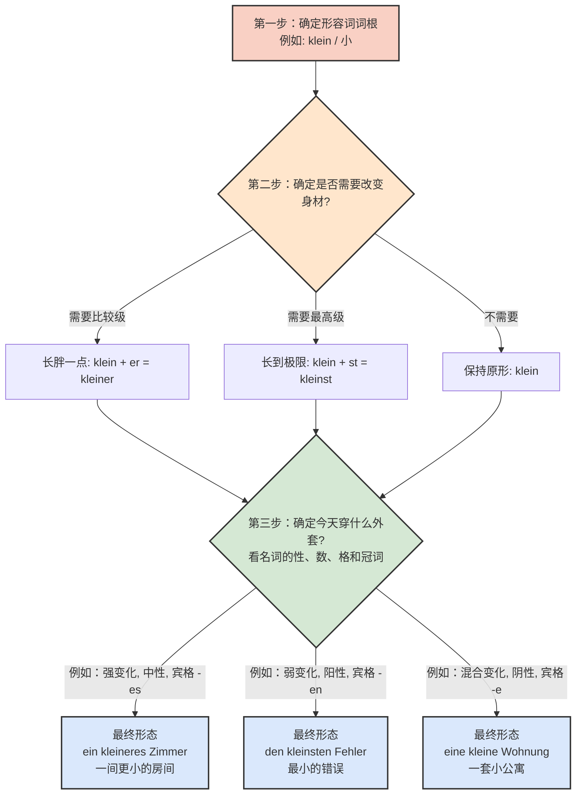

# 格的变化和比较级最高级变化是否重合

针对你的问题：“**形容词格的变化和比较级/最高级变化是否重合在一起？**”

答案是：**绝对是的！它们不仅会重合在一起，而且有严格的“穿衣顺序”。**

---

### 🧥 核心类比：形容词的“身材”与“外套”

你可以把一个德语形容词想象成一个**要去面试或者看房的移民**：

1. **形容词的词根（Grundform）**：是这个人的**骨架**（比如 _schnell_ / 快）。
2. **比较级/最高级（Komparativ / Superlativ）**：是这个人的**身材变化**。他可能是健身长胖了，或者长高了（变成了 _schneller_ / 更快，或者 _schnellst-_ / 最快）。**这是长在肉里的，是内部变化。**
3. **形容词词尾/格的变化（Deklination）**：是这个人出门时穿的**外套**。这件外套取决于今天的天气和场合（也就是名词的**性、数、格**，以及前面的**冠词**）。**这是穿在最外面的，是外部变化。**

**黄金法则：先改变“身材”（加比较级/最高级后缀），再穿上“外套”（加词尾变化）！**

为了让你看得更直观，我为你生成了一张逻辑推演图：

代码段

---

### 🏠 实战场景演练：在德国租房与找工作

让我们把这个理论放到你未来在德国最常遇到的实际场景中。

#### 场景一：找房子（租房场景）

假设你在慕尼黑找房子，中介给你看了一套公寓（die Wohnung），但你觉得太贵了（teuer）。你想说：“我想要找一套**更便宜的**公寓。”

1. **骨架**：_billig_ （便宜的）
2. **身材（内部变化）**：因为是“**更**便宜的”，我们需要比较级。变成 _billig**er**_。
3. **外套（外部变化）**：你要找“一套更便宜的公寓” (eine Wohnung)。
    
    - 动词 _suchen_ 后面加第四格（Akkusativ）。
    - Wohnung 是阴性（feminin）。
    - 前面是带有不定冠词 _eine_。
    - 查词尾变化表：阴性、第四格、不定冠词后面的词尾是 **-e**。
        
4. **合体**：billig + er + e = **billigere**

> **德语表达**：Ich suche eine **billigere** Wohnung.
> 
> _(注意这里的拼写：里面那个 -er 是身材，外面那个 -e 是外套，千万别漏掉！)_

#### 场景二：职场面试（找工作场景）

你收到了几份 Offer，你在和朋友比较这几份工作。你想说：“这是我收到的**最好的**工作邀请（das Angebot，中性）。”

1. **骨架**：_gut_ （好的）
2. **身材（内部变化）**：因为是“**最好的**”，我们需要最高级。_gut_ 的最高级是不规则的，变成 _best-_。
3. **外套（外部变化）**：这是“那个最好的邀请” (das Angebot)。
    
    - 系动词 _sein_ 后面是第一格（Nominativ）。
    - Angebot 是中性（neutral）。
    - 前面是定冠词 _das_。
    - 查词尾变化表：定冠词后的弱变化，第一格中性的词尾是 **-e**。
        
4. **合体**：best + e = **beste**

> **德语表达**：Das ist das **beste** Angebot, das ich bekommen habe.

---

### ⚠️ B 2 级别高频避坑指南（大师的私房叮嘱）

在批改了无数移民学生的作文后，我发现大家最容易掉进以下两个“陷阱”：

**陷阱 1：把“比较级的 -er”错当成“阳性第一格的外套”**

很多同学看到 _ein billiger Computer_（一台便宜的电脑），就觉得这是比较级。

- **错觉**：billig + er （更便宜的）
- **真相**：这是原级 _billig_ + 强变化阳性第一格词尾 _er_！
- **如果是“一台更便宜的电脑”该怎么说？** 身材变 _billiger_，外套还要加 _er_。所以是：ein **billigerer** Computer！（看起来有点像结巴，但语法上极其精准）。

**陷阱 2：最高级如果作表语（不跟在名词前面），不要穿外套！**

只有当形容词像个“保安”一样站在名词前面（作定语）时，它才需要穿上词尾变化的“外套”。如果它只是跟在动词后面描述状态（作表语），它只需要改变身材，**不需要穿外套**，但是最高级要加上特殊的护具 `am ... -sten`。

- **作定语（站岗，要穿外套）**：Er ist der **schnellste** Arzt im Krankenhaus. (他是医院里最快的医生。) -> _schnell + st + e_
- **作表语（休息，不穿外套）**：Dieser Arzt ist **am schnellsten**. (这个医生是最快的。) -> 固定搭配 `am ... -sten`。

---

### 🚀 你的 6 个月 B 2 冲刺学习建议

既然你的目标是在半年内达到 B 2 并适应移民生活，针对形容词的这部分，我建议你这样规划：

1. **第 1-2 个月（夯实基础）**：不要死背词尾变化表！把词尾变化表贴在墙上，每天用一张白纸，拿你生活中最常见的物品造句。例如：“我买了一个大苹果（einen großen Apfel）”，“我需要一个更大的苹果（einen größeren Apfel）”。写错没关系，肌肉记忆是练出来的。
2. **第 3-4 个月（场景代入）**：开始写关于医疗、市政厅延签（Ausländerbehörde）、看合同的短文。强制自己在一个句子里同时使用“原级+词尾”、“比较级+词尾”和“最高级+词尾”。
3. **第 5-6 个月（B 2 真题实战）**：在 B 2 考试的口语（Mündlicher Ausdruck）部分，当你需要表达你的观点或对比两个方案时（例如对比住在大城市还是小村庄），流利地使用 `ein ruhigeres Leben` (一个更安静的生活) 或者 `die höchsten Mietpreise` (最高的租金价格) 会让考官眼前一亮，直接给你高分。

保持这种钻研语法的精神，只要理清了“身材（比较级）”和“外套（格的变化）”的先后顺序，德语语法的积木就会一块块完美契合！Viel Erfolg! (祝你成功！)
