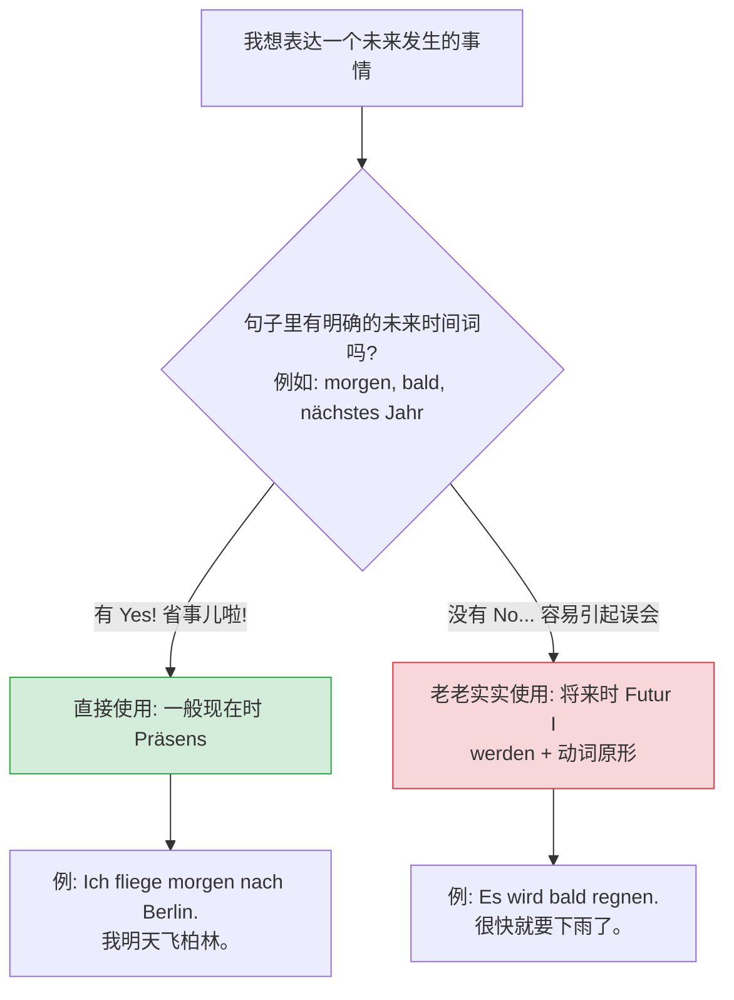

---
aliases:
  - 现在时
  - 一般现在时
---

##### sein haben 的现在时变位

![[PixPin_2026-07-04_10-29-13-1.png|951]]

# 规则动词变化规律

^xdp7nu

Hallo！我是你的“德语大师”。欢迎来到我们在通往B2之路上的第一站。要在6个月内拿下B2，我们没有时间浪费在死记硬背上，我们需要的是**“逻辑”**和**“语感”**。

今天我们攻克最基础、但也最容易在口语中“嘴瓢”的部分：**动词的现在时变位 (Konjugation Präsens)**。

---

### 规则变化

这是90%的动词都遵循的规则。我们可以用一句顺口溜来记忆词尾：

- singule estt
	- 我 e
	- 你 st
	- 他 t
- plurlform enten
	- 我们 en
	- 你们 t
	- 他们 en

**“我爱 (e) 你，** **你死 (st) 缠，** **他踢 (t) 开；**我们恩 (en) 爱，** **你们推 (t) 脫，** 他们恩 (en) 准。**”** ^zqlll8

![[德语语法 活学活用 A1-B1.pdf#page=18&rect=96,421,396,554|📖]]

### 不规则

![[德语语法 活学活用 A1-B1.pdf#page=20&rect=194,426,483,644|📖]]

#### 特定字母结尾

##### t,d,chn,ffn,ckn,gn,dm,tm +235 -e + 正常后缀

只有 du  & ihr & 所有单数 ta 有变化前面多个 e

![[664d53d93bfa54ed7df6864ca4e69ce0_MD5.jpg|800x406]]

![[f302be24b7747aea2861eb1afcd239c0_MD5.jpg|800x452]]

- 特殊规则：词干以t,d,chn,ffn等结尾时，du, 三 e，ihr需在词干后加-e再变位
- 示例：
    - arbeiten → ich arbeite, du arbeitest
    - bilden → ich bilde, du bildest
    - zeichnen → ich zeichne, du zeichnest
    - öffnen → ich öffne, du öffnest
    - trocknen → ich trockne, du trocknest

##### s,ß, ss ,x,z,tz + 2 只加-st -> -t

只有 du 有变化

![[7d0cd51f91b41c28c8cd26e99d7c67ab_MD5.jpg|800x447]]

- 特殊规则：词干以s,ß,z,tz结尾时，du形式只加-t
- 示例：
    - begrüßen → du begrüßt (非begrüßst)
    - heißen → du heißt (非heißst)

##### eln 结尾 46 -n

只有第四和六有变化， n 替代了 en

![[22fecbdf378400335573c63b601cdcbc_MD5.jpg|800x432]]

- wir, sie, Sie, 词尾是 n
![[b087e6f6b5fa9cb73a5d7ed493368b1c_MD5.jpg|800x373]]
- 特殊规则：以-eln结尾动词，wir/sie/Sie形式词尾为-n
- 示例：
    - entwickeln → wir entwickeln (非entwickelen)
    - 第一人称单数两种写法：ich entwickle或ich entwickele

### 元音换音动词变位

![[德语语法 活学活用 A1-B1.pdf#page=22&rect=34,349,463,641|📖]]

# 现在时表将来

简单来说句子里有时间的单词那就可以明确知道是未来，或某个时间点，所以可以直接用现在时，如果句子里没有使用时间，为了避免误会，才使用将来时来刻意显示出这是发生在未来。

**【今日例句与翻译】**

**Ich treffe nächste Woche meinen neuen Chef.**

**翻译**：我下周（将要）见我的新老板。

**句式**：简单句（Einfacher Satz）。句子的核心时态用的是**一般现在时**，但表达的却是**将来的动作**。

**【单词形态大拆解】**

在这个句子里，为了配合语法，好几个词都换了“马甲”：

- **treffe**：原形 _treffen_（遇见/会面）。
    - **变形依据**：一般现在时（Präsens），配合第一人称单数主语 _Ich_，去掉词尾 -en，加上第一人称词尾 -e。你看，动词明明是现在时，但翻译却是“将要见”。
- **nächste**：原形 _nächst-_（下一个的）。
    - **变形依据**：在德语中，表示没有介词引导的、确定的时间状语时，必须要用第四格（Akkusativ）。_Woche_（星期）是阴性名词（die），所以形容词词尾要加上阴性第四格的专属后缀 -e。
- **meinen**：原形 _mein_（我的，物主代词）。
    - **变形依据**：动词 _treffen_ 是个及物动词，直接支配第四格宾语。_Chef_（老板）是阳性名词（der），阳性单数第四格的物主代词必须加上 -en 词尾。
- **neuen**：原形 _neu_（新的）。
    - **变形依据**：由于前面已经有了物主代词 _meinen_，这里触发了德语形容词的“混合变化”。阳性单数第四格的形容词词尾统一加 -en。

**【核心答疑：到底什么是“现在时表将来”？】**

**💡 导师的生动类比：电影票与验票员**

想象一下你去电影院看电影。

正统的将来时（Futur I：werden + 动词原形），就像是电影院门口站着一个大嗓门的验票员，逢人就喊：“注意啦！这是一部**未来**才会放映的电影！”（动词用将来时，强调查明时间）。

但是，如果你的手里已经紧紧攥着一张印着“**明晚八点**”的电影票（明确的时间状语，比如 _morgen_, _nächste Woche_, _in zwei Tagen_），验票员就不需要再扯着嗓子喊了。因为那张“电影票”已经清清楚楚地告诉所有人：这事儿发生在未来！

**德语的逻辑就是如此高效：**

只要句子里已经有了**表示将来的时间词**（nächste Woche 下周），德国人就懒得再去把动词变成复杂的将来时了。直接用最简单的一般现在时（treffe），省时省力，意思还绝不会弄混！

**【视觉化增强：时态选择逻辑图】**

用下面的决策树，你可以一眼看穿德国人脑子里是怎么选择时态的：

代码段

**【学以致用：导师的随堂考核】**

掌握了这个“偷懒秘籍”，以后你和德国人聊天时，只要抛出时间词，就可以大胆地用现在时去聊未来的计划了。

现在，轮到你来牛刀小试了。如果我想让你把下面这句话用这种“最地道、最偷懒的现在时表将来”的方法翻译成德语，你会怎么填空呢？（提示：下个月 = nächsten Monat；买 = kaufen；一辆车 = ein Auto）

**题目：他下个月将要买一辆车。**

**翻译**：Er _______ nächsten Monat ein Auto.
