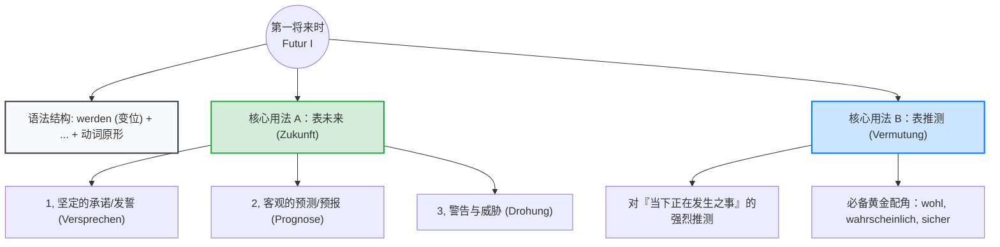

# 第一将来时

更多扮演着“大预言家”和“名侦探”的角色。

> **💡 德语大师的类比时间：**
>
> 我们可以把“第一将来时”想象成一个**“火箭发射系统”**。 助动词 **werden** 是**“发射台”**，它根据主语（我、你、他）调整自己的底座（变位），永远稳稳地扎根在句子的**第二位**。
>
> 而具有实际意义的**动词原形**（Infinitiv），就是那枚**“火箭”**，被发射台一把推到了句子的**最末尾**。不到最后一刻，听众永远不知道这枚火箭要飞向哪里（具体是什么动作）。

### 第一部分：掌握发射系统 —— 语法结构

要想用好将来时，必须先把发射台 **werden** 的变位刻进 DNA 里。这是一个不规则动词，尤其是第二人称（du）和第三人称单数（er/sie/es）需要特别注意。

**1. werden 的现在时变位：**

|**人称**|**werden (变位)**|**人称**|**werden (变位)**|
|---|---|---|---|
|**ich** (我)|**werde**|**wir** (我们)|**werden**|
|**du** (你)|**wirst** (注意去掉了 e)|**ihr** (你们)|**werdet**|
|**er/sie/es** (他/她/它)|**wird** (注意词干变化)|**sie/Sie** (他们/您)|**werden**|

**2. 句型语序（框形结构）：**

- **主句结构：** 主语 + **werden (第 2 位)** + 其他成分（时间、地点、宾语）+ **动词原形 (句末)**
- **从句结构：** 连词 + 主语 + 其他成分 + **动词原形** + **werden (句末)**

### 第二部分：核心用法 A —— 表未来 (Zukunft)

**⚠️ 德语大师的超级避坑指南 (B 2 必考点)：**

在日常口语中，德国人谈论未来的事情，**90%以上的情况是在使用“一般现在时 (Präsens) + 未来时间词”**！

例如：_Ich gehe morgen zum Arzt._ (我明天去看医生。) —— 绝对不要说成 _Ich werde morgen zum Arzt gehen._，这听起来像是在朗读宪法。

**那么，什么时候必须/最好使用 Futur I 表未来呢？** 只有在以下三种具有“强烈情感或客观严肃性”的场景中：

#### 场景 1：坚定的承诺与决心 (Versprechen / Vorsatz)

当你想向别人拍胸脯保证，或者表达强烈的个人决心时。

- **租房场景（向房东保证）：**
    - _Machen Sie sich keine Sorgen, Herr Müller. Ich **werde** die Wohnung immer sauber **halten**!_
    - （您别担心，米勒先生。我**一定会**保持公寓干净的！）
- **找工作场景（向面试官表决心）：**
    - _Ich **werde** meine Deutschkenntnisse innerhalb von sechs Monaten auf das B 2-Niveau **verbessern**._
    - （我**绝对会**在六个月内将我的德语水平提升到 B 2 级别。）

#### 场景 2：客观的预测与预报 (Prognose)

通常用于天气预报、经济走势、科学预测等没有个人主观意志转移的事件。

- **生活/天气场景：**
    - _Laut Wetterbericht **wird** es morgen in ganz Deutschland stark **regnen**._
    - （根据天气预报，明天全德国**将会**有大雨。）
- **行政/社会场景：**
    - _Die Mieten in München **werden** auch im nächsten Jahr weiter **steigen**._
    - （慕尼黑的租金明年**将会**继续上涨。）

#### 场景 3：警告与威胁 (Drohung)

当需要表达严厉的警告时。

- **行政处罚场景（外管局或警察局的严厉警告）：**
    - _Wenn Sie das Formular nicht rechtzeitig einreichen, **werden** Sie eine Strafe **zahlen** müssen!_
    - （如果您不按时提交表格，您**将必须**支付罚款！）

### 第三部分：核心用法 B —— 表推测 (Vermutung)

这是阻碍很多同学突破 B 2 的最大绊脚石！**Futur I 不仅能指向未来，它更常用来对“当下正在发生，但我不敢 100%肯定”的事情进行推测！**

在用作推测时，为了让语气更地道，我们往往会加上几个“黄金配角”（情态小品词 Modalpartikeln / 副词）：

- **wohl** (大概吧，可能)
- **wahrscheinlich / vermutlich** (大概率，很可能)
- **sicher / bestimmt** (肯定，绝对)

#### 场景 1：对他人当前状态的猜测

- **找工作场景（等候面试）：**
    - _Der Personalchef ist noch nicht da. Er **wird wohl** noch im Stau **stehen**._
    - （人事经理还没到。他**大概**目前正**堵**在路上呢。）
    - _大师解析：_ 这里的动作“堵车”是**现在**正在发生的！你不是在预言他未来会堵车，而是在做“名侦探”推测他当下的状态。

#### 场景 2：对行政流程的猜测

- **延签/信件场景（等外管局的信）：**
    - _Warum habe ich noch keine Antwort von der Ausländerbehörde? Sie **werden wahrscheinlich** meine Unterlagen noch **prüfen**._
    - （为什么我还没收到外管局的回复？他们**很有可能**还在**审核**我的材料。）
    - _大师解析：_ 同样，审核动作是当下可能正在进行的。用 _werden + prüfen_ 表达强烈的推测。

#### 场景 3：医生对病情的推测

- **医疗场景：**
    - _Sie haben leichtes Fieber. Das **wird bestimmt** nur eine Erkältung **sein**._
    - （您有点低烧。这**肯定**只**是**普通的感冒。）

### 第四部分：黄金总结法则

怎么区分一句 Futur I 到底是“表未来”还是“表推测”？德语大师教你一个绝招：

1. **看时间词：** 句子里有 _morgen, nächstes Jahr, in zwei Wochen_ -> **99% 表未来**。
2. **看小品词：** 句子里有 _wohl, wahrscheinlich, bestimmt, sicher_ -> **99% 表对现在的推测**。

## 其他
[[第一将来时和第一虚拟式的区别]]