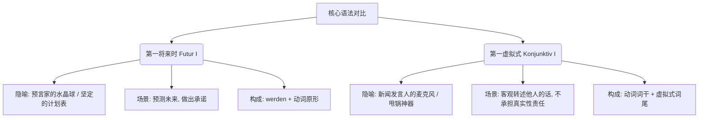

# 第一将来时和第一虚拟式的区别

^lapnsy

### 🧠 今日核心语法：第一将来时 (Futur I) VS 第一虚拟式 (Konjunktiv I)

#### 🔮 第一将来时 (Futur I)：预言家的水晶球

**概念理解：**

当你使用 Futur I 时，你是在对未来做出现实的规划、承诺，或者非常有把握的预测。它充满了主观的确定性。

**语法公式：**

**werden (变位) + 动词原形 (放在句末)**
![[PixPin_2026-05-30_22-31-13.png|386x335]]
**实战场景：求职与面试**

在面试时，你需要向 HR 展示你对未来的清晰规划。比如，你正在应聘一个科技公司的职位，你需要表达你将要做的事情：

- **德语例句：** Ich **werde** im nächsten Monat eine neue Anwendung mit künstlicher Intelligenz **entwickeln**.
- **中文解析：** 下个月我**将开发**一个人工智能新应用。（这是一个坚定的计划）
- **德语例句：** Wir **werden** die Server morgen auf die Cloud **migrieren**.
- **中文解析：** 我们明天**将把**服务器迁移到云端。（对未来工作任务的承诺）

#### 🎤 第一虚拟式 (Konjunktiv I)：新闻发言人的麦克风

**概念理解：**

潜台词是：“这是别人说的，我只是个传话筒，真实性我不打包票哦。”这在看德语新闻、读报纸，或者向官方机构复述情况时极其重要。

**语法公式：**

**动词词干 + 虚拟式专属词尾 (-e, -est, -e, -en, -et, -en)**

_注：最常用的是第三人称单数 (er/sie/es)，因为我们最常转述“他/她说”了什么。_

**实战场景：职场推荐与行政事务**

假设你正在向你的主管汇报一位新求职者的情况，你需要转述他的简历内容，但你要保持客观：

- **德语例句：** Der Bewerber sagt, er **kenne** sich hervorragend mit AWS und Cloud-Infrastrukturen aus.
- **中文解析：** 这位求职者说，他非常**了解** AWS 和云基础设施。（注意：这里用了 kenne 而不是直陈式的 kennt。意思是“这是他自己吹的/说的，到底懂不懂我不负责”。）

在面对租房纠纷或者外管局时，转述别人的话也非常有用：

- **德语例句：** Der Vermieter behauptet, die Heizung **sei** nicht kaputt.
- **中文解析：** 房东声称暖气没坏。（用 sei 而不是 ist，表达了你对这句话的保留态度：“他非说没坏，但我不信”。）

### ⚖️ 核心对比总结

|**特性**|**第一将来时 (Futur I)**|**第一虚拟式 (Konjunktiv I)**|
|---|---|---|
|**核心意图**|预测未来、表达决心|客观转述、拉开距离（甩锅）|
|**时间状态**|绝对发生在**未来**|动作发生的时间取决于原话（可表示现在）|
|**动词位置**|助动词在第二位，原形在**句末**|变位动词直接在第二位（如果是从句则在句末）|
|**典型标志词**|morgen, nächstes Jahr|er sagt, sie behauptet, laut...|

现在，轮到你来实战演练了！掌握语法的最佳途径就是立刻输出。

假设你昨天去看了医生，医生告诉你：“你需要休息三天。” (Du brauchst drei Tage Ruhe.) 今天你要向你的老板请假，并转述医生的话。你会如何使用 **Konjunktiv I (第一虚拟式)** 来用德语向老板写下这个句子呢？

# 对比第一第二虚拟式和将来时

^hvm43e

| **对比维度**                 | 第一虚拟式 (Konjunktiv I)                                                                                   | **第二虚拟式 (Konjunktiv II)**                                                                           | **将来时 (Futur I / Futur II)**                                                                                                                                                       |
| ------------------------ | ------------------------------------------------------------------------------------------------------ | --------------------------------------------------------------------------------------------------- | ---------------------------------------------------------------------------------------------------------------------------------------------------------------------------------- |
| **核心语用功能**               | **间接引语 (Indirekte Rede)**：客观转述他人言论，保持距离感。                                                              | **非现实与礼貌 (Irrealis & Höflichkeit)**：表达不可能的假设、遗憾、愿望，或极其委婉的请求。                                        | **未来与推测 (Zukunft & Vermutung)**：表达未来的计划/承诺，或对某事的强烈推测。                                                                                                                              |
| **语法构成 (以动词 kommen 为例)** | **现在时词干 + 虚拟式词尾** (-e, -est, -e, -en, -et, -en)         _er komme, sie seien (sein是特例)_ | **过去时词干 + (变音) + 虚拟式词尾** 或 **würde + 动词原形**         _er käme_ 或 _er würde kommen_    | **werden + 动词原形 (Futur I)**      **werden + 第二分词 + haben/sein (Futur II)**         _er wird kommen_ (FI)      _er wird gekommen sein_ (FII) |
| **语法难点 (B2必考)**          | 如果 KI 的变位和一般现在时（Indikativ）长得一模一样，必须用 KII 来替换，以免产生歧义！                                                   | 强变化动词（不规则动词）本身的 KII 变位很难记（如 _ginge, bliebe_），口语中多用 _würde_ 替代，但在书面语中情态动词、_haben/sein_ 必须用原汁原味的 KII。 | 德国人日常说未来经常直接用“现在时+时间词”。**Futur 更多时候用来表示“推测 (Vermutung)”**。                                                                                                                         |
| **移民生活高频场景**             | 1. 听新闻广播      2. 医生出具病历报告      3. 在公司向老板汇报同事的话                                 | 1. 在外管局 (Ausländerbehörde) 求签证官通融      2. 找工作面试时展示高情商      3. 租房被拒后的遗憾      | 1. 向房东/老板立下“军令状”保证完成任务      2. 推测某个政府信件为什么还没寄到                                                                                                                         |