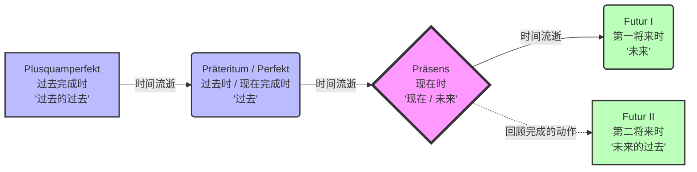
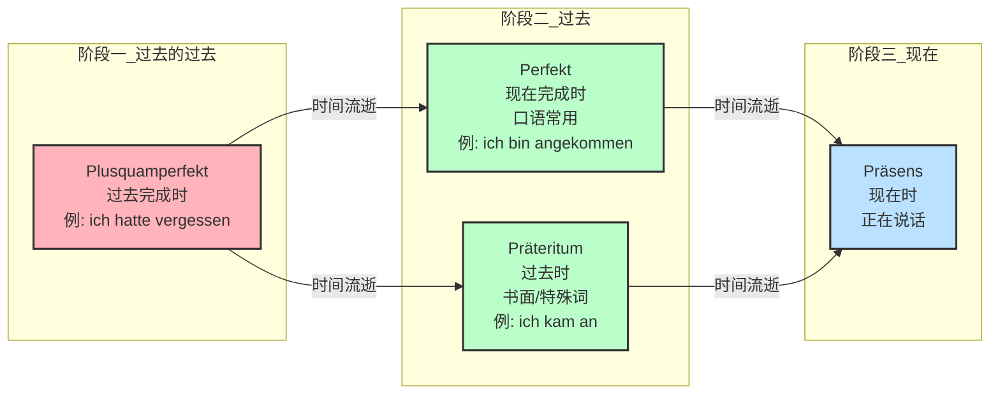

# 时态介绍总结

德语的语法就像是一台精密的德国发动机，初看齿轮繁多、令人头皮发麻，但只要你掌握了它的底层逻辑，它就会运转得无比顺畅。今天，我们就要拆解这台发动机最核心的部件之一：**时态（Die Tempora）**。

德语总共有 **6 个时态**。相较于英语极其复杂的时态系统（什么现在完成进行时等），德语的时态其实**非常精简且极其务实**。

| **时态名称 (德/中)**                               | **💡 形象类比**                             | **⚙️ 构成公式 (框架结构)**                                | **🎯 核心用法与移民实战场景**                                                          | **🗣️ 经典例句 (B1-B2难度)**                                                                                                    |
| -------------------------------------------- | --------------------------------------- | ------------------------------------------------- | --------------------------------------------------------------------------- | ------------------------------------------------------------------------------------------------------------------------- |
| **Präsens**      (现在时)           | **瑞士军刀**      (最百搭、最实用)     | 主语 + **动词现在时变位**                                  | 1. 描述现在或一般状态。      2. **替代将来时**（加上“明天/明年”等时间词，德国人最爱用）。          | _Morgen **unterschreibe** ich den Mietvertrag._      （明天我**签**租房合同。➡️ 表将来）                                    |
| **Perfekt**      (现在完成时)         | **啤酒馆话痨**      (==口语==绝对霸主) | **haben / sein** (变位) + ... + **第二分词 (ge-t/en)**  | 绝大多数的**口语交流**、私人微信/邮件，用来吐槽或汇报刚才、昨天发生的事。                                     | _Ich **habe** den Termin beim Ausländeramt leider **verpasst**._      （我非常遗憾地**错过了**外管局的预约。）                  |
| **Präteritum**      (过去时)        | **新闻主播**      (书面语及特殊词)     | 主语 + **动词过去式** (弱变化-te/强变化不加-t)                   | 1. **书面**报道、故事。      2. 口语特权词：**haben, sein, 情态动词**的过去式直接用在口语中。 | _Ich **war** gestern beim Arzt und **musste** lange warten._      （我昨天去看了医生，并且**必须**等很久。➡️ 口语极高频）             |
| **Plusquamperfekt**      (过去完成时) | **盗梦空间**      (过去的过去)       | **hatte / war** (变位) + ... + **第二分词**             | 描述在某个“过去的动作”**之前**，就已经完成的事情。常配合 _nachdem_ (在...之后) 使用。                      | _Nachdem ich die Unterlagen **eingereicht hatte**, bekam ich das Visum._      （在我**递交了**材料之后【先】，我拿到了签证【后】。）   |
| **Futur I**      (第一将来时)         | **官方承诺**      (严肃与笃定)       | **werden** (变位) + ... + **动词原形**                  | 1. 做出郑重的承诺、计划或警告。      2. 对现在的强烈推测（“大概/肯定...”）。                 | _Ich **werde** die B2-Prüfung im Dezember auf jeden Fall **bestehen**!_      （12月我绝对**要通过**B2考试！➡️ 强烈决心）      |
| **Futur II**      (第二将来时)        | **时空旅行者**      (高级炫技专用)     | **werden** (变位) + ... + **第二分词** + **haben/sein** | B2/C1加分项：预测在**未来某个时间点**已经完成的事；或对**过去**的事进行推测。                               | _In sechs Monaten **werde** ich fließend Deutsch **gelernt haben**._      （六个月后，我**将已经学会了**流利的德语。➡️ 树立Flag专用） |

### 1. Präsens（现在时）—— 德语时态里的“瑞士军刀”

**💭 形象类比：**

现在时就像一把万能的瑞士军刀。它不仅能切现在的水果，还能开未来的罐头。德国人非常讲究实用主义，只要有时间状语（比如明天、明年），他们极少用将来时，而是直接用现在时搞定。

**⚙️ 构造公式：**

**主语 + 动词现在时变位** (比如: ich mache, du machst...)

**📌 适用场景：**

1. 正在发生的事。
2. 一般性真理或习惯。
3. **将要发生的事（高频重点！）**。

**移民生活实战演练：**

- _【看病场景 - 描述当前症状】_

    Ich **habe** seit drei Tagen starke Kopfschmerzen.

    （我剧烈头痛三天了。—— 注意：德语表达“从过去一直延续到现在”的状态，用现在时+seit，千万别受英语现在完成时的影响！）

- _【外管局延签 - 表达未来计划】_

    Nächste Woche **unterschreibe** ich meinen neuen Arbeitsvertrag.

    （下周我将签署我的新工作合同。—— 用了“下周”，动词直接用现在时即可表将来。）

---

### 2. Perfekt（现在完成时）—— 话痨必备的“啤酒馆时态”

**💭 形象类比：**

这是德语口语绝对的王者！如果你在德国的酒吧里跟朋友吐槽今天遇到的奇葩房东，或者在茶水间跟同事聊周末去哪儿玩了，**90%以上的过去的事情，都必须用 Perfekt**。它生动、鲜活，充满了生活气息。

**⚙️ 构造公式：**

**haben / sein 的现在时变位 + ... (句子其他成分) ... + 动词的第二分词 (Partizip II，通常以 ge- 开头)**

_(注：框架结构！助动词在第二位，实义动词像个大秤砣一样死死压在句子最后！)_

**📌 适用场景：**

日常口语交际、非正式的私人邮件中描述过去发生的事情。

**移民生活实战演练：**

- _【租房场景 - 汇报进度】_

    Ich **habe** dem Vermieter die Schufa-Auskunft **geschickt**.

    （我已经把个人信用报告发给房东了。）

- _【职场场景 - 告知同事】_

    Der Chef **ist** gerade nach Berlin **geflogen**.

    （老板刚刚飞去柏林了。—— 表示位置移动的动词，助动词用 sein！）

---

### 3. Präteritum（过去时）—— 严肃高冷的“新闻主播”

**💭 形象类比：**

如果说 Perfekt 是穿着 T 恤喝啤酒的朋友，那 Präteritum 就是穿着西装打领带的新闻主播或小说家。它主要用于书面语（如新闻报道、历史书籍、童话故事）。但是在口语中，有三个“特权阶级”—— **haben (有), sein (是), 以及情态动词 (können, müssen 等)**，德国人嫌它们的 Perfekt 形式太啰嗦，所以在口语中也会直接用它们的 Präteritum。

**⚙️ 构造公式：**

**主语 + 动词过去时变位** (弱变化加 -te，强变化大换血且词尾不加 -t)

**📌 适用场景：**

1. 书面语中的过去故事。
2. 口语中表达“曾是(war)”、“曾有(hatte)”以及“曾必须/能够(musste/konnte)”。

**移民生活实战演练：**

- _【找工作场景 - 看招聘启事（书面）】_

    Das IT-Unternehmen **suchte** einen erfahrenen Softwareentwickler.

    （这家 IT 公司【当时】在寻找一位有经验的软件开发者。）

- _【口语特例 - 面试时描述自己过去的状态】_

    Ich **war** drei Jahre lang Teamleiter in China und **musste** viele Projekte leiten.

    （我之前在中国当了三年团队主管，【必须】负责很多项目。—— 这里口语直接用 war 和 musste，显得非常地道自然。）

---

### 4. Plusquamperfekt（过去完成时）—— 穿越时空的“盗梦空间”

**💭 形象类比：**

这是“过去的过去”。就像电影《盗梦空间》里的第二层梦境。你不能直接跳进第二层梦境，你必须先有一个“过去”的参照点（Präteritum 或 Perfekt），然后在这个参照点之前发生的事，才用过去完成时。

**⚙️ 构造公式：**

**hatte / war + ... + 第二分词 (Partizip II)**

_(简直就是 Perfekt 的翻版，只是把 haben/sein 变成了过去式 hatte/war)_

**📌 适用场景：**

叙述过去的事情时，强调某个动作在另一个过去的动作**之前**就已经完成了。常和连词 _nachdem_ (在...之后) 或 _als_ (当...时) 连用。

**移民生活实战演练：**

- _【行政办事处 - 令人崩溃的突发状况】_

    Als ich endlich beim Bürgeramt **ankam** (过去时：当我终于到达办事处时), **hatte** ich bereits meinen Reisepass **vergessen** (过去完成时：我已经把护照忘在家里了).

    （这就是为什么去政府办事一定要提前检查材料！忘带护照发生在到达办事处之前。）

---

### 5. Futur I（第一将来时）—— 严肃庄重的“官方承诺”

**💭 形象类比：**

还记得我刚才说现在时是瑞士军刀，能代替将来时吗？没错。那么什么时候必须用 Futur I 呢？当你需要做出一种**正式的承诺**，发出**警告**，或者做出一种**基于现在的强烈推测**（算命先生语气）时。它听起来比现在时更有力量、更官方。

**⚙️ 构造公式：**

**werden 的现在时变位 + ... + 动词原形 (Infinitiv，放在句末)**

**📌 适用场景：**

1. 预测、推测（常常带有 _wohl_ 或 _sicher_）。
2. 严肃的计划或承诺。

**移民生活实战演练：**

- _【职场场景 - 对 HR 的坚定承诺】_

    Ich **werde** in den ersten sechs Monaten mein Bestes **geben**!

    （在头六个月的试用期里，我将拼尽全力！—— 充满决心的语气）

- _【看病场景 - 医生的推测】_

    Mit dieser Medizin **werden** Sie sich bald besser **fühlen**.

    （吃了这个药，您很快就会觉得好些的。—— 医生的专业判断）

---

### 6. Futur II（第二将来时）—— 炫技专用的“时空旅行者”

**💭 形象类比：**

这是所有时态里的“大熊猫”，极其罕见！哪怕是德国人自己，一年也用不了几次。它的逻辑是站在未来，回头看一件在那时已经完成的事情（将来完成时）；或者用来推测一件过去发生的事情。这完全是 B 2/C 1 级别的“炫技”语法。

**⚙️ 构造公式：**

**werden 的现在时变位 + ... + 第二分词 (Partizip II) + haben / sein**

_(句末出现三个动词排队，非常壮观)_

**📌 适用场景：**

1. 到未来某个明确的时间点，某事将会已经完成（必须带明确的时间状语）。
2. 对过去发生的事情进行推断（“他当时大概是......”）。

**移民生活实战演练：**

- _【设定 6 个月目标的你】_

    Bis zum Dezember **werde** ich die B 2-Prüfung **bestanden haben**.

    （到 12 月的时候，我**将已经通过**了 B 2 考试。—— 这是一个极具野心和画面感的句子！）

- _【日常推测 - 抱怨德国铁路 DB 的日常】_

    Der Zug hat Verspätung. Er **wird** wohl wieder an einem kaputten Signal **gehalten haben**.

    （火车晚点了。它【过去大概是】又因为信号灯坏了而停下来了吧。—— 吐槽专用的高级推测语气）

---

### 🌟 大师总结与下一步行动

回顾一下：

- 日常沟通最靠谱的兄弟：**Präsens (现在)** 和 **Perfekt (过去)**。
- 写邮件看报纸的必备：**Präteritum**。
- 表达时间先后顺序的逻辑神器：**Plusquamperfekt**。
- 发誓和推测的工具：**Futur I & Futur II**。

对于你六个月冲刺 B 2 的目标，前四个时态是生死攸关的基石，必须做到条件反射般的熟练！

为了检验你是否真的吸收了这些概念，我们来做一个小小的互动练习。请你想象以下场景并尝试**用德语造句**：

**场景：你正在和德国房东交谈，你想告诉他：“在来德国之前，我已经学了六个月德语了。”**

_(提示：这涉及到一个动作发生在另一个过去动作之前，想一想应该用哪个“盗梦空间”时态？)_

请写下你的句子，我会为你进行批改和解析！Ready？Would you like me to wait for your answer?

# 区分现在完成时和过去时与其过去完成时

别灰心！你现在遇到的这个“坎儿”，是 90%以上的中国学生在冲刺 B 1/B 2 时都会撞上的墙。为什么？因为我们中文里没有动词变位，我们表达时间全靠加“昨天”、“已经”、“曾经”这些时间词；而英语里的“现在完成时”和“过去时”又有着严格的时间界限（比如英语里绝对不能说 _I have done it yesterday_）。

但是！**请立刻把你脑子里的“英语时态逻辑”清空！** 德语的这三个过去时态，有着完全不同的底层逻辑。

现在，我们把这三个时态拆开揉碎，用最接地气的方式讲明白。

---

### 第一步：彻底分清 Perfekt (现在完成时) 和 Präteritum (过去时)

**🔥 核心秘诀：它俩在“时间”上没有任何区别！唯一的区别是“穿衣打扮（使用场合）”！**

无论你是用 Perfekt 还是 Präteritum，描述的==都是==**发生在过去、且已经结束的事情**。它们就像一个人的两套衣服：

- **Perfekt（现在完成时） = ==休闲==装（T 恤+牛仔裤）。** 它是==**口语**==的绝对统治者。只要你张嘴说话，或者给朋友发微信、写私人邮件吐槽，90%的情况下你都要穿这套休闲装。
    - _实战场景（跟室友吐槽）：_ „Ich **habe** gestern eine Wohnung **besichtigt**. Die Miete war viel zu teuer!“ (我昨天去看了一个房子。租金太贵了！) ➡️ _注意：这里即使有“昨天(gestern)”，德语依然心安理得地用 Perfekt，这在英语里是绝对犯规的！_
- **Präteritum（过去时） = ==正装==（西装/晚礼服）。** 它是**书面语**的标配。你看的新闻报道、读的格林童话、以及外管局发给你的正式公函，都会穿这套正装。如果你在和朋友喝啤酒时用 Präteritum 聊天，德国人会觉得你在给他们朗诵课文。
    - _实战场景（报纸上的租房新闻）：_ „Der Mann **c** gestern eine Wohnung.“ (这位男士昨天参观了一处公寓。) ➡️ _意思和上面一模一样，只是场合变了。_

**⚠️ 破例警告（B 2 必考点）：**

有些动词特别“懒”，它们嫌 Perfekt 的结构（助动词+第二分词）太麻烦，所以**在口语中也直接穿 Präteritum 这套衣服**。你必须死死记住这几个“特权词”：

1. **sein (是)** ➡️ 口语直接用 **war** (而不是 ist gewesen)
2. **haben (有)** ➡️ 口语直接用 **hatte** (而不是 hat gehabt)
3. **情态动词 (können, müssen, wollen 等)** ➡️ 口语直接用 **konnte, musste, wollte**

> **小结对比：** > _昨天的面试怎么样？_
> 
> ❌ 呆板的口语：Ich _bin_ beim Interview _gewesen_ und ich _habe_ viel Angst _gehabt_. (语法没错，但听起来像个机器)
> ✅ 地道的口语：Ich **war** beim Interview und **hatte** viel Angst. (用特权词的过去时，自然流畅！)

---

### 第二步：精准拿捏 Plusquamperfekt (过去完成时)

**🔥 核心秘诀：它是一个“不能独立行走”的时态，它是用来“插队”的！**

Plusquamperfekt 翻译叫“过去完成时”，我更愿意叫它**“过去的过去”**。

请记住一条铁律：**你永远不能一开口就直接用 Plusquamperfekt。** 它必须有一个“小弟”（Präteritum 或 Perfekt）在前面垫底，才能凸显出它发生的“更早”。

它通常用在包含 **nachdem (在...之后)** 或 **als (当...时)** 的复合句中，用来强调两件过去的事情，**哪件先发生，哪件后发生**。

**移民生活实战场景：延签的悲剧**

假设昨天早上发生了两件事：

动作 A (早上 8:00)：你把护照忘在家里了。

动作 B (早上 9:00)：你到达了外管局。

这两个动作都发生在过去。但是 A 比 B 更早！

所以，比较晚发生的 B 用**过去时/现在完成时**；而更早发生的 A 就必须用**过去完成时**。

- _造句演示：_

    Als ich beim Ausländeramt **ankam** (动作 B，过去时：当我到达外管局时), **hatte** ich meinen Pass zu Hause **vergessen** (动作 A，过去完成时：我已经把护照忘在家里了).

如果你只说一句“我昨天忘了带护照”，没有语境对比，你只需要用普通的 Perfekt：_Ich habe gestern meinen Pass vergessen._ 就足够了！

---

### 🌟 终极大总结（请刻在脑海里）

1. **昨天吃苹果** ➡️ 张嘴说话用 **Perfekt** (_Ich habe einen Apfel gegessen._)
2. **新闻里说昨天吃苹果** ➡️ 写文章用 **Präteritum** (_Ich aß einen Apfel._)
3. **昨天我很忙/我生病了** ➡️ 口语也用 **Präteritum**，因为是 sein/haben 特权词 (_Ich war krank / Ich hatte viel zu tun._)
4. **在吃苹果之前，我已经洗过手了** ➡️ 洗手比吃苹果更早发生，洗手用 **Plusquamperfekt** (_Nachdem ich mir die Hände gewaschen hatte, aß ich den Apfel._)

这下是不是觉得眼前的迷雾散开了一些？语言的逻辑一旦打通，剩下的就是肌肉记忆了。

**你的专属通关挑战：**

为了确保你真的把这三个时态的逻辑搞懂了，请帮我翻译下面这段在德国找工作时极其常见的面试自我介绍。注意看括号里的提示哦！

> "在我来德国（动作 B，用过去时）**之前**，我**已经**在中国工作了三年（动作 A，比来德国更早，想想用什么时态？）。当时我的工作**是**（用特权词的过去式）项目经理。"

大胆写出你的德语翻译，写错了算我的！我来帮你逐字精修，Would you like to give it a try?
